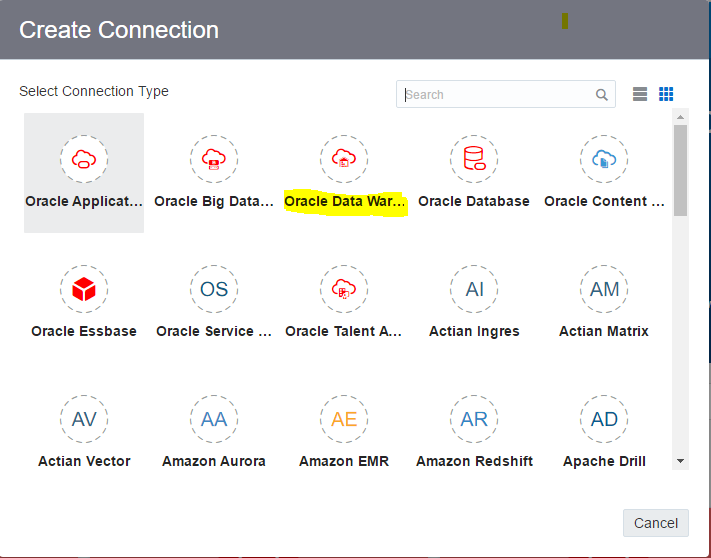

# Introduction

This is the third of several labs that are part of the **Oracle Autonomous Data Warehouse Cloud Workshop**. This workshop will walk you through the connection of ADWCS to Data Visualization Desktop. This lab will elaborate on how you can connect your already created ADWCS instance (which has data already loaded into data warehouse) to DVD and perform beautiful visualizations in DVD.

At this point, you should have performed the following:
1. You have downloaded the latest version of Data Visualization Desktop (DVD) from [here](http://www.oracle.com/technetwork/middleware/oracle-data-visualization/downloads/oracle-data-visualization-desktop-2938957.html).

2. Existing ADWCS instance: You should create and launch the ADWCS instance. Note down the details such as host, service name and port number of your instance. These details will be required when connecting to DVD, more on this later.

3. You have desired data loaded into your data warehouse, which will be used as the data source for connecting to DVD.

## Objectives
- Creating ADWC Instance and Loading Data
- Set Up Local Environment
- Create New Data Visualization Desktop Connection
- Prepare Data Set and Create Visualization

## Required Artifacts

- Data Visualization Desktop
- An ADWC environment that you have access to
- This lab works only with Windows at this time.

## Set Up Local Environment

### **STEP 1**: Set Up Local Environment

- Once you have the ADWCS instance up and running, you should have a wallet zip file from previous lab 200.

- Unzip the wallet in local folder
- Navigate to folder where DVD is installed: **C:\\YourUserName\AppData\Local\Temp\DVDesktop**. Note: Change **YourUserName** to your PC user name. 
- Create a new folder **bitmp** and **DWCS** inside this folder if the folders do not exist.
- Copy the cwallet.sso from unzipped folder to **C:\\YourUserName\AppData\Local\Temp\DVDesktop\bitmp\DWCS**. Note: Change **YourUserName** to your PC user name. 

  

## Create New Data Visualization Desktop Connection 

### **STEP 2**: Create ADWC Connection

- Start DVD Version 4, Click on "Create" on top right of window.

  

- Click on Connection Icon. In Create Connection window, search data warehouse and click on Oracle Data Warehouse.

  

- On this window, you will need information from the tnsnames.ora file in the ADWC wallet folder. tnsnames.ora file can be obtained from wallet.zip.

- Find the service for you and copy the host, port, and service name to DVD 

  

- **Connection Name**: give name for instance
- **Host**: host name from tnsnames.ora for your service
- **Post**: port number from tnsnames.ora for your service
- **Username**: admin
- **Password**: The administrator password you specified during provisioning in Lab 100.

  

  Note: you can also connect as a user that has dwrole, like **dwuser** you created in lab 100. 

- Click on OK to save connection. If it says “Invalid Wallet file”, please follow step 2 to make sure the cwallet file is in the right folder. 

### **STEP 3**: Create Data Set and Create Visualization

- Once the connection is saved, create a data set using that connection. 

  

- In this window, you can either select the columns you would like to visualize or just enter in a SQL statement.

- You can save the data set to create a new visualization project.

  

- Now you have a visualization that is pulling data from ADWC. You can proceed to the next [Lab 400: Use Oracle Machine Learning and Monitor ADWC](LabGuide400.md). 
