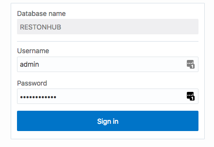
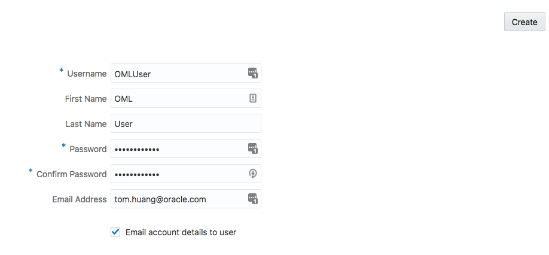
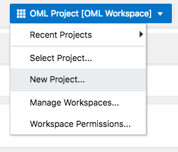
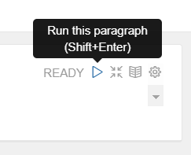
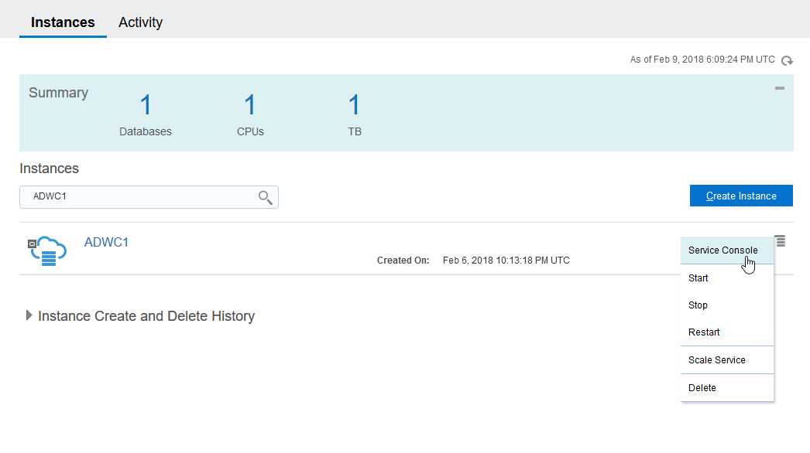
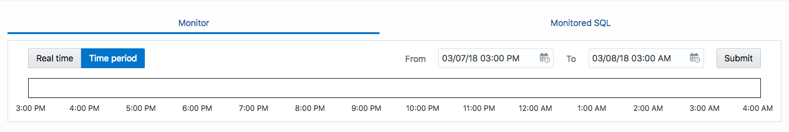

# Introduction

This is the fourth of several labs that are part of the **Oracle Autonomous Data Warehouse Cloud Workshop**. This workshop will walk you through several use cases of using an autonomous data warehouse's conle and Oracle Machine Learning Notebook.

## Objectives
- Access Oracle Machine Learning Interface
    - Create OML user
- Work in Oracle Machine Learning Interface
    - Create OML SQL notebook
    - Create machine learning notebook using OML Gallery template
- Monitor Oracle Autonomous Data Warehouse Cloud and SQL statements
- Scaling ADWC Service

## Required Artifacts
- The following lab requires an Oracle Public Cloud trial account.

# Access Oracle Machine Learning Interface
Oracle Machine Learning is a collaborative web-based interface that provides a development environment to create data mining notebooks where you can perform data analytics, data discovery and data visualizations.

Key features of Oracle Machine Learning:
- Allows collaboration among data scientists, developers, business users

- Leverages the scalability and performance of Oracle Platform and its Cloud Services

## Create Oracle Machine Learning User

### **STEP 1**: Login to your Oracle Public Cloud Dashboard
- From any browser, go to the URL:
    `https://cloud.oracle.com`

- Click **Sign In** in the upper right hand corner of the browser

- Enter your Cloud Account Name and click **Go**.

- Enter your User Name and Password and click **Sign In**

- You will be presented with a Dashboard displaying the various cloud services available to this account. Then, click on **Autonomous DW** (Note: If all your services are not visible, **click** on the **Customize Dashboard**, you can add services to the dashboard by clicking **Show.** If you do not want to see a specific service click **Hide**)

    

- Click **Open Service Console** on the upper right of the screen

### **STEP 2**: Login to Autonomous Data Warehouse Service Console


- Click on the hamburger icon for your Autonomous Data Warehouse Cloud (ADWC) instance you provisioned earlier and click on **Service Console**

    

- Enter your credentials you specified and click on **Sign In**

    


### **STEP 3**: Create Oracle Machine Learning (OML) User

- After you sign in, you are taken to the ADWC service console dashboard. We will come back to this. Now click on **Administration** on the upper right of the screen

    
- On Administration screen, click on **Manage OML Users**

    

- Log in using the same credentials you used to log in to ADWC service console

    

- On OML Users administration screen, you can see all available users. If you have not created any user, it should just have ADMIN user. For more information about User Permissions, please refer to this: `https://docs.oracle.com/en/cloud/paas/autonomous-data-warehouse-cloud/omlug/getting-started-oracle-machine-learning1.html#GUID-2BCF2A11-D445-48D5-9299-30B18D944499`

- Click on **+ Create** to add a new user

    

- Enter the information for your new user, check the checkbox for "Email account details to user" and click on **Create**

    

- You should receive an email shortly about user creation. Click on **here** from the email to sign in

    

- Enter new user's credentials and sign in

- Now you should be in your OML dashboard.

    

# Work in Oracle Machine Learning Console

## Create your first Oracle Machine Learning Notebook

### **STEP 4**: Create a new project
Oracle Machine Learning uses Zeppelin Notebook, a collaborative interface where you can write code, equations, and text, create visualizations, and perform data analytics. Notebooks work with interpreters in the back-end. In Oracle Machine Learning, notebooks are available in a project, where you can create, edit, delete, and even save notebooks as templates.

- Before creating a notebook, it is a good idea to create a new project first where your notebook is contained in. To do that, click on **Workspace** next to your user name on the upper right screen and click on **New Project...**

    

- Enter information about this new project and click **OK**

    

### **STEP 5**: Create a new notebook

- Once have a new project, we are ready for your first OML Notebook. Click on **Go to Notebooks** on the dashboard

    

- Click on **+ Create** to start a new Notebook

    

- Enter in information about this notebook

    

- Click on the notebook you just created

    

### **STEP 6**: Edit your notebook
- In the first paragraph of the notebook, enter in the following SQL script: 
    ```
    %sql

    select prod_id, channel_desc from sh.sales s join sh.channels c on s.channel_id = c.channel_id;
    ```

    

- SH schema comes with a newly provisioned instance of ADWC for testing purpose. It is a simple database for small online shopping website. The script simply joins sales transactions table with sales channels table. To run the script, you can either press **SHIFT + ENTER** or click on the run icon . You should get the results in a table format.

    

    

- In the SQL interpreter, the output section of the paragraph comprises a charting component that displays the results in graphical output. The chart interface allows you to interact with the output in the notebook paragraph. You have the option to run and edit single a paragraph or all paragraphs in a notebook. You can visualize the data by clicking the respective icons for the   each graphical representation, as shown here:
    - Click  histogram to represent the data in a histogram.
    - Click  pie-chart to represent the data in a pie chart.
    - Click  line diagram to represent the data in a line chart.
    - Click  cumulative gain chart to represent the data in a cumulative gain chart.
    - Click  scatter plot to represent the data in a scatter plot.

- To visualize and make sense of this result, click on  histogram icon and drag and drop **CHANNEL_DESC** to **Groups** box

    

- The visulization should look similar to this after the change:

    

### **STEP 7**: Explore more features of notebook

In notebook, you can create text input form on the fly. Text Input form allows you to dynamically retrieve values as defined in the notebook. 

- Run the following sql statement in a new paragraph and run:
```
%sql

SELECT * FROM ALL_OBJECTS WHERE OBJECT_TYPE = ‘${OBJ}’;
```

- The notebook now displays the text input form field obj, as shown in the screenshot. You can enter values in the obj field, and run the notebook to retrieve the corresponding values for the column OBJECT_TYPE in the table ALL_OBJECTS. If you enter TABLE in the obj field, and run the notebook, then the notebook retrieves TABLE in the column OBJECT_TYPE, as shown in the screenshot.

    

- You can also also create dropdown input or checkboxes using similar syntax. For more information please refer to `https://docs.oracle.com/en/cloud/paas/autonomous-data-warehouse-cloud/omlug/using-notebooks-data-analysis-and-data-visualization.html#GUID-1379F259-D510-45DE-8596-5A2EB8BB82E9`

## Create machine learning notebook using OML Gallery template

### **STEP 8**: Create a machine learning notebook

- Go back to OML dashboard and click on **Go to Gallery**. The Gallery page lists pre-populated Oracle Machine Learning notebook templates which you can view, like, and use it to create new templates. 

    

- In the Gallery page, select the template based on which you want to create a notebook. 

    

- Click **New Notebook**, and in the Create Notebook window, the name of the selected template appears. Enter information for notebook name and description and click on **OK**. For Association Rules example, it performs analysis based on SH schema. The results of the paragraphs have been shown. You can rerun each paragraph if you would like. You can go through this notebook at your own pace.

    

- One of the interesting things from this notebook is that it uses ``DBMS_DATA_MINING`` PL/SQL package which is an analytical technology that derives actionable information from data in an Oracle Database or Oracle Data Warehouse. This is a out-of-box function in ADWC that you can utilize to perform machine learning just using SQL scripts. Please refer to this for more information: `https://docs.oracle.com/cd/E18283_01/appdev.112/e16760/d_datmin.htm`

## Monitor Oracle Autonomous Data Warehouse Cloud and SQL statements
 

### **STEP 9**: Monitoring ADWC 
At this point, you have ran some queries in ADWC. We can use ADWC built-in console and dashboard to monitor the performance of ADWC and SQL statements.

- Go to your ADWC instance service console

    

- On the landing page, you can see an overview of the metrics for your ADWC instance. 

    

    - Storage: This chart shows the total and used storage capacity of the service. It indicates what percentage of the space is currently in-use.

    - CPU utilization (%): This chart shows the historical CPU utilization of the service. 

    - Running statements: This chart shows the average number of running SQL statements historically.

    - Average SQL response time: This chart shows the average response time of SQL statements historically.

- To have a more granular view of the metrics, click on **Activity** tab on the top right of the screen

    

- On this page, you can monitor the following information:

    - Database Activity: This chart shows the average number of sessions in the database using CPU or waiting on a wait event. 
    - CPU Utilization: This chart shows the CPU utilization of each consumer group. 
    - Running Statements: This chart shows the average number of running SQL statements in each consumer group. 
    - Queued Statements: This chart shows the average number of queued SQL statements in each consumer group. 

- You can also limit a time period to monitor a specific time interval

    

### **STEP 10**: Monitoring SQL Statements

- To see the statistics and performance for a specific SQL statment, click on **Monitored SQL** tab

    

- Select a SQL statement you would like to monitor and click on **Show Details**

- The **Overview** tab in the pop-up shows general information for that statement. 

- Click **Plan Statistics** tab to see the runtime execution plan of the statement.

    

- Click **Parallel** tab to see information about the parallel processes, if the statement uses parallelism.

- You can also download an active SQL Monitor report for a statement, select the statement in the Monitored SQL page and click the **Download report** button. This will save the active SQL Monitor report to your client. 

    

- The SQL monitor report looks very similar to a report from Oracle Enterprise Manager if you are familiar to the interface. 

    

## Scaling ADWC Service

### **STEP 11**: Scaling your service

- One of the features of ADWC is that it is elastic and easily scalable based on your needs. To do that go to the home page of ADWC Service Console

    

- Click on the hamburger menu for your instance and click on **Scale Service**

    

- On Scale Service box, you can choose whether to Scale Up or Scale Down, and then enter in the number of Cores and/or Storage Capacity in GBs to scale. 

- You are now have completed this lab!
