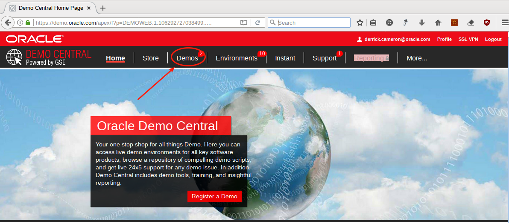
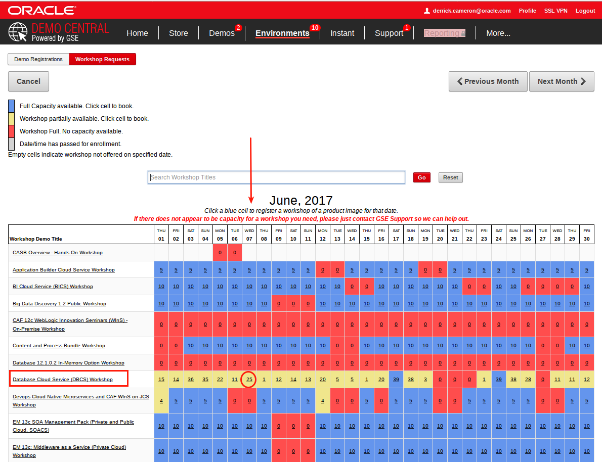

# Steps to Request and Deliver a GGCS Workshop

## **Planning Several Weeks Before Workshop**: 

- Log into demo.oracle.com and select Demo.

	

- Select Workshop Requests, then Request Workshop.

	

- Select DBCS Workshop (Other services such as MySQL CS and Compute are also in this bundle of services), and the particular date you are interested in running the workshop.  Note that you should plan to also schedule the prior day of the workshop as well so you can test the setup prior to running the workshop.

	

- Complete the details and submit.  Be sure to make ***steven.nichols@oracle.com*** the secondary contact so that the environments will be provisioned properly.  Note this will change as the management of this workshop Workshop is transitioned to GSE.  For now Steve will assist GSE.

	

- Invite your customers to the workshop.

## **Week of Workshop**: 

- Log into the [OPC Workshops Site](http://innovate.us.oracle.com:81/opcworkshops/overview.html?workshopkey=Cloud%20Native%20-%20DB) and familiarize yourself with the workshop material.  Note this site is inside Oracle VPN.

	

- Review the various pages on the left.  Make note of the Workhop Delivery materials at the bottom.

	

- Add workshop participants for those who are confirmed.  Go into your workshop tab in demo.oracle.com and update participants.

	

- Enter participants and select Apply.

	

## **Day Before Workshop**: 

- Contact steven.nichols@oracle.com to determine the status of instance deployment. 

- Test instances to ensure they are up and running.

## **Day of Workshop**: 

- Assign Identity Domains to the workshop participants.