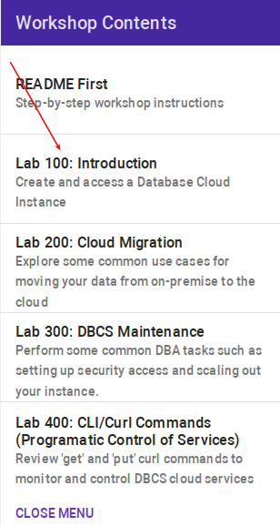

# Database Cloud Services Workshop for Classic Compute Services

Welcome to the Oracle Database Cloud Service Workshop.  This particular version is based on Oracle's 'Classic' services, versus Oracle Compute Infrastructure (OCI) services.  These labs will give you a basic understanding of the Oracle Database Cloud Service and many of the capabilities around administration and database management.  Lab 100 will introduce you to DBCS and show you how to create a Cloud Database from an on-premise backup.  Lab 200 will cover various data migration use cases, including pluggable database migration, tablespace migration, and schema migration.  Lab 300 covers some common Database management activities.  Lab 400 show you how to use curl commands to perform various tasks.

This instructor led version will have set up the lab environment for you so you don't need to run the setup steps.

### **STEP 1**:  Acquire an Oracle Cloud Trial or Workshop Account

Please click on the [Free Oracle Cloud Promotion](https://myservices.us.oraclecloud.com/mycloud/signup?language=en&sourceType=:ex:tb:::RC_NAMK180711P00050:DBCS_OCI_HOL&SC=:ex:tb:::RC_NAMK180711P00050:DBCS_OCI_HOL&pcode=NAMK180711P00050) link to complete all the required steps to get your free Oracle Cloud Trial Account. When you complete the registration process you'll receive a $300 credit and up to 3500 hours of free Oracle Cloud usage. You'll have 1000s of hours left over after the labs to continue to explore the Oracle Cloud.  Soon after requesting your trial you will receive the following email. You will not be able to start Lab 100 until you have received it.

### **STEP 2**:  Navigate to Lab 100

- Once the setup is complete you can move on to lab 100 by clicking on the Menu Icon in the upper left corner of the browser window. You're now ready to continue with Lab 100.

