Update June 30, 2017

## Introduction

This is the first of several labs that are part of the Oracle Public Cloud GoldenGate Cloud Service workshop. These labs will give you a basic understanding of the Oracle GoldenGate Cloud Service and many of the capabilities around real time data replication and migration.  Throughout the workshop the following use cases will be covered in more detail in the following labs.  In lab 400 you will review GGCS monitoring.  Lab 500 covers the use case replication of data from a DBCS 12c Multi-tenant database (cloud) to an 11g on-premise database (optional lab).

- Lab 200: Zero downtime migration and replication of data from an on-premise 11g database to a DBCS 12c multi-tenant database use case.

	

- Lab 300: Replication and transformation of data from a DBCS 12c pluggable database to a DBCS 12c reporting data warehouse with Business Intelligence analytics access use case.

	

- Lab 400: GoldenGate Cloud Service monitoring.

	

- Lab 500 (optional): Replication of data from a DBCS 12c multi-tenant database back to an on-premise 11g database use case.

	

To log issues and view the lab guide source, go to the [github oracle](https://github.com/pcdavies/GoldenGateCloudService/issues) repository.

## Objectives

- Walk through the steps to create a GoldenGate Cloud Service that will manage data replication between on-premise and cloud environments, and manage replication between different cloud environments.
- Introduce you to the Oracle Cloud environment and services that will be used in the following labs.

## Required Artifacts

- As noted in the readme, you will be accessing several Oracle Cloud Services throughout the labs. We have prepared a ***one-page GoldenGate Cloud Services Workshop handout*** with the required information.  

### **STEP 1**: Login to your Oracle Cloud account and Review Services

- Open a Browser and log into [cloud.oracle.com](cloud.oracle.com):

	https://cloud.oracle.com

- Click **Sign In** in the upper right hand corner of the browser

	

- **IMPORTANT** - Under my services, select Traditional Cloud Account from the drop down list, and the correct data center (Region) and click on **My Services**. Review your handout fields ***CS4*** for your assigned Cloud Service Region/Data Center information.

	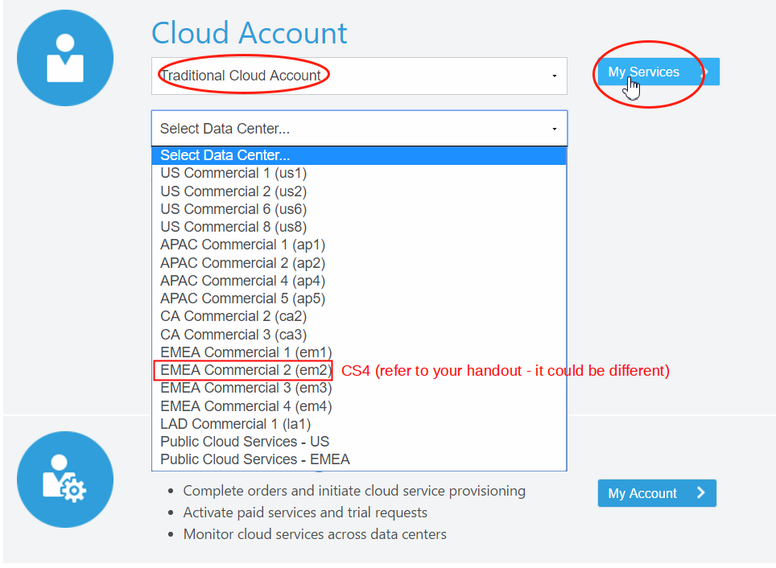

- Next enter the **identity domain** (***CS1*** in your handout) and click **Go**

	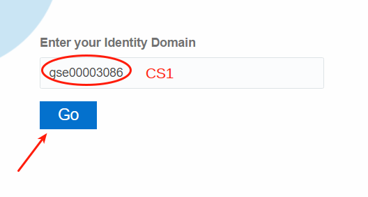

- Once your Identity Domain is set, enter your User Name (***CS2***)and Password (***CS3***) and click **Sign In**

	

- You will be presented with a Dashboard summarizing all of your available services.  You have access to several available services, but only services that have instances deployed will be visible.  You should see Database, Compute, and GoldenGate.  If you do not see GoldenGate **Click** on **Customize Dashboard** to add GoldenGate to your list of visible services. 

	

- You can then add services to the dashboard by clicking **Show**. If you do not want to see a specific service click **Hide**.

### **STEP 2**: Create GoldenGate Cloud Service Instance

- Select GoldenGate Service and then console.

 	

- Open Service Console, and then Create Service Instance.  Note first time you select GoldenGate you get a welcome page - select the 'Go to Console' link on this welcome page.  Screen shot below does not show the welcome page, but shows what you see after the first access.

 	

- Select `Create Service` Instance. 

	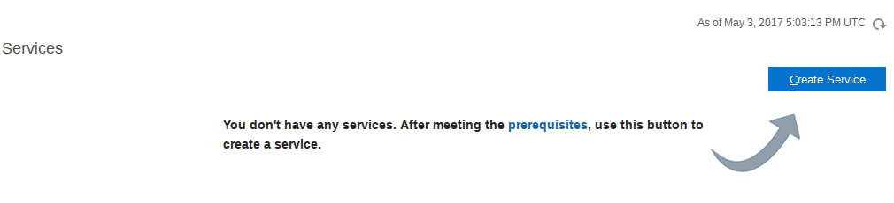

- Enter Service Name `practice-create-ggcs` as the name and select Replication and Cloud Control option and then hit Next:

	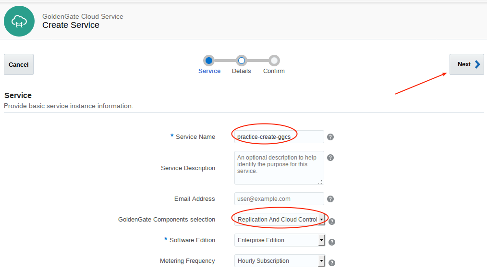

- Select `none` for backup.  Select `Edit` the SSH Public Key.  You will create a new one.

	

- Select `Create a New Key`

	

- Download and save the key Pair.

	

	

- Select `Done`.

	

- Enter the following details and select 'Next' and then create.  The instance create process will take several minutes.

	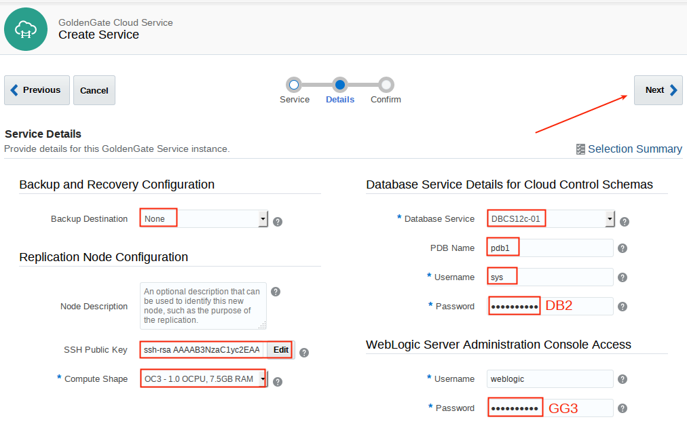

	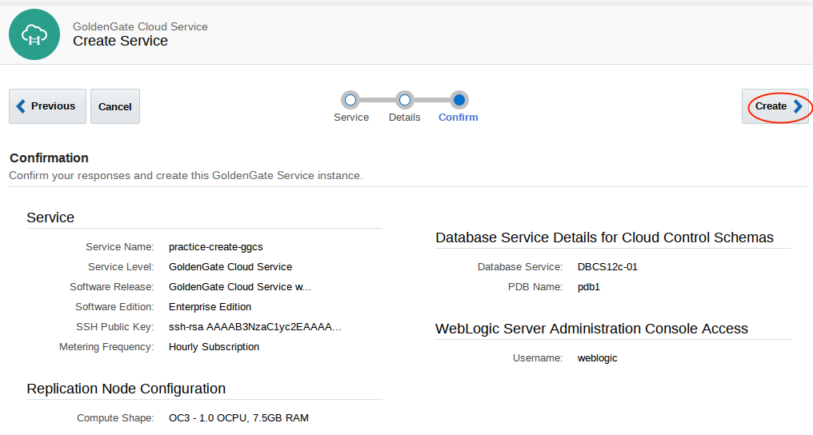

### **STEP 3**: Review GGCS Instance

- A GoldenGate Cloud Service has already been created for you.  The one you created above should take about 15 minutes, but will not be used.  

- Go to the GoldenGate console to get the IP address.  Select GoldenGate.

	

- Open Service Console.

	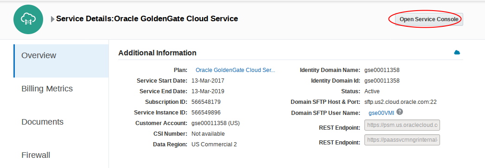

- Open `ggcsservice-ggcs-1`

	

- Note the public IP **this is field ***GG1*** on your handout**.  You will need this later for various configuration steps.

	

### **STEP 4**: Review DBCS and Note Connection String	

-	Select the menu in the top right to navigate to Database.

	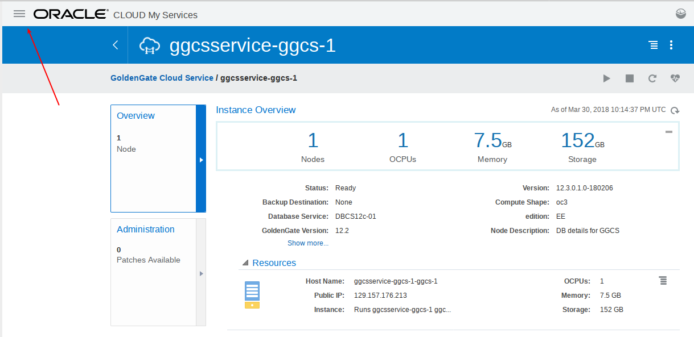

-	Select Database

	

-	Select DBCS12c-01

	

-	Hover over the connection string.  Write down the number highlighted below (598320227 in this case).  We will need to update a database link (used to query DBCS from the on-premise instance), and we will also need to update the tnsnames.ora file in GGCS so it can connect to the database.  

	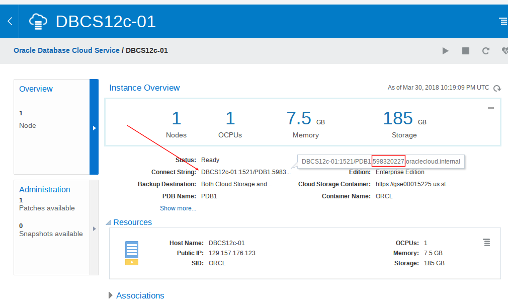

### **STEP 5**: Update the Database Link (used in Lab 200)

-	Open the GGCS_Workshop_Material on the desktop and navigate to SQL SCripts.  Right click on the cr_dblink.sql script and open with gedit.

	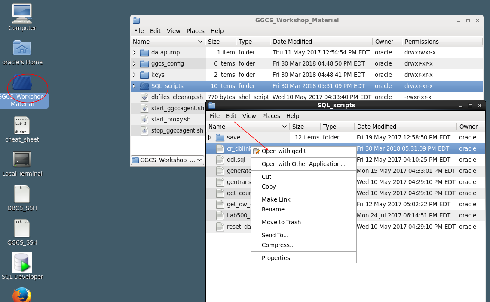

-	Replace the existing identity domain with the connect string noted above.  Save your changes.

	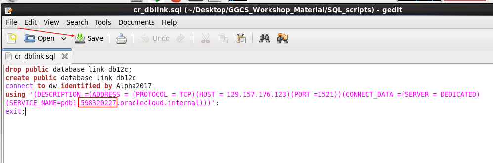

-	Open SQL Developer, and then open the On Premise - EURO connection. 

	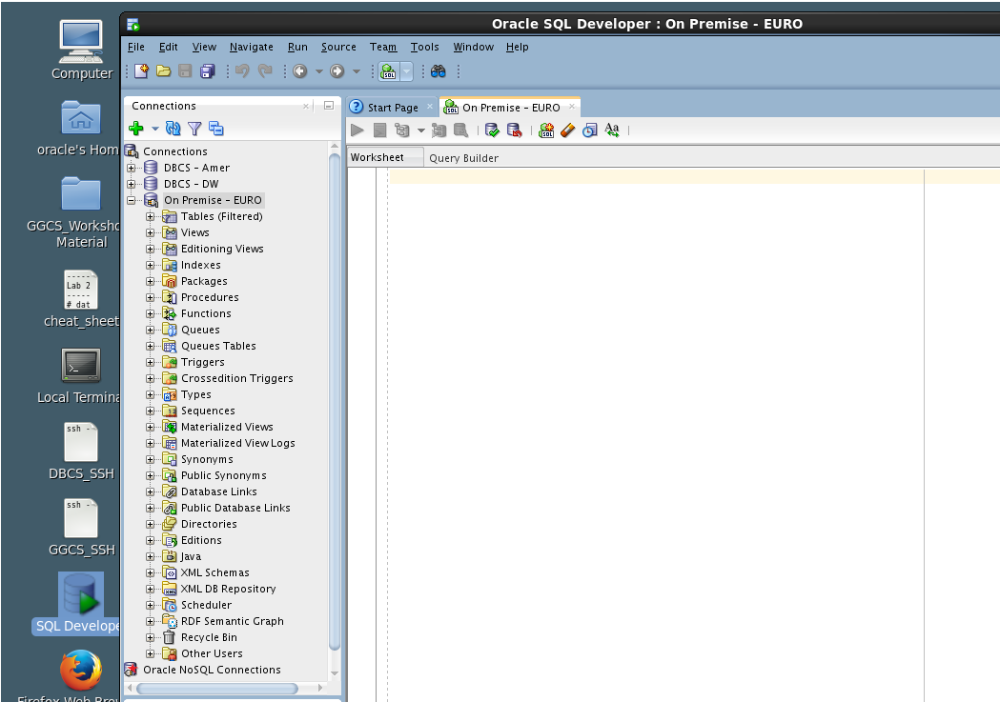

-	Open the cr_dblink.sql file to run the script.

	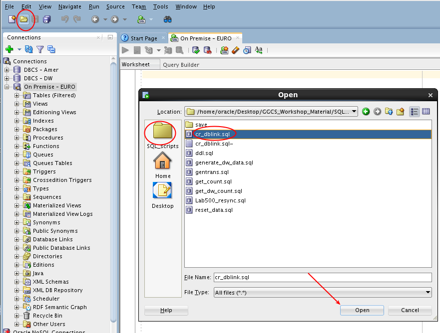

-	Run the script.

	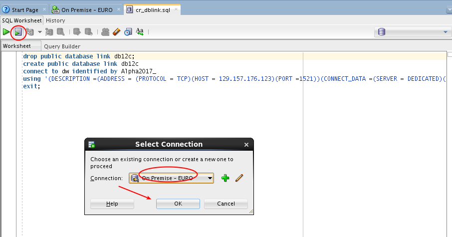

-	Enter `select sysdate from dual@db12c;` to test.  Be sure to highlight this line.  It should return a date from the remote DBCS instance.  We will use this link to view data replication results later in lab 200.

	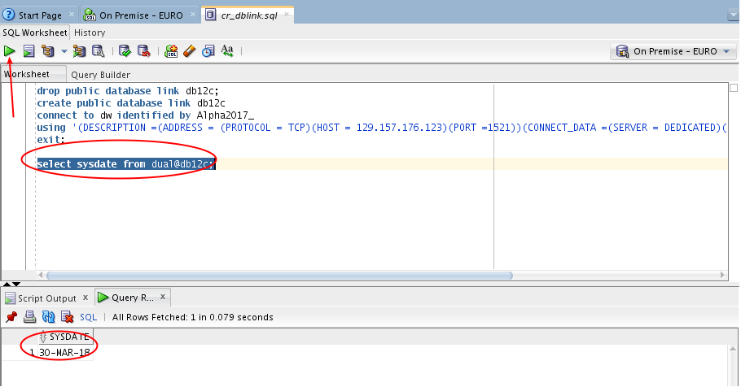
