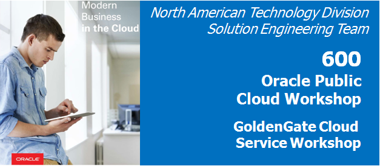
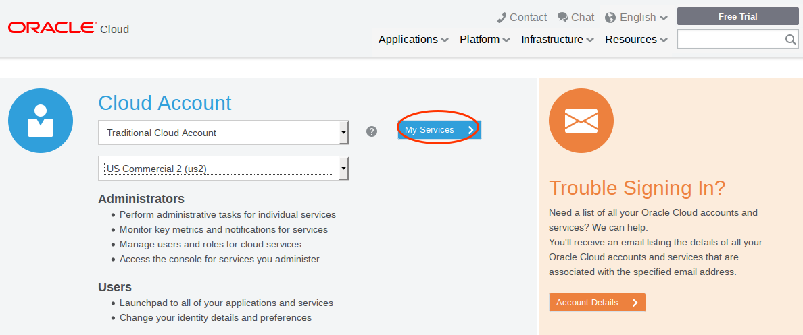
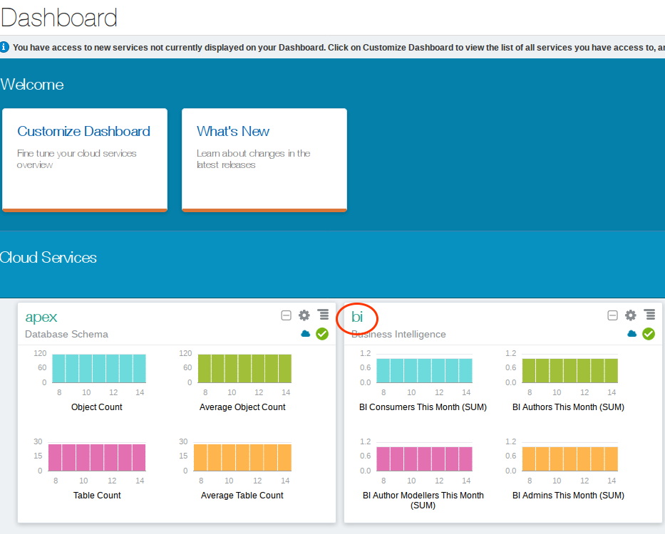
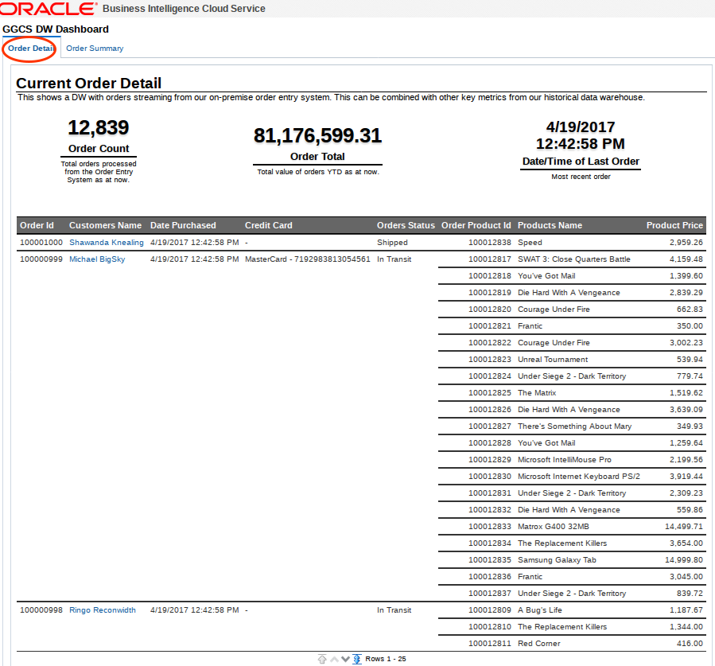
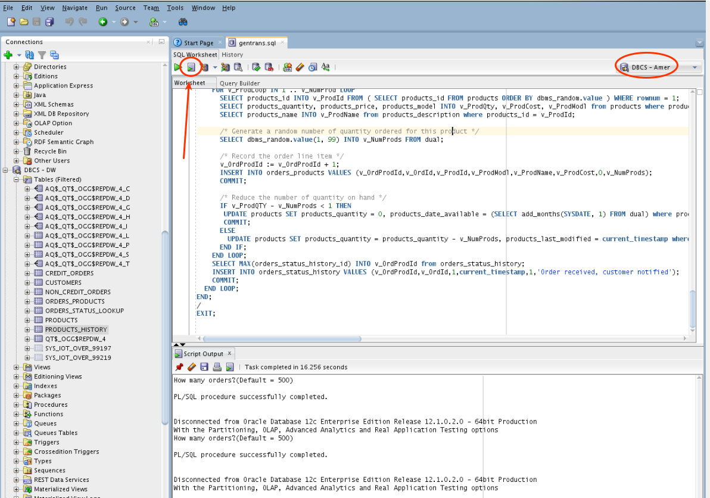
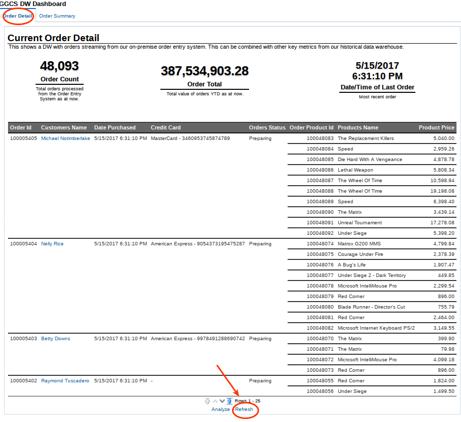

Update May 2, 2017

## Introduction

This is the sixth of six GoldenGate Cloud Service labs, and will show how you can deliver real-time analytics through Oracle Business Intelligence data visualizations and dashboards.

To log issues and view the lab guide source, go to the [github oracle](https://github.com/pcdavies/GoldenGateCloudService/issues) repository.

## Objectives

- Show how real time data replication supports real time analytics and reporting.

## Required Artifacts

- Access to your Oracle Cloud account and services DBCS, GGCS, and BI Cloud Service (BICS).

### **STEP 1**: Access BICS Dashboards and Review GGCS Replicated Data

- Log into BICS with your assigned userid/password.  **NOTE this is a different userid/password that what you have been using thus far in labs 100 - 400.  You MUST first log out of your other account, and clear browser cache.**
    - **Cloud Identity Domain:** <IdentityDomainBI> Field ***BI1***
    - **Cloud Login:**  `<BICS userid and password>` Field ***BI2*** and ***BI3***

    

    

- Navigate to BI

    

- Click on the Service Instance URL:

    

- Click on Dashboards.

    

- Click on GGCS DW Dashboards

    

- Review Order Detail and Order Summary Dashboards.  In particular note the number of rows.  **The data in your lab may differ from the screenshot here.**  We will be generating more transactions and seeing the Dashboards update.

    

    

- Go back to your VNC Desktop (Compute image) and open SQLDeveloper.  Open the gen_trans.sql file.

    

- Execute the script and specify 500 transactions/orders.  Be sure to select the AMER connection.  GoldenGate will replicate and transform this data over to DW.  Note that, again, the number of orders in your BICS environment will likely differ from the totals here.  Also, the transaction generation process creates rows across several tables and you will not necessarily see the row count rise on the Dashboard by the number of rows you specify in the gen_trans.sql file.

    

- Go back to your browser and the BICS Dashboard, scroll to the bottom, and select `Refresh`.  Note that the row count (and other data) reflect the new transactions that were replicated and transformed in the DW.  The refresh may take several seconds to complete.

    

    