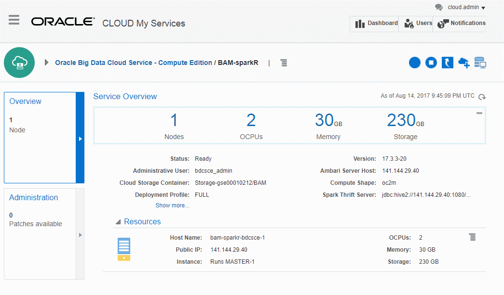
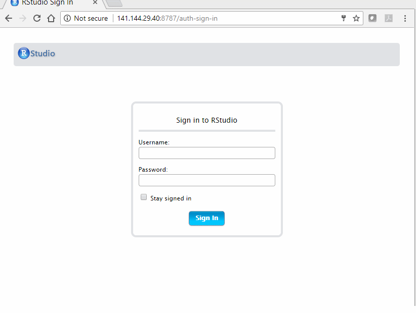
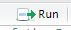
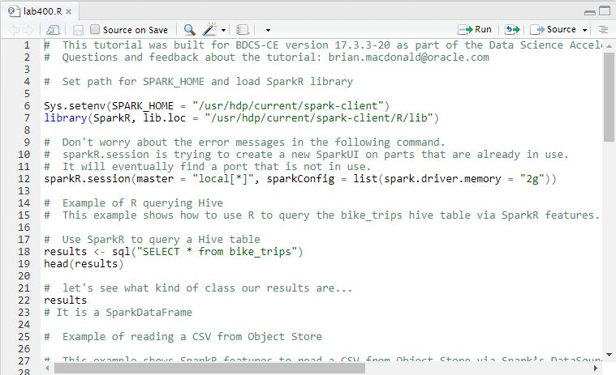

  

Updated: August 15, 2017 for BDCSCE Version 17.3.3-20

# Lab: R and RStudio Server

## Introduction

This lab provides the same examples from Data Science Acceleration Lab 300: R and Zeppelin but focusing on how to use R with RStudio.

In particular, this lab will show you how to use R/SparkR functionality within RStudio. This functionality will allow you to use R to query hive tables and read data directly from the Object Store. It will also allow you to query R data with Spark SQL and to leverage some of Spark's advanced machine learning algorithms.

Please direct comments to: Brian Macdonald (brian.macdonald@oracle.com)

## Objectives

 - Use R and SparkR with RStudio

## Required Artifacts

If you completed Data Science Acceleration Lab 300: R and Zeppelin the following requirments will have been met.  
- A running BDCS-CE instance and Storage Cloud Object Store instance, created as per the instructions in the New Data Lake Journey Lab 100.  These instructions included the use of a special "bootstrap.sh" script which setup the BDCS-CE environment for this workshop.
- You completed the tutorials in the New Data Lake Journey Lab 200 Getting to know BDCS-CE
- You completed the Data Science Acceleration Journey Lab 200 Setup R, SparkR, and RStudio Server

# Connect to the BDCS-CE Console and Open RStudio Port 8787

## Steps

### **STEP 1**: Navigate/login to the Oracle Cloud My Services Dashboard  

 

### **STEP 2**: Navigate to the My Services page for your BDCS-CE cluster

  

### **STEP 3**: Update Access Rules for RStudio

RStudio was installed in Data Science Acceleration Lab 200: Setup R and BDCS-CE but we need to open up port 8787 so that we can access RStudio.

Select **Access Rules** from Platfrom Services drop down menu item next to your service. 

Click on the Create Rule button and fill in the dialog box with the following information:

- Rule Name:   RStudio
- Source:      PUBLIC-INTERNET
- Destination: bdcsce_MASTER
- Destination  Port(s): 8787
- Protocol:    TCP

Click on Create.

# Learn how to use R and SparkR with RStudio

## Connect to RStudio

### **STEP 1**: Open a browser and use your public IP and port 8787 to connect to RStudio using http.

**Note:  https will not work.  Make sure you use http.**

 

### **STEP 2**: Log into RStudio using the folowing credentials that were used in Data Science Acceleration Journey Lab 200 Setup R, SparkR, and RStudio Server.

- user: ruser
- password: welcome1

 

### **STEP 3**: Download and Open the Lab400.R R script located in the /home/ruser directory.

To download the R script, type or copy/paste the following command into the **Console** window in RStudio.

download.file("https://raw.github.com/millerhoo/journey3-data-science/master/workshops/journey3-data-science/rFiles/Lab400script.R","/home/ruser/lab400.R") 

This will copy the file into the /home/ruser directory.

Click on the Open an Existing File icon  to open the Lab400script.R script. 

### **STEP 4**: Read and follow the instructions in the script by clicking on the run icon 

# What you Learned

- Learned how to use R and SparkR with RStudio in BDCS-CE

# Want to Learn More?

- [R project](https://www.r-project.org/)

- [SparkR (R on Spark)](http://spark.apache.org/docs/latest/sparkr.html)

- [RStdio](https://www.rstudio.com/)

