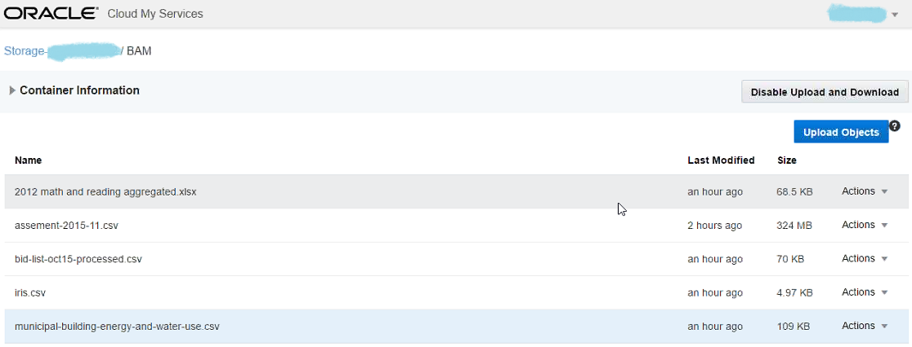
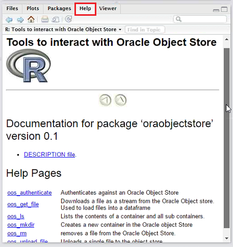
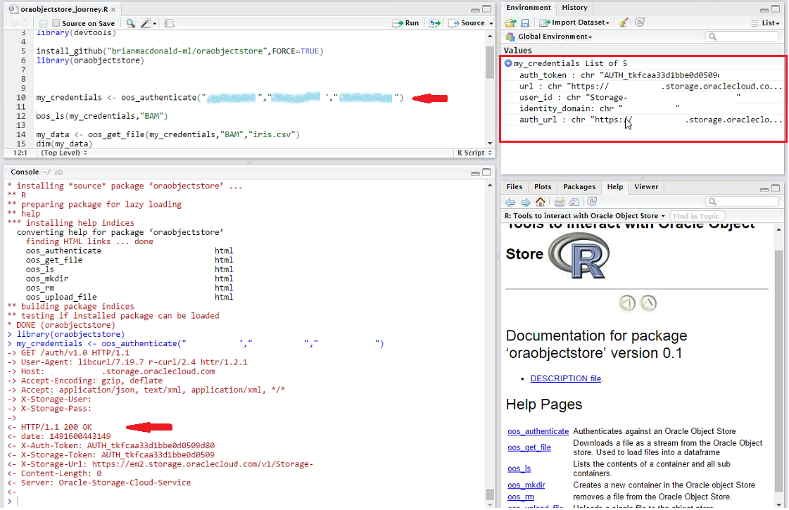
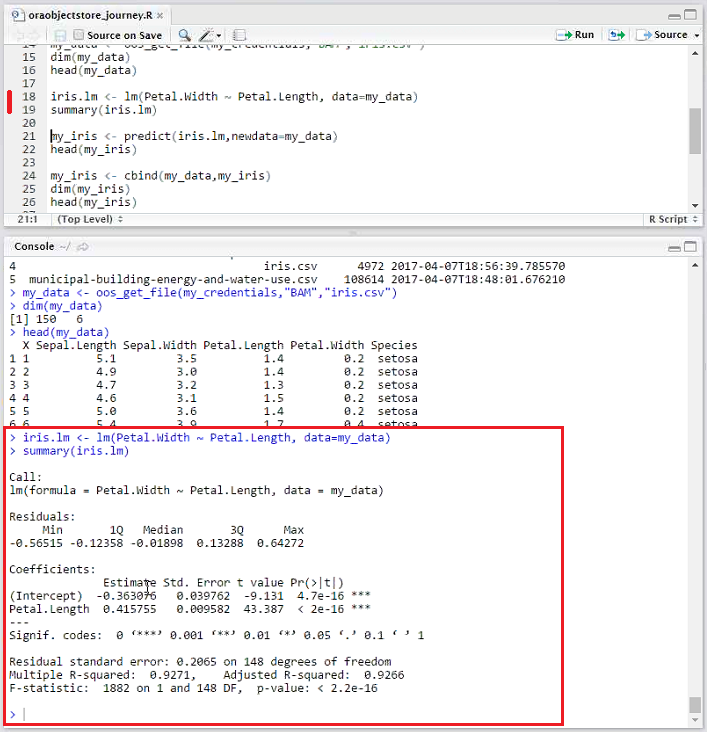
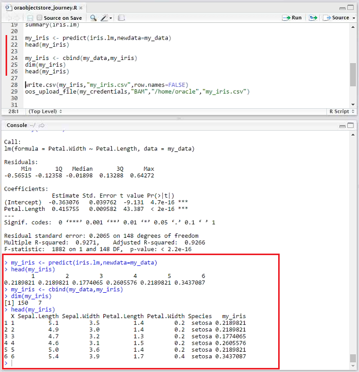
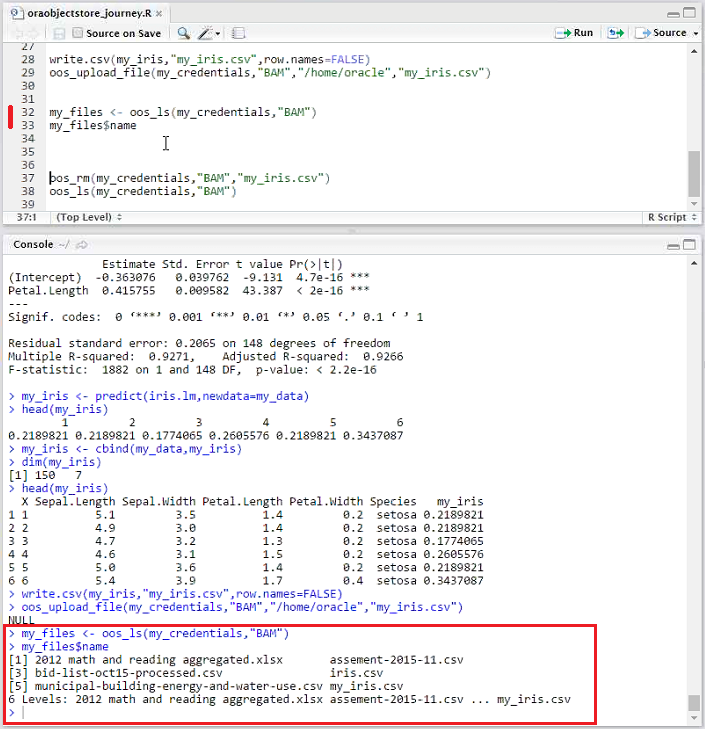
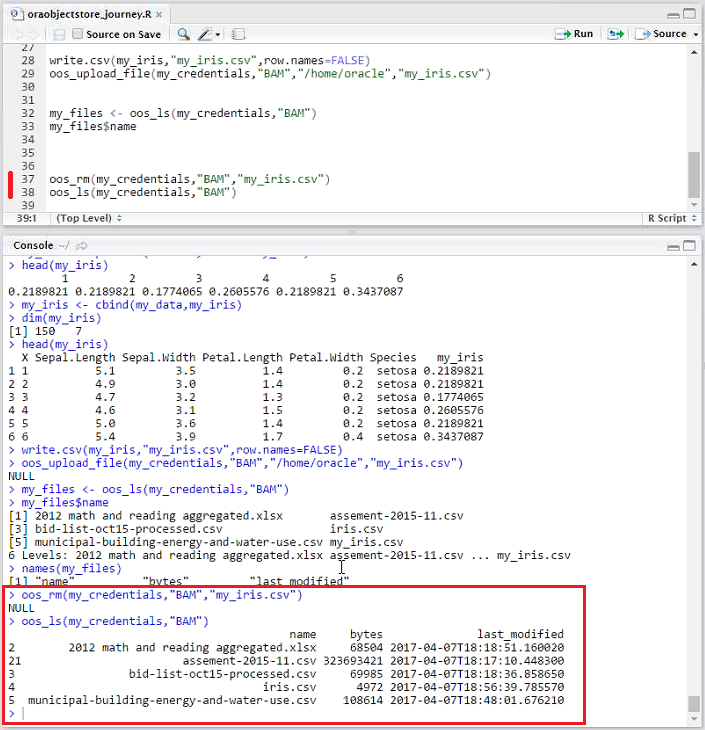
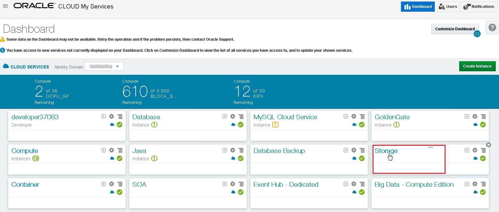
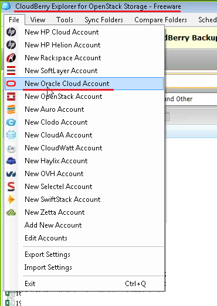

# Interacting with data in Oracle Object Store in R

 -- This lab (Interacting with the Object Store) is under construction and a new version is in the works.  The instructions currently listed below may be **inaccurate** or **incomplete**.

# Before You Begin

## Purpose

In this tutorial, you learn to install and use a new R package called oraobjectstore to connect to the Oracle
Object Storage Cloud and interact with the data in the object store directly in the R environment.

## Time to Complete

20 minutes

## Background

The Oracle Object Store Cloud is a great place to store the corporate data that you want to do data
science on. R is a language and environment for statistical computing and graphics. To help data scientists
or genernal R users interact with the data stored in the Oracle Object Store Cloud in a more direct and
efficient way, Brian Macdonald, who is a data scientist in Oracle, developed a new R package called
oraobjectstore.

You will walk through the functions in the package in this tutorial. The package is put on Github for public
download.

Keep in mind that the package is still under development. Brian will be adding new functionality to it, and
occasionlly you might meet potiential bugs. Please provide feedback for us to improve it.

# What Do You Need?

Before starting this tutorial, you should:
- Have an Oracle Storage Cloud Service account and login credentials ready.
- Download and install R from [here](https://cran.r-project.org/mirrors.html) and the R Studio Desktop open source edition from [here](https://www.rstudio.com/products/rstudio/) if you
have not done this already.
- Download iris.csv from [here](https://raw.githubusercontent.com/uiuc-cse/data-fa14/gh-pages/data/iris.csv) (save the content as iris.csv after you open the link), and upload to your
Oracle Storage Cloud. You can refer to the appendix in the end of this tutorial to learn about how to
upload data to Oracle Storage Cloud. This version may be different from the one in the previous lab.
- Download the R script, oraobjectstore_journey.R, from [here](https://oracle.github.io/learning-library/workshops/journey3-data-science/rFiles/oraobjectstore_journey.R).

# Downloading and Installing the oraobjectstore Package

 

Log into your Oracle Object Store first, make sure you have uploaded the **iris.csv** file there. From the
screenshot, you can see that there are a file named **iris.csv** and other files in the BAM container of my
Oracle Object Store Cloud. The names appear in the screenshot might be different from yours.

 

Run the **R Studio** from your desktop and open the R script, **oraobjectstore_journey.R** , which you have downloaded at the beginning.

For those not who might not be familar with R Studio, there are four panes in RStudio as shown in the
screenshot. The R script appears in the top left pane. The bottow left is the Consol pane, the code
execution and output will show up there. The lower right-hand side is a list of pacakges that have been
installed. The uper right-hand side is the Global Environment pane where the revelant variables and
objects will show up there when you run the R script.

You can click the **Run** icon on the top right corner of the source code pane to run the script one line at a
time.

**Run** Line 3. It loads the **devtools** package, which contains the function called **install_github**. Install the
devtools package if you have not done so already.

**Run** Line 5. This command installs the oraobjectstore package from the github repository
**brianmacdonald-ml/oraobjectstore.** The package is installed successfully as shown in the output.

**Run** Line 6 to load the package into R.

Click the **Update** icon in the **Packages** pane in the right-hand side; you can see the oraobjectstore package
is listed there. Click the link of **oraobjectstore** in the list to the view the Help page.

 

In the Help page, you can see the functions available in the oraobjectstore package. Read through the
functions and descriptions in detail.

# Interacting with data in Oracle Object Store

 

The **oos_authenticate** function in Line 10 will authenticate the session with an Oracle Object Store.

There are three parameters in the function.

- **id** – The identity domain to be connected to

- **username** - Oracle Object Store username

- **password** - Oracle Object Store password for the username

**Replace** the parameters with your domain, user name, and password in the function.

Run **Line 10**. Make sure you see **HTTP/1.1 200 OK** in the output. It indicates that you authenticate against
an Oracle Object Store successfully.

The function returns an R list with the following 5 elements.

- **auth_token** - the authorization token needed for other commands
- **url** - the full url command used for curl commands
- **user_id** - the well formed user id of the form storage_domain:user
- **identity_domain** - domain identity used to authenticate
- **auth_url** - url in the form used for authentication

You can see the return values in the Global Environment pane on the top-right side.

The retuned list is assigned to the variable named **my_credentials** , which will be passed to other
functions.

The function **oos_ls** in Line 12 lists the contents of a container and all sub containers.

There are two parameters for this function, one is for the credentials, and the other is the full container
name to be listed.

The function returns a dataframe which contains the container path and file name, the size in bytes of the
file, and the time it was last modified.

**Replace** the container name **BAM** with your container name. **Run** Line 12.

The contents of your container will be listed in the output as shown in the screenshot. The **iris.csv** file
should be there.

The function **oos_get_file** in Line 14 downloads a file as a stream from the Oracle Object store and loads
the file into a dataframe.

The parameters for this function are credentials, container name where a file resides, and the file name to
download.

**Replace** the container name **BAM** with your container name.
**Run** Line 14. The dataset is assigned to the variable named **my_data**.

**Run** Line 15, you can see that there are 150 rows and 6 columns of data in the iris.csv file in the output.

**Run** Line 16, the column names and the data of the first 6 rows are displayed in the output.

Now the dataset is ready in R Studio for further analysis.

You can build a linear regression model based on the iris data set with the **lm** function in Line 18. Refer
[here](https://stat.ethz.ch/R-manual/R-devel/library/stats/html/lm.html) if you want to learn more about the **lm** function.

The **Petal.Length** column is used as the independent variable, the **Petal.Width** column is used as the
dependent variable for the model. You may need to change this to petal_width and petal_length to match the file.

**Run** Line 18 to fit the model.

**Run** Line 19 to see the summary information of the model in the output. The model is well fitted, the
coefficients are significant and the adjusted R-squared value is about 0.93.

You got a model (math formula) as follows:

Petal.Width = 0.42 * Petal.Length – 0.

Given a specific value of length of a petal, you can calculate/predict the width of the petal by the formula.

Now we can use the model to do some predictions.

For simplicity’s sake, we use the existing values of Length.Petal in **my_data** as the input data for the
**predict** function in Line 21.

**Run** Line 21. The predicted values of width of petals are assigned to the variable **my_iris**.

**Run** Line 22. The first 6 predicted values are listed in the output.

**Run** Line 24, 25, and 26. The predicted values are combined with the existing data set; you can easily
compare the predicted values in the **my_iris** column to the real values of the width of petals in the output.

 

**Run** Line 28 to save the prediction result, **my_iris** , into a file named **my_iris.csv** on your local computer.

**Replace** the container name **BAM** with yours in Line 29.

**Replace** the third parameter **/home/oracle** with the local file system directory where the my_iris.csv
resides in Line 29. You may need to change this to . if you get a permission error.

**Run** Line 29 to upload the **my_iris.csv** to Oracle Object Store with the function **oos_upload_file**. You can
see a **NULL** output, which indicates the file is uploaded successfully.

To validate if the file is uploaded to the Oracle Storage Cloud successfully, you can also list the files in your
container with the function **oos_ls** in Line 32.

**Replace** the container name **BAM** with yours in Line 32.

**Run** Line 32 and 33. The **my_iris.csv** file is displayed in the list.

 

Finally, you can use function **oos_rm** to remove a file in the Oracle Object Store.

**Replace** the container name **BAM** with yours in Line 37 and 38 respectively.

**Run** Line 37 and 38. The my_iris.csv file is removed and it disappears in the output.

# Appendix: Moving Data Across Your Local and Cloud Storage

Sign in to the Oracle Cloud My Services application. The My Services Dashboard is displayed. It lists the
services that are assigned to your account.

Look for and click **Storage**.

The Service Details page is displayed.

Look at the identity domain name, data jurisdiction, and URLs displayed in the REST Endpoint and Auth V
Endpoint fields under Additional Information.

You will need to refer back to the information in this page when you setup CloudBerry for Oracle Storage
Cloud Service in the following steps.

CloudBerry Explorer for OpenStack provides a user interface to cloud storage accounts allowing managing
and moving data across your local and cloud storage.

Download and install [CloudBerry Explorer for OpenStack freeware](https://www.cloudberrylab.com/explorer/openstack.aspx) if you have not done this already.

Launch CloudBerry Explorer, click **File** , and select **New Oracle Cloud Account** option.

In the Add New Oracle Cloud Storage Account dialog:-
- Insert a **display name** of your choice.
- Insert the user name, the **user name** is in the format **Storage-<identity-domain>:<username>** ,
where <username> is the username of your Oracle Public Cloud, that has the correct rights to the
Oracle Storage Cloud Service. For example, _Storage-myDomainID555:myCloudAdminName_
- Insert the **password** that matches the previous username.
- Insert the **Authentication Service URL** , it will look like this:
**https://<identity-domain>.storage.oraclecloud.com/auth/v1.**.
- In the **account location** select the data jurisdiction, for example, US Commercial 2(us2).

Click **Test Connection** to validate your setup. Then click **OK**.

Once you set up the Oracle Storage Cloud account successfully, you can manage and move data across
your local and cloud storage. You can drag and drop a data file from your local computer to the cloud
storage easily.

Besides CloudBerry Explorer, you can also move data across your local and cloud storage with [Oracle
Storage Cloud Service - File Transfer Manager CLI](http://www.oracle.com/technetwork/topics/cloud/downloads/storage-cloud-upload-cli-3424297.html). It is a Java-based command line tool (CLI) that simplifies
uploading to and downloading from Oracle Storage Cloud Service. Please refer [here](https://docs.oracle.com/en/cloud/iaas/storage-cloud/csclr/preparing-use-oracle-storage-cloud-file-transfer-manager-cli.html#GUID-5BB8647F-DDAD-4371-A519-1116402245FB) for more details about it.

# Want to Learn More?

- [The R Project for Statistical Computing](https://www.r-project.org/)
- [Oracle Storage Cloud Service Tutorials](https://cloud.oracle.com/en_US/storage/tutorials)

