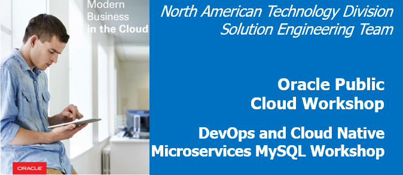
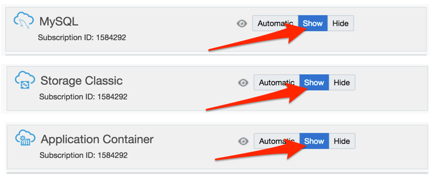

# Trial Account Student Guide


Update: November 8, 2017

## Overview of Tasks

You will need to **complete the following 3 Tasks** prior to attempting the Labs contained in this workshop

- **Acquire an Oracle Cloud Trial Account**
- **Create and Configure the MySQL Database**
- **Install the required open source tools locally on your computer (e.g. Eclipse, Maven, Git, and Brackets)**

# Acquire an Oracle Cloud Trial Account

### **Step 1**: Getting your Trial Account

- Click on this URL [cloud.oracle.com/tryit](http://cloud.oracle.com/tryit&intcmp=DeveloperInnovation-HOL-11NOV17), and complete all the required steps to get your free Oracle Cloud Trial Account.
- You must wait to receive our account before continuing to the "**Create and Configure the MySQL Database**" Section.

# Create and Configure the MySQL Database

During this Workshop you'll use a MySQL Database. The purpose of this workshop is to create microservices, one of which will access data from the database. In the following steps we'll show you how to create and seed the MySQL Database with sample data.

## Login to your Oracle Cloud Account

### **Step 2**: Record information from the welcome email and login

- During the provisioning of your account, you will receive two welcome email message. ***Note: You must wait for the 2nd email shown below***, as it contains information about the ***Traditional Account***, which is required for this workshop. If the second email does not appear within 30 minutes, please check your Junk or Promotions email folders (based on your email provider).


- For later use during the workshop labs, **record the following fields**, some of which you'll find in the email. The other **fields not found in the email** will be located shortly. This information will be ***used multiple times*** during the workshops Labs, so we recommend that you **copy the following list to a text document**, and then populate the fields as they are collected from the **Welcome Email** documented above.

```
Username:
Temporary Password (for Both Accounts):

Cloud Account Name:
Cloud Account Password:

Identity Domain Name:
Traditional Account Password:

Identity Tenant ID:
Data Center:
```

- ***(1)*** **Username**: With a trial account, this should be your email address.
- ***(2)*** **Temporary Password**: The first time you login, you will use this temporary password.
- ***(3)*** **Cloud Account Name**: This name will be used when you login  using the **Cloud Account with Identity Cloud Service**. ***Note***: When you click on Link **(5)** in the email, you will use this Cloud Account Name. This is the method by which all Oracle Services will eventually be authenticated.
- **Cloud Account Password**: You will login to your Cloud Account to set this password.
- ***(4)*** **Identity Domain Name**: This name will be used when you login with the **Traditional Cloud Services**. During this workshop, we will be use the Developer Cloud Services, which is currently a Traditional Cloud Services. ***Note***: When you click on Link **(6)** in the email, you will use this Identity Domain Name.
- **Traditional Account Password**: You will login to your Traditional Cloud Account to set this password in an upcoming step.
- **Identity Tenant ID**: We will locate this information later, but make a holding place in your notes for this field. This field will be used when creating a connection between the Developer Cloud Service (DevCS) and the Application Cloud Service (ACCS), allowing automatic deployment of Applications.
- **Data Center**: We'll locate this information in an upcoming step, and this fields will also be used when creating the connection between DevCS and ACCS.
- Click on the link ***(5)*** **Cloud Account My Services URL** provided in the email.
- Follow the instructions to **set your password**, and then record in your notes the new password for this **Cloud Account Password** field.

- You are now have viewing the dashboard used to access all the Cloud Services managed by the Oracle Identity Cloud Services.

- Click on the **Customize Dashboard** box to add the some select services to the Dashboard.

    

- Located the **Identity Cloud** Services, and click on **Show**.

    

- Also locate and **Show** the **MySQL**, **Storage Classic** and **Application Container** cloud services. Exit the Customization popup by clicking on the **X** in the upper right corner of the dialog.

    

- To capture the **Tenant ID**, we'll load up the Compute Classic console by clicking on the **Hamburger Menu** at the top of the dashboard. Click on **Compute Classic**.

    

- The **Tenant ID** is located at the top of the Classic Console Dashboard. This ID Will be used when connecting to Application Container Cloud Service from the Developer Cloud Services. Copy the ID and save it in your notes.

    

- Return to the main dashboard by clicking on the **Dashboard** icon in the upper right corner of the Identity Cloud Service Console.

    

- From the Dashboard, ***Right Click*** on **Application Container**, and select **Open Link in New Tab**.

    

- View the Tab just opened, and save the **Data Region** in your notes. In this example, the data Region is North America. Later on in the workshop you will be asked to select a Data Center for Deployment to the Application Container Cloud Service, and you can use one of the North American Data Centers, e.g. US Commercial 1 or 2. You now have the important user and connection information that will be used during the remainder of this workshop. You can now close this browser tab, and return to the main Dashboard.

    

### **Step 3**: Check/Set Storage Replication Policy

Some services that we will use in this workshop require that your account's Replication Policy is set. The following steps will show you how to set your replication policy.

- Click on the **Hamburger Menu** in the upper left corner of the browser window to expose the **Dashboard Menu**, then click on the **Storage Classic** menu option.

    

- If your replication policy has not yet been set, the following dialog will be displayed. Use the Default **Georeplication Policy**, and click on **Set Policy**.

    

- To return to the main **Dashboard**, click on the **Hamburger Menu**, and then click on the **My Services** menu option.

    

### **Step 4**: Set the Traditional Account Password

We will now set the Password for the **Traditional Account** User. This Account will allow you to access the **Developer Cloud Service**.

- Click on the link **Traditional Cloud Account My Services URL** provided in the Welcome email sent from Oracle.

    

- Follow the instructions to **set your password**, and then record in your notes the new password for  **Traditional Account Password**.

### **Step 5**: Test Logging into your Multiple Accounts

It is important to fully understand how to login to both the **Standard Identity Cloud Service** managed account, and then login to the **Traditional** account at the same time. After this step, we'll assume you know how to switch between accounts and services during the upcoming labs. ***Note: Oracle will soon have all services merged under the Standard Identity Cloud Service Account.*** However, until that time, you need to be aware of your dashboard Account settings, and at times you will need to switch between the Regular Cloud Account and Traditional Cloud Account to view the right services in the Dashboard and Dashboard Menus.

- Fully exit/close your browser to logout and remove all session cookies

- Re-open your browser.

- Go to [cloud.oracle.com](http://cloud.oracle.com)

- Click on **Sign In** at the top of the page.

    

- Set the first field to **Cloud Account with Identity Cloud Service**, enter your **Cloud Account Name** recorded earlier in the second field, and click on **My Services**

    

- Enter the **Username** and **Cloud Account Password** recorded earlier, and click on **Sign in**.

    

- View the available services after clicking on the Dashboard **Hamburger Menu**.

    

- Let's now connect to the **Traditional Account** at the same time. Open a new Browser tab window, got to [cloud.oracle.com](http://cloud.oracle.com) again, and click on **Sign In**.

    

- Select **Tradition Cloud Account** from the top drop-down. Next select your **Data Center**. In our example, our Data Center was US Commercial 2 - both "US Commercial 2" or "Public Cloud Services - US" work in that example. **Your selection will vary** based on what you recorded earlier in this guide.

- Click on **My Services**

    

- Enter the **Identity Domain Name** you recorded earlier, and click on **Go**

    

- Enter the **Username** and **Traditional Account Password** you recorded earlier, and click on **Sign In**

    

- Click on the Traditional Dashboard **Hamburger Menu**, and view the limited set of available services

    

- **Note**: you can change the account on the dashboard page between **Traditional** and the Standard **Identity Cloud Services** accounts, but one approach is to keep a tab/window open for each Account's dashboard.

    


## Create the MySQL Database

### **Step 6**: Load the MySQL Dashboard

- The **Oracle CLOUD My Services** Dashboard should be displayed. Click on the **Hamburger Menu** on the top left side of the Dashboard.

    

- Select **MySQL** from the menu options.

    

- If the following Welcome screen is displayed, click on **Go to Console**.

    

### **Step 7**: Create a new MySQL Instance

- From the MySQL Service Console, Click on the **Create Service** button.

    

- Enter `AlphaOfficeDB` for the **Service Name**, and then click on the **Next** button.

    

- Click on the **Edit** button next to the **SSH Public Key** field.

    

- Select the **Create a New Key** option, and the click on the **Enter** button.

    

 - Once the SSH Keys have been created, click on the **Download** button. A file named **sshkeybundle.zip** will download to your Browser's configured download directory. Once the zip file has downloaded, click on **Done** to close the dialog.

    

- **Unzip/Extract** and **save** the **privateKey** and **publicKey** files, as you will need these files when accessing the Cloud Image on which the MySQL Database will be installed.

    

 - Change the following default fields on the **Service Details** page, and then click on **Next**.

    - **Password**: `Alpha2017_`
    - **Database Schema Name**: `AlphaOfficeDB`
    - **Backup Destination**: Select the **None** option

    

- Review the **Confirmation** Screen, and click on **Create**

    

- It will take several minutes for the MySQL Database to be fully configured. You can click on the refresh Icon to refresh the status page. You can Also click on the Status Link to view the provisioning log. Take a break for an hour while the database and database image are provisioning.

    

### **Step 8**: Record the Database Host IP Address

- Once the Database is provisioned, click on **AlphaOfficeDB** to view the Database details.

    

- Make note of the **Public IP** for the Database Service host.

    

## SSH into the Database Image

### **Step 9 (option Windows)**: Connection from Windows

- If you do not already have PuTTY on your computer, go to [http://putty.org](http://putty.org) and download and install the appropriate version of PuTTY. 

- Load the PuTTYgen utility, select **RSA** from the type of key to generate, and click on the **Load** button.

    

- Change the file types to **All Files(\*.\*)**, and navigate to the folder where you saved the privateKey and publicKey files. Select the **privateKey** file, and click on the **Open** button.

    

- Click on **OK** to close the PuTTYgen Notice.

    

- Click on **Save private key**.

    

- Click on **Yes** to close the PuTTYgen Warning message.

    

- Enter `privateKey.ppk` for the **File name** to be saved, and click on the **Save** button.

    

- Now that the new privateKey has been generated, close **PuTTYgen**.

- Run **PuTTY** to connect using the privateKey file.

- Enter the **MySQL Image Public IP** into the **Host Name (or IP address)** filed. Expand the **SSH** tree, and click on **Auth** 

    

- From the **Auth** panel, click on the **Browse** button.

    

- Select the **privateKey** ppk file, and click on **Open**.

    

- Click on the **Open** button to connect to the image using the ssh private key.

    

- If you receive a PuTTY Security Alert about the server's host key not in the registry, click on **Yes** to trust the host.

    

- Enter in the username `opc` and press the **return** key.

    

- You should now be connected to the MySQL Image.

    

### **Step 9 (option Mac)**: Connecting from a Mac

If you are using a Mac, you will perform this step from a Mac Terminal window. First **ssh** into the MySQL Host using the **Public IP**.

- Open a Terminal Window, change to the directory where you saved your **privateKey** file, and change the file permission of the private key file to **600** using the following command: 

    ```
    chmod 600 <privateKeyFileName>
    ```

    

- Enter the ssh command to connect into the MySQL Database image instance. ***Note***: the  **opc** user has rights to **sudo** as other users:

    ```
    ssh -i <privateKeyFileName> opc@<yourHostIPAddress>
    ```

    

### **Step 10**: Install git in the MySQL Image

- From either your Window's PuTTY connection, or from you Mac Terminal window, enter the **yum** command shown below to Install **git**. 

    ```
    sudo yum install git
    ```

    

- When prompted with the question, "**Is this OK**" enter `y` and press the return key.

    

### **Step 11**: Clone the Script repository

- Using the **sudo** command, connected as the **oracle** user. Next, create a **repo** directory, and change to that directory.

    ```
    sudo su - oracle
    mkdir repo
    cd repo
    ```

    

- Clone a local copy of the git repository containing the scripts used to load the database with the Product Catalog tables. This seed database will be used in subsequent labs.

    ```
    git clone https://github.com/pcdavies/AlphaOfficeMySQLSetup.git
    ```

    

### **Step 12**: Run the scripts

- Change directories to the **AlphaOfficeMySQLSetup** directory. Run the `ls` command to see all the files in this repository. View the contents of the **setupAlphaUser.sh** script. Notice that this script runs all the other scripts contained in the directory. Then change the permission on the script so it can be run.

    ```
    cd AlphaOfficeMySQLSetup
    ls
    more setupAlphaUser.sh
    chmod +x ./setupAlphaUser.sh
    ```

    

- Run the **setupAlphaUser.sh** script with the following command. Ignore the warnings. **Note**: the setupAlphaUser.sh script use the Password suggested in previous steps. If you used a different password when creating the Database than what was documented, you will need to update the the password in the script.

    ```
    ./setupAlphaUser.sh
    ```
- After the script completes, you can check to see if the **alpha** user was created, and the database tables where loaded by running the following command - you should see the **Product** tables:

    ```
    mysql -ualpha -pAlpha2017_ AlphaOfficeDB -e 'SHOW TABLES;'
    ```
    

- You can now exit and close the Terminal/PuTTY window.

# Install the Open Source Tools

## Verify your version of the Java JDK

### **Step 13 (Windows Option)**: JDK Verification on Windows

**Note**: Eclipse requires that you have the a Java JDK 8 installed. Even if you have a JRE version 8, you still need to verify that you have a JDK 8 installed.

- On Windows, open a **cmd** window and enter `java -version`

```
C:\Users\usr>java -version
java version "1.8.0_121"
Java(TM) SE Runtime Environment (build 1.8.0_121-b13)
Java HotSpot(TM) Client VM (build 25.121-b13, mixed mode, sharing)
```

- If JDK/**Java version 1.8** is not installed,  you will need to download a [JDK 8](http://www.oracle.com/technetwork/java/javase/downloads/jdk8-downloads-2133151.html) from the Oracle Technology Network website, and install.

### **Step 13 (Mac Option)**: JDK Verification on a MAC

**Note**: Eclipse requires that you have the a Java **JDK** 8 installed. Even if you have a **JRE** version 8, you still need to verify that you have a JDK 8 installed.

- Open Terminal window and execute the following command: 

```
ls /Library/java/JavaVirtualMachines/
```

- If you do not have a JDK 1.8 folder, you will need to download the [JDK 8](http://www.oracle.com/technetwork/java/javase/downloads/jdk8-downloads-2133151.html) from the Oracle Technology Network website, and install.

## Download and Install Eclipse

### **Step 14**: Download Eclipse

***Note***: Even if you already have Eclipse installed, you need to install and use the version documented below. This version of Eclipse contains the ***Oracle Enterprise Pack for Eclipse***, which will be used during the workshop.

- Go to the [Eclipse](http://www.oracle.com/technetwork/developer-tools/eclipse/downloads/index.html) installation website

- Accept the **licensing agreement**, and then select the **Neon** version of Eclipse required for your operating system.

    

- Once you’ve downloaded eclipse, extract the zip file and install. ***Note:*** If you encounter an error when extracting Eclipse due to a "Path name too long" error on Windows, there are solutions that can be found by performing an internet search on the error to change the Windows allowed file length. Also, we have found that using the open source [7-zip](http://www.7-zip.org/download.html) tool can help overcome the file length errors encountered by the default windows zip file extraction tools.

### **Step 15**: Optionally Configure Proxies (if behind a firewall)

If you are running Eclipse behind a firewall, you need to configure the proxy setting. First, you need to ensure that Eclipse’s proxy is set. Next, you need to update the maven proxy setting, and then finally, you need to ensure that the Oracle Plugin will work with your proxy settings.

- To set configure Eclipse’s proxy, open Eclipse and navigate to the Properties menu. Depending on the operating system, this drop down is found either from the **Eclipse > Preferences, or Window > Preferences**

    

- From the preferences panel, enter “**proxy**” into the search window, and click on **Network Connections**. Select **Native** for the Active Provider and click on **OK**. This setting works well, but it requires that you have the proxy setting configured correctly on the system running Eclipse – e.g. Windows, MAC OS or Linux. Selecting Manual should also work, but some of the plugins require the underlying operating system’s proxy to be configured.

    

- To test that your connection works, select the menu option **Window > Show View > Other**

    

- Type “**web**” in the search field, select **Internal Web Browser** and click on **OK**

    

- Enter a **URL** into the browser and press **enter** to test your proxy settings.


### **Step 16**: Optionally Update the Eclipse / Maven proxy (if behind a firewall)

***Note:*** You will only do this optional Eclipse/Maven Proxy setup if you are behind a firewall. Otherwise, skip this step, and go to next step where you will download and install Brackets.

- From the **Eclipse > Preference or Window > Preferences** panel, type **Maven** into the search box. 
- Click on the Maven **User Settings**. Make note of the directory where the settings.xml file is to be located. In the example below, the Maven User Settings will be located in the **/home/oracle/.m2** directory

    

- **Cancel** out of the Maven dialog, and **Close** Eclipse

- If the directory does not exist where the settings.xml file is to be located, **create the directory**. In this example, we will create the **.m2** directory. 

- Also, create the **settings.xml** file, if it does not exist. Add the following to the settings.xml file (NOTE: you will need to use your correct **Host, Port, nonProxyHosts, username and Password settings**):

```
<?xml version="1.0" encoding="UTF-8"?>
<settings xmlns="http://maven.apache.org/SETTINGS/1.1.0" xmlns:xsi="http://www.w3.org/2001/XMLSchema-instance"
xsi:schemaLocation="http://maven.apache.org/SETTINGS/1.1.0 http://maven.apache.org/xsd/settings-1.1.0.xsd">
<proxies>
<proxy>
<active>true</active>
<protocol>http</protocol>
<username>proxyuser</username>
<password>proxypass</password>
<host>www-proxy.us.oracle.com</host>
<port>80</port>
<nonProxyHosts>local.net|some.host.com</nonProxyHosts>
</proxy>
<proxy>
<active>true</active>
<protocol>https</protocol>
<username>proxyuser</username>
<password>proxypass</password>
<host>www-proxy.us.oracle.com</host>
<port>80</port>
<nonProxyHosts>local.net|some.host.com</nonProxyHosts>
</proxy>
</proxies>
</settings>
```

- Reload Eclipse to use the new maven settings

## Download and Install Git and Brackets

### **Step 17**: Download/Install Git

- Go to the following URL: https://git-scm.com/downloads

    

- Select your OS. In our example, we will show how to install on Windows. Click **Windows** Download and click **Save File**

    

- Select your download location and click **Save**. We will use D:\Software    

    

- Open Windows Explorer and navigate to where you downloaded the Git executable. Double click on the Git executable to start the install process.

    

- Run through the installation process. In our tests, we used the default installation settings.

    

### **Step 18**: Download/Install the Brackets Text Editor

- Go to the following URL: http://brackets.io    

    

- Click **Download Brackets 1.X** then click **Save File**

    

- Select your download location and click **Save**. We will use D:\Software

    

- Open Windows Explorer and navigate you where you downloaded Brackets. Double click on the Brackets executable to start the install process.


- Run through the installation process. In our tests, we used the default installation settings.

### **Step 19**: Start Brackets and Configure Git

- From a location of your choice, create a directory called **ProductCatalogUI**. From Windows Explorer navigate to the directory **ProductCatalogUI**, right click and select **Open as Brackets Project**

    

- Select **File -> Extension Manager…**

- In the search field, type `integration of git`. Click **Install** for **Brackets Git**

    

- After the install completes, leave the defaults for Git Settings and click **Save**

    

- Click **OK** to restart Brackets

    

- You will now see the Git icon on the right-hand panel

    

- You can now ready to start on [Lab 100](CloudNativeMySQL100.md) Lab
