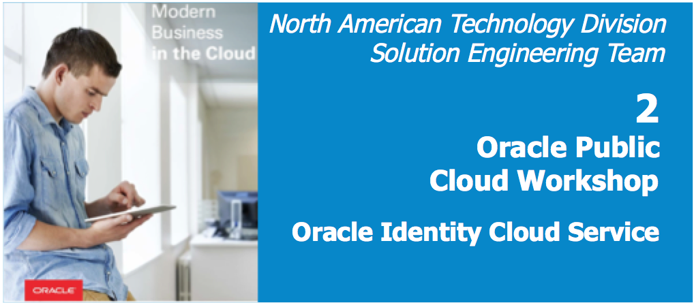

# Single Sign-on

## Introduction

This is the second of several labs that are part of the **Oracle Public Cloud Identity Cloud Service workshop.** This workshop will walk you through the Single Sign-on (SSO) capabilities available in Identity Cloud Service (IDCS).

IDCS supports SSO integration using several methods - 

- Security Assertion Markup Language (SAML) protocol
- Secure Form-Fill
- Agent enforced cookie or header based SSO with on-premise/cloud applications
- Oracle E-Business Suite asserter.

In this lab, you will integrate external application for SSO using SAML. 

**_To log issues_**, click here to go to the [GitHub oracle](https://github.com/oracle/learning-library/issues/new) repository issue submission form.

## Contents

- [Salesforce SSO Integration - SAML](contents/LabGuide2-IA-SAML.md)

