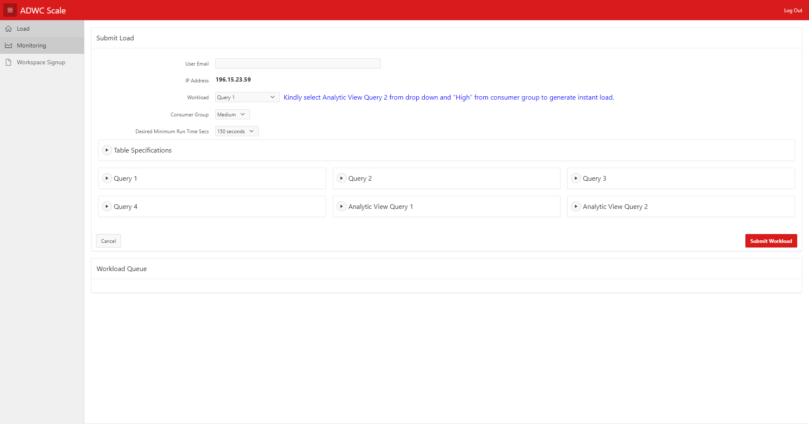
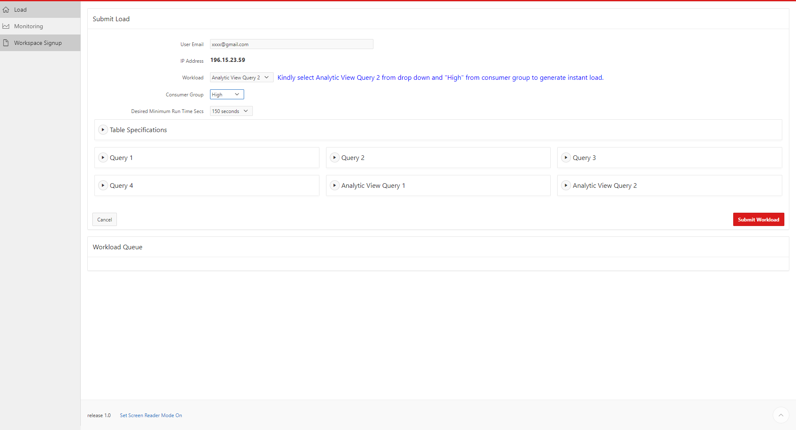
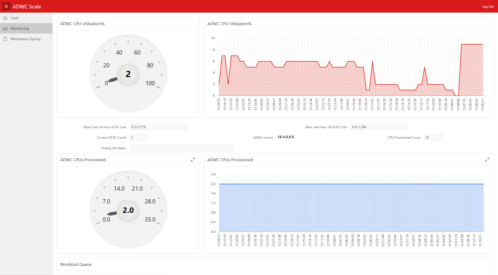

# Lab 100

## Introduction

This lab will show you how to navigate the Autonomous Data Warehouse auto scaling demo.

## Objectives

- Get comfortable with Autonomous Data Warehouse auto scaling and cost saving feature

## Autonomous Data Warehouse auto scaling click through demo

### **STEP 1**: ADW Scaling Demo Navigation

- Open browser and Navigate to http:www.oracledatagroup.com. it will show below landing page

- Click **Load** Menu to submit load to Autonomous Data Warehouse

  
   
- In load page enter below information
  
  * User Email - Enter your Email id
  * Workload - Select query from workload drop down 
  * Consumer Group - Select consumer group(Low, Medium, High) under which you want to submit load
  * Desired Minimum Run time sec - Select for how many second you want to run query
  * Click Submit Workload.It navigates to Monitoring screen.
  
    
  
- In Monitoring screen you can see ADWC CPU Utilization and ADWC CPUs Provisioned. Also you can see last 24 CPU cost after auto scaling and static CPU cost if we don't auto scale ADW. 

  

