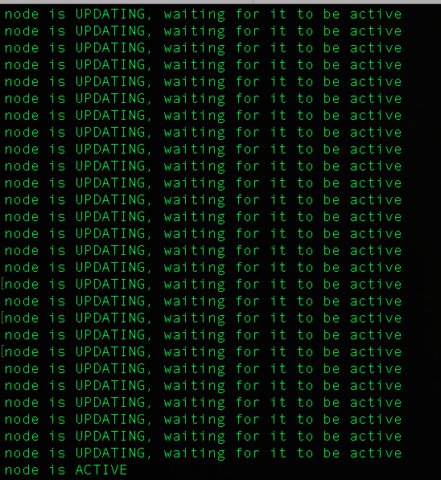

<table class="tbl-heading"><tr><td class="td-logo">

November 19, 2018
</td>
<td class="td-banner">
# Lab 10: Kubernetes and ATP
</td></tr><table>

## Introduction

Containers allow us to package apps along with all their dependencies and provide a light-weight run time environment that provides isolation similar to a virtual machine, but without the added overhead of a full-fledged operating system

The topic of containers and microservices is a subject on its own but suffice to say that breaking up large, complex software into more manageable pieces that run isolated from each other has many advantages. Its easier to deploy, diagnose and provides better availability since failure of any microservice limits downtime to a portion of the application.


Its important to have a similar strategy in the backend for the database tier. But the issue is if you run multiple databases for each application then you end up having to maintain a large fleet of databases and the maintenance costs can go through the roof. Add to that having to manage security and availability for all of them.

This is where the Oracle’s autonomous database cloud service comes in. It is based on a pluggable architecture similar to application containers where one container database holds multiple pluggable databases. Each of these pluggable databases or PDBs are completely isolated from each other, can be deployed quickly and can be managed as a whole so that you incur the cost of managing a single database while deploying multiple micro services onto these PDBs.

The Autonomous cloud service takes it a step further. It is self managing, self securing and highly available. There is no customer involvement in backing it up, patching it or even tuning it for most part. You simply provision, connect and run your apps. Lets take a look at how we can use cloud automation to deploy a full application stack in the Oracle Cloud Infrastructure and deploy a micro-service application.

To **log issues**, click [here](https://github.com/cloudsolutionhubs/autonomous-transaction-processing/issues/new) to go to the github oracle repository issue submission form.

## Objectives

- Use OCI automation to deploy a full infrastructure stack including load balancers, network, compute and a Kubernetes cluster
- Automate deployment of ATP database
- Deploy a microservice on the kubernetes cluster connected to the ATP database


## Required Artifacts

-   The following lab requires an Oracle Public Cloud account. You may use your own cloud account, a cloud account that you obtained through a trial, or a training account whose details were given to you by an Oracle instructor.
- Docker installed on your local machine. If you do not have docker please follow this [Mac User link](https://docs.docker.com/docker-for-mac/install/), [Windows User link](https://docs.docker.com/docker-for-windows/install/) and install docker

## Steps

### **STEP 1: Pull the Docker image**

- First we will pull down the docker image using:


```
docker pull [OPTIONS] NAME[:TAG|@DIGEST]
```

- Second, we will create a directory which we will use later to place our wallet in. When running our docker image we will use the -v option to map the directory to the image and the image will be able to pick up the wallet information

```
mkdir -p ~/tmp/wallet
```

- Now we will launch the container using the image we just pulled.

Note: With this run command we are mapping the local directory ~/tmp/wallet/ to the directory in the image /opt/oracle/database/wallet.

```
docker run -it -v /var/run/docker.sock:/var/run/docker.sock -v ~/tmp/wallet:/opt/oracle/database/wallet NAMEOFIMAGE /bin/bash
```


### **STEP 2: Setup OCI config**

- Once in the image we will setup OCI-CLI like we did in Lab900:

```
oci setup config
```

- The command prompts you for the information required for the config file and the API public/private keys. The setup dialog generates an API key pair and creates the config file.


- Once you run the above command, you will need to enter the following:

    - **Enter a location for your config [/Users/tejus/.oci/config]**: Press Return key
    - **Enter a user OCID**: This is located on your user information page in OCI console

    Login to OCI console and click on Menu, Identity and Users. Click on the User and navigate to User Details page. Copy the User OCID.

    

    


    - **Enter a tenancy OCID**: This is located in the bottom left of your OCI console
    
    Login to OCI console click on User icon on top right corner on the page and click on Tenancy and copy Tenancy OCID

    

    

    - **Enter a region (e.g. eu-frankfurt-1, uk-london-1, us-ashburn-1, us-phoenix-1)**: Select a region

    - **Do you want to generate a new RSA key pair? (If you decline you will be asked to supply the path to an existing key.) [Y/n]**: Y
    - **Enter a directory for your keys to be created [/Users/tejus/.oci]**: Press Return key
    - **Enter a name for your key [oci_api_key]**: Press Return key
    - **Enter a passphrase for your private key (empty for no passphrase)**: Press Return key
    

### **STEP 3: Deploy the Infratstructure**

- This step is entirely automated and only requires the user to add the compartment ID to deploy the infrastructure

```
source deployInfra.sh
```

- This will prompt you to enter the compartment ID of which to deploy the infrastructure. On the **Menu** screen, go down to **Identity** and select **Compartments**


- Select the copy icon to copy the ID of the compartment you will paste in the terminal

- When you are finished it should look like like below:


This process can take upwards of 10 minutes while everything is configured and includes creating an:
- ATP instance
- VCN
- Internet Gateway
- Route Table
- Security Lists
- Workers Subnets
- Load Balancer Subnets
- Kubernetes Cluster
- Node pool for the Kubernetes Cluster

When it is over you will see a message like below:




### **STEP 4: Deploy the Node Application**

- We have scripted the deployment of the Node application as well. Please run the script below:

```
source deployApp.sh
```


- When the script is finished you will see the message:


- Go to your local browser at **127.0.0.1:8080** and you should see the application deployed!


