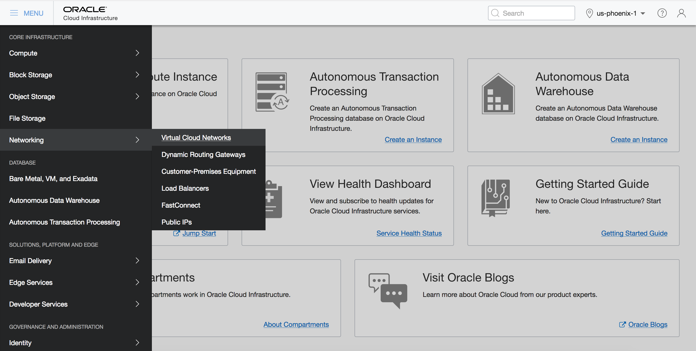
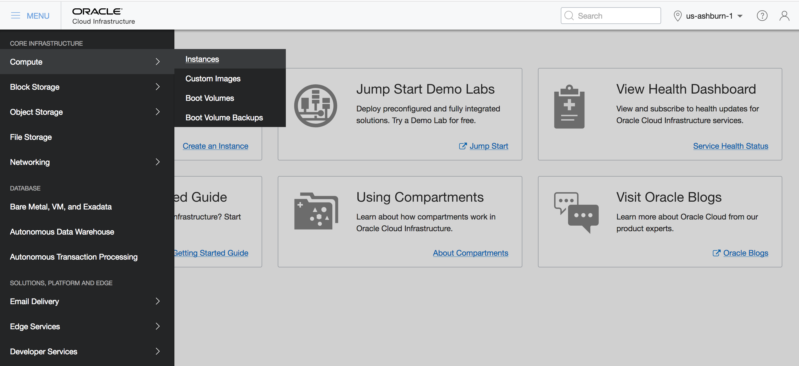
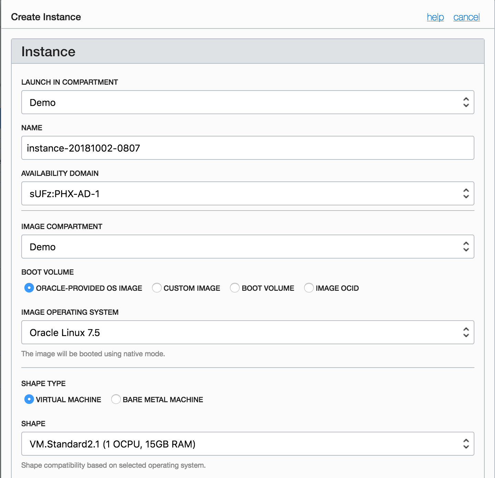
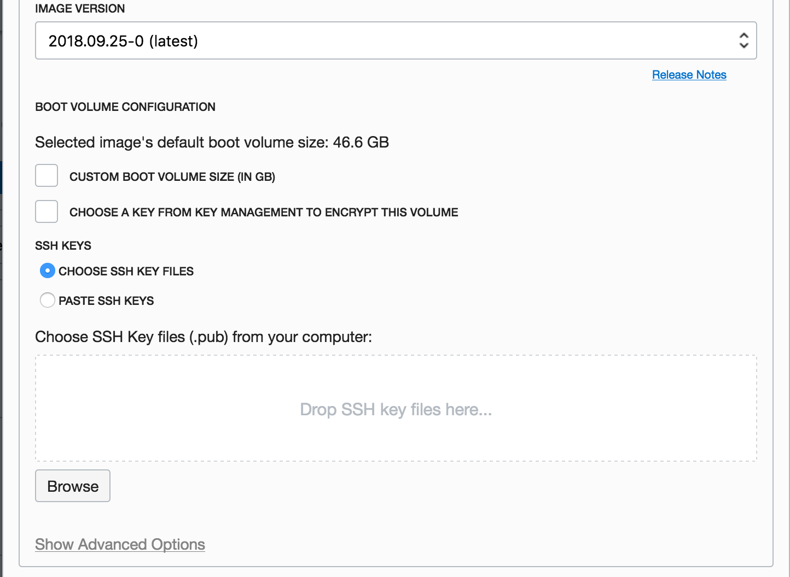

<table class="tbl-heading"><tr><td class="td-logo">

November 08, 2018
</td>
<td class="td-banner">
# Lab 6: Configure Java with ATP
</td></tr><table>

## Introduction

Autonomous Transaction Processing provides all of the performance of the market-leading Oracle Database in an environment that is tuned and optimized for transaction processing workloads. Oracle Autonomous Transaction Processing (or ATP) service provisions in a few minutes and requires very little manual ongoing administration.


ATP provides a TLS 1.2 encrypted secure connectivity for applications. In fact, using a secure encryption wallet is the only way to connect to an ATP service instance, ensuring every connection to your database is secure, regardless how it gets routed.

To **log issues**, click [here](https://github.com/cloudsolutionhubs/autonomous-transaction-processing/issues/new) to go to the github oracle repository issue submission form.

## Objectives

- Learn how to build a linux Java application server and connect it to an Oracle ATP database service

## Required Artifacts

- The following lab requires an Oracle Public Cloud account. You may use your own cloud account, a cloud account that you obtained through a trial, or a training account whose details were given to you by an Oracle instructor.

#### Note: If you have created Virtual Cloud Network, Linux Environemnt in the previous lab, you can jump to Step 3 in the same lab to configure Java with ATP.

## Steps

### **STEP 1: Create a Virtual Cloud Network**

Virutal Cloud Network (VCN) is a private network that you set up in the Oracle data centers, with firewall rules and specific types of communication gateways that you can choose to use. A VCN covers a single, contiguous IPv4 CIDR block of your choice. See [Default Components that Come With Your VCN](https://docs.cloud.oracle.com/iaas/Content/Network/Concepts/overview.htm#Default). The terms virtual cloud network, VCN, and cloud network are used interchangeably in this documentation. For more information, see [VCNs and Subnets](https://docs.cloud.oracle.com/iaas/Content/Network/Tasks/managingVCNs.htm).

- Login to your Oracle Cloud Infrastructure and Click n **Menu** and select **Network** and **Virtual Cloud Networks**.



In order to create a VCN we need to select a Compartment from the List Scope. For this lab we will be selecting **Demo** compartment.


- After selecting **Demo** compartment click on Create Virtual Cloud Network to create VCN


- This will bring Create Virtual Cloud Netowrk screen where you will specify the configurations.


- Enter the following the screen

**Create In Compartment**: Select the sandbox compartment, Demo. By default, this field displays your current compartment.
**Name**: Enter a name for your cloud network.
Check on **Create Virtual Cloud Network Plus Related Resources** option. By selecting this option, you will be creating a VCN with only public subnets. The dialog expands to list the items that will be created with your cloud network.


- Click on Create Virtual Cloud Network.

A confirmation page displays the details of the cloud network that you just created. The cloud network has the following resources and characteristics (some of which are not listed in the confirmation dialog):
- CIDR block range of 10.0.0.0/16
- An internet gateway
- A route table with a default route rule to enable traffic to and from the internet gateway
- A [default security](https://docs.cloud.oracle.com/iaas/Content/Network/Concepts/securitylists.htm#Default) list
- A public subnet in each availability domain


### **STEP 2: Provision a Linux compute VM to serve as the app server**

- Provision a Linux compute VM to serve as the app server. 

- Log into your Oracle Cloud Infrastructure and click on Menu and select Compute and Instances.



- Click on Create Instance


- In order to create Compute Instance we need to select a Compartment. Select Demo Compartment which we created in Lab100

Enter the following to Create Linux Instance

- **Name**: Enter a friendly name to identify your Linux instance
- **Availability Domain**: Oracle Cloud Infrastructure is hosted in Regions, which are localized geographic areas. Each Region contains three Availability Domains which are isolated and fault-tolerant data centers that can be used to ensure high availability. In the Availability Domain field, select the Availability Domain in which you want to run the instance. For example, scul:PHX-AD-1.
- **Image Compartment**: Select Demo compartment
- **Boot Volume**: Oracle-Provided OS Image
- **Image Operating System**: Oracle Linux 7.5
- **Shape Type**: Virtual Machine
- **Shape**: The shape of an instance determines the number of CPUs, the amount of memory, and how much local storage an instance will have. Shape types with names that start with VM are Virtual Machines, while shape types with names that start with BM are Bare Metal instances. Choose the appropriate shape for your Virtual Machine instance in the Shape field. For example, VM.Standard1.4.
- **Image Version**: Please select the latest version, 2018.09.25-0(latest)
- **SSH Keys**: If the operating system image for your instance uses SSH keys for authentication (for example, Linux instances), then you must provide an SSH public key. To choose a public key file, ensure that Choose SSH Key Files is selected, then click Browse. 


- Choose the public key to upload (for example, id_rsa.pub), then click Open. Note: some operating systems may use a different interface for file selection.


If you do not have ssh key pair you can create using command line.

- Open terminal for entering the commands
- At the prompt, enter the following:
```
ssh-keygen -t rsa -N "" -b "2048" -C "key comment" -f path/root_name
```
Where
- **-t rsa**: Use the RSA algorithm
- **-N "passphrase"**: Passphrase to protect the use of the key (like a password). If you don't want to set a passphrase, don't enter anything between the quotes.
- **-b "2048"**: Generate a 2048 bit key.
- **-C "key comment": A name to identify the key.
- **-f path/root_name**: The location where the key pair will be saved and the root name for the files. For example, if you give the root name as id_rsa, the name of the private key will be id_rsa and the public key will be id_rsa.pub.


#### For windows users:

- Download and run the [PuTTY](http://www.chiark.greenend.org.uk/~sgtatham/putty/download.html) installer.

- Generate a private and public key pair:
    - Go to the Windows Start menu -> All Programs -> PuTTY and open PuTTYgen
    - Click the 'Generate' button and PuTTYgen will ask you to make some random movement with your mouse until it has enough random data to generate a secure key for you
    - Click the 'Save private key' button and save the resulting file somewhere safe and only accessible by you!

- **Virtual Cloud Network Compartment**: Select Demo Compartment
- **Virtual Cloud Network**: In the Virtual Cloud Network field, select the Virtual Cloud Network for the instance which we created earlier in this lab.
- **Subnet Compartment**: Select Demo Compartment
- **Subnet**: In the Subnet field, select the subnet to which to add the instance. For example, the public subnet scul:PHX-AD-1.

- Click on **Create Instance** at the bottom 





- While the instance is being created, its state is displayed as "PROVISIONING".


- The status changes to "RUNNING" when the instance is fully operational.


- Note the public IP of the machine provisioned and ssh into this host and configure it to run node.js on ATP.

### **STEP 3: Install JDK and JDBC drivers**

- ssh into Linux host machine

```
sudo ssh -i /path_to/sshkeys/id_rsa opc@publicIP
```


- Install open JDK in Linux environment

#### Note: It will take around 3 minutes to install

```
sudo yum install -y java-1.8.0-openjdk-devel
```


- Create a folder named ATPJava and clone the java app from git

```
cd ~

mkdir ATPJava

cd ATPJava

sudo yum install git

git clone https://github.com/cloudsolutionhubs/ATPJava.git
```

- Install JDBC drivers on Linux environment

```
cd /home/opc/ATPJava/

mkdir lib

cd lib 

wget https://github.com/cloudsolutionhubs/ojdbc8-full/raw/master/ojdbc8-full.tar.gz

tar xzfv ojdbc8-full.tar.gz
```


- Copy secured connection wallet to Linux instance

    - Open terminal in your laptop and run the following command

```
scp sudo scp -i /path_to_ssh_key/id_rsa /path_to/wallet_DB.zip opc@publicIP:/home/opc/ATPJava/
```

- Unzip secured wallet in your linux instance
    - ssh into linux host machine

```
sudo ssh -i /path_to/sshkeys/id_rsa opc@publicIP

cd /home/opc/ATPJava/

mkdir wallet_DB

unzip /home/opc/ATPJava/wallet_TEJUS.zip -d /home/opc/ATPJava/wallet_DB/
```


- Change database credentials configuration from dbconfig.properties

    Enter the following:

    #### Note: Please change your dbinstance, dbcredpath, dbuser, dbpassword accordingly.

    **dbinstance= This is your ATP instancee name. E.g tejus_low**

    **dbcredpath= /home/opc/ATPJava/wallet_DB**

    **dbuser= ADMIN**

    **dbpassword= WElcome_123#**

```
cd /home/opc/ATPJava/ATPJava/src

nano dbconfig.properties
```


- Edit sqlnet.ora in wallet_DB folder

```
cd /home/opc/ATPJava/wallet_DB/

nano sqlnet.ora
```

- Enter the following in sqlnet.ora

```
WALLET_LOCATION = (SOURCE = (METHOD = file) (METHOD_DATA = (DIRECTORY=$TNS_ADMIN)))
SSL_SERVER_DN_MATCH=yes
```


- Export TNS_ADMIN to location where secured wallet is present

```
export TNS_ADMIN=/home/opc/ATPJava/wallet_DB/
```

### **STEP 4: Compile and run Java application**

- Compile your Java application

```
cd /home/opc/ATPJava/ATPJava/src

javac -cp .:/home/opc/ATPJava/lib/ojdbc8-full/ojdbc8.jar TestATP.java
```


- Run your Java application 

```
java -cp .:/home/opc/ATPJava/lib/ojdbc8-full/ojdbc8.jar TestATP
```


You have now successfully connected your Java app to Autonomous Transaction Processing database.

-   You are now ready to move to the next lab.

<table>
<tr><td class="td-logo">[](#)</td>
<td class="td-banner">
## Great Work - All Done!
</td>
</tr>
<table>