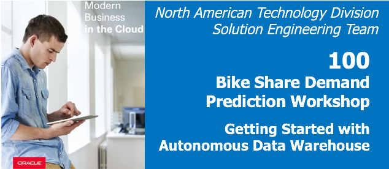
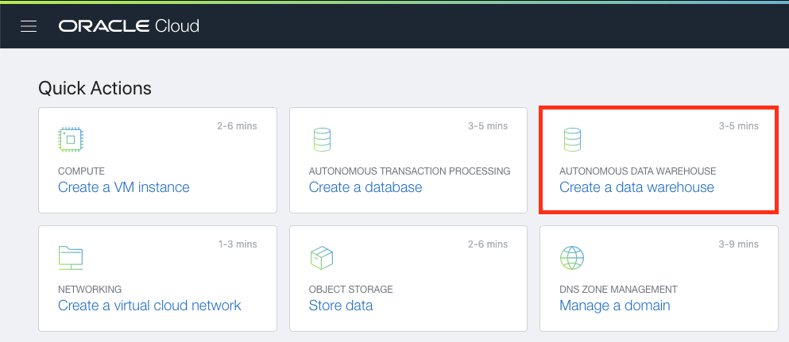
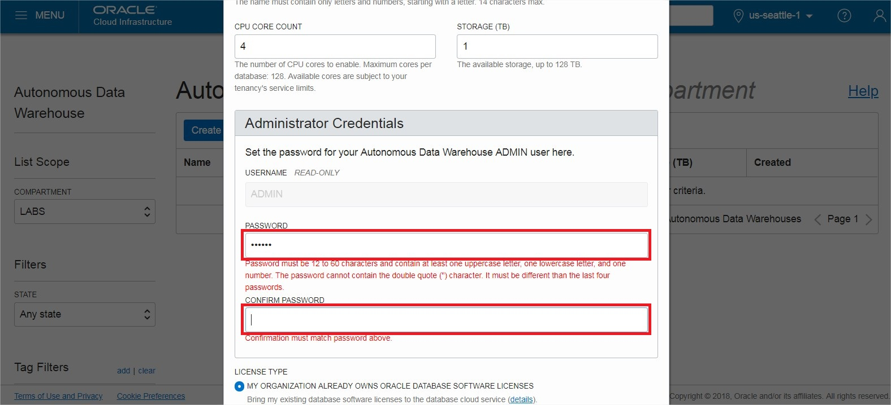
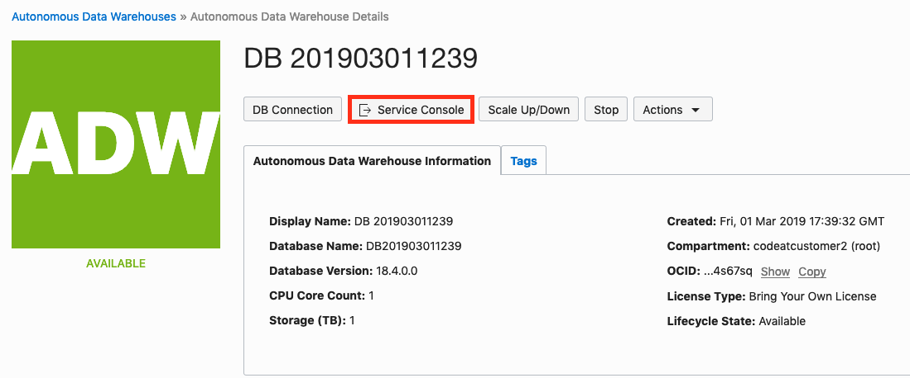
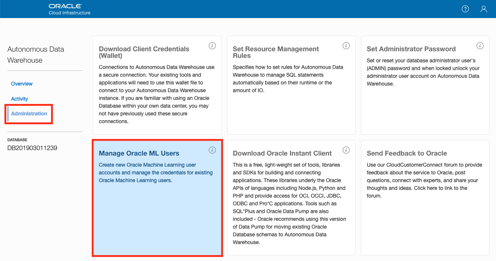

Getting Started with Autonomous Data Warehouse (ADW) and Oracle Machine Learning (OML)
----------------------------------------------------------------------------

  
Updated: January 4, 2019

## **Introduction**

This lab walks you through the steps to get started using the Oracle Autonomous Data Warehouse (ADW) and the new Oracle Machine Learning (OML) SQL notebook application provided with your Autonomous Data Warehouse on Oracle Infrastructure Cloud (OCI). You will provision a new ADW instance and create a new OML user.

**_To log issues_**, click here to go to the [github oracle](https://github.com/oracle/learning-library/issues/new) repository issue submission form.

## Objectives
-   Learn how to provision a new Autonomous Data Warehouse
-   Learn how to create OML Users

## Required Artifacts
-   The following lab requires an Oracle  Cloud account. You may use your own cloud account, a cloud account that you obtained through signing up for the free tier, or a training account whose details were given to you by an Oracle instructor.

# Provision Autonomous Data Warehouse (ADW) and Create Users in Oracle Machine Learning (OML)

## Part 1. Provisioning an ADW Instance

In this section you will be provisioning an ADW instance using the cloud console.

### **STEP 1: Sign in to Oracle Cloud**

- From any browser go to oracle.com to access the Oracle Cloud.

    [https://www.oracle.com/](https://www.oracle.com/)

    

- Click the icon in the upper right corner.  Click on **Sign in to Cloud** at the bottom of the drop down.  *NOTE:  Do NOT click the Sign-In button, this will take you to Single Sign-On, not the Oracle Cloud*

       

- Enter your username and password and click on **Sign In**.

-  Once you log in you will see a page similar to the one below.  Click on the hamburger icon in the upper left corner to reveal the menu.

      

### **STEP 2: Create an ADW Instance**

-   Once you are logged in, you are taken to the OCI Console. Click **Create a data warehouse**

-  This will bring up the Create Autonomous Data Warehouse screen where you will specify the configurations of the instance. Select the root compartment, or another compartment of your choice.

-  Specify a memorable display name for the instance. Also specify your database's name, for this lab use ADWFINANCE.

-  Next, select the number of CPUs and storage size. Here, we use 4 CPUs and 1 TB of storage.

-  Then, specify an ADMIN password for the instance, and a confirmation of it. Make a note of this password.

-  For this lab, we will select Subscribe To A New Database License. If your organization owns Oracle Database licenses already, you may bring those license to your cloud service.

-  Make sure everything is filled out correctly, then proceed to click on **Create Autonomous Data Warehouse**.

-  Your instance will begin provisioning. Once the state goes from Provisioning to Available, click on your display name to see its details.

-  You now have created your first Autonomous Data Warehouse instance. Have a look at your instance's details here including its name, database version, CPU count and storage size.

## Part 2. Creating an OML Users

### **STEP 3: Creating OML Users**

- Click the **Service Console** button on your Autonomous Data Warehouse details page.

- Click the **Administration** tab and click **Manage Oracle ML Users** to go to the OML user management page.

This will open a new tab within your browser that asks you for a username and password.

-   Enter **admin** as the username and use the password you specified when provisioning your ADWC instance.

**Note** that you do not have to go to this page using the same steps every time, you can bookmark this Oracle ML Notebook Admin URL and access it directly later.

-   Click **Create** button to create a new OML user. Note that this will also create a new database user with the same name. This newly created user will be able to use the OML notebook application. Note that you can also enter an email address to send an email confirmation to your user (*for this lab you can use your own personal email address*) when creating the user.

-   Enter the required information for this user, name the user as **omluser1**. If you supplied a valid **email address**, a welcome email should arrive within a few minutes to your Inbox. Click the **Create** button, in the top-right corner of the page, to create the user.

-   Below is the email which each user receives welcoming them to the OML application. It includes a direct link to the OML application
for that user which they can bookmark.

-   After you click **Create** you will see that user listed in the Users section.

-   Using the same steps, create another user named **omluser2**.

You will use these two users later in this workshop.

## Great Work - All Done with Lab100!
**You are ready to move on to the next lab. You may now close this tab.**
