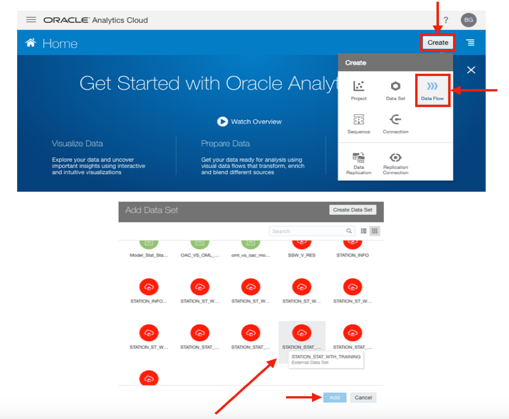
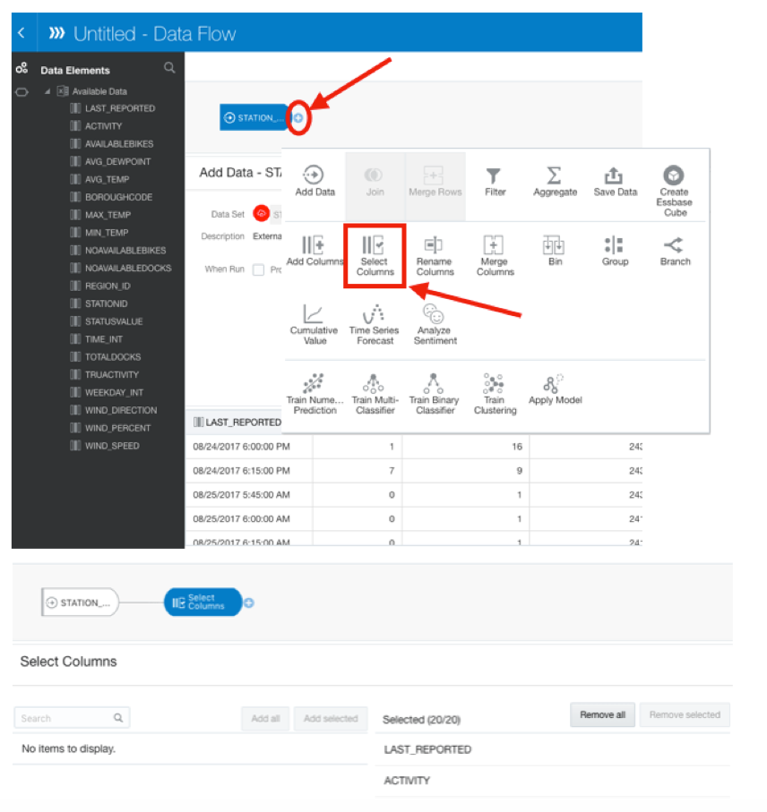
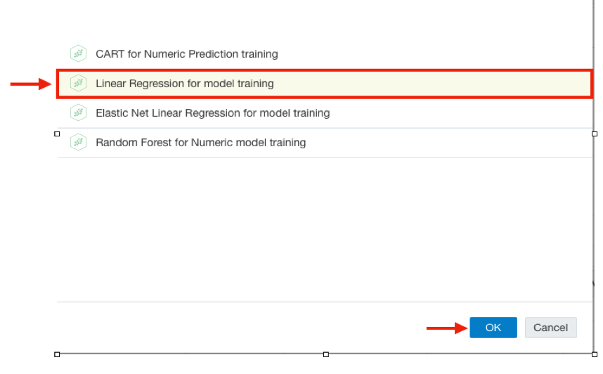
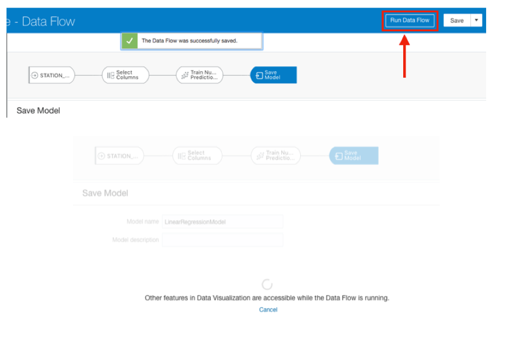
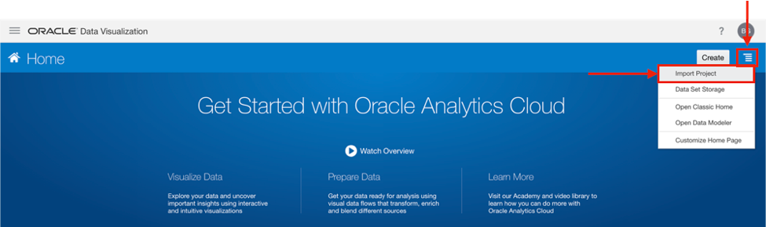
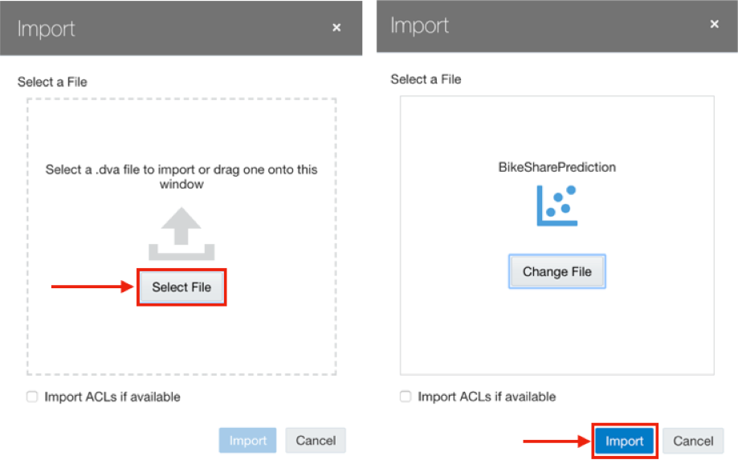
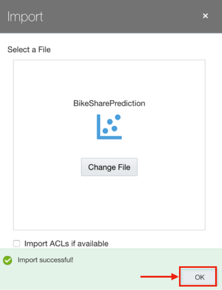
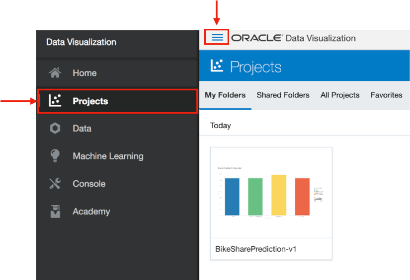

# Building Machine Learning Models in Oracle Analytics Cloud (OAC)

  
Updated: January 4, 2019

## Introduction

This lab walks you through the steps to create and train a machine learning model in the Oracle Analytic Cloud, without writing a single line of code. Also, we will show you a comparison between different machine learning models that you can create using OAC.

**_To log issues_**, click here to go to the [github oracle](https://github.com/oracle/learning-library/issues/new) repository issue submission form.

## Objectives
-   Learn how to create machine learning models in Oracle Analytics Cloud
-   Compare different machine learning models

## Required Artifacts
-    The following lab requires an Oracle  Cloud account. You may use your own cloud account, a cloud account that you obtained through signing up for the free tier, or a training account whose details were given to you by an Oracle instructor.

# Build and Compare Machine Learning Models in Oracle Analytics Cloud (OAC)

## Part 1. Create Machine Learning Models in OAC

### **STEP 1: Create a Linear Regression Model in OAC**

-   In your OAC instance, click on **Create**, then select **Data Flow** in the wizard. Once the list of tables popped up, select the dataset we want to use for training the model (**STATION_ST_WTH_TRAINING** ).

-   Click on the small **+** to select the subset of columns that you need to use for training the model. Here you need every columns, so we select them all.

-   Next, you should choose the class of machine learning algorithms applicable to this problem. In this case, you need a numerical prediction algorithm, so choose the corresponding class of algorithms.

-   Among the available built-in algorithms, select the **Linear Regression** model.

-   As you can see, all the variables except one are set by default. The only variable you need to specify in order to have a complete linear regression model is the target column. You can select the target column from the list of existing columns in the table. Since you want to predict the number of available bikes at each station, you should select the “AVIALABLEBIKES”.

-   Now, save both the model and the Data Flow.

-   Once the Data Flow is saved, you can click on **Run Data Flow**, which trains the model on the data you selected in the first step.

## Part 2. Compare Different Machine Learning Models

**Note:** In this section, you will compare different machine learning models to find the one which fits this problem the best. One way to do this is to repeate **Part 1** three more times and create other built-in machine learning models one by one. However, to simplify the process, we have already created all those models and the comparison between them in a DVA project. Next steps will shoe you how you can import that project and use it as a base for creating more graphs in the next labs.

### **STEP 2: Import the .DVA Project**

-   Click on the hamburger icon on the top right side of the OAC home page and select **Import Project**.

-   Click on **Select File** and upload the [**BikeSharePrediction.dva**](./files/project/BikeSharePrediction.dva) file. Then click on **Import** to import the project to your OAC instance.

-   When the import is successful, a message will pop up. Click on **OK**.

-   You can see the project under the section **Projects**.

## Great Work - All Done with Lab400!
**You are ready to move on to the next lab. You may now close this tab.**
