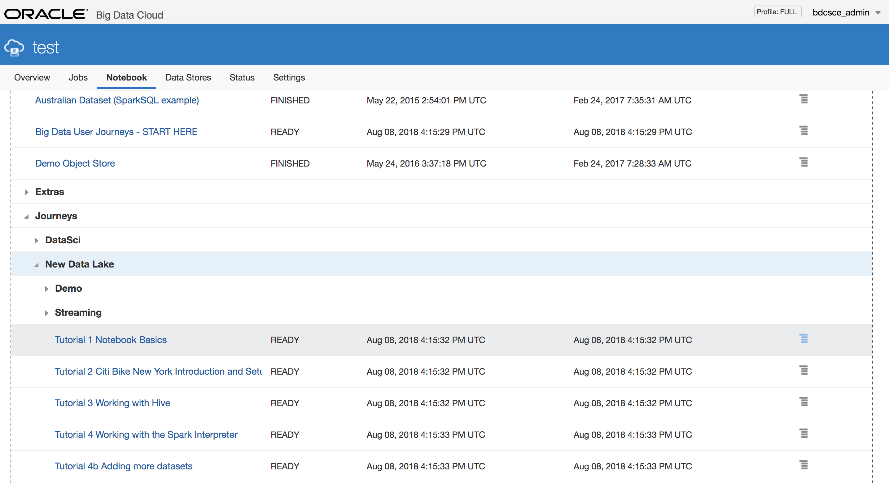
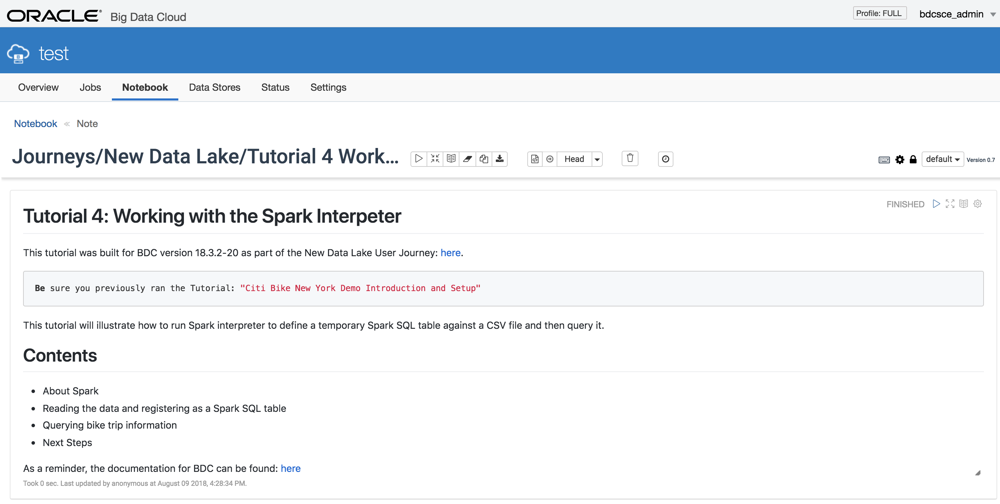
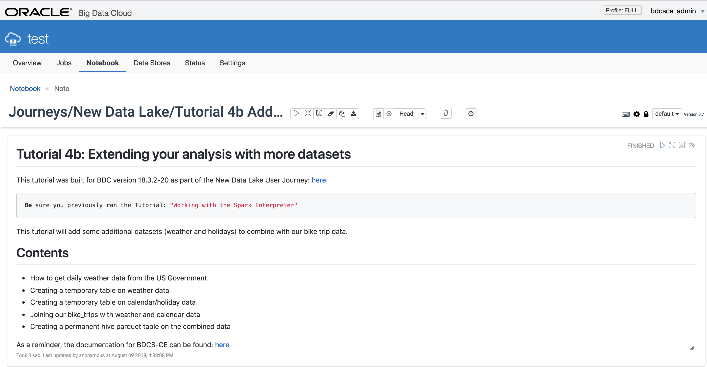
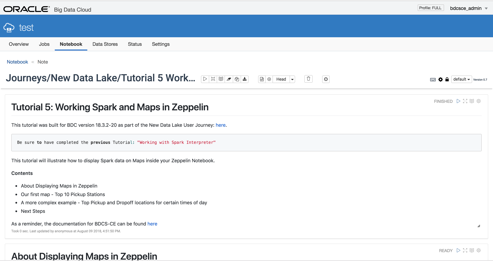
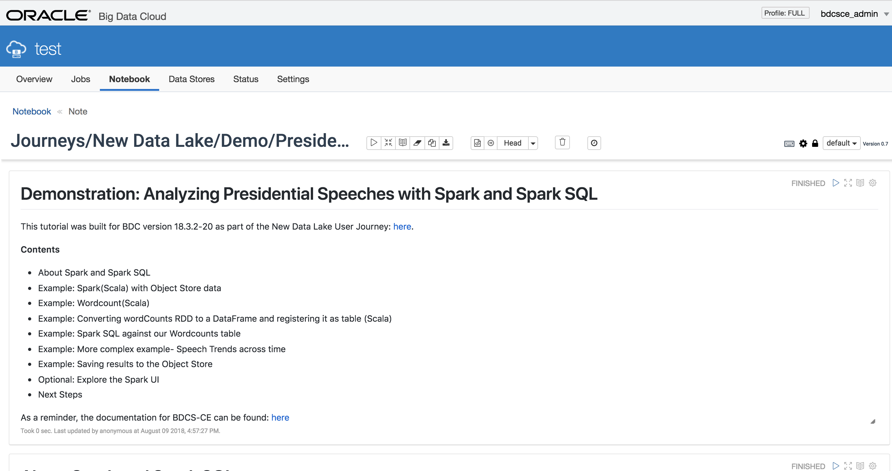

  

# Lab: More about Big Data Cloud

## Introduction

This lab will walk you through additional features of **Oracle Big Data Cloud**.  

In particular, this lab will focus on interacting with **Spark** and **Spark SQL**. 

Please direct comments to: David Bayard (david.bayard@oracle.com)

## Objectives

- Learn how to work with Spark and Spark SQL
- Learn how to work with Maps with Spark and Zeppelin

## Required Artifacts

- A running BDC instance and Storage Cloud Object Store instance, created as per the instructions in Lab 100.  These instructions included the use of a special "bootstrap.sh" script which setup the BDC environment for this workshop.
- You completed the tutorials in Lab 200 Getting to know Oracle Big Data Cloud

# Connect to the BDC Console

## Steps

### **STEP 1**: Navigate/login to the Oracle Cloud My Services Dashboard  

 

### **STEP 2**: Select Oracle Big Data Cloud in My Services page and then, click on "Open Service Console".

### **STEP 3**: Launch the Big Data Cluster Console

- Launch the Big Data Cluster Console for your BDC cluster.  If this is your first time, you will likely need to allow your browser to accept the self-signed certificate for the web console application.
- You will be asked to provide a username/password.  Use the username and password you defined earlier when you created the BDC instance (the username defaults to bdcsce_admin). 

# Learn how to work with Spark and Spark SQL

## Open and run the Tutorial 4 note in the notebook

### **STEP 1**: Click on the Notebook tab. Expand the Journeys folder.  Then expand the New Data Lake folder. 

 

### **STEP 2**: Click on the Tutorial 4  Working with the Spark Interpreter tutorial to open it. 

### **STEP 3**: Read and follow the instructions in the Tutorial

## Open and run Tutorials 4b in the notebook

### **STEP 1**: Click on the Notebook tab. Expand the Journeys folder.  Then expand the New Data Lake folder. Then click on the Tutorial 4b Adding more datasets tutorial to open it. 

 

### **STEP 2**: Read and follow the instructions in the Tutorial

# Learn how to work with Maps with Spark and Zeppelin

## Open and run the Tutorial 5 note in the notebook

### **STEP 1**: Click on the Notebook tab. Expand the Journeys folder.  Then expand the New Data Lake folder. Then click on the Tutorial 5 Working with Spark and Maps tutorial to open it. 

### **STEP 2**: Read and follow the instructions in the Tutorial

# Check out a bonus demonstration using Spark with Presidential Speeches

## Open and run the Demonstration Presidential Speeches note in the notebook

### **STEP 1**: Click on the Notebook tab. Expand the Journeys folder.  Then expand the New Data Lake folder. Then expand the Demos folder. 

 

### **STEP 2**: Click on the Presidential Speeches with Spark and Spark SQL note to open it. 

 

### **STEP 3**: Read and follow the instructions in the note

 

# What you Learned

- Learned how to work with Spark and Spark SQL
- Learned how to work with Maps and Spark and Zeppelin

# Next Steps

- Proceed to the next Lab to learn how to add Oracle Event Hub Cloud Service to the architcture and how to leverage Spark Streaming