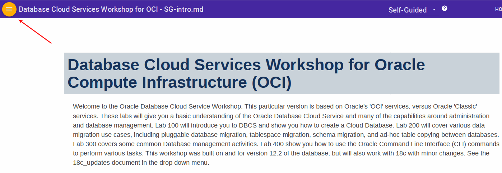
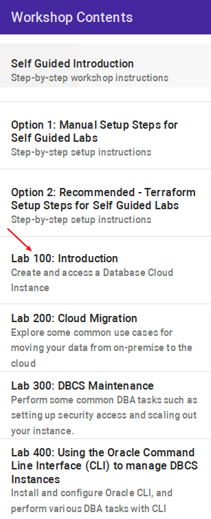

# Database Cloud Services Workshop for Oracle Compute Infrastructure (OCI)

Welcome to the Oracle Database Cloud Service Workshop. This particular version is based on Oracle's 'OCI' services, versus Oracle 'Classic' services. These labs will give you a basic understanding of the Oracle Database Cloud Service and many of the capabilities around administration and database management. Lab 100 will introduce you to DBCS and show you how to create a Cloud Database. Lab 200 will cover various data migration use cases, including pluggable database migration, tablespace migration, schema migration, and ad-hoc table copying between databases. Lab 300 covers some common Database management activities. Lab 400 show you how to use the Oracle Command Line Interface (CLI) commands to perform various tasks.  This workshop was built on and for version 12.2 of the database, but will also work with 18c with minor changes.  See the 18c_updates document in the drop down menu.

This instructor led version will have set up the lab environment for you so you don't need to run the setup steps.

### **STEP 1**:  Acquire an Oracle Cloud Trial or Workshop Account

- Please click on the URL to create your Free Account cloud.oracle.com/tryit, and complete all the required steps to get your free Oracle Cloud Trial Account. When you complete the registration process you'll receive a $300 credit that will enable you to complete the lab for free. Additionally, you'll have 1000s of hours left over to continue to explore the Oracle Cloud.
  - Soon after requesting your trial you will receive the following email. You will not be able to start Lab 100 until you have received it.

     

### **STEP 2**:  Navigate to Lab 100

- Once the setup is complete you can move on to lab 100 by clicking on the Menu Icon in the upper left corner of the browser window. You're now ready to continue with Lab 100.

  

