# DevOps and Infrastructure as Code 

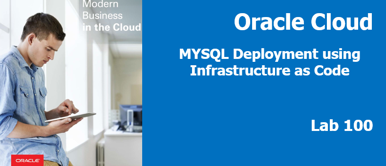

## Workshop Overview

In this workshop we will use the toolset built into Developer Cloud Service. Lab 100 will feature the Infrastructure persona (Riddhima) who is responible for laying down the footprint to support application deployments in the Oracle Cloud. Riddhima will lay down the ground work for a MYSQL DB running on a Oracle Linux Compute instance. He will build and deploy an environment by creating a "Custom Image" and then create an Oracle Linux VM using that image. This will be accomplished using Developer Cloud Service's Packer and Terraform built-ins.

- Packer and Terraform are both open source tools from Hashcorp that are integrated into Developer Cloud Service. They will be used in a Pipeline flow to create the Cloud infrastructure and build out the custom Linux based VM.
- [Packer Documentation](https://www.packer.io/intro/index.html)
- [Terraform Documentation](https://www.terraform.io/)

## Objectives of this Workshop

- Login to your Oracle Trial Account
- Use Developer Cloud Service's new features of Packer / Terraform / Pipelines / Software Templates
- Generate and Deploy a Custom Image into your account
- Create a Compute Instance based on the Custom Image
- SSH into the Compute Instance and verify the installation of MYSQL, Git, and Docker

## Requirements

- If using Windows and your OS does not have the OpenSSH bundle (comes in later versions of Windows 10.. `You can open up a Command Prompt and type **ssh** or **ssh-keygen** to see`), download and install from here: [OpenSSH for Windows](http://www.mls-software.com/opensshd.html).

  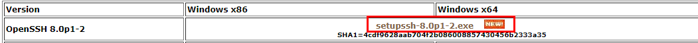


- During the installation only install the `client` side tools:

  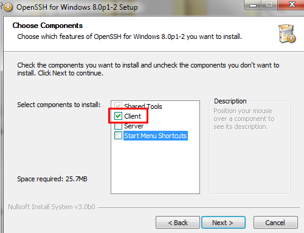

# Using Developer Cloud Service to Deploy Infrastructure

## Login to Trial Account

### **STEP 1**: Verify your Oracle Cloud Trial Account

- You have already applied for and received your Oracle Cloud Trial Account.

### **STEP 2**: Log in to your OCI dashboard

- Once you receive the **Get Started now with Oracle Cloud** Email, make note of your **Username, Password and Cloud Account Name**.

  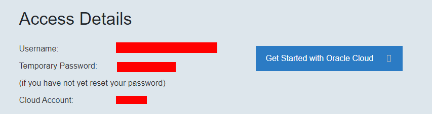

- From any browser go to. :

    [https://cloud.oracle.com/en_US/sign-in](https://cloud.oracle.com/en_US/sign-in)

- Enter your **Cloud Account Name** in the input field and click the **My Services** button.  This information can be found in your welcome email.

  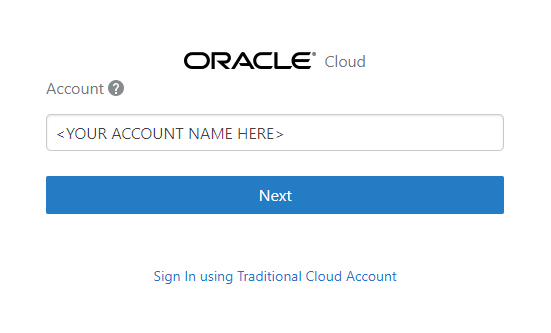

- Enter your **Username** and **Password** in the input fields and click **Sign In**.

  

  **NOTE: You will be prompted to change the temporary password given to you in the welcome email.**

### **STEP 3**: Go to Compute Services and Create a Compartment

Compartments are used to isolate resources within your OCI tenant. User-based access policies can be applied to manage access to compute instances and other resources within a Compartment.

- In the top left corner of the dashboard, click the **hamburger menu**. Right-click on **Compute** and select **Open link in new tab**.

  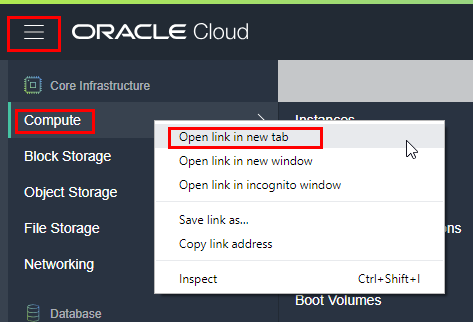

- In the Compute tab you just opened click the **hamburger icon** in the upper left corner to open the navigation menu. Under the **Identity** section of the menu, click **Compartments**.

  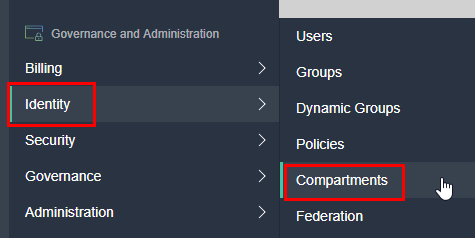

- Click **Create Compartment**.

  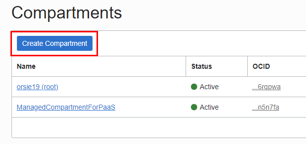

- In the **Name** field, enter any name you want. For this example we will be using the name `MYSQL`. Enter a **Description** of your choice. Click **Create Compartment**.

  ```
  Name: MYSQL
  ```

  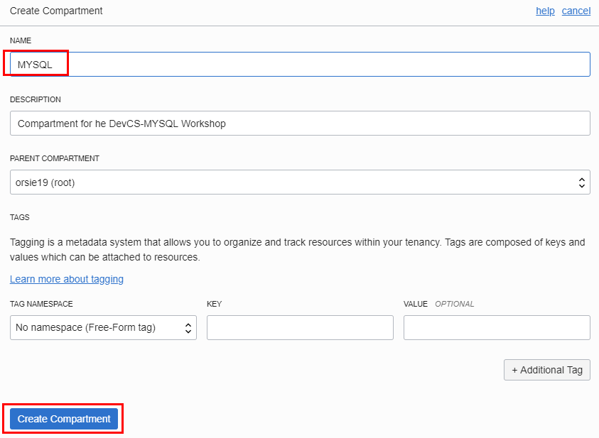

- In a moment, your new Compartment will show up in the list with an assigned OCID:

  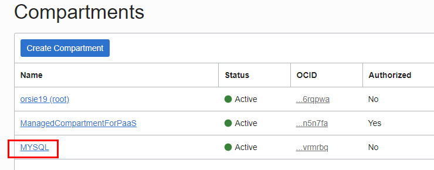

  **NOTE: OCID's are what the Oracle Cloud uses to identify specific components. Here is a description of the key resources we will be using in this workshop:**.

    - **IAM:**
Oracle Cloud Infrastructure Identity and Access Management (IAM) lets you control who has access to your cloud resources.

    - **Tenancy:**
The root compartment that contains all of your organization's Oracle Cloud Infrastructure resources. Oracle automatically creates your company's tenancy for you. Directly within the tenancy are your IAM entities (users, groups, compartments, and some policies; you can also put policies into compartments inside the tenancy). You place the other types of cloud resources (e.g., instances, virtual networks, block storage volumes, etc.) inside the compartments that you create.

    - **User:**
An individual employee or system that needs to manage or use your company's Oracle Cloud Infrastructure resources. Users might need to launch instances, manage remote disks, work with your virtual cloud network, etc. End users of your application are not typically IAM users. Users have one or more IAM credentials (see User Credentials).

    - **Compartment:**
A collection of related resources. Compartments are a fundamental component of Oracle Cloud Infrastructure for organizing and isolating your cloud resources. You use them to clearly separate resources for the purposes of measuring usage and billing, access (through the use of policies), and isolation (separating the resources for one project or business unit from another). A common approach is to create a compartment for each major part of your organization. For more information, see Setting Up Your Tenancy.

    - **Home Region:**
The region where your IAM resources reside. All IAM resources are global and available across all regions, but the master set of definitions reside in a single region, the home region. You must make changes to your IAM resources in your home region. The changes will be automatically propagated to all regions. For more information, see Managing Regions. In North America the Region will be Ashburn or Phoenix.

    - **API Public Key Fingerprint:**
    An API key pair will be created by you later in this lab. You will upload that key into an OCI USER account so you'll be able to remotely be able to create resources in your Tenancy. Once uploaded, a Fingerprint use by subsequent builds in Developer Cloud Service will be generated.

- **Save off the OCID of the `MYSQL` compartment** by clicking the **OCID** link  and then clicking **Copy**. **Paste this into a text editor** of your choice as we will be referencing it later on in the labs.

   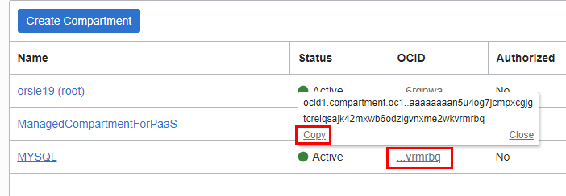

- Now, gather other OCID's to be used by clicking the **hamburger icon** in the upper left corner to open the navigation menu. Under the Identity section of the menu, click **Users**.

  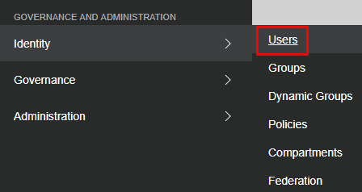

- You see a list of all the users in the account. You can use your login user or the default api.user if it is there. In this example we are using matto. Click the **Copy** link and save that value in your text editor.

  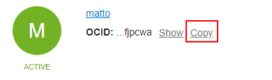

- Gather the Tenancy OCID and the Storage Namespace to be used by clicking the **hamburger icon** in the upper left corner to open the navigation menu. Under the Administration section of the menu, click **Tenancy Details**. editor.

  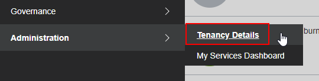

- In the details page click the **Copy** link of the OCID. Save that value in your text editor. Also save off the **Storage Namespace**, in this example: "orsie19".

  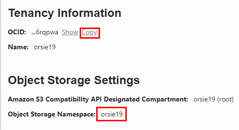

- Near the top right of the page you will notice a Region link. The link is not important at this time but the name of the region is. Note what it is and type that into your text editor. In this example it is `us-ashburn-1`.

  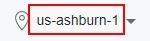

### **STEP 4**: Create a Virtual Compute Network

We need a default VCN so out Developer Cloud Service Builds have a resource to create instances within the `MYSQL` compartment (_Or the name you used for your compartment_). This is where Subnets and Security Lists (access rules) get defined for each Availablity Domain in your Tenancy. Oracle Cloud Infrastructure is hosted in regions and availability domains. A region is a localized geographic area, and an availability domain is one or more data centers located within a region. A region is composed of several availability domains. Availability domains are isolated from each other, fault tolerant, and very unlikely to fail simultaneously. Because availability domains do not share infrastructure such as power or cooling, or the internal availability domain network, a failure at one availability domain is unlikely to impact the availability of the others.

All the availability domains in a region are connected to each other by a low latency, high bandwidth network, which makes it possible for you to provide high-availability connectivity to the Internet and customer premises, and to build replicated systems in multiple availability domains for both high-availability and disaster recovery.

- Click the **hamburger icon** in the upper left corner to open the navigation menu. Under the **Network** section of the menu, click **Virtual Cloud Networks**.

   

- Select your compartment from the drop down list of values.

   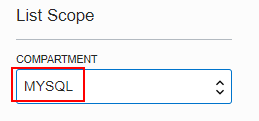

- Click **Create Virtual Cloud Network**

   

- Fill in and/or select the follow values as highlighted below:

   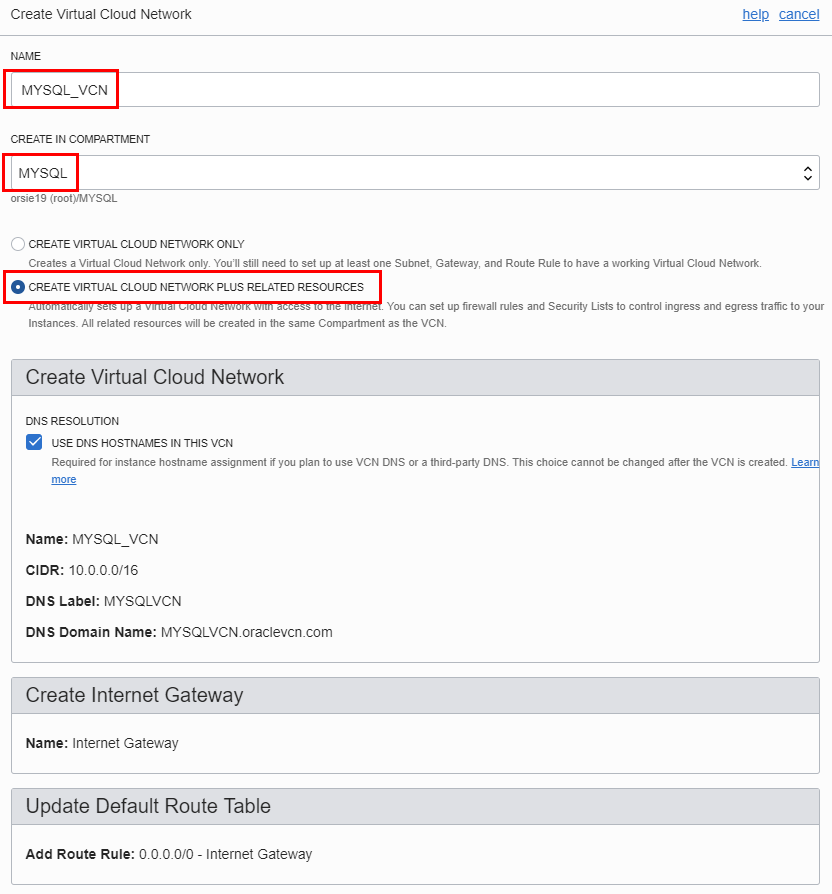

   

- Click **Create Virtual Cloud Network**

- Click **Close** on the details page:

   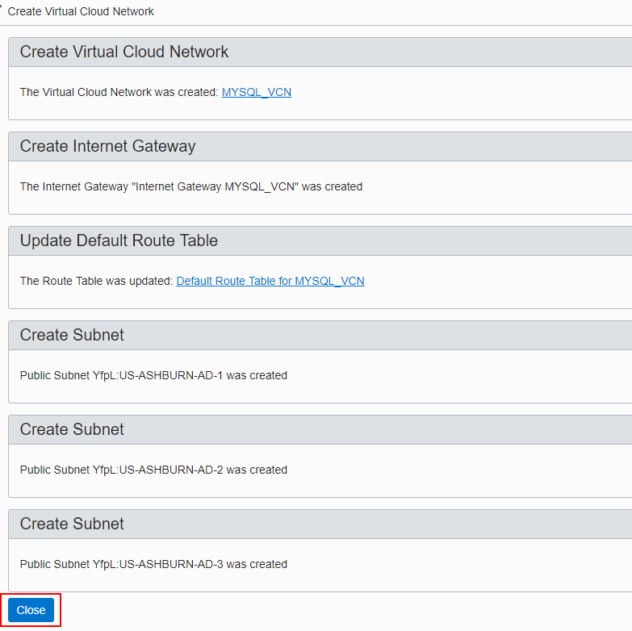

- You will see the VCN created:

   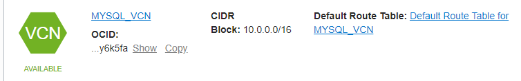

- While we're in this section let's gather one more component OCID that will be used in the lab. Click on the **MYSQL_VCN** link.

  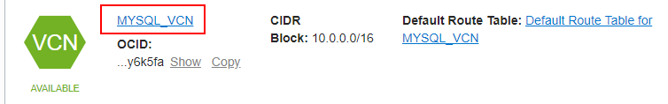

- You'll notice for redundency reasons that you have a subnet in each of the three Availability Domains in the region. Find the `<your-region>-AD-1` subnet and click **Copy**. Paste the Subnet OCID into your text editor.

  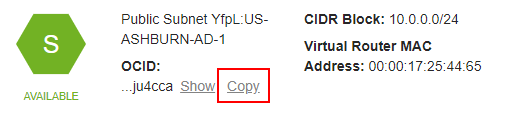

- Also, copy and paste the **Availibility Domain** for AD-1 and save in your text editor. In this example it's `Yfpl:US-ASHBURN-AD-1`

  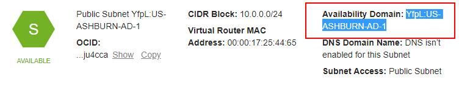

- At this point we have retrieved all the component resources we need to remotely work with your account.

### **STEP 5**: Create the Developer Cloud Service Instance

Before you can use Oracle Developer Cloud Service to provision to Oracle Cloud Infrastructure you must deploy an DevCS instance (Development/Deployment environment), Then you'll configure supporting connections which control VM builds and storage project artifacts.

- Click on the **hamburger menu**, right-click on **My Services Dashboard** and select **Open link in new tab**:

  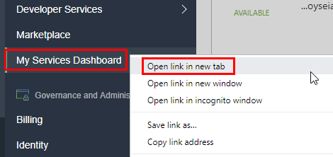

- If prompted set your preferences and click **OK**.

  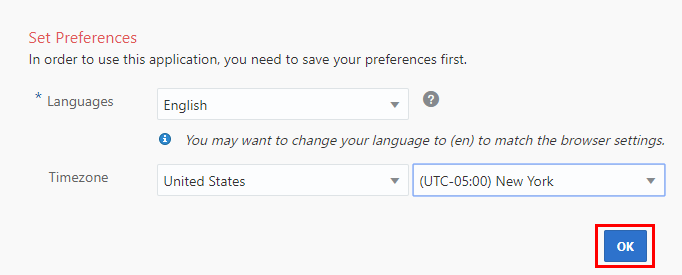

- Click on the Dashboard **hamburger menu**, expand **Services**, right-click on **Developer** and select **Open link in new tab**.

  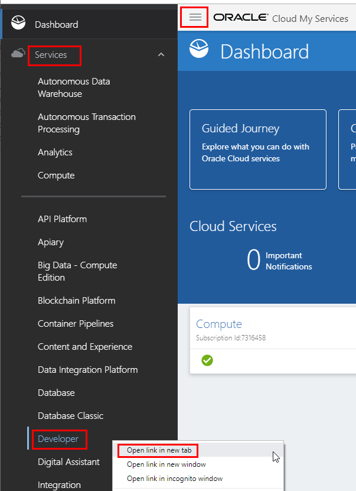

- Click **Create Instance**.

  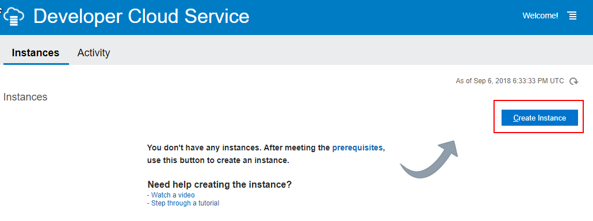

- Enter the following and click **Next** and then click **Create**:

  ```
  Name:       MYSQLAlphaOffice
  Description: Deployment of Infrastructure and Applications
  ```

  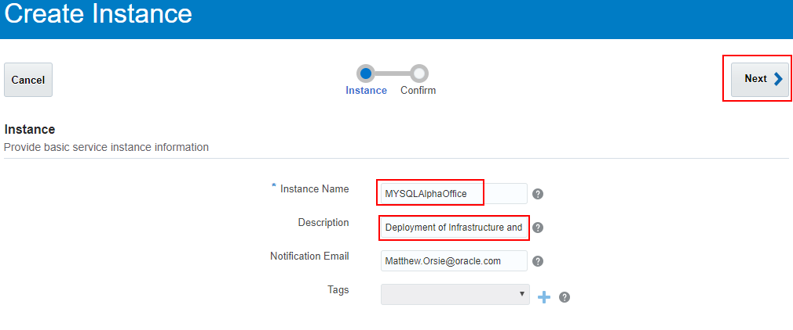

  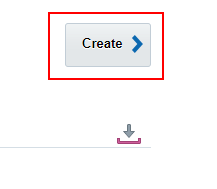

- After a few minutes click the **refresh page icon** to see if the status changes from creating service to nothing. You can also expand the **Instance Create and Delete History** to see if you have **green checkmark** that indicates successfull completion.

  

  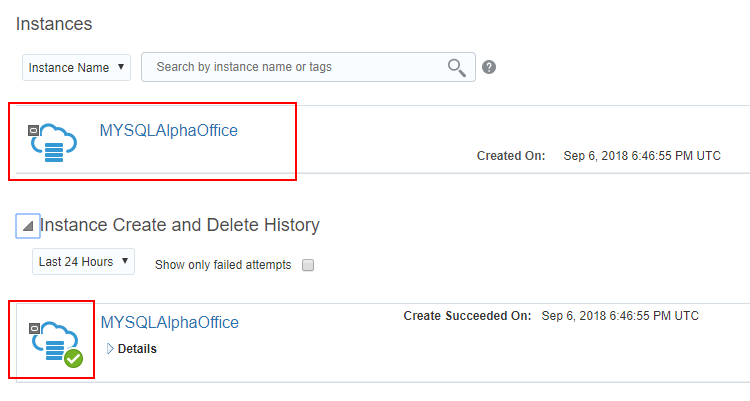

- Click on the **MYSQLAlphaOffice** link and then click on the **hamburger menu** on the upper right hand side of the page and select **Access Service Instance**.

  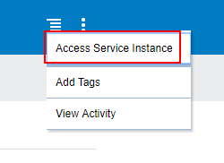

- You'll see on the page a reminder that configuration of  Compute and Storage needs to take place before any builds and deployments can be done. We will set this up later in the lab.

  

### **STEP 6**: Create the Project

The project we create will contain the builds and deployments for the Infrastructure.

- You can close the `Welcome` pane by clicking the **X**.

  

- Under `Organization` click the **Projects** link.

  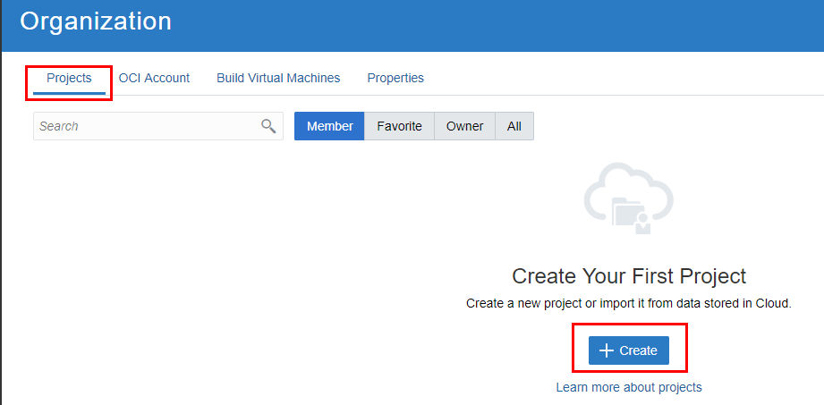

- Click the **New Project** button and enter the following in the dialog, then click **Next**.

  ```
  Name:        MYSQL-AlphaOffice
  Description: Infrastructure and application deployments
  ```

  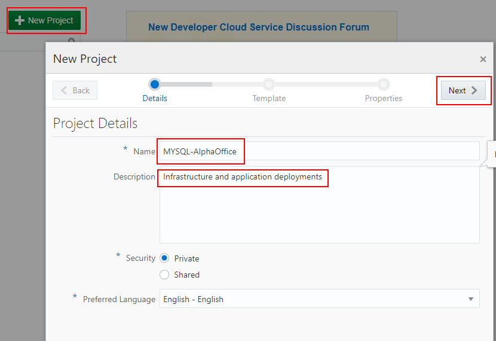

- Select **Empty Project** and click **Next**.

  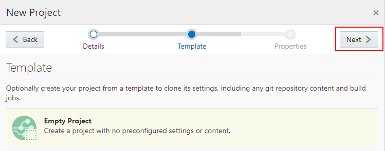

- At the properties step of the dialog take the default of `Markdown` and click **Finish**. In a minute or so the supporting project components will be provisioned.

  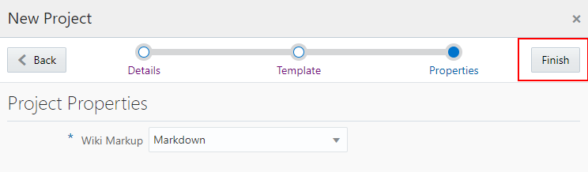

  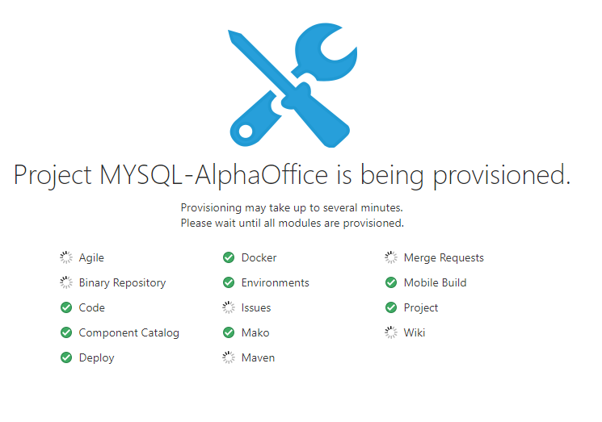   

### **Step 7**: Import a GitHub repository, Create Key Pairs

In this step you will import a GitHub repository into the project and modify a Packer configuration file. Here you will add the various OCIDs that you saved off earlier in your text editor. You'll also generate the two Key Pairs required. One pair is used for making API calls into your account and the other pair is used for creating the Compute Instance (VM).

- In the `Repositories` section click **Create**.

  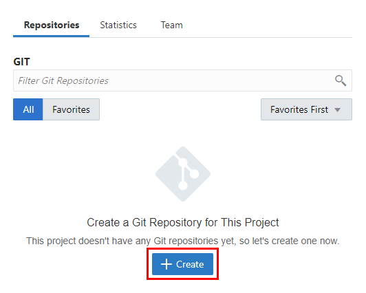

- Enter the following Name into the dialog:

  ```
  Name: MYSQL-PackerTerraform
  ```

- Select the **Import existing repository** radio button and then **Type** or **Copy and Paste** the following:

  ```
  https://github.com/wvbirder/DevCS-Packer-Terraform-MYSQL.git
  ```

  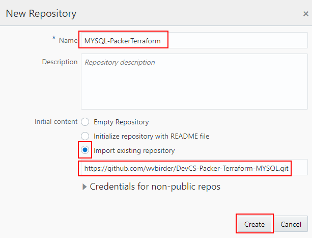

- This file contains all of support files for our Packer and Terraform builds.

- Click **Create**.

- You will see the repository contents displayed. In the next Steps we will be creating two key pairs, the API public and private keys will be placed into the **oci_api_key_public.pem** and **oci_api_key.pem** files respectively. The Compute Instance public and private keys will be placed into the **oci_instance_key.pub** and **oci_instance_key** files respectively.

### **STEP 7a Mac/Linux**: Create SSH Key Pairs (API and Instance) (Linux or Mac client)

**NOTE: This sub step focuses on key pair generation for Linux or Mac based terminal sessions. If your going to run your terminal sessions from a Windows client then skip to STEP 7b**.

A key pair is an authentication mechanism used by Oracle Cloud Infrastructure. A key pair consists of a private key file and a public key file. You upload your public key to Oracle Cloud Infrastructure. You keep the private key securely on your computer. The private key is private to you, like a password.

Key pairs can be generated according to different specifications. Oracle Cloud Infrastructure uses two types of key pairs for specific purposes:

`Instance SSH Key pair`: This key pair is used to establish secure shell (SSH) connection to an instance. When you provision an instance, you provide the public key, which is saved to the instance's authorized key file. To log on to the instance, you provide your private key, which is verified with the public key.

`API signing key pair`: This key pair is in PEM format and is used to authenticate you when submitting API requests. Only users who will be accessing Oracle Cloud Infrastructure via the API need this key pair.

You'll need to create two sets of SSH keys, the API key pair will allow access via an API to work with your cloud user account assets and the other key pair will be used to securely connect to a Compute Instance you will creating later on in this lab.

- In a `Linux/Mac` client terminal window **Type** the following (**For this lab we WON'T be using Passphrases**)

  - **type**  mkdir keys

  - **type** cd keys (taking your into your directory)

  - **type** ssh-keygen -m PEM -f  oci_api_key

  - **type** ssh-keygen -f oci_api_key -e -m PKCS8 > oci_api_key_pem.pub

    The last command creates a PEM formated public key from the private key. This is the required format for importing into the OCI user account.

    ```
    mkdir keys
    cd keys
    ssh-keygen -m PEM -f  oci_api_key
    ssh-keygen -f oci_api_key -e -m PKCS8 > oci_api_key_pem.pub
    ```

- Type **ls**:

  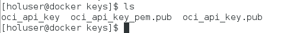

  Your API key pair files are now in the current directory.  You will have three files (the RSA pair) which make up the symmetric key and the PEM formatted public key used by the OCI user account. The private key should remain only in secure locations to protect from misuse.

- Now **Type** the following to generate the OCI Instance key pair:

  ```
  ssh-keygen -b 2048 -t rsa -f oci_instance_key
  ```

- Typing **ls** will now show five files:

  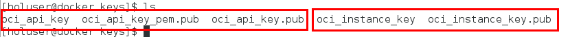

- **PROCEED to STEP 8**

### **STEP 7b Windows**: Create SSH Key Pair Create SSH Key Pairs (API and Instance) (Windows client)

A key pair is an authentication mechanism used by Oracle Cloud Infrastructure. A key pair consists of a private key file and a public key file. You upload your public key to Oracle Cloud Infrastructure. You keep the private key securely on your computer. The private key is private to you, like a password.

Key pairs can be generated according to different specifications. Oracle Cloud Infrastructure uses two types of key pairs for specific purposes:

`Instance SSH Key pair`: This key pair is used to establish secure shell (SSH) connection to an instance. When you provision an instance, you provide the public key, which is saved to the instance's authorized key file. To log on to the instance, you provide your private key, which is verified with the public key.

`API signing key pair`: This key pair is in PEM format and is used to authenticate you when submitting API requests. Only users who will be accessing Oracle Cloud Infrastructure via the API need this key pair.

You'll need to create two sets of SSH keys, the API key pair will allow access via an API to work with your cloud user account assets and the other key pair will be used to securely connect to a Compute Instance you will creating later on in this lab.

- As mentioned in the `Requirements` section at the beginning of this lab: If using Windows and your OS does not have the OpenSSH bundle (comes in later versions of Windows 10.. `You can open up a Command Prompt and type **ssh** or **ssh-keygen** to see`), download and install from here: [OpenSSH for Windows](http://www.mls-software.com/opensshd.html).

- In a `Windows` client terminal window **Type** the following (**For this lab we WON'T be using Passphrases**)

  - **type**  mkdir keys

  - **type** cd keys (taking your into your directory)

  - **type** ssh-keygen -b 2048 -t rsa -f oci_api_key

  - **type** ssh-keygen -f oci_api_key -e -m PKCS8 > oci_api_key_pem.pub

    The last command creates a PEM formated public key. This is the required format for importing into the OCI user account.

    ```
    mkdir keys
    cd keys
    ssh-keygen -b 2048 -t rsa -f oci_api_key
    ssh-keygen -f oci_api_key -e -m PKCS8 > oci_api_key_pem.pub
    ```
- Type **dir**:

  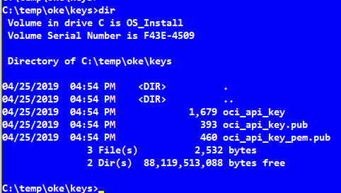

  Your API key pair files are now in the current directory.  You will have three files (the RSA pair) which make up the symmetric key and the PEM formatted public key used by the OCI user account. The private key should remain only in secure locations to protect from misuse.

- Now **Type** the following to generate the OCI Instance key pair:

  ```
  ssh-keygen -b 2048 -t rsa -f oci_instance_key
  ```

- Typing **dir** will now show five files:

  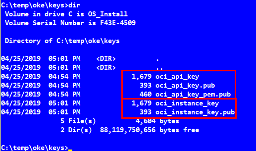

### **STEP 8**: Copy Key pair contents into their respective files in the Git Repository

**NOTE**: Windows Notepad screen shots will be shown in this step.

- If not already there you can click on the Developer Cloud Service **hamburger menu** and click on **Git** to get to the repository files.

  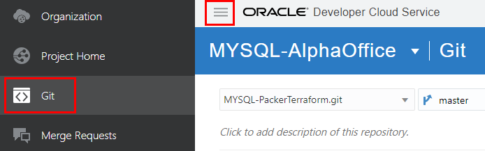

- On your local server open up the **oci_api_key_pem.pub** using your favorite text editor. Select the entire contents and right-click **Copy**:

  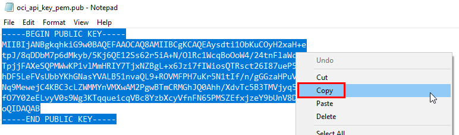

- If you no longer have the Compute Service Console opened from earlier in this lab go back to the main Services `Dashboard`, click **hamburger menu**, expand `Services`, right-click on **Compute** and select **Open link in new tab**.

  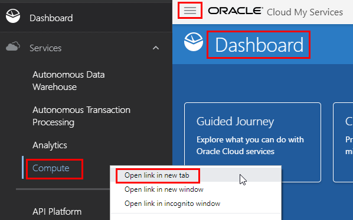

- Click the **hamburger menu** in the Compute Service Console and select **Identity-->Users**.

  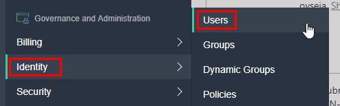

- Click the link of **the user** you copied the OCID from earlier in this lab.

  

- Under `API Keys` click **Add Public Key**. **Paste** the contents of the `oci_api_key_pem.pub` you copied from your editor. Click **Add**.

  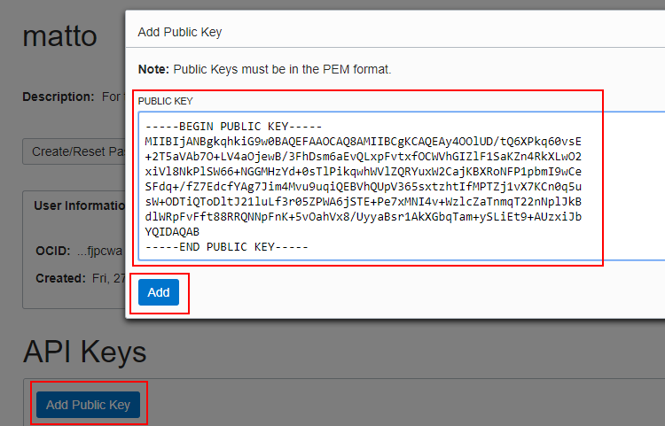

- A new PK Fingerprint will appear. Highlight the fingerprint and right-click **Copy**:

  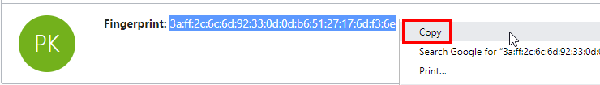

- **Paste this Fingerprint value into the text editor where you have been saving OCID's, etc**.

- Now open the **oci_api_key** file on your local server in a text editor, select the entire contents and right-click **Copy**:

  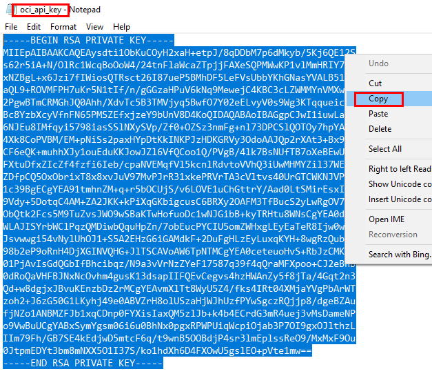

- In the Developer Git repository click on the **oci_api_key.pem** file. This is the private API key.

  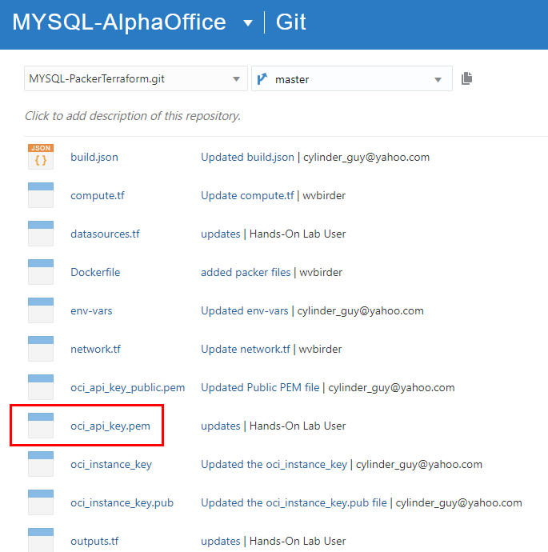

- Click the Pencil "edit" button:

  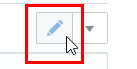

- **Paste** your `oci_api_key` file contents replacing anything already there:

  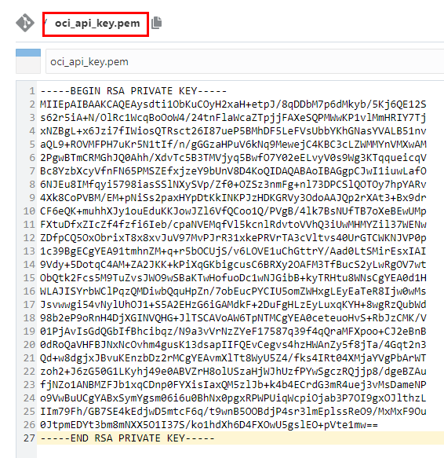

- Click the **Commit** button and at the dialog enter a comment and **Commit**.

  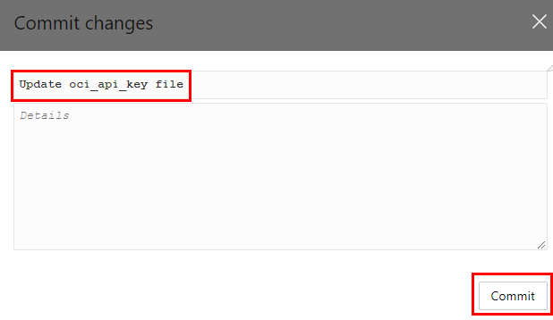

### **Step 9**: Configure the DevCS connection to your OCI account

- Now it's time to connect your DevCS environment to your OCI account. You will be using values from the project git repository and the OCID values you collected earlier in this lab. Back in your Developer Cloud Service under `Project Home` click the **OCI Credentials** link.

  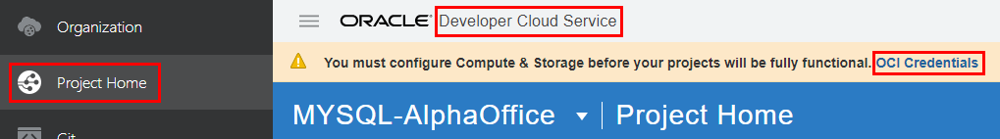

- In the `Configure OCI Account` dialog you will be Copying and Pasting the values you have saved in your text editor for:

   - **Tenancy OCID**
   - **User OCID**
   - Select the home region where your account is
   - **Private Key:** **Copy and Paste** the contents of the **oci_api_key** file in the Git Repository
   - **Fingerprint**
   - **Compartment OCID**
   - **Storage Namespace**

- When all values are in place click the **Validate** button to confirm. If Compute and Storage connections are successfull, click **Save**.

  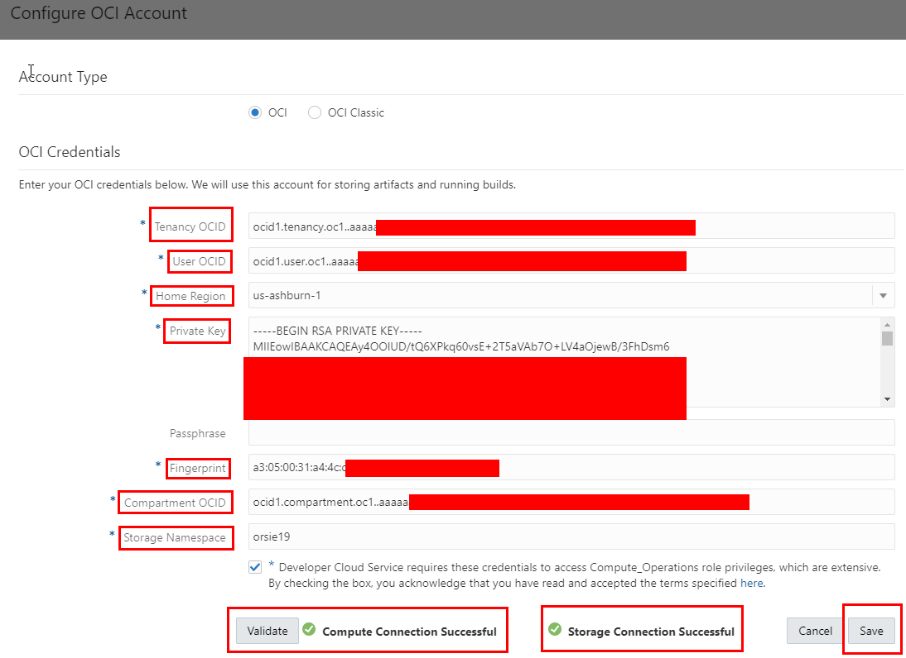

### **STEP 10**: Create Software Template and Virtual Machine configurations

In this step Software Templates define what supporting software packages get incorporated into the build servers used within Developer Cloud Service projects. Virtual Machine definitions define the number of VMs based on the Software Templates.

- Still within the `Organization` page click the **VM Templates** tab.

  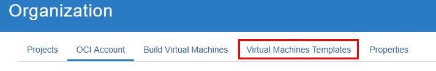

- Click **+Create**.

  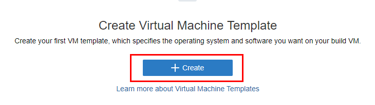

- In the dialog enter:

  ```
  PackerTerraformNodeJS
  ```

- Click **Create**.

  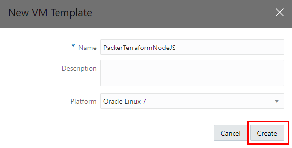

- Click on **Configure Software**.

  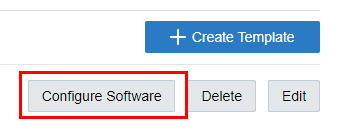

- Click on the big plus sign for the following packages:

   - **Docker 17**
   - **Node.js 6**
   - **Terraform**
   - **Packer**

- Click **Done** when all packages have been added.

  

 - Click the **Build Virtual Machines** tab followed by **+Create**.

  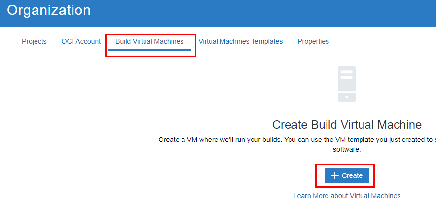

- In the dialog box take all the defaults. The **PackerTerraformNodeJS** template should be included. Click **Add**.

  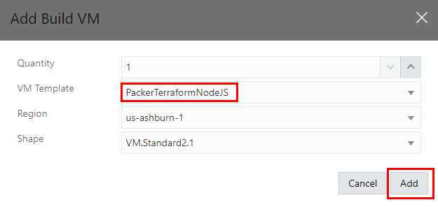

### **Step 11**: Edit the Packer "build.json" file

- Go to **Project Home** and click on the **MYSQL-PackerTerraform.git**  repository

  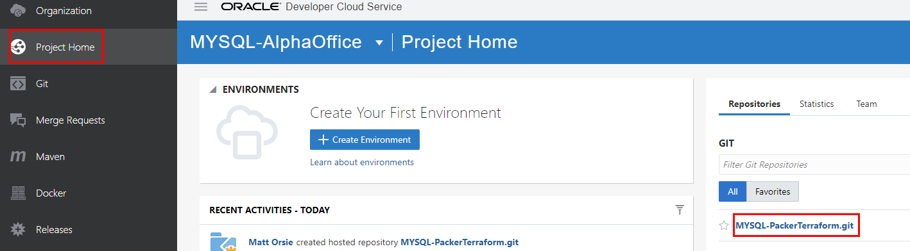

- Click on the **build.json** file as we are going to edit some values relative to your Trial Account.

  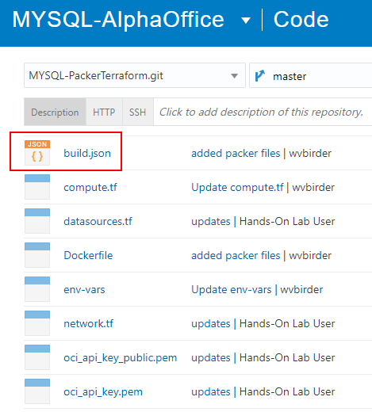

  **NOTE: This is where you again will be copying values you saved off earlier in the lab. It's importent to match the proper value with the environment variable. Tenany OCID to Tenacy, User OCID to User, etc**.

- Click on the **pencil icon** of the build.json file to edit.

  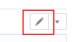

- At a minimum the following values will need to be **copied and pasted** into your build.json file:

    - **user_ocid**
    - **tenancy_ocid**
    - **fingerprint**
    - **avaliability_domain**
    - **compartment_ocid**
    - **subnet_ocid**

- **Replace the 6 variables above** in the file where the current values are **XXXX-HERE** with the corresponding values you saved in the text editor. You can paste these values into the file using **Ctrl-V**.

- So, for example:

  ```
  "user_ocid":"USER-HERE"
  ```

  Becomes: **NOTE:** The values stay in double quotes:

  ```
  "user_ocid":"ocid1.user.oc1..aaaaaaaazusfrxnxk3qx3fxxx75ynagfsmtdoorkfffb2hqu6rxnxcfjpcwa"
  ```

- When you are finished the file will look something like:

  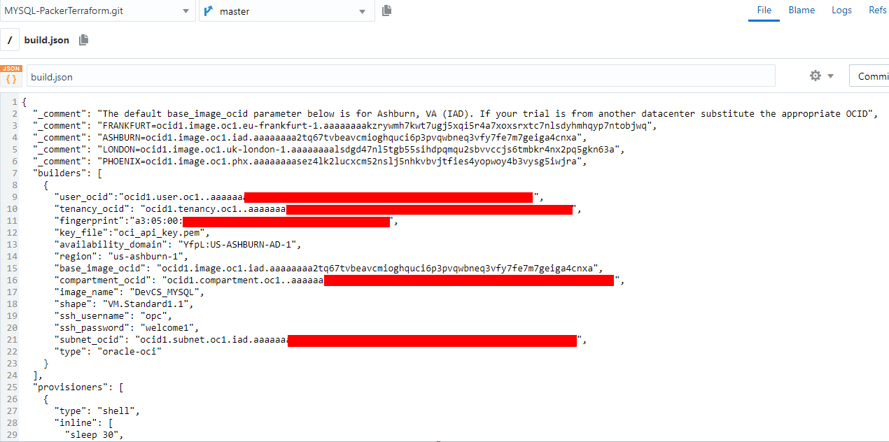

- **NOTE: If your Tenacy is NOT running in the "us-ashburn-1" region** then you will also need to change the following:

  ```
  "region": "<your-region>"
  "base_image_ocid": "<The OCID of the base image associated with your region. The comments section at the top of the file contains the values... the current default is for the ASHBURN region>"
  ```

- Click the **Commit** button. Also, **add a comment** and click **Commit** at the pop up dialog prompt.

  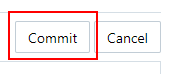

### **Step 12**: Build the Packer job

In this step you will define a Packer build using the Software Template you created in Step 7. This will build and create a Custom Image with MYSQL, GIT, and Docker installed into your Compute Service compartment.

- From the project menu click the **Builds** link.

  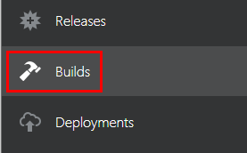

- Click **+Create Job**.

  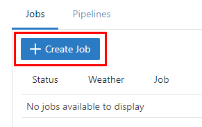

- Enter:

  ```
  MYSQL-Packer
  ```

- ...for the **Job Name**, select the **PackerTerraformNodeJS** template and click **Create Job**.

  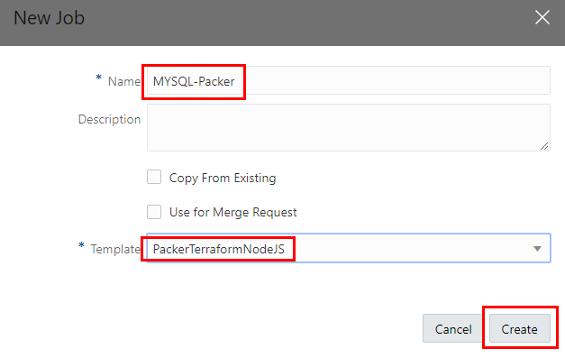

- Under the Git tab select **Add Git** and then choose the **MYSQL-PackerTerraform.git** repository.

  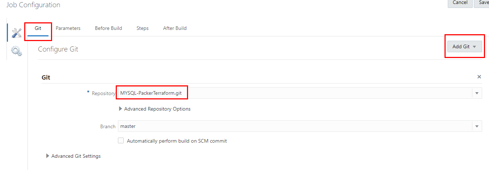

- Select the **Steps** tab and choose **Unix Shell**.

  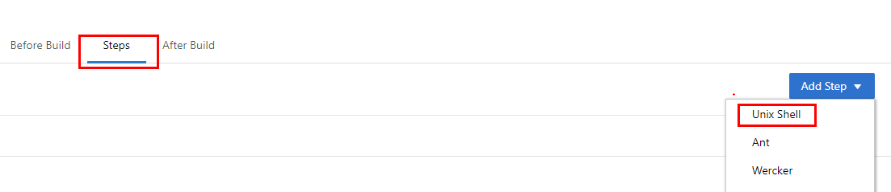

- **Copy and Paste** the following into the Script section:

  ```
  packer --version
  packer build build.json | tee output.txt
  ls -l
  cat output.txt
  set OUT = `tail output.txt | grep OCID | cut -d ":" -f 4 | cut -d ")" -f 1 | tr -d '[:space:]' | tee image_OCID`
  ```

  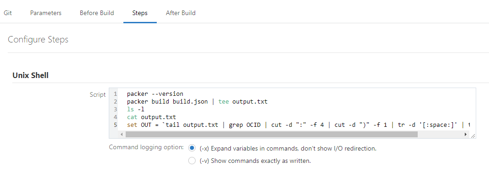

  The script fires off a Packer build based on the `build.json` contents and then places the OCID of the newly created Custom Image into an environment variable which can be referenced from other builds.

- Select the **After Build** tab and add the **Artifact Archiver** After Build Action. Enter the following into the **Files to Archive** field:

  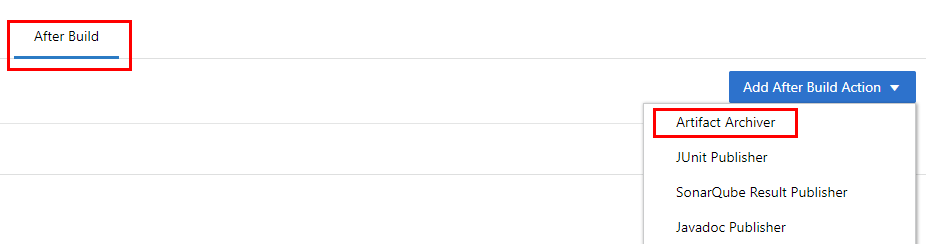

  ```
  image_OCID
  ```

  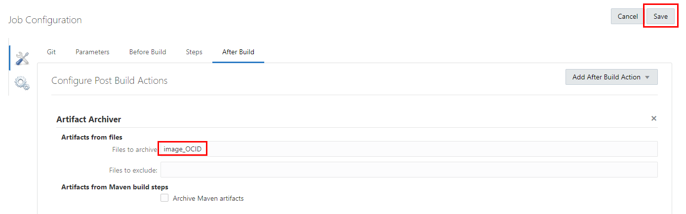

- Click **Save**.

- Click the **Build Now** button to queue up the Packer build for execution.

  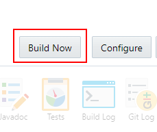

- The screen will update to show the build is queued. The first build may take 10-15 minutes or more as it first has to buld the "Build Server" used for subsequent build going forward. You can check the process by clicking on the **Build Log** icon once the build is in the running phase.

  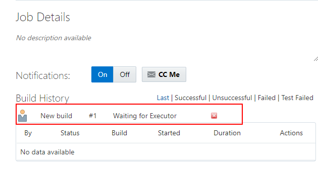

  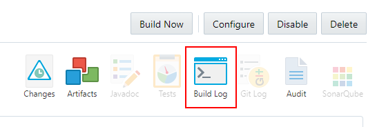

  **NOTE: If the build was not successfull the build log output should give you clues. Make any changes and re-submit the build**.

- On a successful build the end of the build log will show the script section commands you cut and pasted earlier. The OCID of the Custom Image was archived in the image_OCID variable we stipulated in the Post build section.

  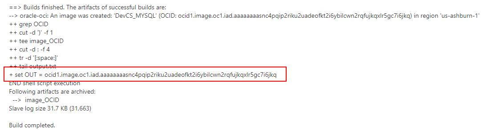

- You can double check the sucess of the build by going to the Compute Service Console, clicking on the **hamburger menu** and selecting **Compute-->Custom Images**.

  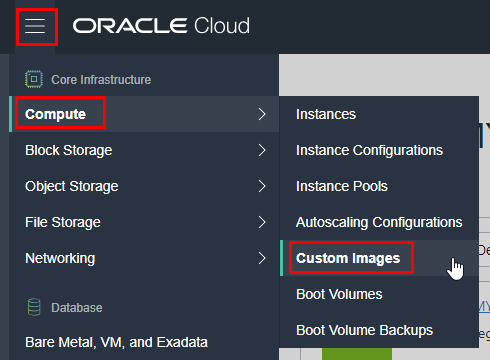

- With a successful build you will see a new Custom Image called `DevCS_MYSQL`. Click the **Show** link to expand the OCID. The OCID will match the OCID in the build log.

  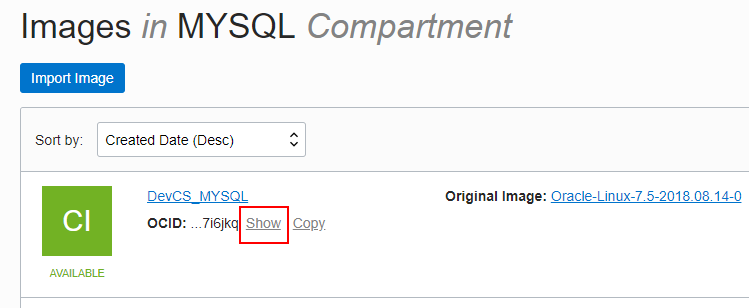

  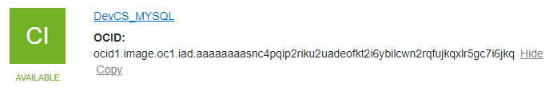

### **Step 13**: Edit the Terraform configuration file

In this step you'll **Copy and Paste** the `oci_instance` key pair you generated in Step 7a or 7b and save those values into their respective file in the Git Repository. The public key of the pair will be used to create a Compute Instance based on the Custom Image you just created in the previous step. The private key will be used in Terraform execution in creating the Compute Instance and also later on in the lab when you SSH into the Compute Instance.

- Open the generated **oci_instance_key** file on your local server in a text editor, select the entire contents and right-click **Copy**:

  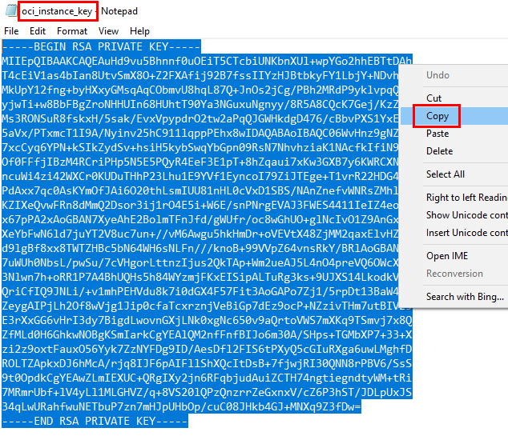

- Go to the Developer **Git** section and click on **oci_instance_key**:

  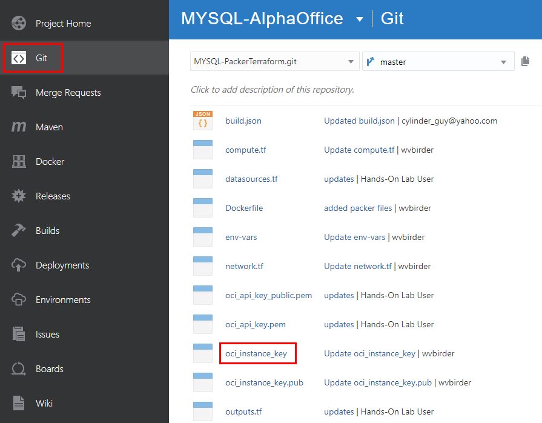

  - Click the **pencil icon** to edit and then **Paste** into that file replacing the `<YOUR PRIVATE INSTANCE KEY GOES HERE>` placeholder by using **Ctrl-V** from the keyboard:

  

  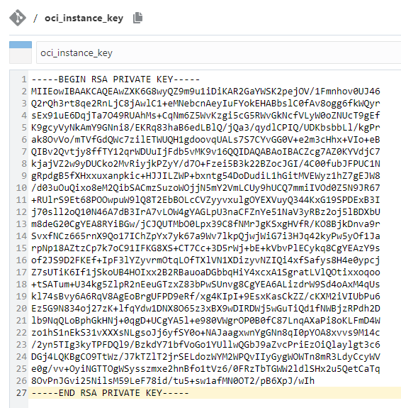

    **Make sure there are only 27 lines in the file!**

  - When all looks good click the **Commit** button. Enter a comment in the pop up dialog and click **Commit** to save.

  

  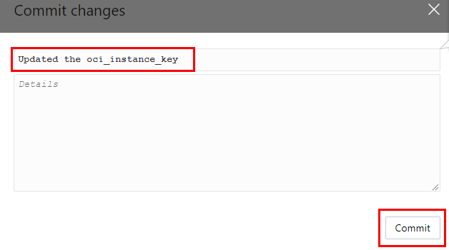

- Now, repeat the sub-steps above to Copy the public OpenSSH format key into the **oci_instance_key.pub** file in the Git repository. From your text editor select the entire contents and then right-click **Copy**:

  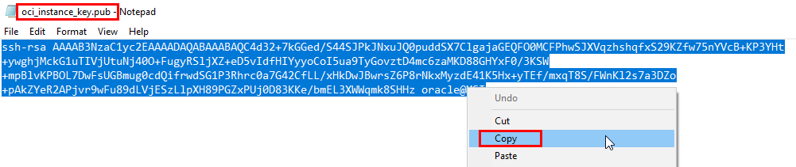

- Go to the Developer **Git** section and click on the slash **/** and select the **oci_instance_key.pub** file:

  

  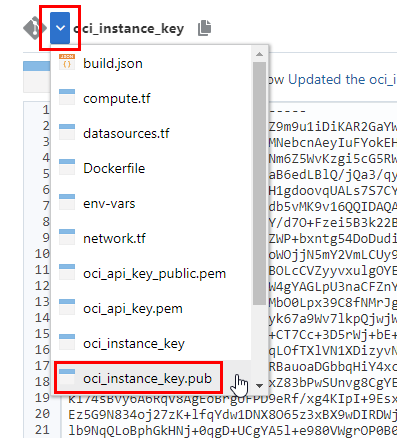

- Click the **pencil icon** to edit and then **Paste** into that file replacing the `<YOUR PUBLIC INSTANCE KEY GOES HERE>` placeholder by using **Ctrl-V** from the keyboard:

  

  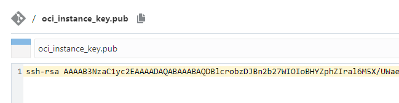

   **There is only ONE line in the file!**

- When all looks good click the **Commit** button. Enter a comment in the pop up dialog and click **Commit** to save.

  

  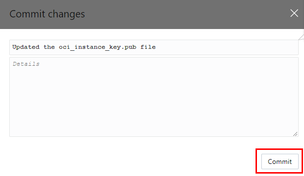

### **Step 14**: Edit the Terraform configuration file

In this step you will edit the Terraform config file. The Terraform scripting will create a new Compute Instance based on the Custom Image you created in Step 11.

- You already have the baseline Terraform files in the imported Git repository. You still need to modify a few of the environment variables to match your specific Tenancy OCIDs as we did for the previous Packer build. If not already there, in the Developer project click on the **Git** link. Click on the **env-vars** file.

  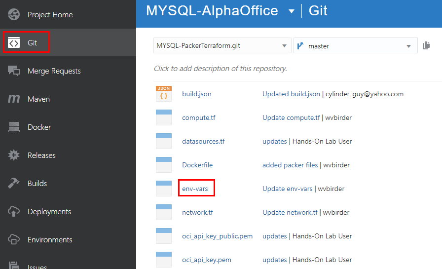

- Click the **pencil icon** to edit.

  

- The following `env-vars` values will need to be **Copied and Pasted** from the values you saved into your text editor earlier in this lab:

    - **TF_VAR_tenancy_ocid**
    - **TF_VAR_user_ocid**
    - **TF_VAR_fingerprint**
    - **TF_VAR_compartment_ocid**
    - **TF_VAR_region**

- **Fill in the 5 variables above** with the corresponding values you saved earlier. You can paste into the file using **Ctrl-V**.

- So, for example:

  ```
  export TF_VAR_user_ocid=
  ```

  Becomes:

  ```
  export TF_VAR_user_ocid=ocid1.user.oc1..aaaaaaaazusfrxnxk3qx3fxxx75ynagfsmtdoorkfffb2hqu6rxnxcfjpcwa
  ```

  **NOTE: The `TF_VAR_client_image` variable remains empty as it will be populated during the build.**

   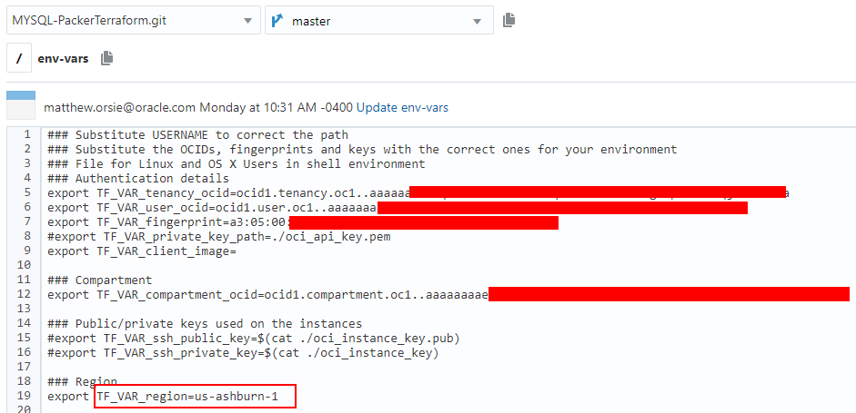

  **NOTE: The Region `us-ashburn-1` is shown in this example. If yours is different then type in the value replacing the default.**

- Click the **Commit** button. Also click **Commit** at the pop up dialog after entering a comment.

  

  

### **Step 15**: Build the Terraform job

In this step you will create and execute the Terraform build job to create a Compute instance based on the Custome Image created in the Packer build.

- From the project menu click the **Builds** link.

  

- Click **+Create Job**.

  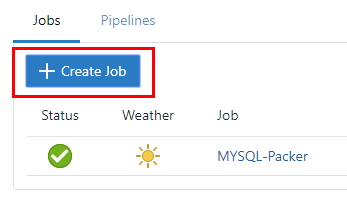

- Enter:

  ```
  MYSQL-Terraform
  ```

- ...for the **Job Name**, select the **PackerTerraformNodeJS** template and click **Create**.

  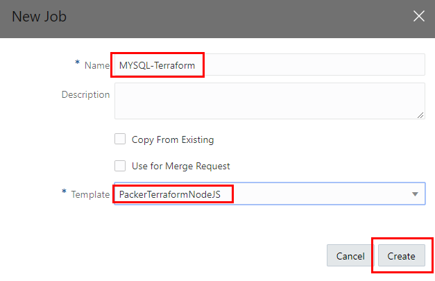

- Select the **Git** tab and then choose **Git** from the **AddGit** drop down. Select the **MYSQL-PackerTerraform.git** repository.

  

  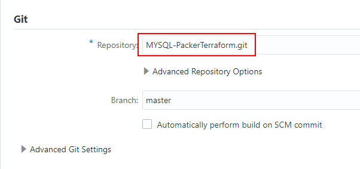

- Select the **Before Build** tab and from the **Add before Build Actions** drop down choose **Copy Artifacts**.

  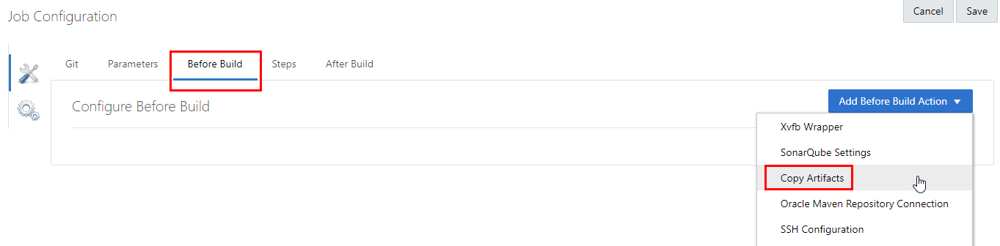

- Verify the `Which build` field says **Last successful build**. This is the default.

  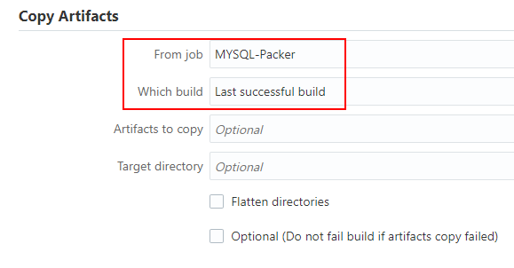

- Select the **Steps** tab and choose **Unix Shell**.

  

- **Copy and Paste** the following into the Script section:

  ```
  export REPLACE=`cat image_OCID`
  echo $REPLACE

  sed -i.bak "s/TF_VAR_client_image=/TF_VAR_client_image=$REPLACE/g" env-vars
  cat env-vars

  source ./env-vars
  cp oci_api_key.pem ~/.terraform.d/
  cp oci_api_key_public.pem ~/.terraform.d/
  terraform --version
  terraform workspace list
  terraform providers
  terraform init
  terraform plan
  terraform apply -auto-approve

  ipADDr=`terraform output DevCS01PublicIP`
  echo $ipAddr
  ```

  This script substitutes the client_image OCID generated from the Packer build and populates the `TF_VAR_client_image` environment variable in the `env-vars` file. Then it runs Terraform commands to create a new Compute instance based on the Custom image and displays the Public IP address of the Compute instance.

  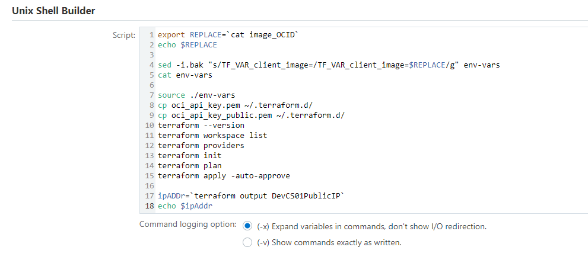

- Click **Save**.

  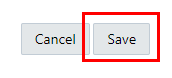

- Click the **Build Now** button to queue up the Terraform build for execution.

  

- The screen will update to show the build is queued. It may take several minutes for the queuing / build to finish. You can check the process by clicking on the **Build Log** icon once the build is in the running phase.

  

  

  **NOTE:** If the build was not successfull the build log output should give you clues. Make any changes and re-submit the build.

- On a successful build the end of the build log will show the script section commands you cut and pasted earlier. The Public IP Address of the Compute instance was output.

  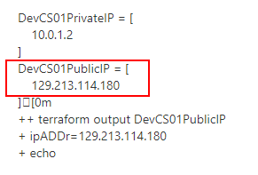

- Go to the Compute Service Console and click on the **hamburger menu**. Select **Compute-->Instances**.

  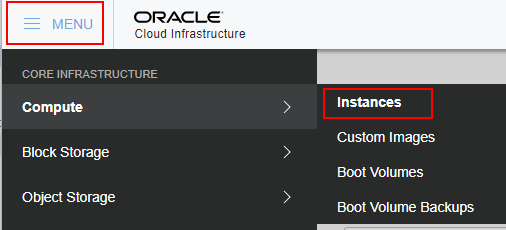

- You should see a new Compute instance running called `MYSQL` running. You can verify the Public IP address by clicking the **MYSQL** link and looking at the details.

  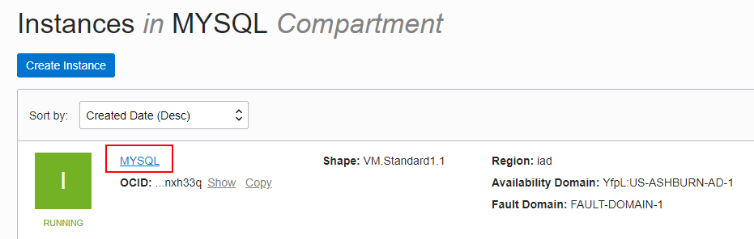

  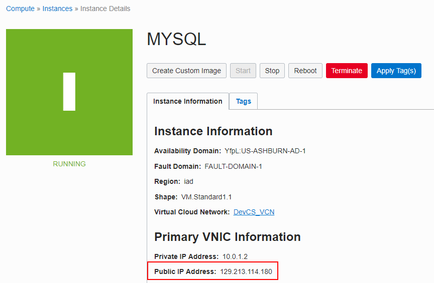

### **Step 16**: Build a Pipeline flow

Now that you have built and tested the Packer and Terraform builds we will show you how to define a flow using the Pipeline capabilities in Developer Cloud Service.

- Click the **Builds** tab in the Developer project.

  

- Click on the **Pipelines** tab, then click **+Create Pipeline**.

  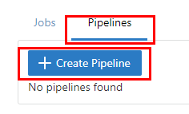

  In the dialog enter:

  ```
  MYSQL-PackerTerraform
  ```

- ... for the **Name** and make sure **both checkboxes are selected** and click **Create**.

  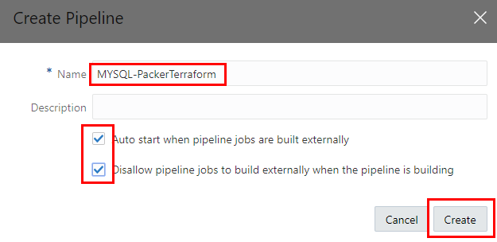

- Drag and Drop the **MYSQL-Packer** and **MYSQL-Terraform** builds onto the canvas and then **connect them together** along with the **Start** icon.

  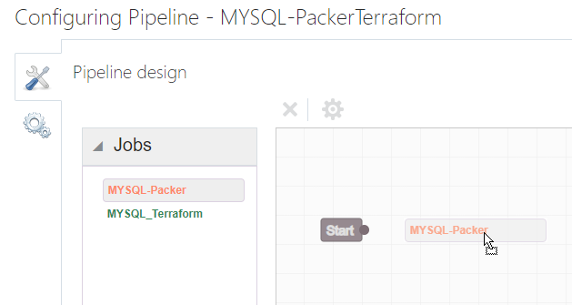

  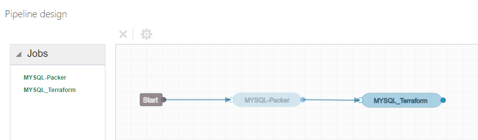

- Click **Save** and the new Pipeline is available.

  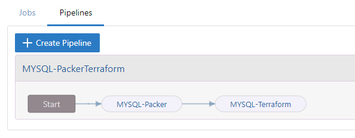

### **Step 17**: (**OPTIONAL**) Execute the Pipeline

This is an optional step which will create the Custom Image and Compute instance in one sequential build. Typically, there would be a clean up "build" in front of this flow to delete the older versions. That is out of the scope of this lab but if you'd like to execute the Pipeline you can manually delete the Compute instance and Custom Image first. If you don't delete them first you'll get another Custom Image AND Compute instance with unique OCID's even though the displayed names would be the same.

- Terminate the Compute instance in the Compute Cloud Service Console by selecting from the **hamburger menu**, **Compute-->Instances**. Select the triple dot drop down **Terminate Instance** option.

  

  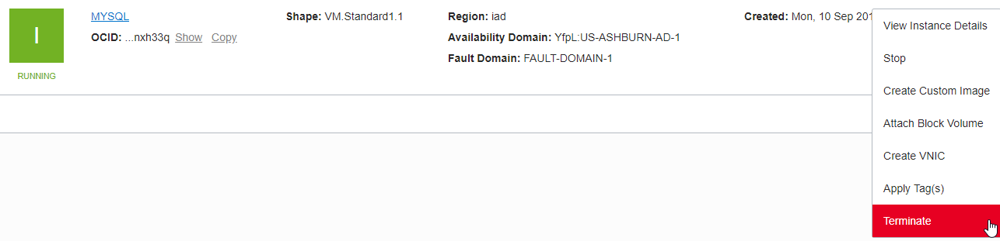

- Confirm in the dialog by selecting the **Permanently delete the attached Boot Volume** checkbox and clicking **Terminate Instance**.

  

- After the instance is terminated you will see:

  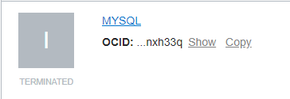

- Click on the **Custom Images** link.

  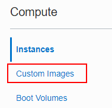

- Delete the `DevCS_MYSQL` Custom Image by select the triple dot drop down and choosing **Delete**. At the dialog prompt click **OK**.

  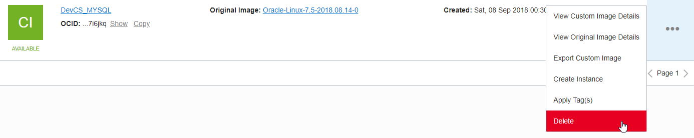

- Back in the Developer project in the Build Pipelines section execute your Pipeline by clicking the **Build icon**.

  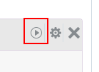

- It will take several minutes for both builds to complete. Progress is updated as the flow proceeds.

  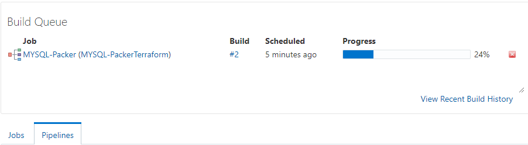

- When the Pipeline is completed you can click on the **View Recent Build History** link to verify status.

  

  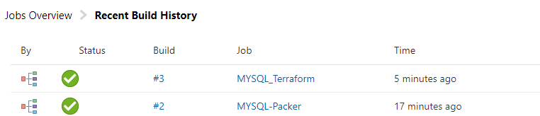

- You can go back into the Compute Cloud Service Console and see the new deployments of the `DevCS_MYSQL` Custom Image and the `MYSQL` Compute instance.

  

  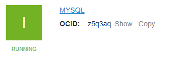

### **STEP 18a**: SSH into the `MYSQL` Compute Instance (Windows)

In this step you will SSH into the Compute instance and verify the MYSQL installation.

**NOTE: If you are using a Linux or Mac client then go to STEP 18b**

- In the OCI Console go to the newly created instance and click the **Instance Details** link. There you will note the Public IP address of the `MYSQL` Compute Instance:

  Example:

  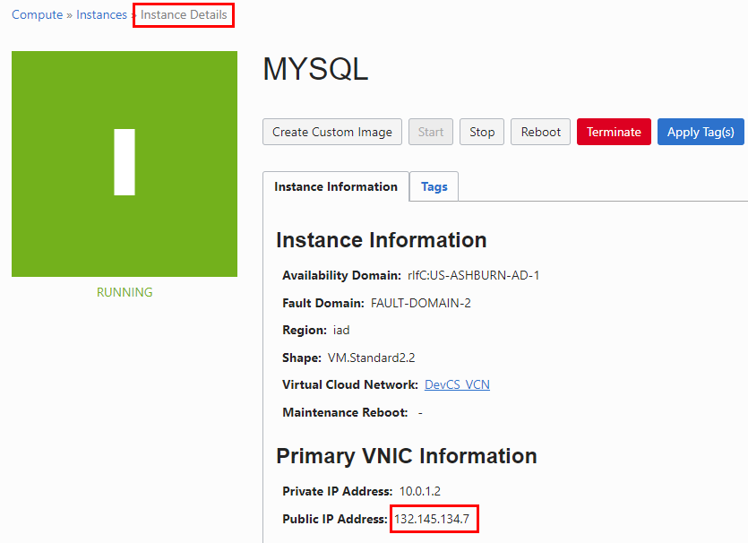

- From your local laptop / server make sure you're in the directory where your generated **oci_instance_key** file resides. **Type** the following substituting your public IP address:

  ```
  ssh -i .\oci_instance_key opc@<PUBLIC IP>
  ```

- When prompted to accept the authentication of the host type **yes**:

  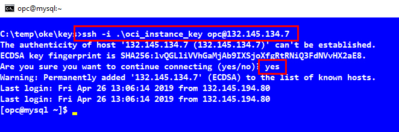

- You are now logged into the `MYSQL` Compute image. Type the following cmds:

  ```
  hostname
  sudo firewall-cmd --list-ports
  ```

- This will confirm that the Packer build configured the firewall port (3306) for access to the MYSQL database.

  

### **STEP 18b**: SSH into the `MYSQL` Compute Instance (Linux/Mac)

- In the OCI Console go to the newly created instance and click the **Instance Details** link. There you will note the Public IP address of the `MYSQL` Compute Instance:

  Example:

  

- From your local laptop / server make sure you're in the directory where your generated **oci_instance_key** file resides. Make sure your private key file has the permissions of "600".

- **Type:**:

  ```
  chmod 600 oci_instance_key
  ```

- Verify the change took place using:

  ```
  ls -l oci_instance_key
  ```

  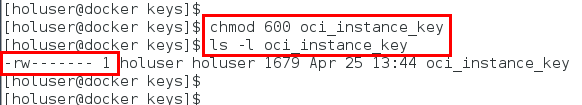

- SSH into the instance using the following command:

  ```
  ssh -i ./oci_instance_key opc@<PUBLIC IP>
  ```

  The first time you will be prompted to authenticate. Type **yes**.

  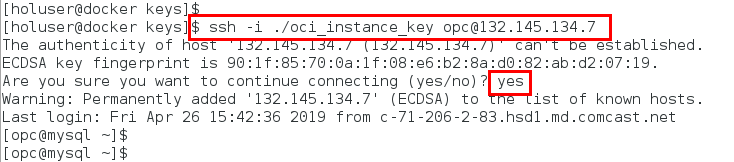

- Enter the following commands: (**The Firewall showing 3306 confirms the Packer build config**)

  ```
  hostname
  sudo firewall-cmd --list-ports
  ```

  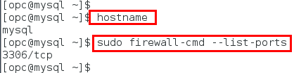

### **STEP 19**: Verify the MYSQL, Git and Docker installations

In this step you are SSH'ed into the `MYSQL` Compute instance and you'll execute a few commands to verify that MYSQL was installed OK and the database schema for the AlphaOffice application is there.

- From your SSH session **Type** the following:

  ```
  mysql -ualpha -pAlpha2018_
  use AlphaOfficeDB
  show tables;
  select count(*) from PRODUCTS; (case sensitive)
  exit;
  ```

- You should see output as shown below proofing out the installation and configuration of MYSQL along with the AlphaOffice database schema.

  **NOTE:** Windows terminal session screen shots are shown:

  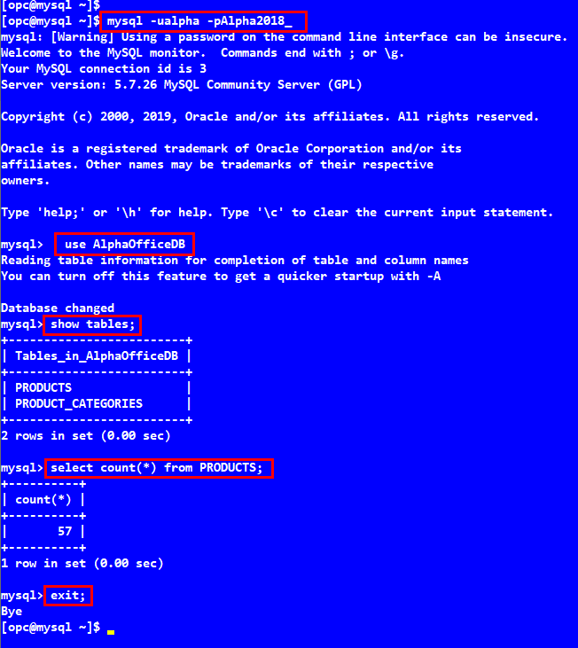

- **Type** the following commands to show that Git and Docker are installed:

  ```
  git version
  docker version
  ```

  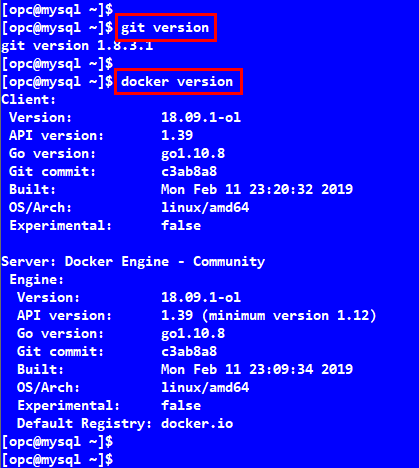

- To exit your terminal session **Type**:

  ```
  exit
  ```

  **You have completed the lab**
