# Docker Workshop - Trial Account Set Up

## Before You Begin
### Objectives
- Obtain an Oracle Cloud Free Tier Account
- Create the baseline infrastructure to support a Compute instance
- Create a SSH key pair
- SSH into the instance: Install Docker and Git

### Requirements
To complete this lab, you need to have the following:
- If running from Windows: [Putty and PuttyGen](https://www.chiark.greenend.org.uk/~sgtatham/putty/latest.html)

In this lab we will obtain an Oracle Cloud Free Tier Account (if you haven't obtained one already please [follow these directions](./lab-000/content.md)), create SSH key pairs, login to your Cloud Account, create a VCN (Virtual Compute Network) and Compartment, create a new Compute instance, and finally install Docker into the instance.

***To log issues***, click here to go to the [github oracle](https://github.com/oracle/learning-library/issues/new) repository issue submission form.


## Overview

What is Docker? What is a container?

- Docker is a company specializing in containerization technology.
- [Docker Documentation](https://docs.docker.com)
- A container is a runtime instance of a docker image: [Container Documentation](https://docs.docker.com/glossary/?term=container)

Containers have been around for many years. Docker created a technology that was easier to use and understand by humans. Thus, it has enjoyed a tremendous amount of support for creating a technology for packaging applications to be portable and lightweight.


### VM vs Container


While containers may sound like a virtual machine (VM), the two are distinct technologies. With VMs each virtual machine includes the application, the necessary binaries and libraries, and the entire guest operating system.

On the other hand, containers include the application and all of its dependencies, but share the kernel with other containers and are not tied to any specific infrastructure, other than having the Docker engine installed on its host. This allows containers to run on almost any computer, infrastructure, or cloud.

**Note:** At this time, Windows and Linux containers require that they run on their respective kernel base. Therefore, Windows containers cannot run on Linux hosts and vice versa.

## **STEP 1**: Your Oracle Cloud Account

- You have already applied for and received your Oracle Cloud Free Tier Account and will change the default password...

## **STEP 2**: Log in to your account

- Once you receive the **Your Cloud Account is fully provisioned** Email, make note of your **Username and Cloud Account Name**. *`Note: Usernames are usually your email address.`* You can login by clicking the Sign In button or access it from any browser.

  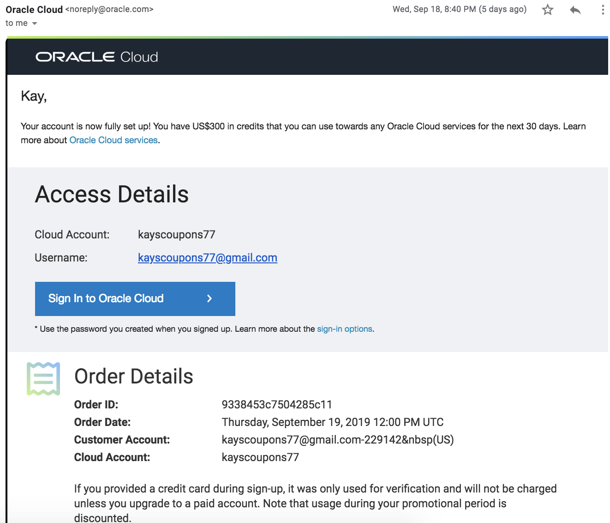

- From any browser go to oracle.com to access our Cloud.

  [https://www.oracle.com/](https://www.oracle.com/)

  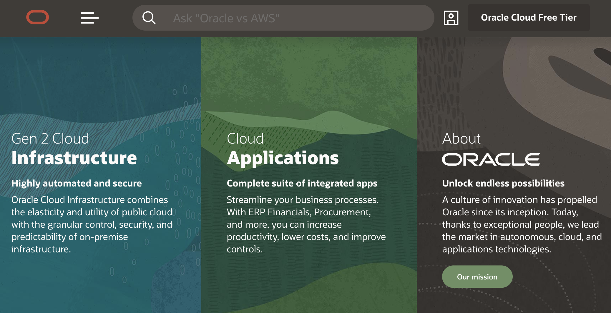

- Click the icon in the upper right corner.  Click on **Sign in to Cloud** at the bottom of the drop down.  *NOTE:  Do NOT click the Sign-In button, this will take you to Single Sign-On, not the Oracle Cloud*

  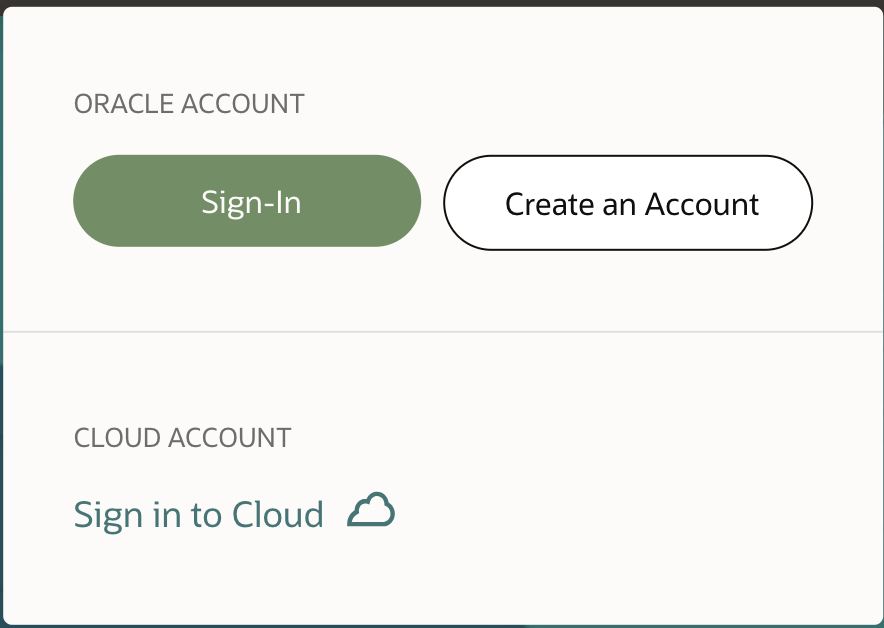    

- Enter your **Cloud Account Name** in the input field and click the **My Services** button. If you have a Free Tier account provisioned, this can be found in your welcome email. Otherwise, this will be supplied by your workshop instructor.

  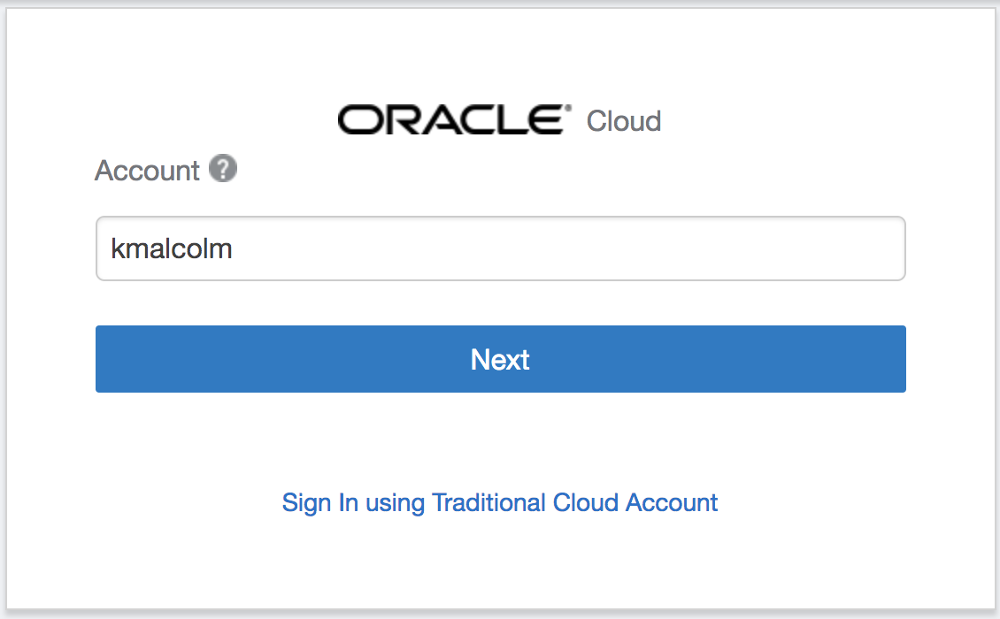  

- Enter your **Username** and **Password** in the input fields and click **Sign In**.

  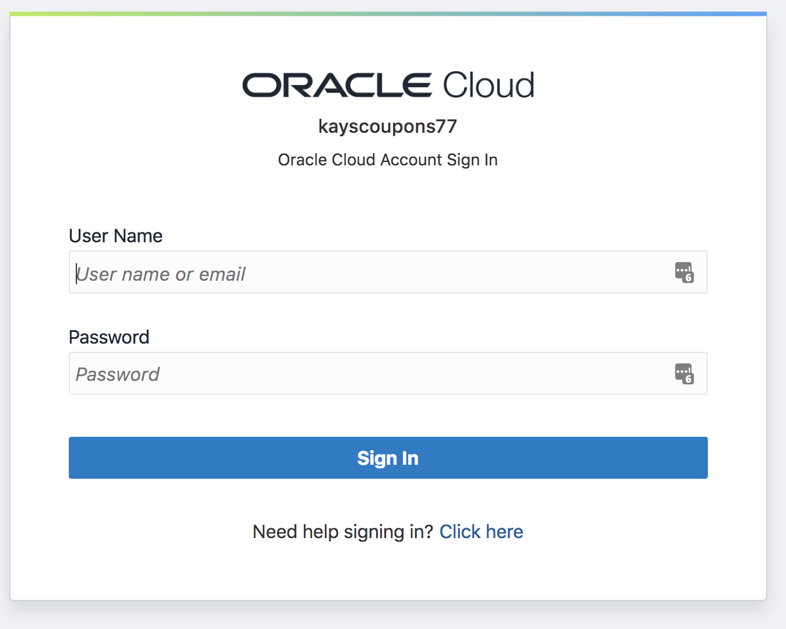 

  **NOTE**: You will likely be prompted to change the temporary password listed in the welcome email. In that case, enter the new password in the password field.

## **STEP 3**: Create a Compartment

Compartments are used to isolate resources within your OCI tenant. User-based access policies can be applied to manage access to compute instances and other resources within a Compartment.

- Click the **hamburger icon** in the upper left corner to open the navigation menu. Under the **Identity** section of the menu, click **Compartments**

  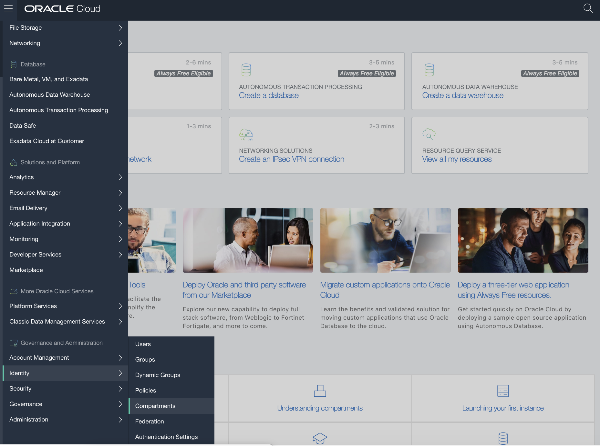 

- Click **Create Compartment**

  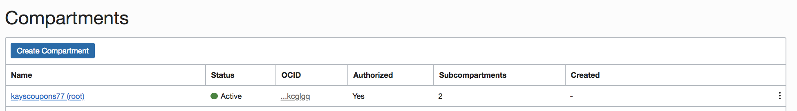 

- In the **Name** field, enter any name you want. For this example we will be using the name `Demo` going forward. Enter a **Description** of your choice. Click **Create Compartment**.

  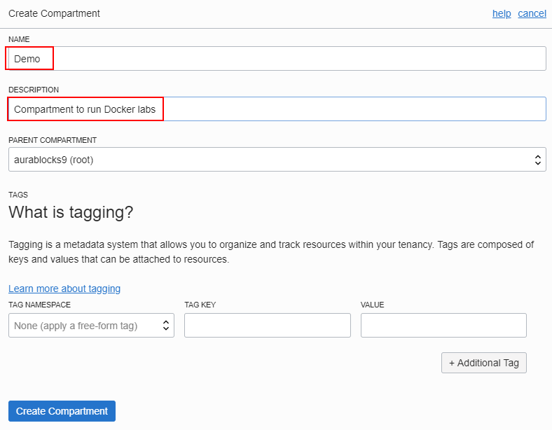

- In a moment, your new Compartment will show up in the list.

  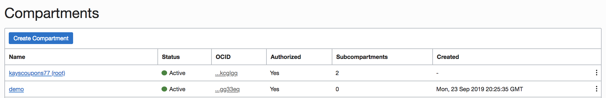 

## **STEP 4**: Create a Virtual Cloud Network

We need a default VCN to define our networking within the `Demo` compartment or the name you used for your compartment. This is where Subnets and Security Lists, to name a couple get defined for each Availablity Domains in your Tenancy. Oracle Cloud Infrastructure is hosted in regions and availability domains. A region is a localized geographic area, and an availability domain is one or more data centers located within a region. A region is composed of several availability domains. Availability domains are isolated from each other, fault tolerant, and very unlikely to fail simultaneously. Because availability domains do not share infrastructure such as power or cooling, or the internal availability domain network, a failure at one availability domain is unlikely to impact the availability of the others.

All the availability domains in a region are connected to each other by a low latency, high bandwidth network, which makes it possible for you to provide high-availability connectivity to the Internet and customer premises, and to build replicated systems in multiple availability domains for both high-availability and disaster recovery.

- Click the **hamburger icon** in the upper left corner to open the navigation menu. Under the **Networking** section of the menu, click **Virtual Cloud Networks**

  

- Select your compartment from the List Scope dropdown menu.

  

- Click **Networking Quickstart**, select **VCN with Internet Connectivity**, then click **Start Workflow**

  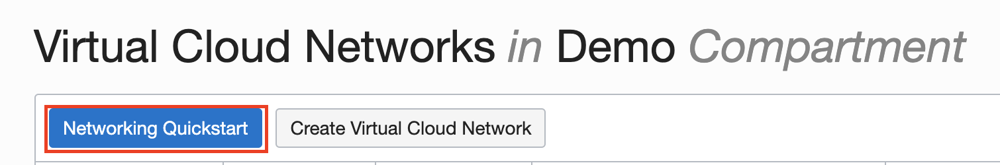
  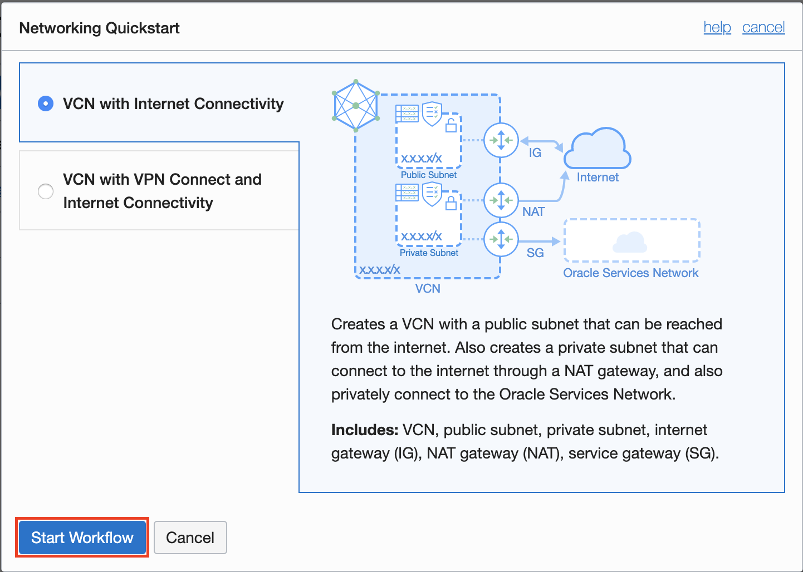

- Fill in the following values as highlighted below:

  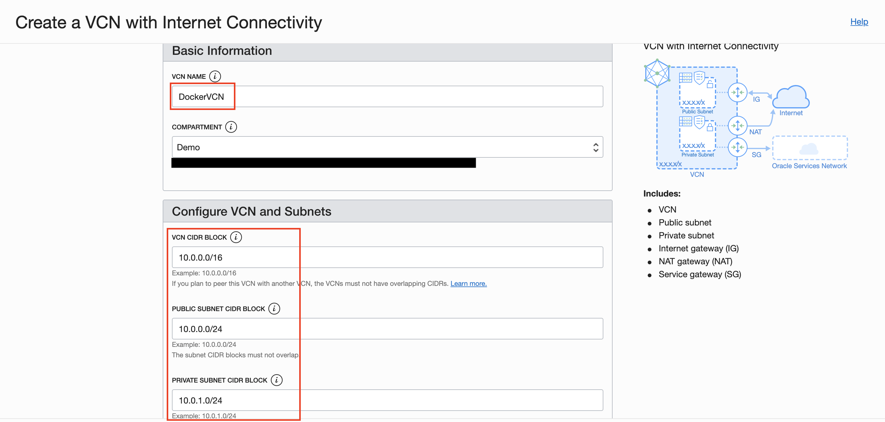

- Click **Next**, then **Create**.

- Click **View Virtual Cloud Network**. You will see:

  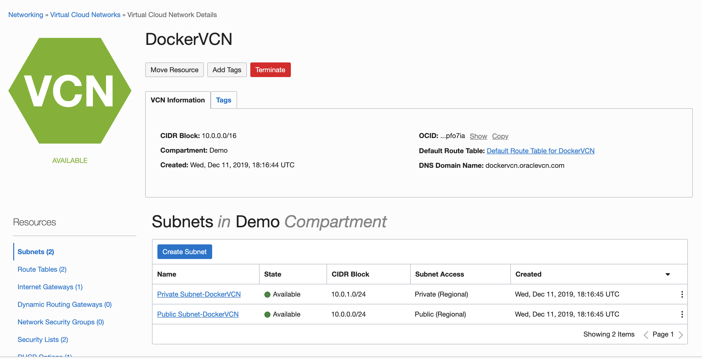

## **STEP 5**: Add a Security List entry

A security list provides a virtual firewall for an instance, with ingress and egress rules that specify the types of traffic allowed in and out. Each security list is enforced at the instance level. However, you configure your security lists at the subnet level, which means that all instances in a given subnet are subject to the same set of rules. The security lists apply to a given instance whether it's talking with another instance in the VCN or a host outside the VCN.

- In the DockerVCN network click on **Security Lists**

  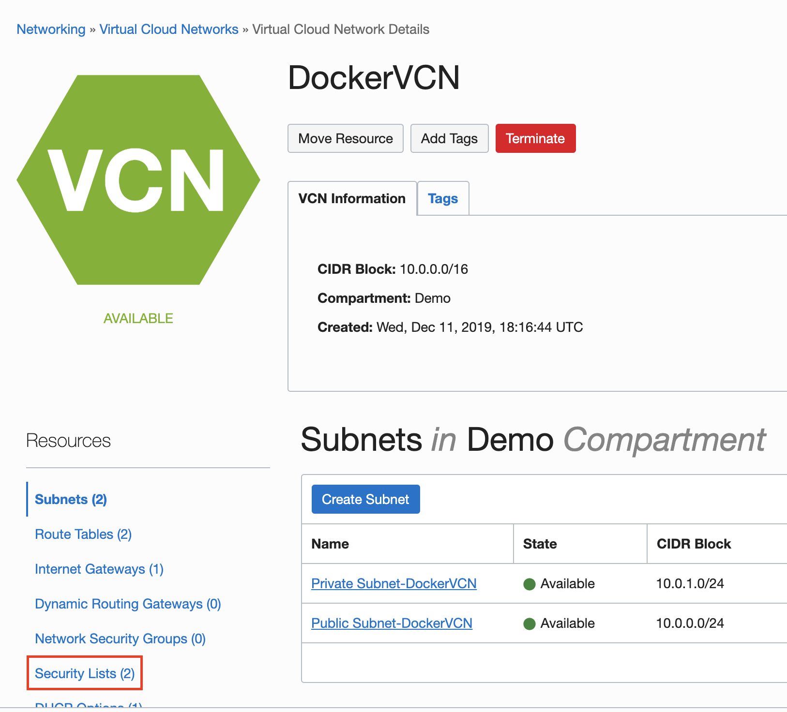

- Click on **Default Security List for DockerVCN**

  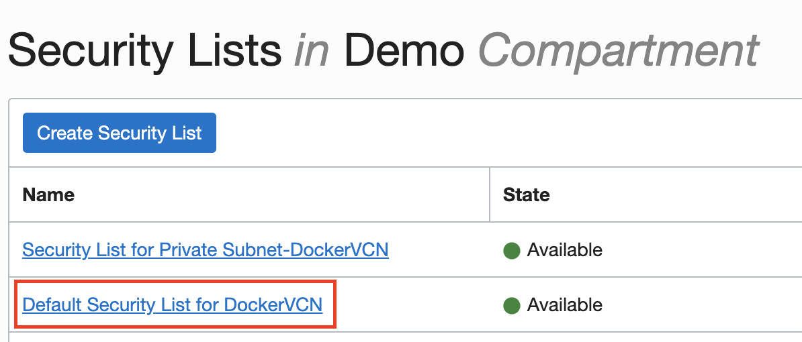

For the purposes of the upcoming Docker deployments we need to add five Ingress Rules that allow access from the Internet to ports 9080, 8002, 18002, 5600, and 8085. In a production environment only the UI port (8085) would typically be opened for access but the labs will have us test various other Application and Oracle centric functionality as we go, thus the need to open other ports.

- Click **Add Ingress Rule**

  **`NOTE: DO NOT EDIT AN ALREADY EXISTING RULE, ADD NEW ONES...`**

  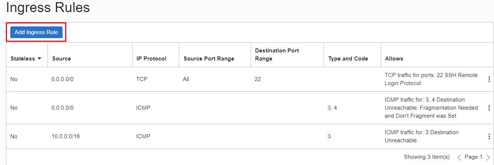

- In the Pop up dialog **Enter the following** and then click the **Add Ingress Rule** button.

  **NOTE: Leave all other values at default. The destination port values should not have any spaces between them.**

  ```
  Source CIDR: 0.0.0.0/0
  Destination Port Range: 8085,9080,8002,18002,5600
  ```

  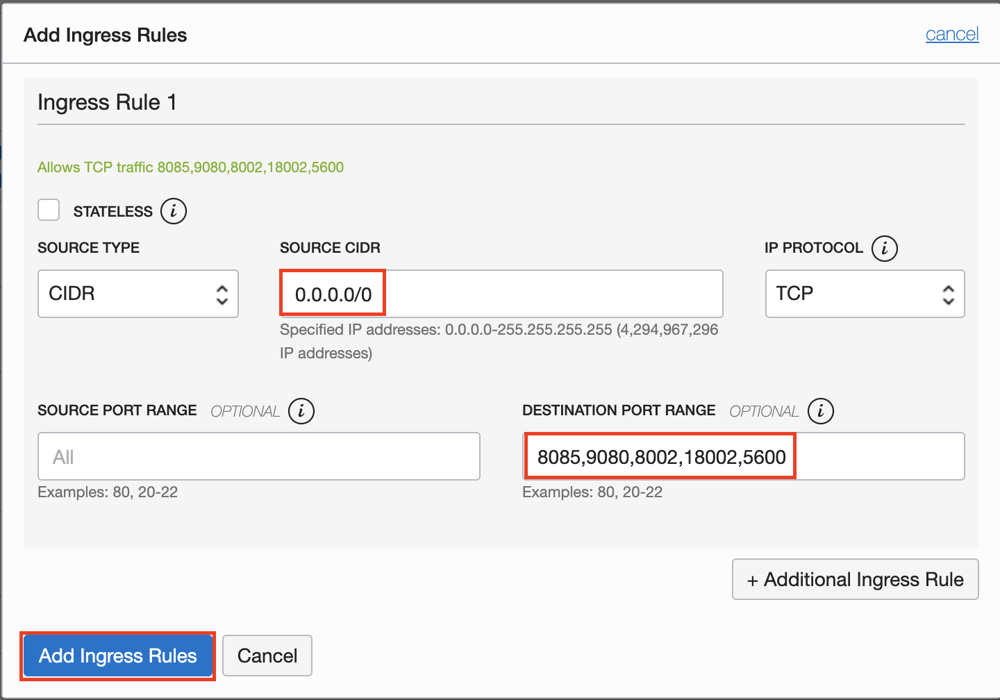

- **If the comma-separated values do not work or give you `invalid input`, you will have to create the ingress rule entries one-by-one.**

- When completed your Ingress Rules should look like:

  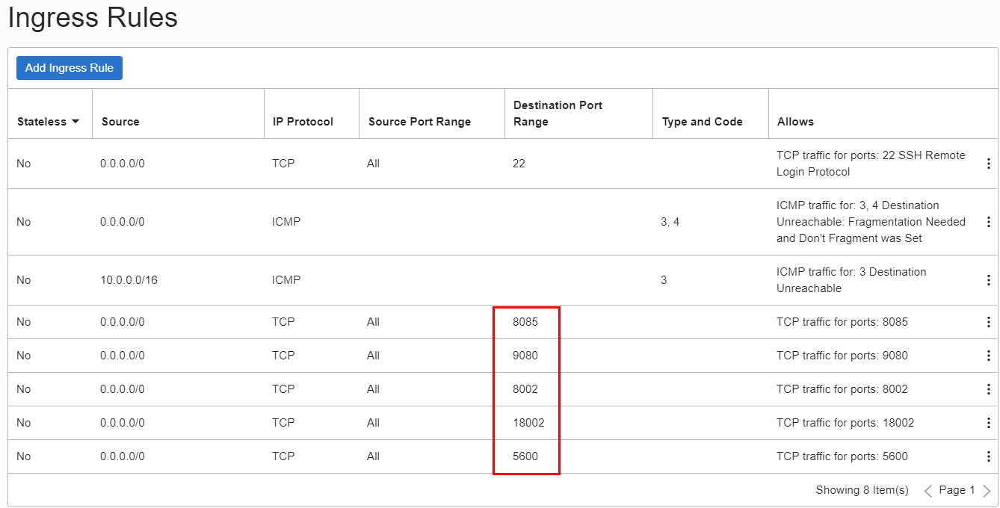

## **STEP 6**: Create SSH Key Pair (Linux or Mac client)

Before we create the Compute instance that will contain Docker and application deployments we need to create an SSH key pair so we'll be able to securely connect to the instance and do the Docker installation, etc.

**NOTE:** `This step focuses on key pair generation for Linux or Mac based terminal sessions. If your going to run your terminal sessions from a Windows client then skip to STEP 7`

- In a `Linux/Mac` client terminal window **Run** the following command (**You don't have to worry about any passphrases unless you want to enter one**)

  ```
  ssh-keygen -b 2048 -t rsa -f dockerkey
  ```

- Your key pair is now in the current directory

  

  **NOTE for Linux and Mac Clients:** Just open up the public key file in an editor (vi/vim) and select / copy the entire contents to be used in Step 8.   

  

## **STEP 7**: Create SSH Key Pair (Windows client)

For Windows clients this example will show the use of PuttyGen to generate the keypair. [Putty and PuttyGen](https://www.chiark.greenend.org.uk/~sgtatham/putty/latest.html) are available for download.

- Run **PuttyGen** and click **Generate**

  

- Once the generation process completes click the **Save Private Key** button and save to a directory of your choice.

- If prompted to save without a passphrase click yes.

  

  **NOTE:** `Do not save the public key as the format is not compatable with Linux openSSH.`

- Instead, **Select the entire Public Key in the display and right-click copy**. `This content will be pasted into the Create Instance dialog in Step 8.`

  

## **STEP 8**: Create a Compute Instance

You will now create a Linux based Compute instance using the public key you just generated.

- Go back to your OCI console and from the hamburger menu in the upper left hand corner select **Compute-->Instances**

  

- Click **Create Instance**

  

- **You will (Select / Leave Default) or Type** the following in the `Create Compute Instance` section of the dialog:
  
  - Name: Docker
  - Image Operating System: Oracle Linux 7.6 or 7.7 (Default)
    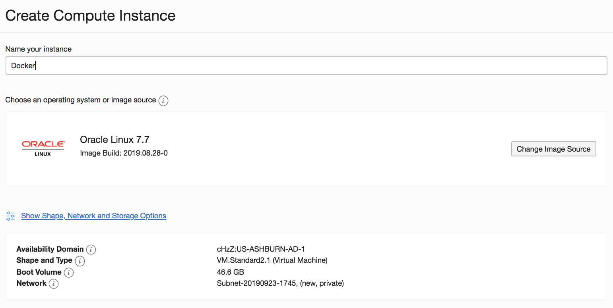
  - Expand the **Show Shape, Network and Storage Options** button, accept the defaults, and ensure the `Always Free Eligible` options are chosen:
  - Availability Domain: AD 1 or 2 (Use default)
  - Shape Type: Virtual Machine (Default)
  - Shape: VM.Standard2.1 (Default)
    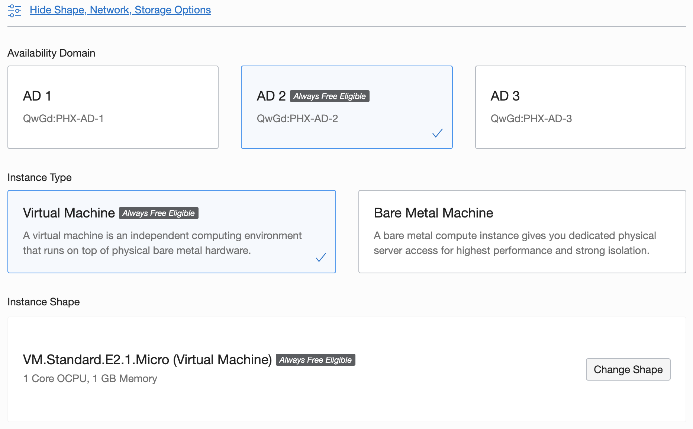
  - Select the `demo` compartment you created.  
    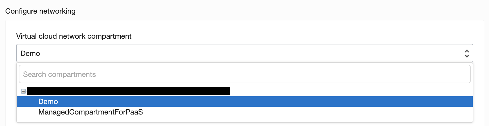
  - The VCN network `DockerVCN` you created should populate.
    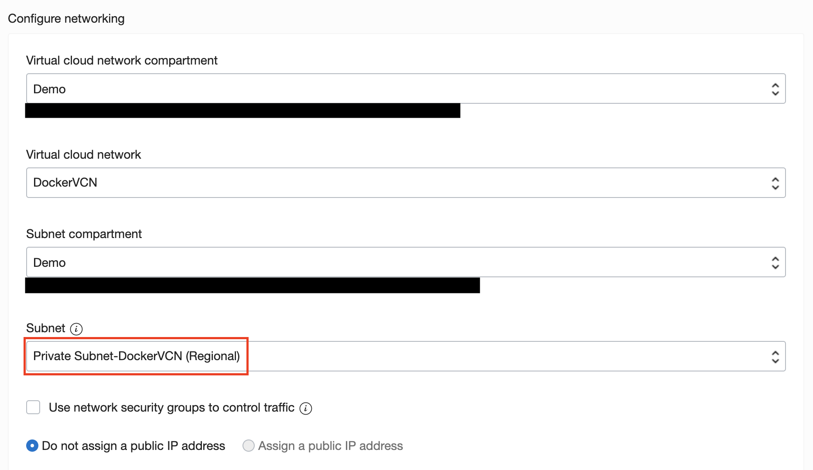
  - Change your subnet to the public one by selecting the **Subnet** dropdown menu, and then select **Assign a public IP address**. The order of the radio buttons might be swapped.
    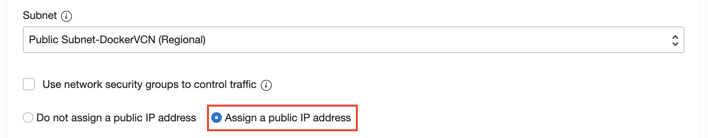
  - Leave all boot volume options unchecked (accept all defaults)
    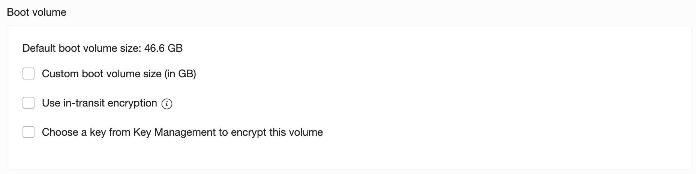

- Scroll down furthur on the page to add your PUBLIC SSH Key.
**NOTE:** You will paste the public key you copied in Step 7 into the SSH KEY field by selecting the **Paste SSH Keys** radio button. `The public key should all be on ONE LINE`

  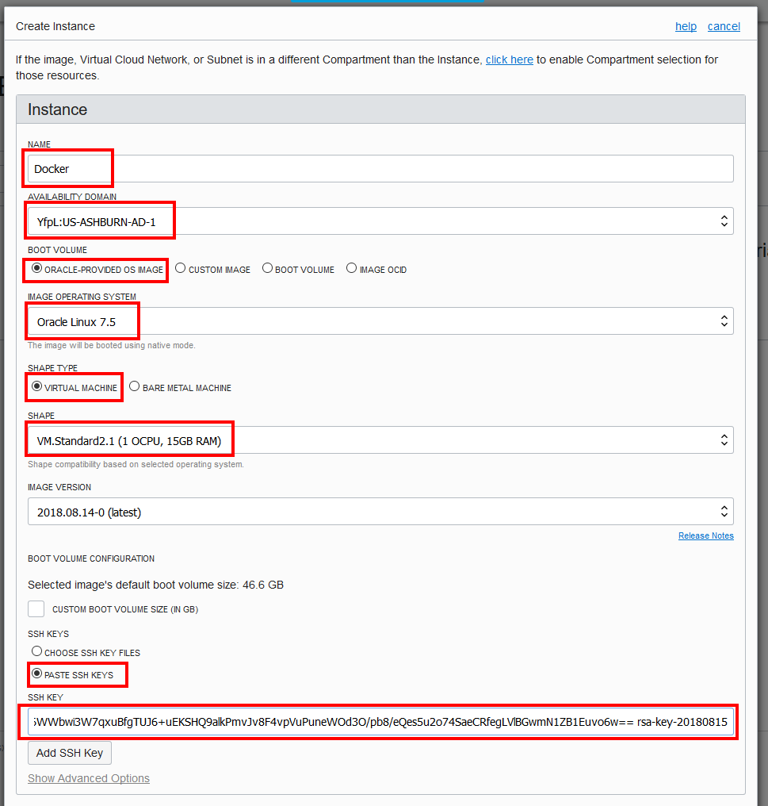

- Click **Create**

  After a few minutes you should see a running instance with a Public IP Address.

- `Make a note of the IP Address as we will be using this in the next step.`

  

## **STEP 9**: SSH into the Instance

You will need to SSH into the Compute image before you can install Docker and Git.

- **For a Windows client session**:

  - Bring up Putty, select the **Session** section, and type in the IP address:
    

  - Select the **Data** section and enter `opc` as the username:
    

  - Select **SSH-->Auth** and browse to the Private Key you created back in Step 7:
    

  - Click the **Open** button. You will presented the first time with am alert message. Click **Yes**
    

  - You will logged into the Compute image:
    

- **For Linux and Mac client sessions**:

  - Open a terminal window and "cd" into the directory where your key pair is. Make sure the dockerkey file has the permissions of "600" (read/write for the user only) and SSH into the compute instance `substituting your IP address`.

    Example:

    ```
    cd <directory of your key pair>
    chmod 600 dockerkey
    ssh -i ./dockerkey opc@<compute instance public ip address>
    ```
    

## **STEP 10**: Install and configure Docker and Git

Docker and Git are required for the subsuquent labs. You will install the Docker engine, enable it to start on re-boot, grant docker privledges to the `opc` user and finally install Git.

- The `sudo -s` command brings you to the `root` context, where you can run commands as a "super-user" and gain more administrative privileges. Once you have SSH'd into the compute instance and see something along the lines of `[opc@dockertest ~]$`, **run** the following commands:

  ```
  sudo -s
  yum install docker-engine
  ```

  During the `yum install docker-engine` command press `Y` is asked if installation is ok. Then **run** these commands:

  ```
  usermod -aG docker opc
  systemctl enable docker
  systemctl start docker
  ```

- Screenshot at the end of the Docker installation:

  

  

- **Run** the following command:

  ```
  yum install git
  ```

- Screenshot at the end of the Git installation:

  

- The `su - opc` command brings you to a new context identical to that of the original `opc` user context upon successfully SSH'ing into the compute instance. **Run** the following commands to verify good installations:

  ```
  su - opc
  docker version
  docker images
  git --version
  ```

  

## **STEP 11**: Edit /etc/sysconfig/selinux

Set the server to Permissive mode and also ensure that permissive mode survives re-boots by editing `/etc/sysconfig/selinux`

- Using vim, change the SELINUX line to **permissive**. **Run** the following commands: (**NOTE**: You need to be the root user to edit this file. Make sure your user in the terminal looks something like `[root@dockertest opc]#`)

  ```
  sudo -s
  vim /etc/sysconfig/selinux
  ```

  **NOTE:** If you are new to vim, press the letter `i` to edit text.

  

- Save the file and exit out of vim.

  **NOTE:** To save, press Escape, then type `:wq` to "write and quit".

- Now, **Run** the following commands:

  ```
  setenforce 0
  sestatus
  ```

- Verify that your server is in permissive mode.

  

- **Run** the following to exit out of `root` and go back and verify that you're now the `opc` user:

  ```
  exit
  whoami
  ```

  

**This completes the Set Up!**

**You are ready to proceed to Lab 100**
