## Lab 100 - Getting Started with Oracle Analytics Cloud Data Visualization (OAC DV)

## Objectives

This section focuses on getting started with OAC DV and introducing users to the DV interface.

Key takeaways from this lab:
- Starting an OAC instance
- Learning and getting acclimatized to the DV interface

## Oracle Analytics Cloud

Oracle Analytics Cloud is a cloud-first analytics platform, providing fast and flexible analysis of any data from any source. It is built on the industry-leading Oracle Business Intelligence platform and Oracle’s top tier cloud infrastructure.

Oracle Analytics Cloud delivers scalability, high availability, state-of-the-art security, and operational simplicity. This combination of proven technologies, world-class infrastructure, broad data access, and deep analytic capabilities makes Oracle Analytics Cloud the best solution for every user.

The goal of today’s workshop is to introduce you to the data visualization capabilities included in OAC. We will be analyzing data using local Excel files. Data Visualization also allows you to analyze data based on a pre-built OAC subject area or coming directly from a wide variety of sources. These can include Oracle SaaS applications (e.g. ERP Cloud), databases, and 3rd party applications (e.g. Salesforce), amongst others.

## What are Data Visualizations?

Data Visualization is a tool that enables you to explore analytical data visually and individually. The capabilities are available both via a web-based interface as well as via a local client.

Data Visualization makes it easy to visualize your data, so you can focus on exploring interesting patterns and outliers. Just upload your data files or connect to a data source, select the elements you are interested in, and let Data Visualization find the best way to visualize it. Of course, you can also choose from a wide range of visualizations yourself if you want to look at your data in a specific way.

- **Creating visualizations is easy**. Your data analysis work is an individual experience in exploration and discovery that can also be shared with other users. Data Visualization enables you to experiment with a wealth of different options for how to view your data. During this experimentation process, you can find correlations, discover patterns, and see trends in your content.

- Data Visualization provides you with tools for faster and simpler assembly of detailed reports arranged together in an appealing and meaningful display. Data Visualization goes even further, to give you dynamic views for focused, exploratory interaction with your data.

## Data Visualization provides the following:

>**Guidance**: Grammar-centric approach to visualizations combined with powerful keyword search and pattern detection to aid all users making new discoveries.

>**Richness**: Robust visualization library and streamlined dashboard construction provide all the tools needed for constructing sophisticated analysis across many different perspectives of data.

>**Visual Grammar**: Visualizations automatically created and updated by applying visual grammar to data selections made by user. All visualization types share foundation in visual grammar.

>**Keyword Search**: All relevant artifacts are indexed for search. Unfamiliar data models can be intuitively accessed using keywords.

>**Pattern Brushing**: Sophisticated technique to highlight correlations between visualizations. Patterns highlighted across all components on the canvas.

>**Data Blending**: Combining two or more data sources for analysis.

Now let’s get started!

### a) Provisioning an Oracle Analytics Cloud Instance

1. Open your browser and navigate to [cloud.oracle.com](cloud.oracle.com). Click on **Sign In**.

      

2. Enter your cloud account name and click on **My Services**.

    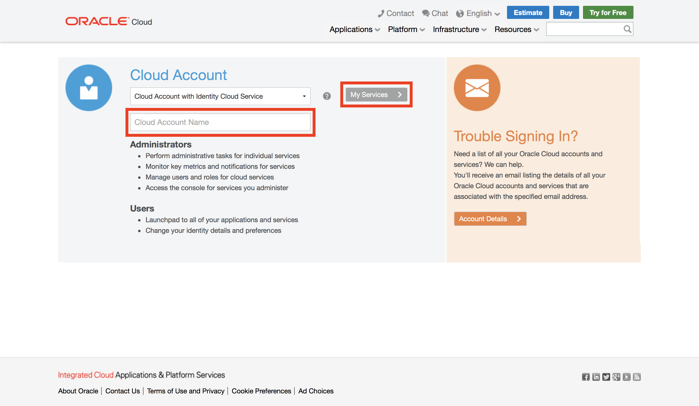  

3. Enter your username and password and click on **Sign In**.

    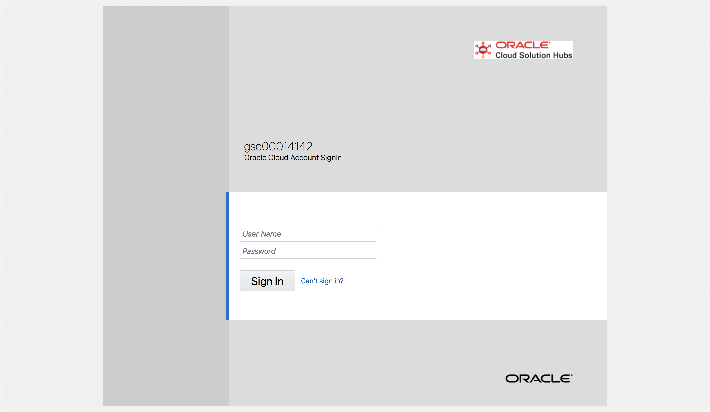  

4. Once you log in you will see a page similar to the one below: -

      

    Select **Customize Dashboard**. Ensure that **Analytics** is not hidden.

    

5. Click on the hamburger icon to reveal the menu. Select **Services**. The expanded menu will list all services available for provisioning.

    

    Select **Analytics**.

    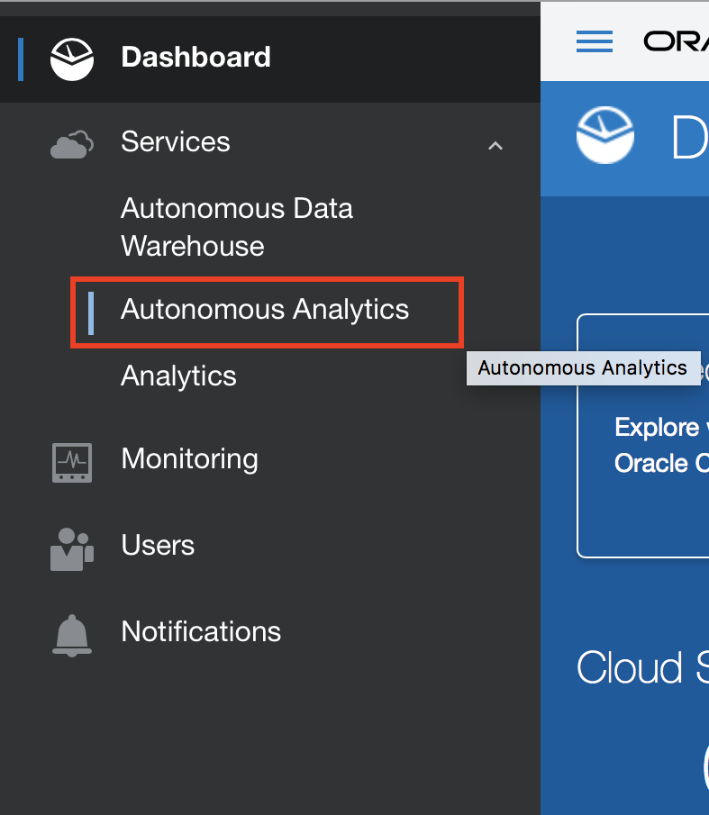

6. On the next screen, click on **Create Instance**.

    

7. Next, we will configure our instance. Click on the **Feature Set** dropdown.

    

    Choose **Data Visualization**.

    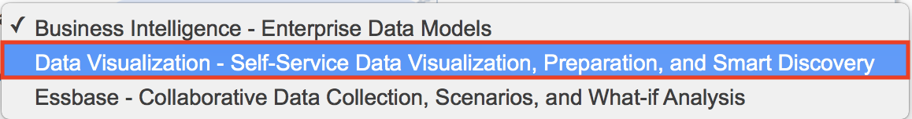

    Now, give your instance a **Name** and choose the correct **License Type**. If you already own a license, then choose the first option. Otherwise, go with the second option.

    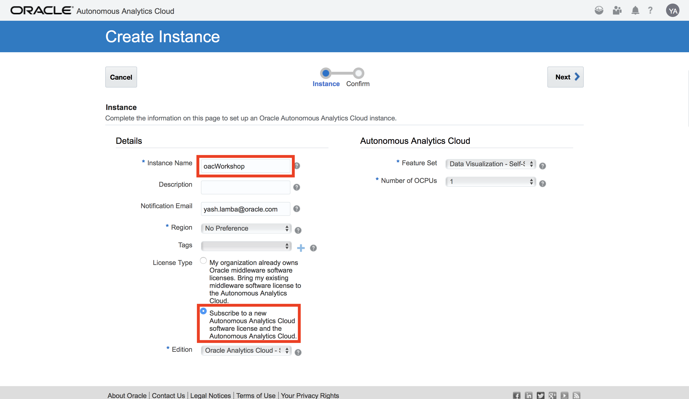

     After this, click on the **Edition** dropdown menu and choose **Oracle Analytics Cloud - Standard**.

    

    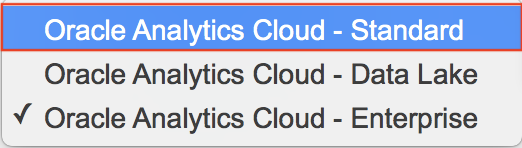

    Once configured, click on **Next**.

    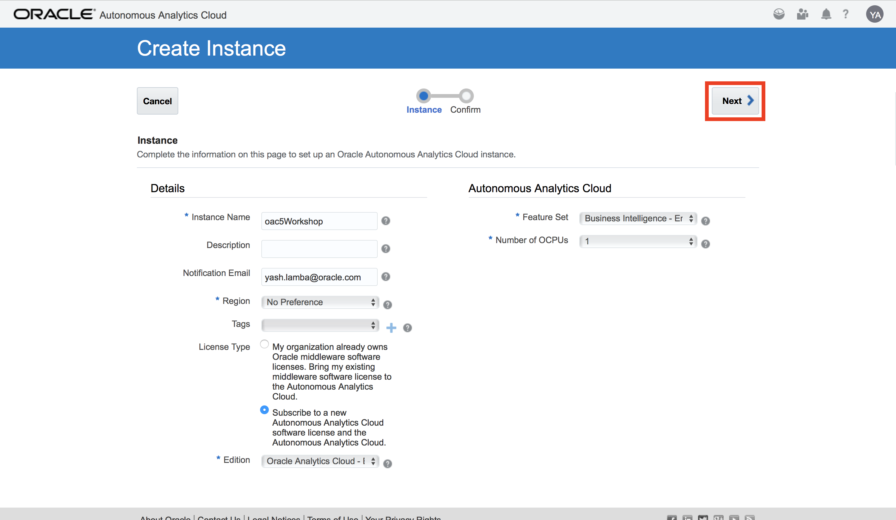

8. Review your selections. Make sure your fields match the fields mentioned in the previous step. In case of issues, return to the previous screen and make the required changes. Then click **Create**.

    

9. Now, wait for the instance to be created.

    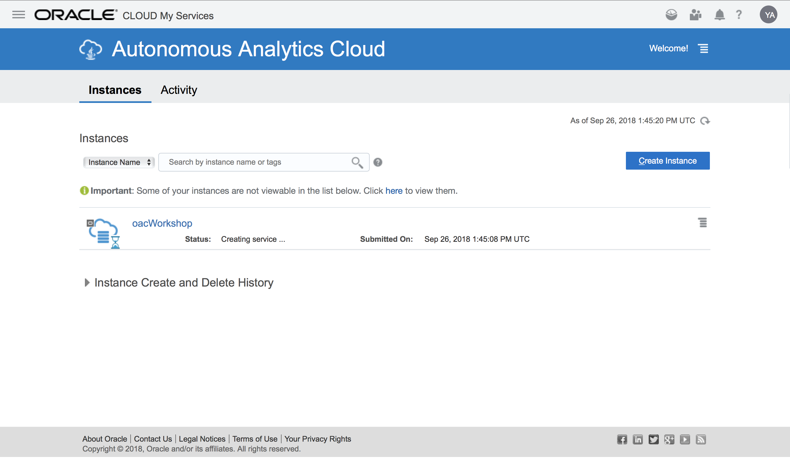

    You will receive an email once the instance is ready.

    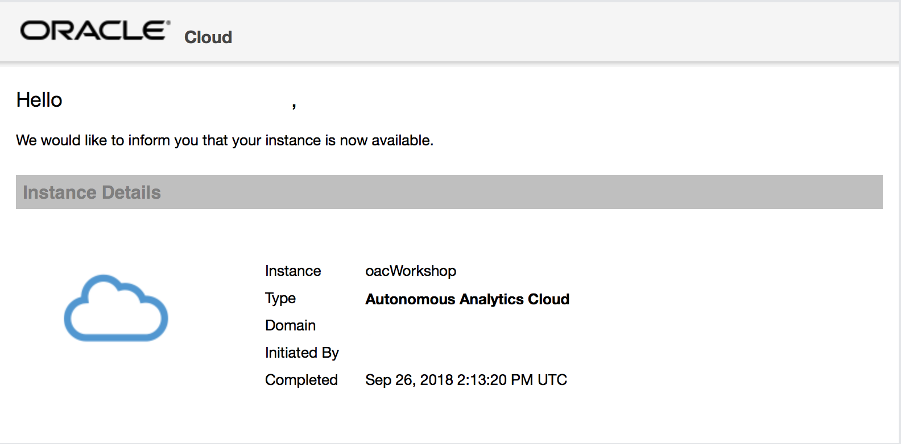

10. Click on the **Ellipses** menu and select **Oracle Analytics Cloud URL**.

    

    Doing so will take you to the OAC home page which we will be reviewing in the next section.

    

### b) Reviewing the Home page and the primary menus

On logging into OAC, you will see the home page.

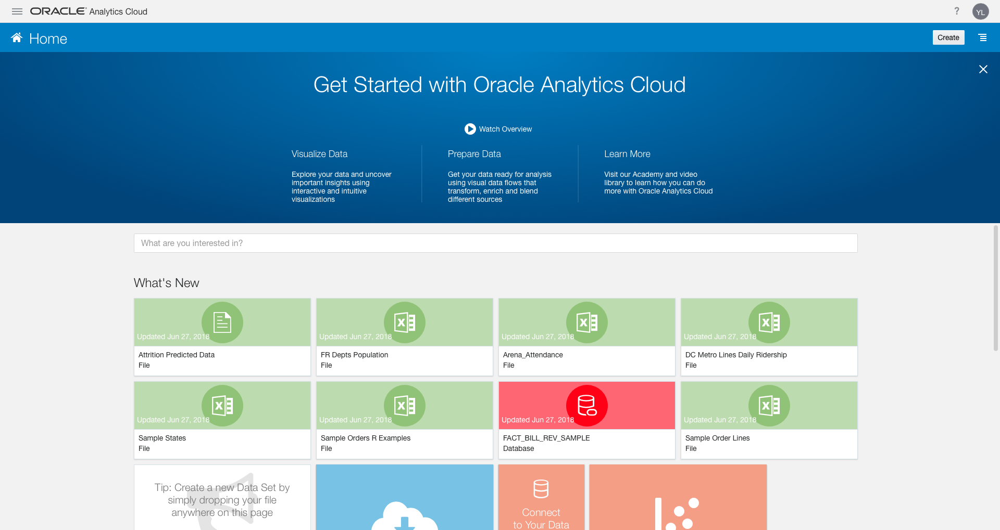  

1. Start by clicking on the hamburger menu in the top-left of the UI. This will open the drawer menu.

    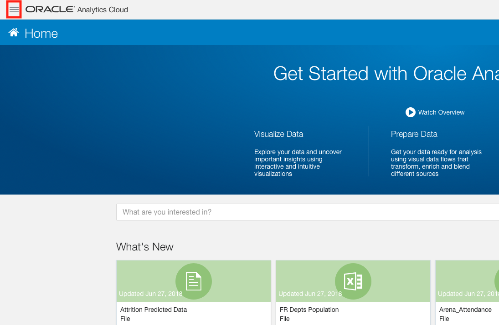

2. You can use this menu to navigate through the application.

    

    

    The application follows standard web and application interface protocols, thus supporting both left and right click interactions. In terms of general navigation, there are 4 key menus accessible at the top of the screen or via a hamburger menu in the top left (not all screens will show the top menu bar but the hamburger navigation is always available).

    >**Home**: Application start up page from where you can view existing projects, data sets, data flows or create new ones.

    >**Projects**:  Collections of visualizations and the underlying data sources. **Folders** are simply means by which to organize projects.

    >**Data**: Display or create **Data Sets** (instances of data such as a specific Excel file);
        >> **Connections** (connections to data sources such as a database or SaaS application to pull data files); or
        >> **Data Flows** (ability to curate data from data sources including adding calculations, merging multiple sources, and managing columns).

    >**Machine Learning**: This page shows all the available machine learning models ready for use in projects.

    >**Console**: Administrative menu for managing **Custom Plugins** (e.g. new types of analyses obtained from the Oracle Analytics Store or custom built), **Maps** layers (e.g. new backgrounds for map-based analyses) and other administrative tasks.

    >**Academy**: Home to important links to the OAC documentation and videos that help you accomplish common tasks in the OAC.

3. At the top-right of the UI, click on the **Create** button.

    

    This window allows you to create a Visualization project, a data set, a connection to an external source, a data flow, or a sequence.

4. Click on hamburger icon at the top right of the UI, next to Create.

    

5. Select the **Customize** option.

    

    

    This menu allows you to customize the components of your home page.

Now that you can start OAC and navigate around DV, let’s get started with some analyses!
