Updated: August 4, 2018

## Lab 2: Analyzing Sales - Basic Introduction to Core Features

This section walks the you through the analysis of a single data set.

Key Take Aways from this lab:
- Creating projects with data sets and visualizations
- Understanding the visualization capabilities of DV
- Telling a story with annotated visualizations

### 2a) Creating a Project with a Data Source and Visualizations

#### Scenario
You are the Chief Marketing Officer (CMO) of KoolKart.

KoolKart is an e-Commerce company that sells 4 categories of products and is looking for innovative ways to increase revenues. As part of that initiative, you and your team have launched several social media campaigns within the past 6 months.

Given the level of investment your company has made, you are looking to ensure that resources are being effectively utilized, by investigating the effectiveness of those campaigns.

After reaching out to the sales team, you have been provided with a spreadsheet with thousands of rows of information and are struggling to make heads or tails of what you are evaluating. Let’s see how DV can help you!

1. Open the spreadsheet containing the sales figures used in this lab.
    
    Open the **KoolKart Sales Data.xlsx** file. 
    
     
    
    You should see that there are several thousand records of sales figures (e.g. **Revenue** and **Number of Orders**) broken down by **Date**, **Category**, **Age Group**, and **Gender**. 
    
    You can close the spreadsheet.
    
2. Create a Project to evaluate the sales data and upload the Excel file.
    
    Select **Create Project** from the Home screen.
    
    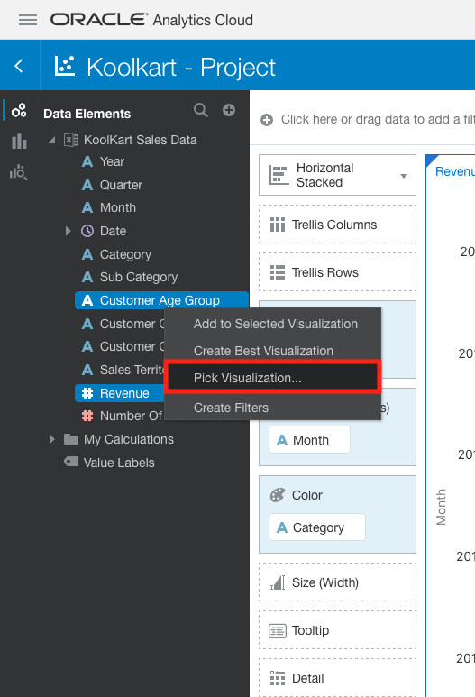 
    
    Every project requires a data source, so you will be prompted to add one. Select **Create Data Set** to load in the Excel file.
    
    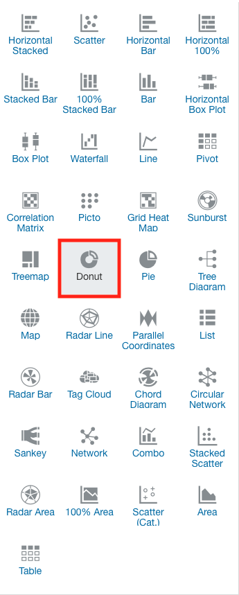 
    
    If you had created connections to external systems (e.g. an Oracle Database), you would see those as options here. For the purpose of this lab, we will just upload a file.
    
    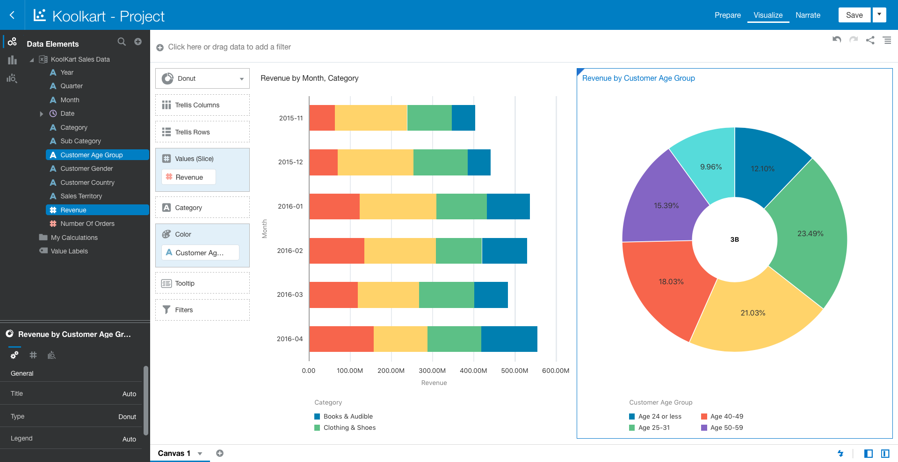 
    
    Navigate to the **KoolKart Sales Data.xlsx** file and select it.

3. Validate the uploaded data.

    Following the upload of the file, which will be available for other projects as a **Data Source**, you have the ability to make changes to the data, so it can be easily used within analyses.
    
     
    
    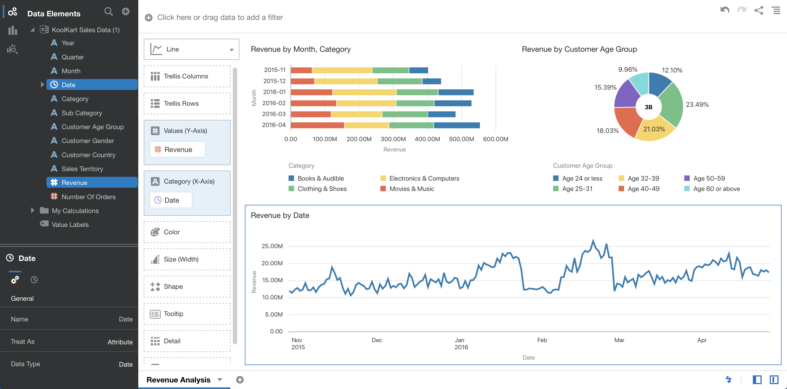 
    
    The system will determine, if the columns are **Attributes** or **Measures**.
    
    - **Attributes**: Indicated by **A** (), attributes are generally non-numeric fields.
    
    - **Measures**: Indicated by **#** (), measures are generally numeric fields.
    
    If a field is determined to be a **Measure**, the system will also determine the default aggregation method for when it is used in an analysis (e.g. average, sum, count). If desired, you can change an **Attribute** to a **Measure** and vice-versa. For **Measures**, you can also change the default aggregation rule.

    Fields may also be indicated by a **Clock** icon (). These will be your date and time based fields, which can be handled differently in certain visualizations. However, they still need to be defined as **Attributes** or **Measures**. If the **Clock** icon appears, the date is being treated as an **Attribute** otherwise it will have a **#** icon.

4. Add data to your project.

    Click **Add** to begin creating visualizations.
    
    
    
5. Create an analysis of monthly revenues.

    Select the **Visualize** tab (top right of the screen).
    
    
    
    Select the **Data Elements** icon and select both **Month** and **Revenue**. Then right click and select **Create Best Visualization**.

    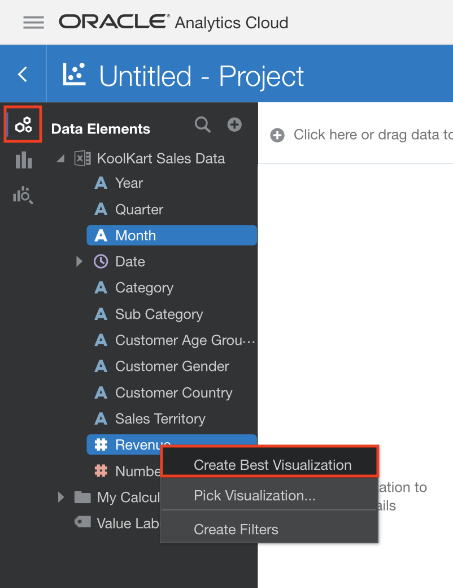
    
        As an intelligent analytics platform, the system is able to provide recommendations for how best to 
        visualize information.
    
    The system has determined that a horizontal bar chart is a good way to display the information you are evaluating.
    
    
    
    Before we continue, let’s take a step back and better understand the interface of the Visualize tab and its capabilities.
    
### 2b) Understanding the Visualize Interface

1. Review the **Visualize** interface and menus.

    We have previously established that a **Project** comprises of data sources, and visualizations related to those data sources. We have already walked through the process of adding a data source in the previous section. Now, we will learn some more about visualizations. Visualizations are displayed on a canvas. A **Canvas** can contain multiple visualizations and a **Project** can include multiple Canvases.
 
    When you open the **Visualize** interface, you should see the **Canvas** in addition to a few other menus. The **Project Components Menu** will be on the left hand side. The **Project Tabs** will appear at the center top of the screen and the **Project Menu** will be in the top right.

    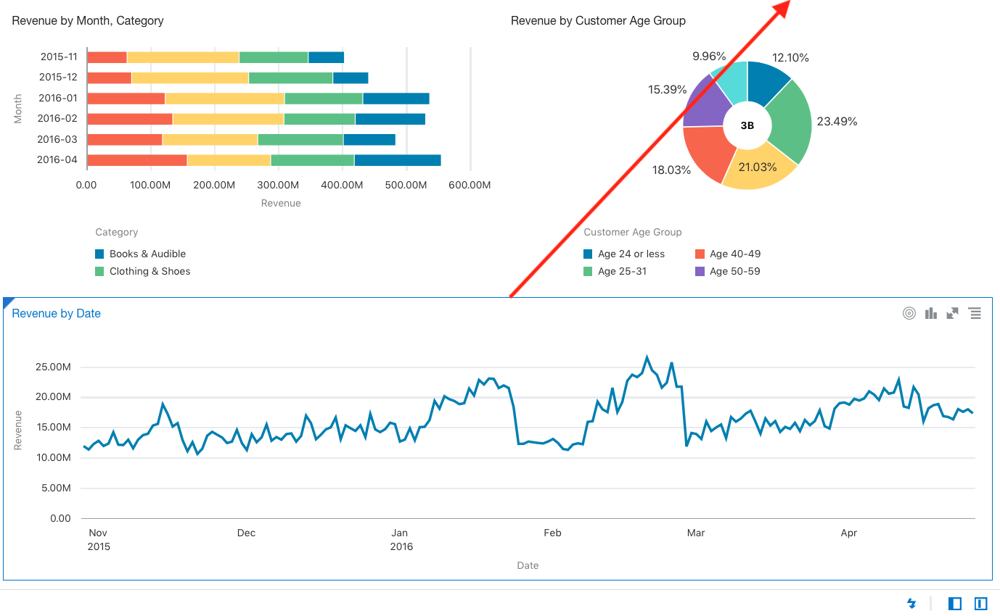
    
    Let’s start by reviewing the **Project Tabs**, which allow you to switch between editing data sources, creating visualizations, and putting together a story about the visualizations.
    
    

    You can switch between the tabs as needed and each has a specific purpose:

    - **Prepare** – As briefly covered in step 3 of Lab 1b, this is where you can validate and make changes to the data you wish to use in your visualizations.

    - **Visualize** – This is where you will create your visualizations.

    - **Narrate** – A nice feature of the platform is the ability to compile meaningful “stories” from your visualizations by picking certain ones to highlight and add commentary. These are viewed and managed within the **Narrate** tab.

    Next to the **Project Tabs**, you will find the **Project Menu** which allows you to manage various facets of your project.
    
    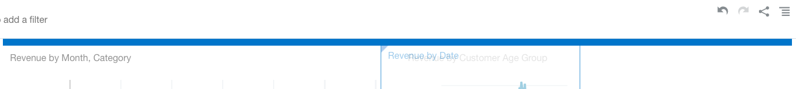
    
    From left to right, the items are:
    
    - **Undo Last Edit** – Removes the last user change.
    
    - **Redo Last Edit** – Reapplies the last user change rolled back by the above (greyed out, if nothing to redo).

    - **Share Project** – Brings up additional options for sharing the project.
    
    - **Canvas Settings** – Provides ability to manage canvas and project level properties.

    On the left hand side of the screen, the **Project Components Menu** displays the available Data Sources, **Data Elements**, **Analytics**, or **Visualizations** within the project (depending upon which one has been selected). If you are on the **Prepare** tab, then it will display **Preparation Script** or **Data Elements**. 
    
    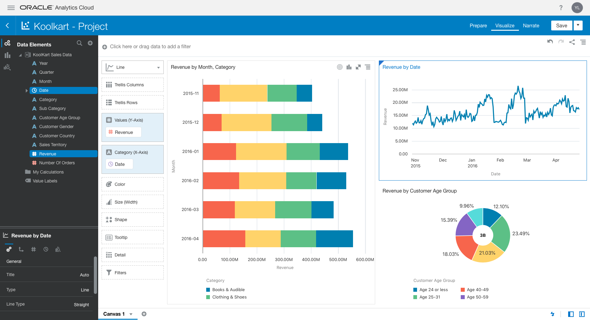

    The icons on the left filter the items listed. From top to bottom they are:

    - **Data Elements** – Displays the actual data available for analysis (e.g. the columns from your data sources).
    
    - **Analytics** – Provides access to advanced analytics that can be added to visualizations such as trend lines, clusters, and outliers.

    - **Visualizations** – Visual elements available for use in the Canvas.

    Based upon which icon is selected, you will see different results. The example below shows the **Data Elements** in our current project.

    

    The **Search** box allows you to search through the result set. For example, you can search for **Data Elements** that are related to the customers by typing in customer.

    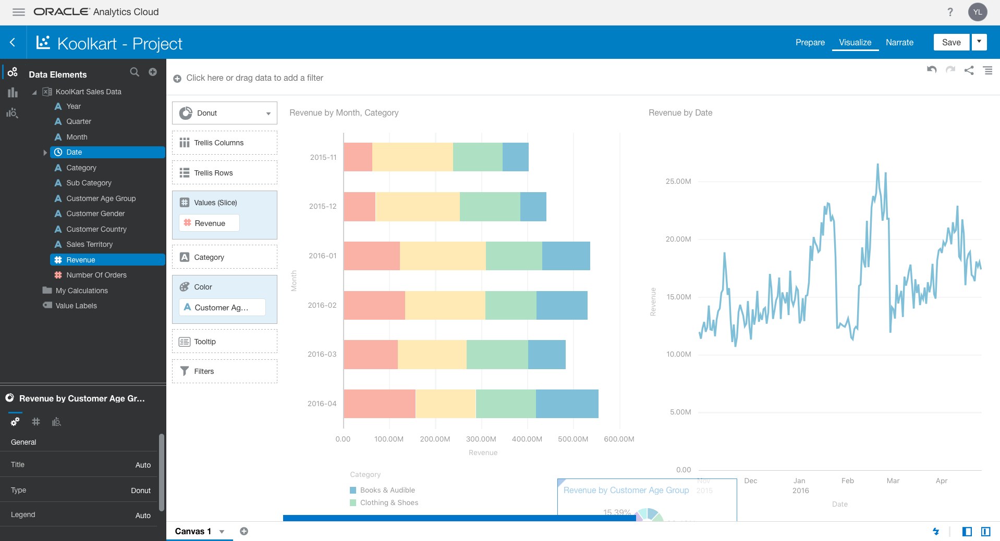
    
    Click the **X** (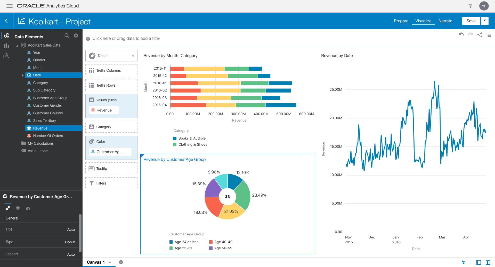) to remove any filters (please do so, now).

    Now that you have been exposed to the core features of the interface, let’s dive into some further analyses.

### 2c) Analyzing Sales Figures by Product and Customer Segments

    Thus far, you have brought data into DV and generated a basic analysis of revenues over the past six 
    months. However, that is a fairly basic analysis and, as CMO, you really need and want to dig in to the 
    data further. Specifically, you are interested in seeing how different product categories are performing
    and how different marketing segments (e.g. gender) have an impact on those figures.
    
1. Create a breakdown of revenues by product category.

    Drag and drop **Category** into the **Color** property of the previously created bar chart.
    
    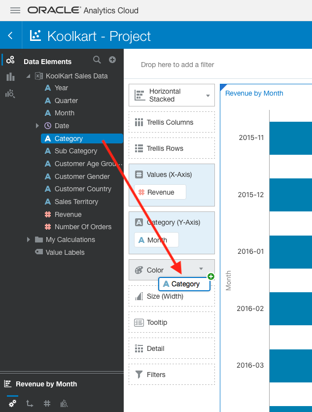
    
    You can now see monthly revenues broken out by product category.
    
    
    
        Built-in intelligence would also have allowed you to simply double click on Category and the system would attempt to determine how best to add it to your visualization.
        
    You can also interact with the results further by hovering over various categories. For example, if you move your mouse over the yellow portion of **2015-11** (which represents **Electronics & Computers**), you will see all other categories dimmed for easier viewing. You will also be able to see more detailed information on the actual data (e.g. the actual number of orders).
    
    
    
    
    
        After looking at each product category, you can now see that Electronics & Computers and Clothing & 
        Shoes categories are consistently the major contributors to sales in the past 6 months.
        
        So, that helps in better understanding which categories drive the most revenues, but you still need 
        to better understand your customer demographics.
        
2. Create a new type of visualization to evaluate revenues by age group.
    
    Select the **Data Elements** item and select **Customer Age Group**. Press and hold the **Control(Windows)** or **Command(Mac)** key and click on **Revenue**. Now, right click and select **Pick Visualization**.
    
    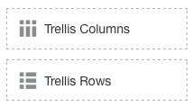
    
    **Select Donut**.
    
    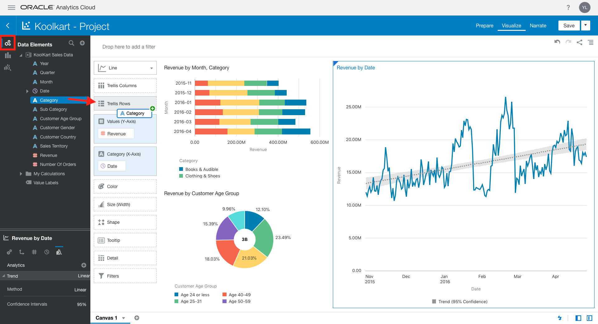
    
        As you can see, there is already a great variety of visualizations available and more are released 
        in every new version of the tool. We will not be covering each and every one, but we have made an
        attempt to provide a few examples during the course of this workshop. Please feel free to try out
        the different types!
        
    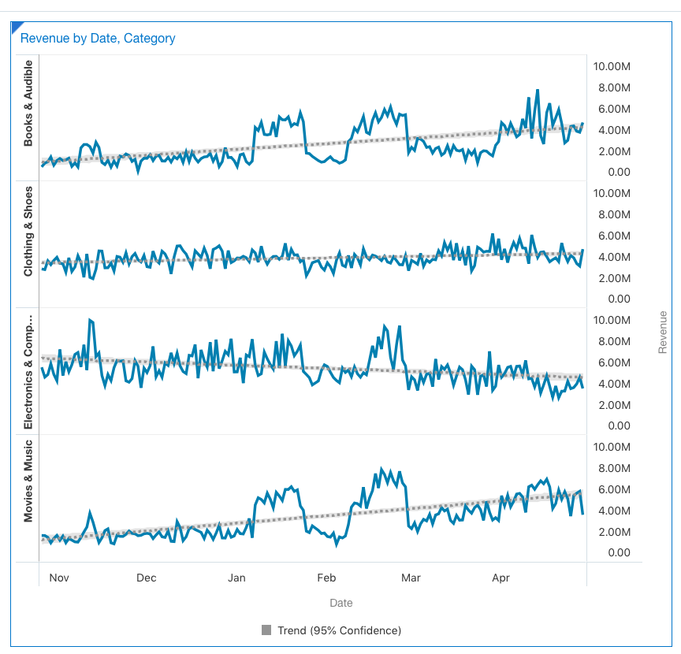
    
    You should see the new visualization, automatically placed next to the bar chart.
    
        It looks like our customers in the 25-31 and then 32-39 age range are the largest contributors
        to our revenues in the past 6 months. Let’s take a look at revenues over time to see if there is
        a noticeable increase over time (which we’d hope based upon our investments in the social media
        campaigns).
        
3. Create a new type of visualization to evaluate revenues by date (e.g. to view a trend over time as opposed to just monthly totals).

    Select the **Data Elements** item and select **Date**. Press and hold **Control(Windows)** or **Command(Mac)**. Select **Revenue**. Now, right click and select **Create Best Visualization**.
    
    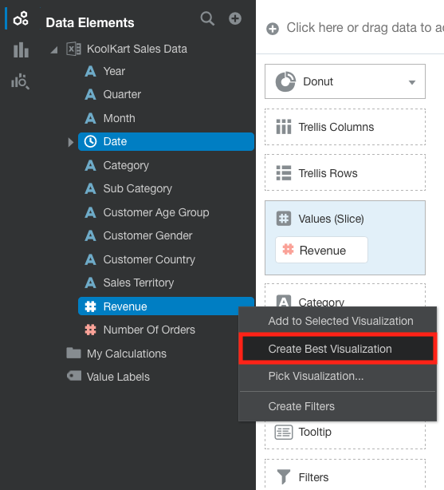
    
    You should now see a canvas that looks like the following:
    
        It looks like we have seen some increased revenues, though we will likely need to drill in even 
        further to identify the impact of the social media campaigns. However, before we do that, let’s
        “clean-up” the canvas so it’s easier to digest, in case we need to share the results.
        
### 2d) Formatting Visualizations and the Canvas

1. Rearrange the visualizations to make them easier to view.

    Click on the **Revenue by Date** timeline visualization. A blue border will indicate that the image has been selected. Hover your cursor near the top border until you see a 4 way arrow icon ().
    
    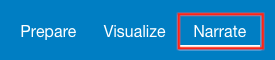

    Left click and then drag the visualization into the top right of the canvas above the **Revenue by Customer Age Group** visualization until you see a thick blue line.
    
    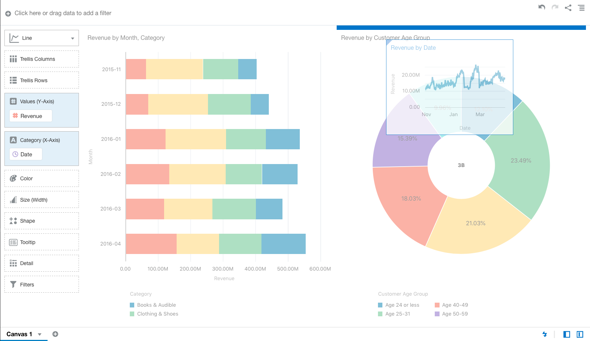
    
        Make sure that the thick blue line does not extend above Revenue by Month, Category otherwise the 
        visualization you are moving will appear above both the bar chart and donut.
        
    
        
    
    
    Now, click on the **Customer Age Group** visualization. Just like the previous time, the image will have a blue border when selected. Hover your cursor until you see a 4 way arrow icon (   ).
    
    
    
    Left click and then, drag the visualization into the bottom left of the canvas under the **Revenue by Month, Category** visualization until you see a thick blue line.
    
    

    Your canvas should look like the following:
    
    
    
2. Expand one of the visualizations.

    Now, click on the **Revenue by Date** visualization. Hover your cursor over the left border until you see an arrow icon (   ).
    
    

    Left click and drag the edge of the visualization to the left to increase the size. Your canvas should now, look like the following:
    
    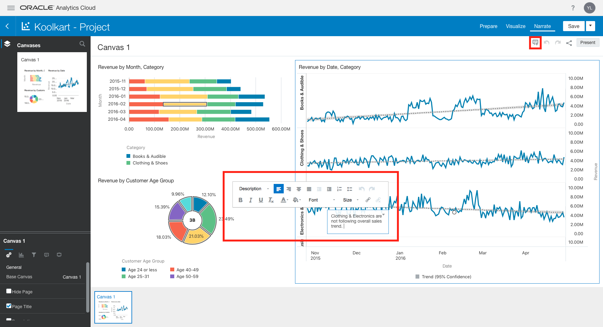

3. Adjust the project colors used in the visualizations.

    Select the **Canvas Settings** option in the **Project Menu** in the top right of the screen and select **Project Properties**.
    
    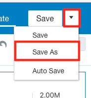

    Click on **Default** in the **Color Series** option.
    
    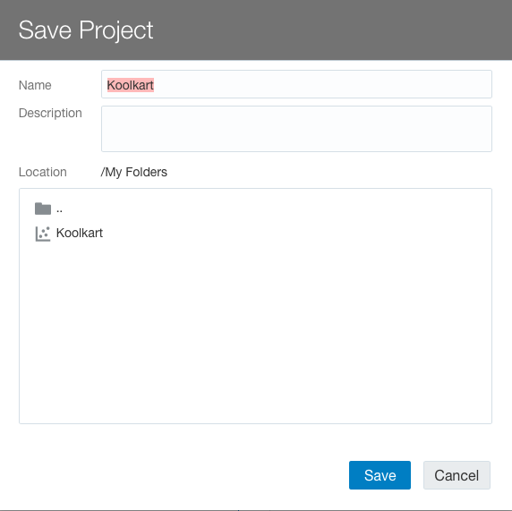

    Scroll down and select **Tokyo**. Then select OK.
    
    
    
    

    All of the visualizations will now reflect the new color scheme, across all canvases!
    
    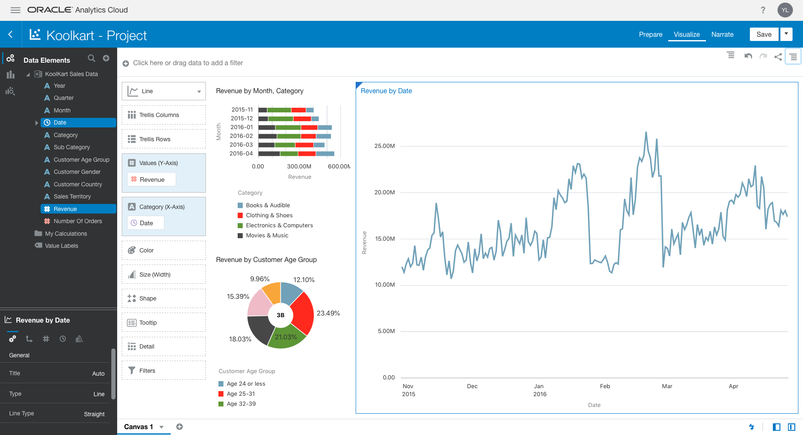

        You may have noticed that in addition to a wide variety of options and configurations, there is 
        also the ability to create custom palettes, which enables users to display results however they 
        wish. For purposes of this example we made changes at the project level for a quick and easy 
        change but colors and display options are also available at the visualization level to allow for
        full flexibility.
    
4. Reset the color palette.

    To avoid confusion with coloring in prior exercises, let’s go ahead and reset the color palette.

    Select the **Canvas Settings** option in the **Project Menu** in the top right of the screen and select **Reset Colors**.
    
    

5. Rename the Canvas.

    Since, **Projects** can have multiple **Canvases**, it usually makes sense to name them for the ease of reviewing down the line.

    Select the **Canvas Settings** option in the **Project Menu** in the top right of the screen and select **Canvas Properties**.
    
    

    Give the **Canvas** a meaningful name such as **Revenue Analysis** by clicking in the box and typing it in. Select **OK** to confirm your changes.
    
    

### 2e) Analyzing Visualizations with Trend Lines and Trellis Rows

    As mentioned earlier, as CMO you have now, started to evaluate your revenue data. However, you want to 
    make sure that it has some relation to the social media campaigns that you launched during November, 
    January, February, and April. At first glance, it does look like revenues are increasing following those
    campaigns, but you want to make sure things are also trending upwards, overall. Luckily, DV can help. So,
    let’s take a closer look at our numbers!
    
1. Add a trend line to your Revenue by Date visualization.

    **Right click** anywhere in the **Revenue by Date** visualization and select **Add Trend Line**.
    
    
    
    You should now see a trend line within the **Revenue by Date** visualization. Click anywhere in the visualization to remove the trend line properties menu.
    
        As you added the trend line, hopefully, you also noticed the ability to add other types of analyses 
        such as, reference lines, clusters, and forecasts as well as the ability to fine tune those analy- 
        ses. The platform is highly intelligent and robust, and allows for the deepest levels of analysis, 
        some of which we will cover in later labs.
        
        It looks like revenues are trending upwards and have been healthy for the past 6 months! But, let’s 
        see, if that holds true for all product categories or if our campaigns have had more success in 
        certain areas than others.
        
2. Further analyze your **Revenue by Date** visualization by breaking it out, according to product category.
        
        Trellis Rows and Trellis Columns are mechanisms by which we can breakdown an analysis by creating 
        multiple versions of that analysis for distinct entities. In the example being used, there is an
        initial line chart looking at revenues over time. Adding a Trellis Row for product category creates
        a line chart of revenues for each product category. See below for a screenshot.
        
    
    
    Make sure the **Revenue by Date** visualization is selected by clicking on it. Now, select **Category** from the **Project Components Menu** on the left (make sure to select the **Data Elements**, if you do not see **Category** listed). Drag and drop it into the **Trellis Rows** property of the visualization.
    
    
    
    Your line chart should now be comprised of 4 rows, each of which is its own line chart for a specific product category.
    
     
     
        Now, this is interesting!
        
        We knew overall revenues were trending upward and that certainly seems true for the Books & Audible 
        and Movies & Music categories.
        
        However, Clothing & Shoes seems to have remained flat and Electronics & Computers is actually
        trending down!
        
        Electronics & Computers makes up a good portion of our overall revenues too, so we should really 
        take a closer look at all of this.
        
        We should talk with our team, but what is the best way to share this information?
        
### 2f) Narrating a Story with Visualizations and Insights

1. Add an Insight to your project.

    Click on **Narrate** in the **Project Tabs** in the top right of the screen.
    
     
     
     You will see the following screen:
     
     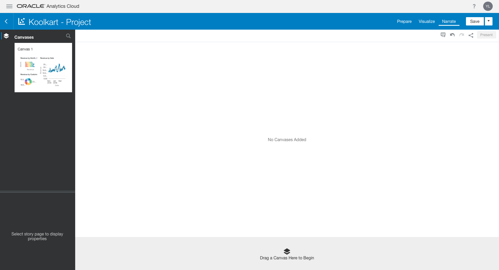
    
2. Create a narration for your Insight.

    Click on the hamburger icon and select **Add To Story**.
    
    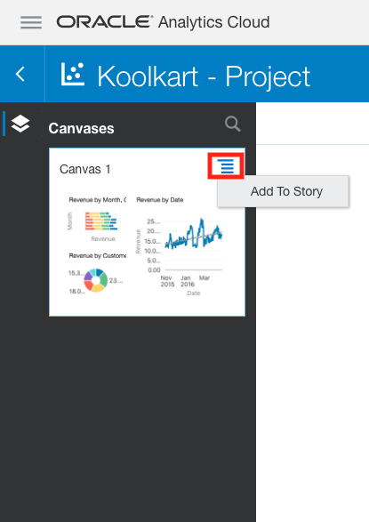
    
    You should see the ability to add information into a text box at the top of the screen. Click into the **Description** text box and type in **Clothing & Electronics are not following the overall sales trend**. Hit **Enter**.

    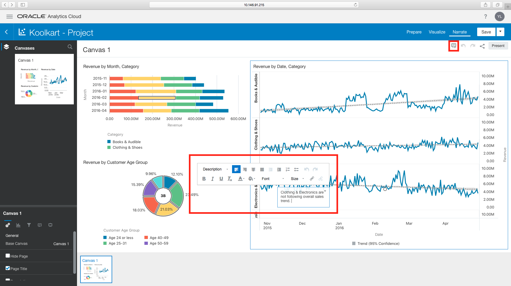
    
    Let’s also, give the **Insight** tab a meaningful name. Double-click the Title Box and type **Clothing & Electronics**.
    
    

    The **Insight** is now ready to be shared, which we will cover later on. Let’s make sure to save our work at this point.

3. Save your project.

    Select the **Save** button from the **Project Menu** in the top right of the screen. Select **Save As** in the pop-up menu.
    
    

    Type in KoolKart Sales as the Name and click **Save**.
    
    

Congratulations! You have now, successfully created compelling visualizations with DV. Proceed on to the next labs to learn about and try out even more robust features!

### 2g) Modifying Properties in the Data Panel

Now, let's go over the data panel in the bottom left of the UI for accessing properties. You will find yourself using them in the upcoming labs, so now is a good time to visit them.

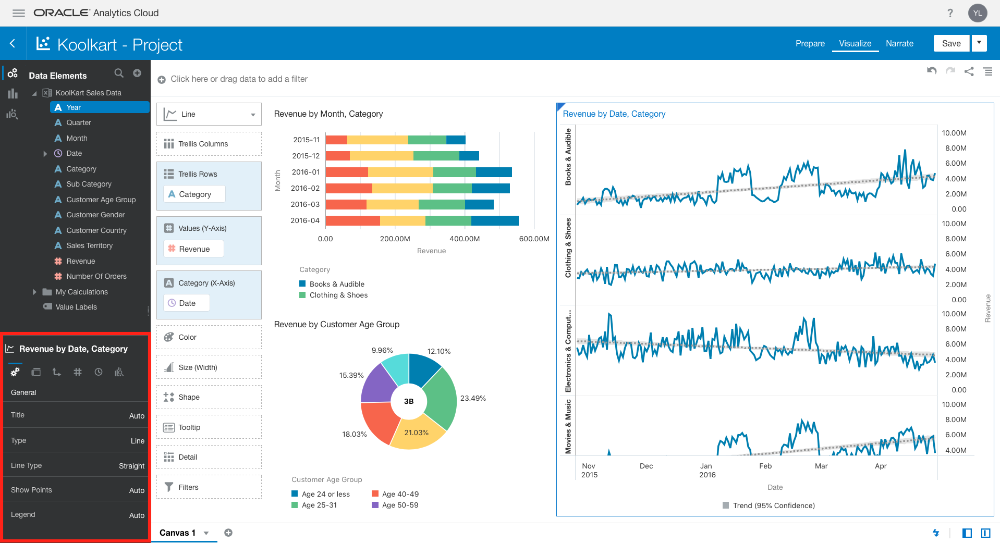

This section will cover the functions of each of these options.

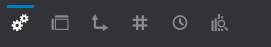

-  **General**: This is a section that allows you to edit the title, the visualization type, and the line type.

-  **Edge Labels**: This section allows you to edit labels with in your visualizations such as Trellis Rows or Trellis Columns.

-  **Axis**: This section allows you to adjust the labels for different axes on your visualization. This includes the labels axis, values axis, and the secondary values axis.

- 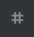 **Values**: This section allows you to adjust the measures you have included in your data set. You can change the aggregation method, the number format, or even the Y2 axis (if it applies).

-  **Date/Time Format**: Here you are given the capability to adjust how date/time column data is shown in your visualizations.

-  **Analytics**: In this section, you are given the ability to add different analytics options to your visualization. This can inlcude: Clusters, Outliers, Reference Lines, and Forecasts.