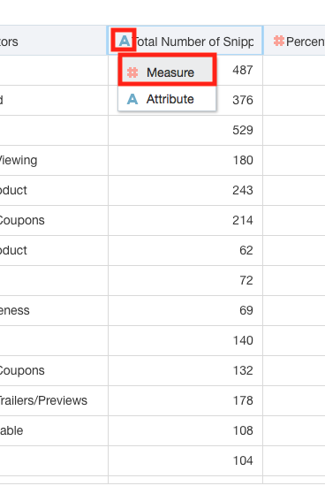
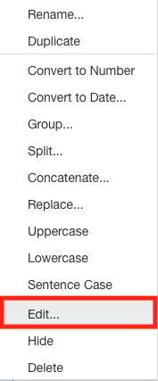
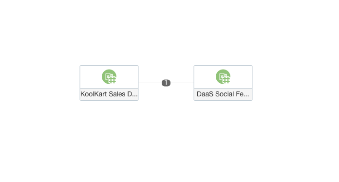
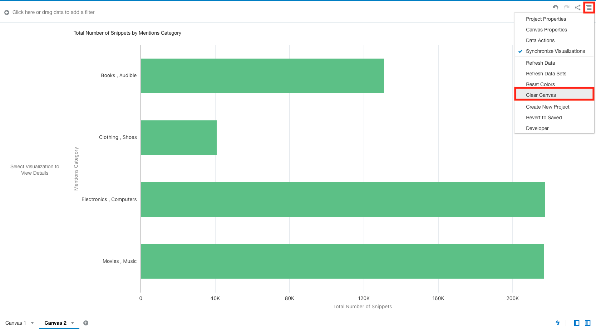
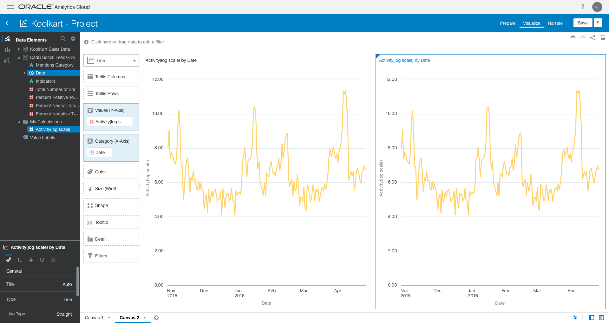
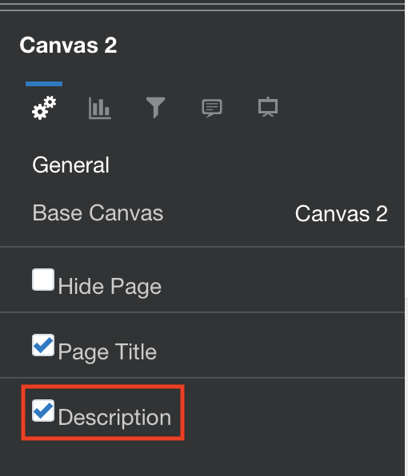
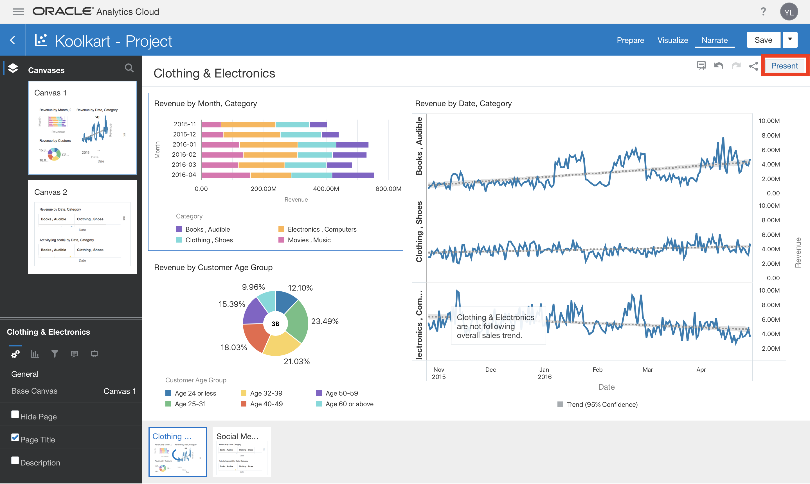

Updated: Aug 4, 2018

## Lab 3 – Analyzing Social Media with Sales – Data Blending and Wrangling
 
### Scenario

As KoolKarts’ CMO you have been evaluating revenue data to see, if your team’s social media campaigns over the past 6 months have had a positive impact.

So far, you have found that **Clothing & Shoes** and **Electronics & Computers** product categories are the main contributors to sales in the past 6 months. However, they are not following the overall positive sales trends despite your social media campaign efforts.

This is concerning. Now, you want to look at what is going on in the social media campaigns to understand the reason behind this.

Let’s look at the past 6 months of Oracle Data as a Service (DaaS) feeds on a KoolKart topic mentioning its product categories. These feeds come from numerous public social media sources including Facebook, Twitter, and others.

    You must have completed Lab 2 in order to complete all sections of this Lab.

### 3a) Adding Additional Data Sources to a Project

1. Add another data source to your project.

    Right click in any blank area in the **Project Components Menu** on the left hand side and select **Add Data Set**.
    
    
    
    Select **Create Data Souret**.
    
    
    
        Whenever you upload a file, Data Visualization treats it as a Data Set. Whenever you go to add a 
        new data source to an existing DV project or are creating a new DV project, the system displays all
        the data sets you have previously uploaded. This is a nice feature in that it allows you to re-use
        data sets you have already uploaded for other DV projects. But, for this lab, we need to upload a 
        new spreadsheet that we have not previously uploaded before.
    
    Select **Drop data file here or click to browse**.
    
    
    
    In the file browser that pops up, find and select the **DaaS Social Feeds-KoolKart.xslx** file.
    
        This file contains Indicator words from posts to your social media pages or posts mentioning your 
        business. It includes the total number of times the Indicator word was mentioned and whether it was
        mentioned in a positive tone, neutral tone, or negative tone. It is broken down by Date and Category.
        We are going to look at this data in conjunction with the already loaded revenue data to see if we 
        can identify how social media might be impacting sales.
    
    The system uploads the file. 
    
    Notice that the system was intelligent enough to see that the Date column is common between the first data set (i.e. revenue spreadsheet) you uploaded into your current project and this one. Therefore, the system sets this column to Match. This, in turn, will enable you to create visualizations combining attributes and measures from both data sets at the same time.
    
    
    
        You do not need to change anything with this step. This is merely to allow you to recognize that the system will auto match data sets where possible.
        
    
    
## 3b) Update Aggregation Logic within a Data Source

1. Modify how DV will aggregate some of the fields by default.

        DV will try to identify the best aggregation method (e.g. Average, Sum, Count) for Measures within 
        a data set. However, you may sometimes wish to use an alternate aggregation method and the system 
        allows you to set the logic for every column.
        
        In this lab, we will want to look at averages as opposed to sums when evaluating what percentage of
        social media comments are of a certain tone.
        
    Click on **Percent Positive Tone** field header. Now, in the **Data Panel** in the **Project Components Menu**, select **Sum** (next to **Aggregation**) and then select **Average**.

    
    
    
    
    Repeat the steps above for **Percent Neutral Tone** and **Percent Negative Tone**.
    
    
    
    

2. Update an Attribute to a Measure.

        Upon importing data, DV will automatically identify numeric columns as measures. Please continue
        with the step below, if the **Total Number of Snippets** column is not a measure.
      
      There are two methods to do this:-
      1. Select the **A** icon on the **Total Number of Snippets** header and select **Measure**.
      
            
            
      2. Go to the **Data Panel**, select **Treat As** and change it to **Measure**.
      
            
      
      Select **Add** to begin working with the data.
      
    
    
    You should now, see the **DaaS Social Feeds-KoolKart** data set loaded into your project.
    
    
    
### 3c. Add a Canvas to a Project with a New Visualization

1. As previously covered, a DV Project can include multiple Canvases for organizing visualizations. Add a new **Canvas**.
    
    Select the **Visualize** tab at the center top of the screen.
    
    
    
    Select the **+** icon at the bottom left of the screen to add a new **Canvas**.
    
    

2. Add a new visualization to the new Canvas.

    Select **Mentions Category** under the **DaaS Social Feeds – KoolKart** data source (within the **Data Elements** option of the **Project Components Menu** on the left).

    Hold down the **Control(Windows) or Command(Mac)** key and select **Total Number of Snippets**. **Right click** and select **Create Best Visualization**.
    
    

    The system will have determined that a **Horizontal Bar Chart** is the best option for displaying this data.
    
    

        We seem to have enough volume of activities (i.e. snippets) for each category so that’s good. 
        However, the format of the Mentions Category data seems to be different from the format of the 
        Category data in our KoolKart Sales Data (e.g. Clothing, Shoes vs. Clothing & Shoes). So, it looks 
        like we need to figure out a way to “adjust” the data.

### 3d) Data Wrangling (Adjusting Sales Data to Align with Social Media Data)

1. Modify the data in the social media data source to allow it to be merged with the sales data.

        Data wrangling enables you to manipulate the data in an existing “raw” data set for easier consump-
        tion by tools like analytics and reporting platforms. This eliminates the need to have to go back 
        and make changes to your source tables / files (in our case the Excel file) and then re-upload again.
        
    Select the **Prepare** tab.
    
    

    Select the **KoolKart Sales Data** tab in the bottom left of the **Canvas**..
    
    
    
    As previously stated, the way the **Category** is displayed here (i.e. with Ampersands) is different from how it is displayed in the **DaaS Social Feeds-KooKart** data set. (click on the tab at the bottom of the screen to view the other data source).
    
    
        
    
    
    Make sure you are on the **KoolKart Sales Data** tab in the bottom left and select the **Ellipses** icon () next to the **Category** column.
    
    
    
    Select Edit.
    
    

    You should see an expression editor, which we will use to replace the ampersands in **Category** with commas.
    
    
    
        We will walk you through the exact expression for this lab. Please notice that the editor supports
        a wide range of functionality for structuring data to suit your analytical needs.
    
    Delete the existing content in the **Expression Box** (e.g. **Category**). Expand the values under **String** in the **Function Menu**.
    
    
    
    Scroll down and select (e.g. double click) **Replace**.
    
    
    
     The system will show you the required format of the function. Click on the first occurrence of **expression** and type in "Categ". You will see the system provides suggestions. Click on **Category**.
     
     
     
     Click on the next occurrence of **expression** and type in ‘&’ (include the single quotes). Click the next occurrence of **expression** and type in ‘,’ (include the single quotes).
     
     The expression should now appear as: **REPLACE(Category, '&', ',')**. The function should be validated, automatically. If not, then click the **Validate** button.  
     
     

    Click **Add Step** to apply your changes, once validated. If you face any issues then, please try again.

    The **Category** field should now appear with commas. Click on **Apply Script** in the **Project Components Menu** under **Preparation Script**.
    
    
    
### 3e) Data Source Diagrams and Matching Logic

1. Create an additional join (e.g. matching logic) between the sales and social feeds data sets.

    In the last exercise, we modified some of the data in the **KoolKart Sales Data** dataset to ensure that it aligned with the **DaaS Social Feeds-KoolKart** dataset.

    Now that **Category** / **Mentions Category** appears in a similar way in both datasets, we can tell the system to join the two datasets.

    Select **Data Diagram** in the bottom left.

    
    
   **Data Diagram** displays a visualization of the datasets being utilized within the project. In this workshop, we are using two Excel files, so you will see those represented. Furthermore, you will see any joins between the two datasets. If you recall, the system had automatically matched the files according to date. Now that we have made some changes to the data, we can also utilize **Category** / **Mentions Category**.
   
   
   
   Click on the number **1** in the diagram. In the new menu, click on **Add Another Match**.
   
   
   
   You can now identify the logic to join the datasets. In the first column of the new row, use the dropdown to select **Mentions Category**. In the second column select **Category**.
   
   
    
        You may have noticed that only Attributes are displayed. This is by design as Measures are for 
        aggregation, not dimensional analysis or joins. If need be, you can always modify a column or create 
        a copy of it in another format (e.g. a dataset could have an Id column defined as an Attribute and a 
        copy of that column, such as Id_Measure, defined as a Measure with count aggregation).
    
    Click **OK**.
    
    The data source diagram will now show there are **2** joins between the datasets.
    
    
    
### 3f) Analysis of Sales and Social Media Data (Calculations and Other Visualizations)

1. Create a calculated field to use in visualizations.

        Now, we have data that spans both social media feeds and revenue figures. This will help us dig into
        their relationship.
    
        Previously, we created some visualizations, but now, we have the ability to really dive into more 
        advanced capabilities. For starters, activity on social media is subject to large spikes. To make
        it easier to evaluate, we should evaluate it on a logarithmic scale (large and varied datasets like
        those found in social media are often, best handled using a logarithmic scale, where values are 
        evaluated based upon multiplicative factors as opposed to static values).
    
    In the last exercise, we modified some of the data in the **KoolKart Sales Data** dataset to ensure that it is aligned with the **DaaS Social Feeds-K oolKart** dataset. Navigate to the **Visualize** tab.
    
     
     
     Click on the **+** icon on the top right of the **Project Components Menu**. Next, click on **Add Calculation** (make sure that the **Data Elements** icon is selected, else the **+** icon won't be visible).
     
     
     
    In the **Expression Editor**, type in **Activity(log scale)** as the **Name**.
    
    Then, type in the following expression into the **Expression Box** (you could also use the function list on the right and field search as demonstrated in previous exercises):

    **log(Total**
    
    
    
    Select **Total Number of Snippets** from the pop up.
    
        You must type this in for the auto-complete suggestions to show up.
        
    Select **Validate**. Then select **Save**, assuming it was valid.
    
    
    
    

2. Use the calculation in a visualization to analyze social media volume on a logarithmic scale.

    Clear the existing **Canvas**. Select the **Canvas Settings** option from the **Project Menu** and select **Clear Canvas**.
    
    

    Select **Date** (under **DaaS Social Feeds-KoolKart** within **Data Elements** in the **Project Components Menu**).
 
        You can adjust the display format of a date or a time column by specifying the format and/or level 
        of granularity. For example, you might want to change the format of a transaction data column (which 
        by default, is set to show the long date format such as November 1, 2017) to display the ISO
        date format (such as 2017-11-01), instead.
    
    Press the **Control(Windows)** or **Command(Mac)** key and also select **Activity(log scale)**. **Right click** and select **Create Best Visualization**.
    
    

    The system will have determined that a line chart is the best way to visualize this data. Let’s create a copy of the visualization, so that we can quickly analyze the date based information in our dataset.
    
    
    
    **Right click** in the white space of the visualization (or use the **Visualization Properties Menu** in the top right of the visualization). Select **Copy Visual**.
    
    
    
    

    **Right click** in the white space of the visualization (or use the **Visualization Properties Menu** in the top right of the visualization). Select **Paste Visual**.
    
    
    
    

    You should now have two copies of the line chart on your canvas. 
    
    
    
    If needed, rearrange the images one above the other, as learnt in Lab2. 
    
    Now, go ahead and select the one at the top.
    
    

    Select **Revenue** under **KoolKart Sales Data** in the **Project Components Menu** (make sure nothing else is selected) and drag it directly on top of **Activity(log scale)** in the properties box under **Values (Y-axis)**.
     
    
    
    Doing so, should have replaced **Activity(log scale)** with **Revenue**. If, instead, it added it as another Y-axis measure, just hover over the **Activity(log scale)** measure and click the **X** that appears in the right corner to remove it.
 
    
    
    Now, let’s create a copy of the canvas, so that we can quickly apply different filters and analyze the dataset in our next section.
    
    
    
    **Click** on the arrow next to **Canvas 2** and select **Duplicate Canvas**.
    
    
    
    

    **Click** on the arrow next to **Canvas 2 copy** and select rename. Rename the canvas to **Canvas 3**.
    
    
    
    
    
    
    
    Now, go ahead and select **Canvas 2**.
    
        In our earlier analysis, we were able to establish that, although, certain product categories have 
        negative revenue trends, the overall trends are positive and would appear to correlate positively 
        with our social media campaigns.
    
        In this visualization, we can see the Revenue by Date and Activity(log scale) by Date visualizations
        seem quite close in terms of trending thus helping validate the hypothesis that the social media 
        campaigns were helpful overall.
    
        However, let’s drill into the categories that were not performing well to see if we can find out
        what is going on. Specifically, let’s take a look at Clothing & Shoes and Electronics & Computers.
    
3. We can apply filters to our visualizations to only look at certain parts of our datasets.

    Select **Mentions Category** (make sure nothing else is selected) and drag it to the **Filter** area.
    
    
    
    Select **Clothing , Shoes** and **Electronics , Computers**. 
    
    
    
    Both visualizations will now only show data for these 2 categories. Click anywhere outside the filter box to hide the filter box drop-down.
    
    
    
4. Include category in the visualization as a Trellis Column and adjust the color palette of the visualization.
    
    Select **Category** and drag it into the **Trellis Columns** property.
    
    
    
    Next, let’s reset the color assignments to make it a little easier to compare the two metrics. **Right click** on the white background and select **Color** and then **Reset Visualization Colors**.
    
    Your visualization should now look like the following:
    
5. Add Category to the SECOND visualization.

    Select the Activity(log scale) by Date visualization (will appear with a blue border). Select Category (make sure nothing else is selected) and drag it to the Trellis Columns property.
    
    Let’s take a look at the visualizations.
    
        What is that we see here?
        Well, in looking at the Activity(log scale) by Date, Category visualization, the overall trend is flat meaning there doesn’t seem to be much social media activity for the Clothing , Shoes category despite our social media campaigns.
        In looking at the Revenue by Date, Category visualization, revenues for the Clothing , Shoes category also seem to be rather flat despite our social media campaigns.
        In looking back at the Activity(log scale) by Date, Category visualization, surprisingly there is quite a bit of social media activity for the Electronics , Computers category and it is growing. But in looking at the Revenue by Date, Category visualization for this category, revenues are trending down.
        This is confusing! Let’s check the tonality/sentiment of the social media activities because while there is social media activity, perhaps it is not all positive.
        
6. Create a new visualization to evaluate the tone of social media posts.

    Select the Activity(log scale) by Date, Category visualization (it will appear with a blue border). Right click in any blank area and select Copy Visualization.

    Right click below the Activity(log scale) by Date, Category visualization and select Paste Visualization.
    
    Select the bottom visualization (it will appear with a blue border). Select Percent Positive Tone (make sure nothing else is selected). Press and hold Control and select Percent Neutral Tone and Percent Negative Tone. Drag and drop them directly on top of Activity(log scale) in the properties area under Values (Y-axis).
    
    This should have replaced Activity(log scale) with the 3 new columns. If instead it added them as additional Y-axis measures, just hover over the Activity(log scale) measure and click the X that
    appears in the right corner to remove it.
    
    Change the visualization type. Select the dropdown menu next to the current visualization type (Line) and select Area.
    
    Let’s take a closer look at this visualization. Select Maximize Visualization in the top right.
    
        Interesting... there seems to be a lot of negative sentiment towards Electronics , Computers starting in the 2nd week of January. Let’s analyze the Indicators to try to further understand the problem.
        
7. Evaluate the tone of specific social media posts using a Tag Cloud visualization.

    Minimize the last visualization.
    
    Select Indicators (make sure nothing else is selected). Press and hold Control. Select Total Number of Snippets. Right click and select Pick Visualization.
    
    Select Tag Cloud.
    
    You should now see a breakdown of the most common Indicators on social media.
    
     Let’s narrow this down to focus in on just Electronics & Computers and filter the dates to after mid- January. Select the current Category filter and click on Clothing , Shoes (to remove it).
     
     Click outside the filter to exit the menu. Select Date and drag it into the Filter area to the right of Category (so it is added and does not replace the existing filter).
     
     Set the Start Date (using the calendar or by typing) to January 9, 2016. Set the End Date to April 29, 2016. Click anywhere outside the filter to exit the menu.
     
      Next let’s color the Tag Cloud by intensity of negative sentiments. Select Percent Negative Tone and drag into the Color property.
      
      We now have a visualization of Electronics , Computers related social media posts between January and April 2016 focused on identifying issues from negative feedback.
      
        In looking at the size of the tag, we can see key indicators like Defective, Delivery, and Recall are frequently mentioned and by looking at the darker color, we can see Customer Service and MEDIA: Viewing seem to be contributing to the bulk of negative sentiment. This needs to be followed up on.
        
        Let’s note this as another insight to share with the team.
        
        
        Depending on the size of your monitor and your screen resolution, your Tag Cloud could be laid out slightly different but relative size and color should be the same as above.
        
### 3g) Finalize Project and Insights of Sales and Social Media Data

    Data Action links are responsible for passing context values from Data Visualization as parameters to 
    external URLs or filters to other projects. When a link navigates to a project, the data context is 
    displayed in the form of canvas scope filters in the filter bar. The links data context may include 
    attributes associated with the selections or cell from which the link was initiated.

1. Accessing the Data Actions Dialog Box

    Click on **Narrate** in the **Project Tabs** in the top right of the screen.
    
    

    Hover over the visualization, click on the **Hamburger Icon**, and select **Add To Story**.
    
    

    Let’s also give the **Insight** a meaningful name. Double-click the **Title Box** and type **Social Media Sentiment**.
 
    Navigate to the **Canvas Settings** and check the **Description Box**.
    
    
 
    Double-click the **Description Text Box** and type in: **Seeing increased social media activity for Electronics & Computers starting mid-January. Negative sentiment seems to be around Customer Service and MEDIA: Viewing**. Click anywhere outside the box to save it.
 
    
 
 2. Save the project.
 
    Select the **Save Button** in the **Project Menu**. Select **Save**.
    
    
    
3. Present the findings using Presentation Mode.

    **Presentation Mode** should be used when you are sharing your story and any insights that you have gained with others.
    
    Select the **Present** button to start **Presentation Mode** in the **Project Menu**.
    
    

    This will remove all the editing sections from the interface and convert your **Insights** into a dashboard style presentation mode that you can now, share with others.
    
    

    Notice the 2 dots that appear at the bottom of your screen (one for each Insight you created). The **Insight** title and description appear above the dots. Click on the **2nd dot**. Notice that now, your **2nd Insight** is displayed. You can navigate back and forth between each **Insight** by clicking on the dots or the arrows.
    
    
    
    This concludes the lab. Exit **Presentation Mode** and navigate back to the **Home Screen**. Select the **X** in the top right to exit the mode.
    
    

    Select **Home** to return to the **Home Page**.

