Updated: July 21, 2018

## Lab 4: Data Flows to Curate Data (General Ledger from Multiple Sources)

In this next lab, you will create a data source from multiple sources, as part of a reusable **Data Flow**. **Data Flows** can be used to merge multiple data sources; apply aggregations; filter results; and modify and create columns. These flows can also be refreshed and reused as needed.

Key Take Aways from this lab:
- Getting used to the DV interface
- 

        This lab is optional but provides an important overview of managing data for those users who might 
        need to prepare data for analysis.

### Scenario

As VP of Finance at a large organization, you often face the challenge of being able adequately analyze financial data, which is derived from multiple sources. A Project Planning and Management tool is used for budgeting and forecasting purposes, while actuals (e.g. spend) are captured in a Financials module of an ERP. You have asked for data from both, but been given a delimited text file and an Excel file.

Luckily, one of your staff who knows how to use Data Visualization in Oracle Analytics Cloud, is here to help you define a mechanism by which that data can be merged and utilized for your analytical purposes.

### 4a) Import an Excel File and a Delimited Text File and Apply a Format Conversion

1. Import actuals data from an Excel file for use in your data flow.

    Open the **Data** menu.

    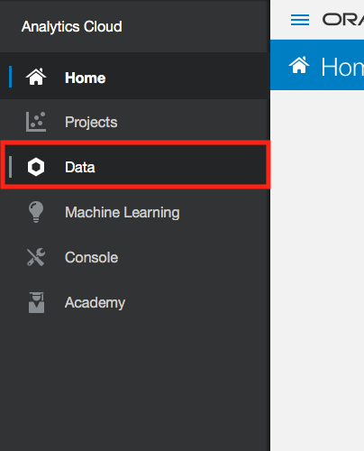
    
    Select **Data Set** in the **Create** section.
    
    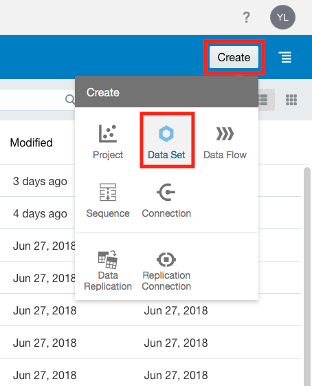
    
    Select **Data Set** and choose **Drag data file here or click to browse** or simply drag the **General Ledger Data - Financial System Actuals.xlsx** file to the space.
    
    
    
    Select **General Ledger Data - Financial System Actuals.xlsx** from where you saved the data files for the workshop. Please make sure you do not load the combined data file (that is used if skipping this lab).
    
    You’ll notice this file contains **Actual** (spend amount) by **AccountLineId**, **Account**, **Account Group**, **Business Lines**, **Month**. Leave all fields as they are and select **Add**.
    
        You may have noticed that Month is appearing with the day of the month as well. Let’s clean that
        up.
    
    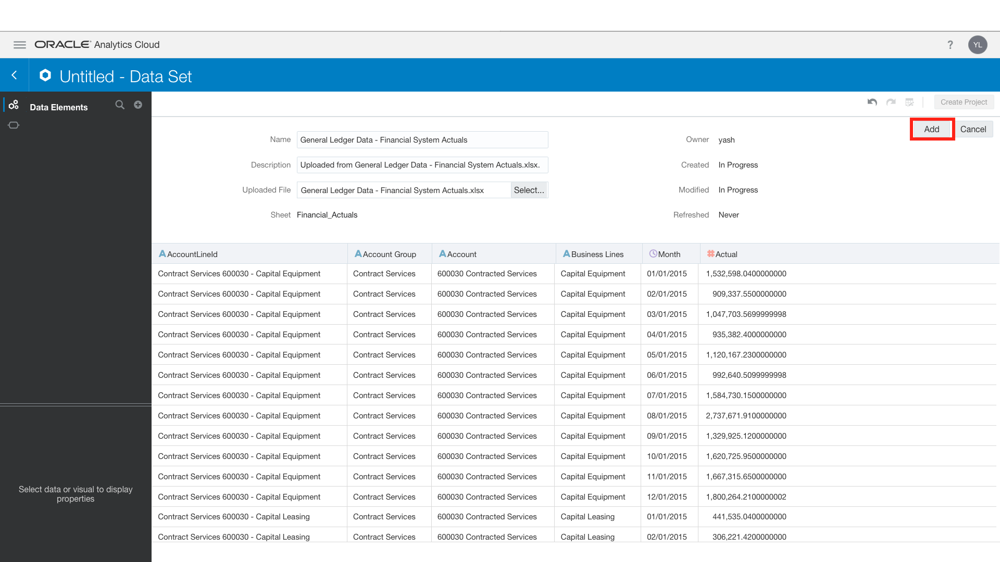
    
    Select the column **Month**. Under **Properties** in the **Project Components Menu**, select the **Date** icon. Now type in **MMMMM YYYY** into the **Format** field.
    
    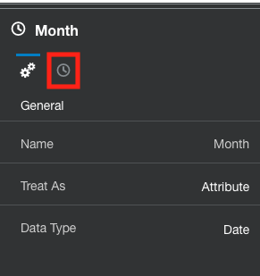
    
    
    
     Go to **Preparation Script** and click **Apply Script**. 
     
     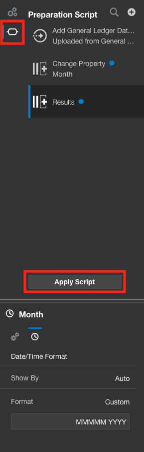
    
    Your data should now be ready to use. Go back to the **Data Sources** menu.
    
    
    
2. Import budget data from a delimited text file for use in your data flow. 
    
    Select **Data Source** in the **Create** section.
    
    
     
    Similar to step 1, select **Data Set** and choose **Drag data file here or click to browse** and select **General Ledger Data - Project Planning System Budgets.txt** or drag it to the space.
    
        Delimited files (typically in a text format) are simply datasets where the columns are separated 
        by a character (or set of characters) such as a comma, a pipe, a semicolon, or others. Most 
        systems today have strong export capabilities and APIs for retrieving data, but large datasets 
        and those from legacy systems often rely upon these means for sharing data.
    
    You’ll notice that it looks like the system thinks all the data is part of a single column. This is because the system defaults to looking for comma delimited files so you will need to change this. Click on **Comma**. Select **Custom**.
    
    
    
    Type in a pipe delimiter (usually **Shift** and the key between **Backspace** and **Enter**/**Return**): **|**
    
    
    
    Click outside the field to apply the changes. You will now notice this file contains **Budget** by **AccountLineId**, **Account**, **Account Group**, **Business Lines**, and **Month**.
    
    Leave all fields as they are and select **Add**.
    
3.  Convert Text to Dates.

        You may have noticed that Month is showing up with the day of the month as well and in text format. Let’s clean that up so we can analyze it as a date.
    
    Select the **Month** column.
    
    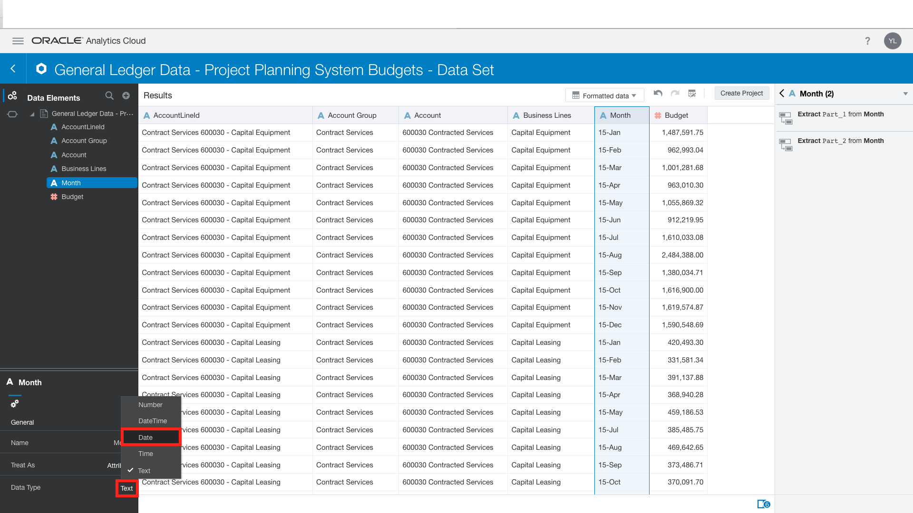
    
    Under **Properties** in the **Project Components Menu**, select the **Data Type** and set it as **Date**. You will now be able to see the **Date** icon. Now type in **MMMMM YYYY** into the **Format** field. Go to *Preparation Script** and click **Apply Script**. 
    
    
    
    The data is now ready to be used in our data flow.
    
        You won’t always need to be modify data as we just did. You can add data sources directly while 
        creating data flows. However, these past two exercises were structured to allow you to see that
        regardless of the type and format of data you have been provided, you can easily structure it for
        analysis within OAC.
    
## 4b) Create a Data Flow to Curate Budget and Actuals into a Single Dataset

1. Create a new Data Flow.
    
    Return to the **Data Sources** menu.
    
    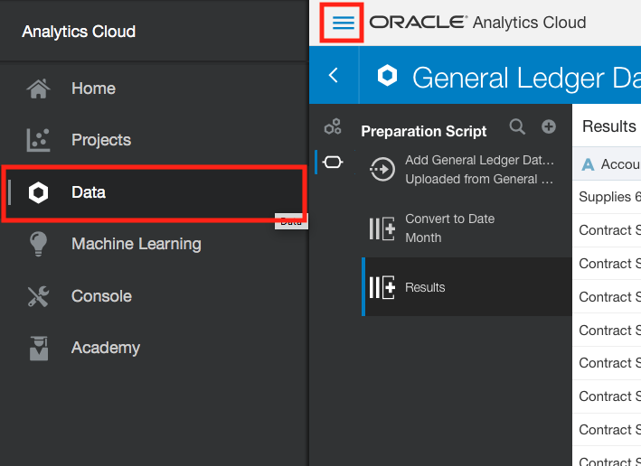
    
    Select **Data Flow** in the **Create** section.
    
    
    
    Select the **General Ledger Data – Financial System Actuals** dataset and select **Add**.
    
    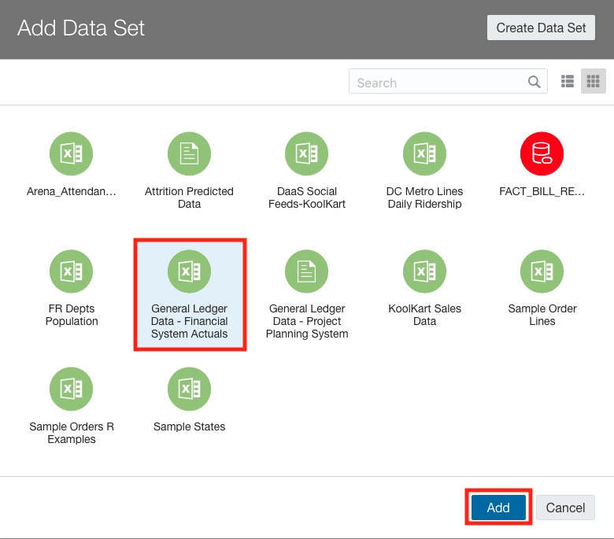
   
    This brings up the **Data Flow** editor. We will not be covering this in its entirety, but the editor shows a visual representation of the operations at the top of the screen with the resulting data at the bottom. The available operations are presented as icons on the right.
     
    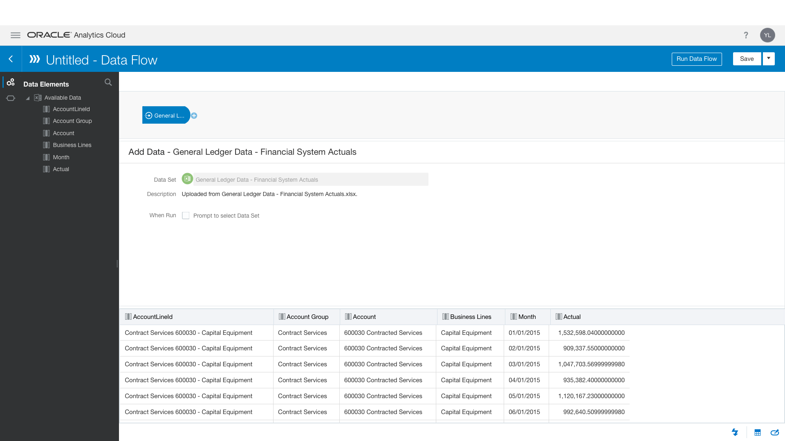
    
2. Add another data source.

    The first thing we should do here is add our other data source (the budgetary figures). Select **Add Data** from the **Data Flow Steps Menu**. Drag it under **General** in the diagram.
    
    
    
    Select the **General Ledger Data - Project Planning System Budgets** dataset and select **Add**.
    
3. Join the data sources.

    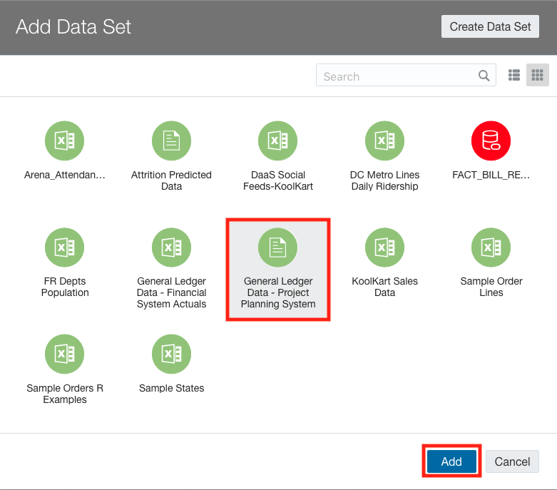
    
    In order for the system to understand how the two data sources can be combined, we need to provide athejoin logic.

    Select **Join** from the **Data Flow Steps** Menu and drag and drop it after the first General icon in the flow.
    
    
    
    You will be informed that you need to provide additional logic. Select the open circle to do so (it does not matter if the circle appears in the top or bottom line).
    
    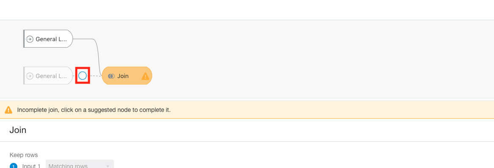
    
    The system will suggest the first column (**AccountLineId**) as a possible join. In addition, we also want to use the **Month** column. To do so, select the plus icon and add another join.
    
    
    
    Select **Month** for both, Input 1 and Input 2.
    
    
    
    You should see the data below the join logic. If not, then there may be an issue with what you have applied, so try again.
    
4. Identify the columns we want to use for our analyses.

    Let’s remove any column copies as both data sets include the same information about the account. Click on **Select Columns** and drag and drop it after **Join**.
    
    
    
    Scroll down and click on **AccountLineId_1**. Then also select **Account Group_1**, **Account_1**, **Business Lines_1**, and **Month_1**. **Select Remove Selected**.
    
    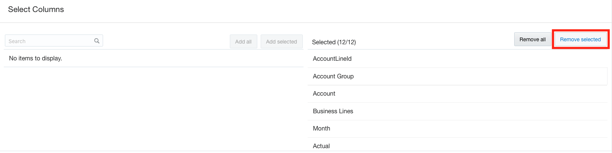
    
    
    
    Your flow and data should now look like the following:
    
    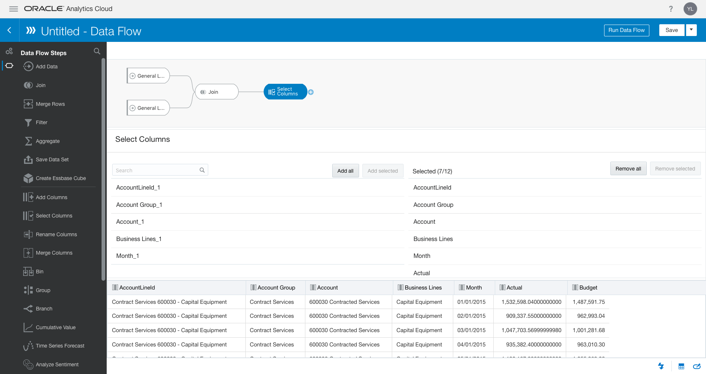
    
5. Add a new column to the result set.

    If you’ve noticed, we have both **Budget** and **Actual** values. Typically, it makes sense to evaluate any variance. Let’s add that information to our flow.
    
    Select **Add Columns** and drag it to the right of **Select Columns**.
    
    
    
    Type in **Variance** as the **Name**. Type in **Budget** in the **Expression Editor** and wait for the pop-up to appear and select **Budget**.
    
    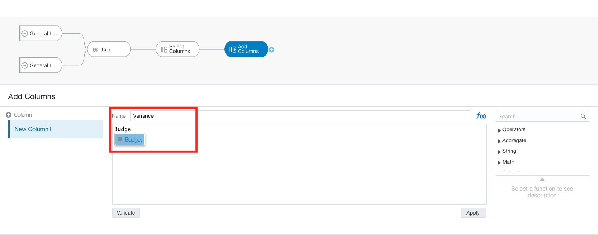
    
    Type in the minus sign (**-**). Then drag and drop the **Actual** column into the equation after the minus (you will need to select the **Columns** icon in the menu on the left).
    
    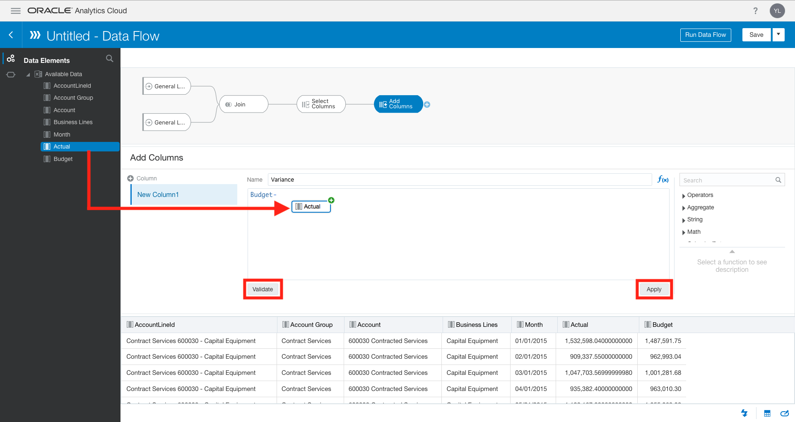
    
    Select **Validate** and then Apply.
    
    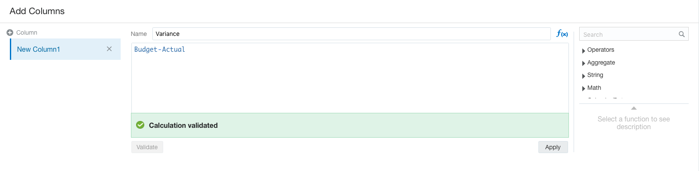
    
    You should now see a **Variance** column in the data. Let’s go ahead and add a step to save the data in the flow.
    
6. Save the data in the flow (e.g. to have the system create a data source for use in visualizations).
    
    Select the **Actions** icon. Select **Save Data Set** and drag next to **Add Column**.
    
    
    
    Type in **General Ledger Data Merged** in the **Name**.
    
    
    
7. Save the data flow itself.

    Select **Save** in the top right and select **Save As**.
    
    
    
    Type in **General Ledger Merging Data Flow** and select **OK**.
    
    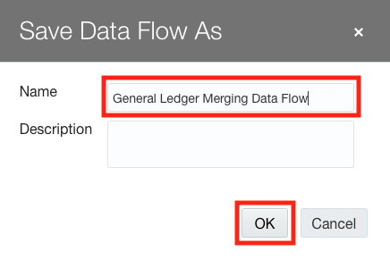
    
8. Run the Data Flow to create the data source for use in visualizations.

    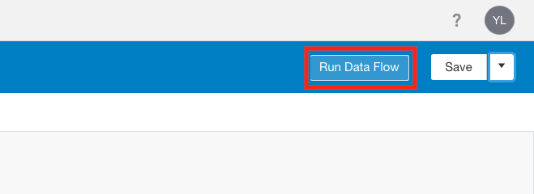

9. Review the created Data Source to make sure it is formatted how you would like it.

    Go to the **Data** menu.
    
    
    
    Select the **Ellipses** icon next to the newly created and merged data source (**General Ledger Data Merged**) and select **Open**.
    
    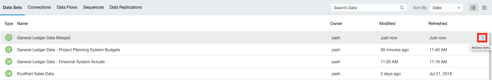
    
    Now would be a good time to adjust formatting as needed (e.g. in the example below, we want to change the formatting for **Actual**, **Budget**, and **Variance**).
    
    
    
    As before, to make any change select the column, go to **Project Components Menu** and make the change.
    
    
    
    
    
    
    
    In this menu, you can also change the Aggregation (default for Measures) and Format as desired.
    
    Once you are done with your changes, click **Apply Script**.
    
    You are now ready to create visualizations from two different data sources that have been curated using a **Data Flow**!

### 4c) Binning, Grouping, Running Aggregations in Data Flows

Binning a measure creates a new column based on the value of the measure. You can assign a value to the bin, dynamically, by creating the number of equally sized bins (such as the same number of values in each bin), or by explicitly specifying the range of values for each bin.

1. Navigate back to your newly created **Data Flow** section.

    
    
2. Drag **Bin** from the left pane to the **Add columns** option.

    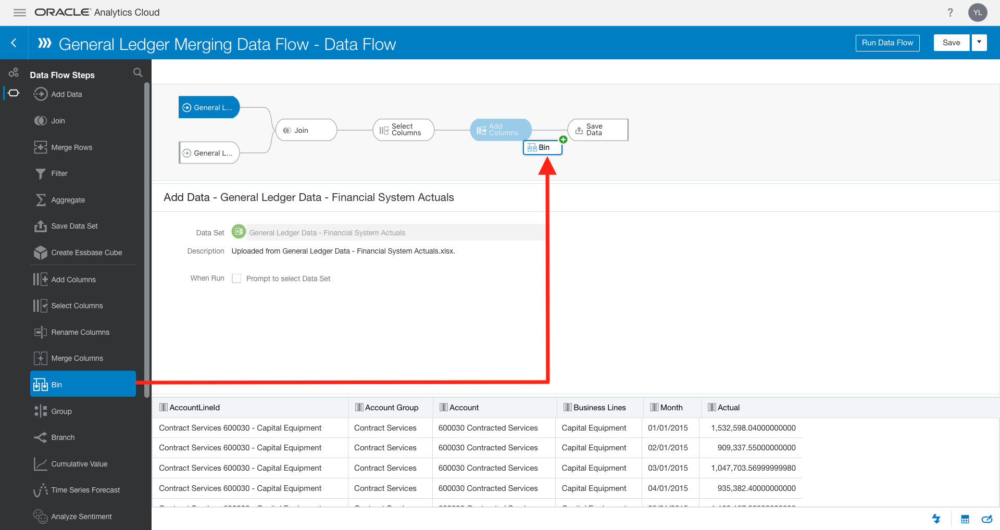
    
    

    
    
3. Rename the element name to **Bin for Actuals** and set the **Number of bins** to 6.

    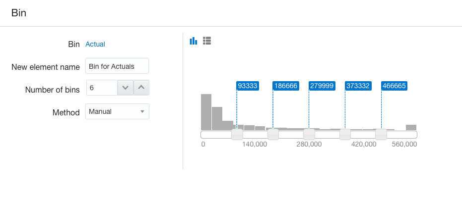
    
4. Drag Group from the left pane to the Add Columns Section.

    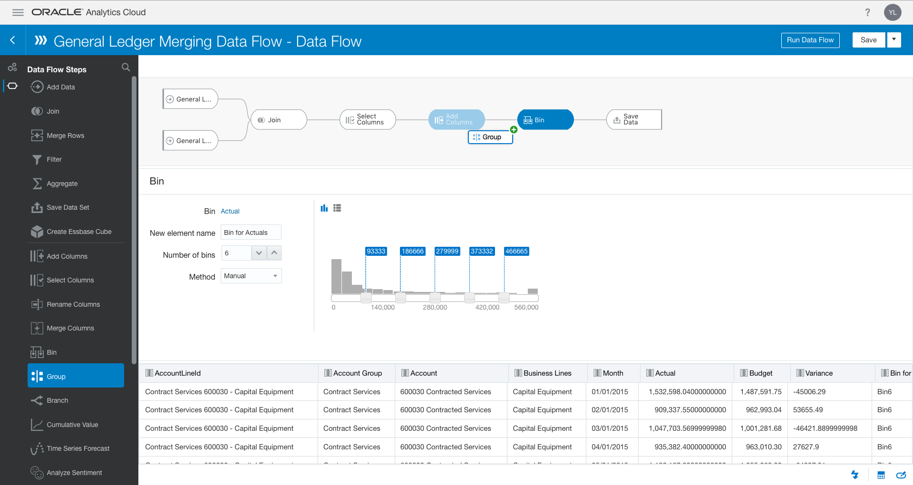
    
5. Now you are able to take certain columns and assign them to a group.

    
     