#Lab 5 – Analyze ERP Budgets and Actuals

### In this next lab, you will be analyzing financial data using lessons learned in prior labs. There will be less guidance provided along the way but feel free to ask questions if you get stuck.

-  - Lab 2 is a good resource to revisit if you need help performing certain tasks in this Lab.

-  - It is the end of the fiscal year and, as VP of Finance, you have been tasked with evaluating how actual spend is comparing to budgets across business lines and accounts. Let’s see if DVD can help us!

##5a – Create a Data Source Containing Budgets and Actuals
-  - If you completed Lab 4 please skip this step as you created the same set of data.
    
- **1) Create a data source of General Ledger data.**
    - Steps required:
        - Create a new DVD Project.
        - Create a new file based data source using the General Ledger Data - COMBINED.xlsx file.
        - Preview the Attributes and Measures but do NOT make any changes.
        - Add it to your data source.

##5b –  Create Visualizations for Budget and Actuals
- **1) Create a visualization of Actuals by Business Lines**
    - Steps required:
        - Go to the Visualize tab.
        - Select **Business Lines** and **Actuals** and select Create Best Visualization.

        

        - Sort your data by **right clicking** in an empty area, selecting **Sort,** and then selecting **Business Lines by Actual High to Low**.

        

- **2) Create a visualization of Actuals and Budget by Month**
    - Steps required:
        - Select Month and Actual.
        - Select Pick Visualization. Select Bar chart. Add Budget to the Y-Axis.
        - Sort Actual by Business Lines visualization from high to low.

        

- **3) Modify, move, and adjust the colors of the Actual, Budget by Month visualization.**
    - Steps:
        - On the Y-Axis, replace Actual and Budget with Variance.
        - Add a Trend Line.
        - Move the visualization so that it appears directly above the Actual by Business Lines visualization.
        
        

        - Right click in an empty area and select **Color** and then select **Manage Assignments**.

        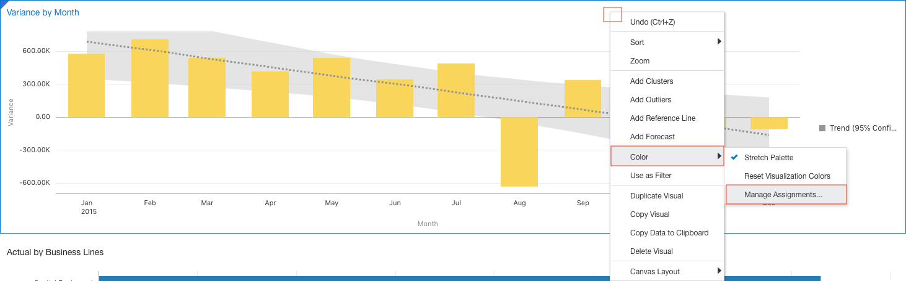

        - Select **Variance** then select **Red** and select **OK**.

        

- **4) Create a Pivot table view of variance percentage.**
    - Steps:
        - Copy the **Actual by Business Lines** visualization and paste it so that it appears on the bottom right corner of the **Canvas**.
        - Change it to a **Pivot** table.
        - Drag the left-edge to make it wider.
        - Add **Budget.**
        - Create a calculation called Var % using the following **Expression:** (Variance / Budget) * -100
        - Add the calculation to the **Pivot** table.

        

        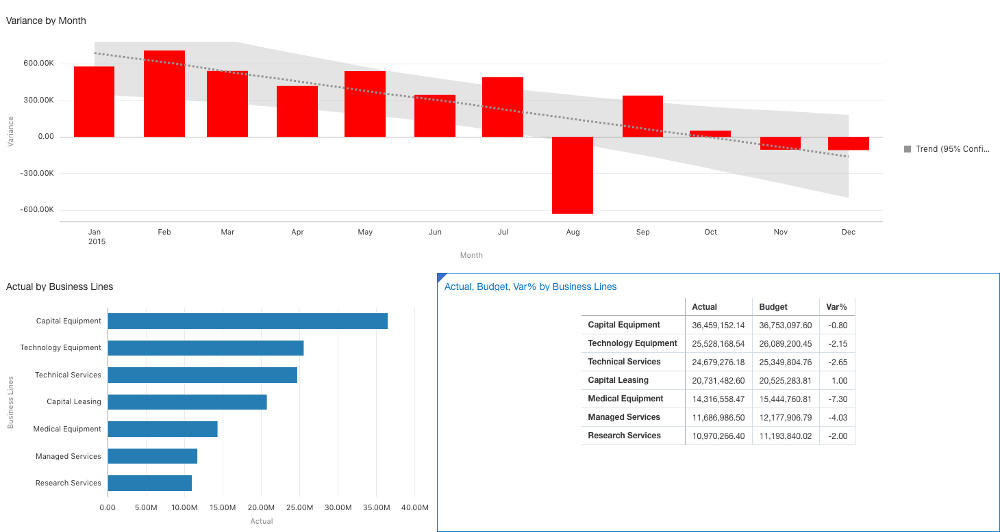

- **5) Create a Tree Map visualization of Actuals, Business Lines, and Variance %. Create an Insight, and Save the Project.**     
    - Steps:
        - Select **Business Lines**, **Actual**, and **Var %**.
        - Select **Pick Visualization** and choose **Treemap**.
        - Move the visualization so that it appears in the upper right corner of canvas.

        -  - It looks like variance is trending down but remember variance in this case refers to Budget less Actuals so this means budgets are being overshot more regularly so this is something that needs investigating!

        - **Save** your project (**My Folder** is a good place). Name it **Spend Analysis**.

        

- **6) Drill into Capital Equipment figures as they seem to make up the largest amount of spend so hopefully they are staying on track in terms of budgets.**  
    - Steps:
        - Return to the **Visualize** tab.
        - Delete the **Variance by Mont** visualization and the **Actual by Business Lines, Var %** visualization.

        - Now we want to apply a filter to the **Actual by Business Lines** visualization. Select it first. Then **right click** on the bar representing **Capital Equipment** and then choose **Keep Selected** (this is a fast way to add a filter).

        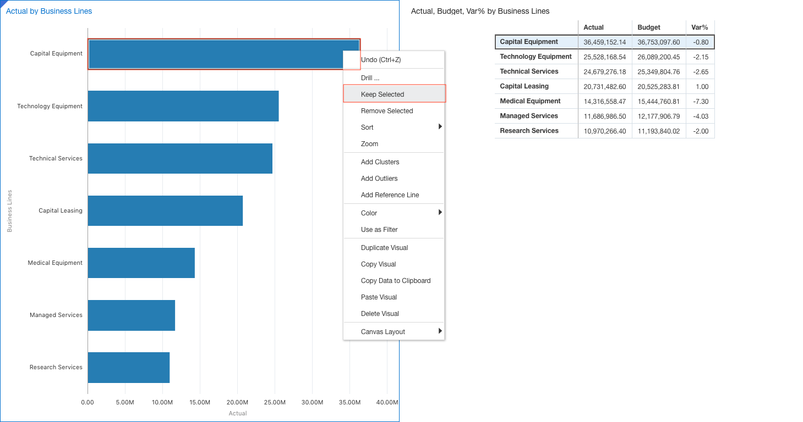

- **7) Adjust the visualizations and add an Insight and Save.**  
    - Steps:
        - On the **Actual by Business Lines** visualization, replace **Business Lines** with **Account Group**. 

        - Move **Account Group** to the **Color** property.

        - On the **Actual**, **Budget**, **Var % by Business Lines** visualization, add **Account Group** directly below **Business Lines** (hint: in the **Rows** property).

        - Add an **Insight** with the **Description**:

        - **Contract Services Spend is worrying!**

        -  - We may want to talk to **Contract Services** because they already have a sizeable budget and are exceeding it by a decent amount.

        - **Save.**

        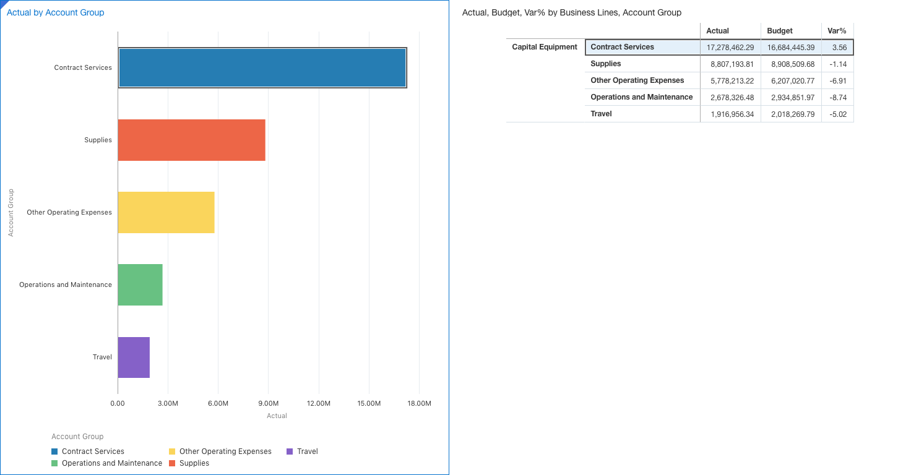

- **8) Drill into Contract Services spending.**  
    - Steps:
        - Go to the **Visualize** tab.
        - Remove the filter for **Business Lines** (hint: right-click on the filter and select **Delete**).
        - Add an **Account Group**filter select **Contract Services**.
        - Remove **Account Group** from **Pivot** table visualization.
        - On the **Pivot** table visualization, sort **Actual** from **High to Low** (hint: click on the up/down arrows that appear just to the right of the **Actual** column heading).
        - On the **Actual by Account Group** visualization, in the **Color** property replace **Account Group** with **Business Lines**.
        - Sort **Business Lines** by **Actual High to Low**.
        - Select the **Narrate** tab and drag the **Spent Analysis** visualization to the **Drag a Canvas Here to Begin**.
        - In the Spent Analysis settings and check the **description** checkbox.
        - Type the following text below in the Enter Page Description here section:
        **Capital and Technology Equipment Lines have the biggest spend and spend variance for Contract Services**
        **Save** your project

        

- **9) Analyze recent variances.**
    - Steps:
        Select **Month**, **Budget**, and **Actual**.
        Select **Pick Visualization**. Choose **Bar** chart.
        Move **Actual** from the Color property to the **Y-Axis** (move it so it appears under the **Budget** attribute). Move the visualization so that it appears along the top of the canvas.

        Use your mouse to draw a box (also called a drawing a **Marquee**) around the last 5 months of data (hint: you should see a cross icon when moving your mouse across your chart and that allows you to make selections). 

        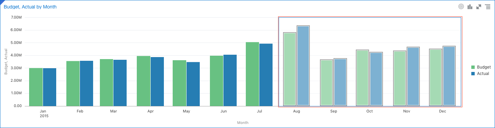

        **Right-click** and select **Keep Selected** (notice this created a filter on just the last 5 months of data).

        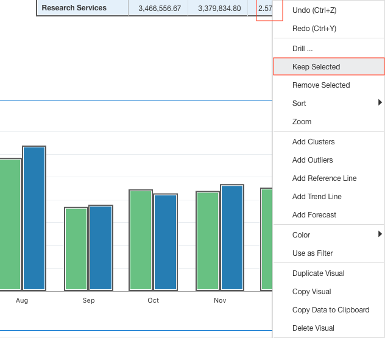

        Filter by the last 5 months 

        Let’s add one final visualization and **Insight**.

    - Steps:
        Select **Variance**.
        Select **Pick Visualization**. Choose **Tile**.
        Move the **Tile** so that it appears to the left of the **Budget**, **Actual by Month** visualization
        Resize it to make it a little less wide.
        Add an **Insight** with any description.
        **Save**.

        

        

That completes this lab and hopefully you now feel comfortable getting around DVD and working with visualizations!

##5c – DVCS 5.0 Copy/Paste/Duplicate Capabilities
DVD 4.0 has made it a lot easier to use the copy, paste, and duplicate capabilities of Data Visualization Desktop!

It’s often quicker to copy visualizations than starting from scratch. You can paste within the same canvas and between canvases in the same project. Use the duplicate option to make copies of an object within the same canvas or to duplicate the entire canvas.

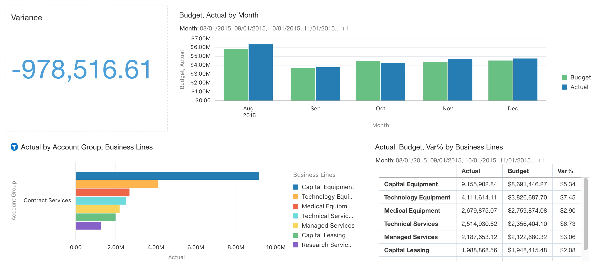

1) Right-click on the variance visual and in the dropdown menu, click on **Duplicate Visual**. Replace **variance** with **budget** measure. 

DVD copies the same visualization type and automatically assigns a different parameter to be measured in order to give you a more well-rounded view of your data.

2) Delete the Budget visual. Right click on the Variance visual again and click on **Copy Visual**.

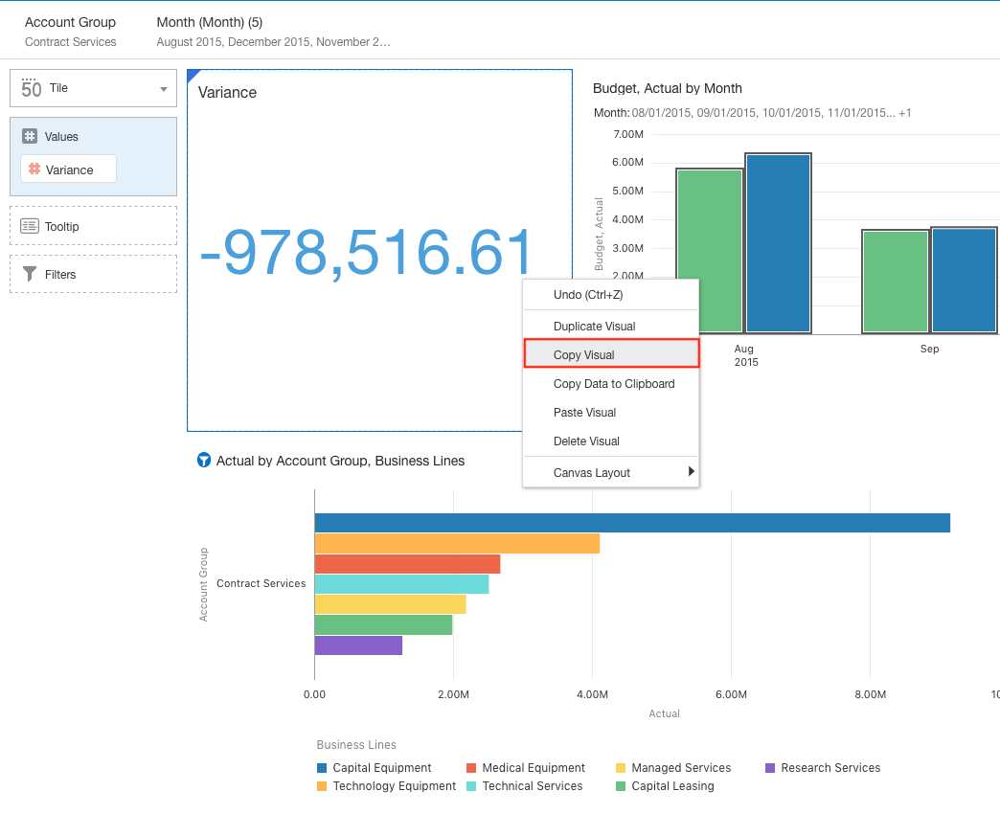

3) Right-click to the right of the Budget, Actuals by Month visualization and click on **Paste Visual**.

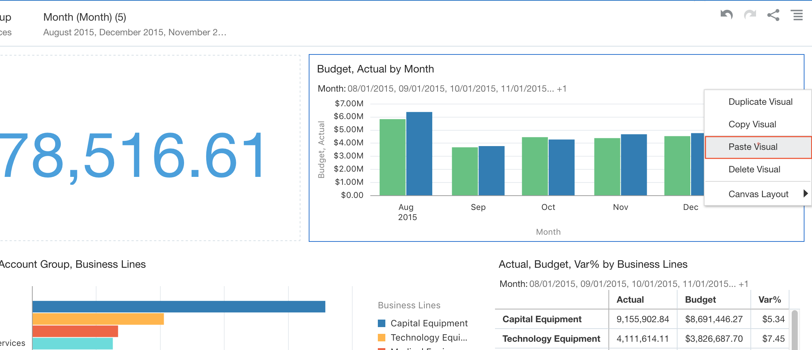

4) DVD will paste the visualization to the location you specified.

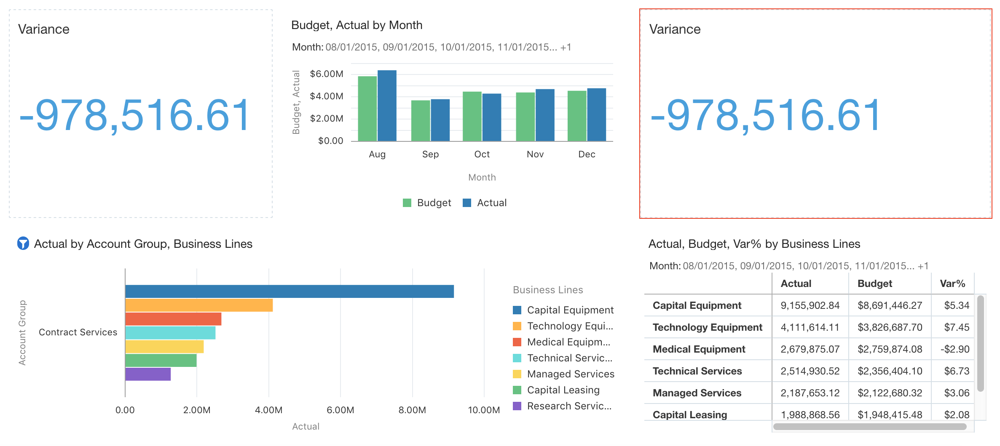

5) Delete the variance visual before going to the next step.

##5d – DVCS 5.0 Improved Sharing Abilities

DVD 4.0 also has more ways to share than in previous versions.

The share feature enables you to share a visualization, canvas, or story with others as a DV file, by email, a printed page, and on cloud. 

You can also share a project or folder only in DVA format, as a file, by email, and on cloud. 

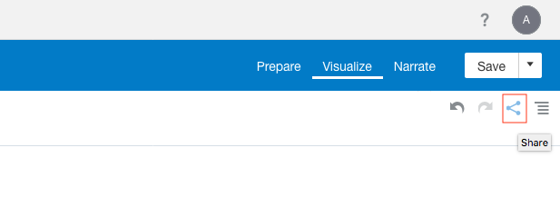

You have the option to share your visualization(s) as a file, email to a colleague, print a hard copy, or save the project to a cloud instance.

##5e – DVCS 5.0 Improved Sharing Abilities
After you begin creating insights within a story, you can cultivate the look and feel of that story. For example, you can rearrange insights, include another insight, or hide an insight title. Each project can have one story comprising multiple pages (which are called canvases).

Navigate to the Narrate Section of the UI.

1) To get started, drag the 1st canvas on the left to the bottom gray area to begin building your story.

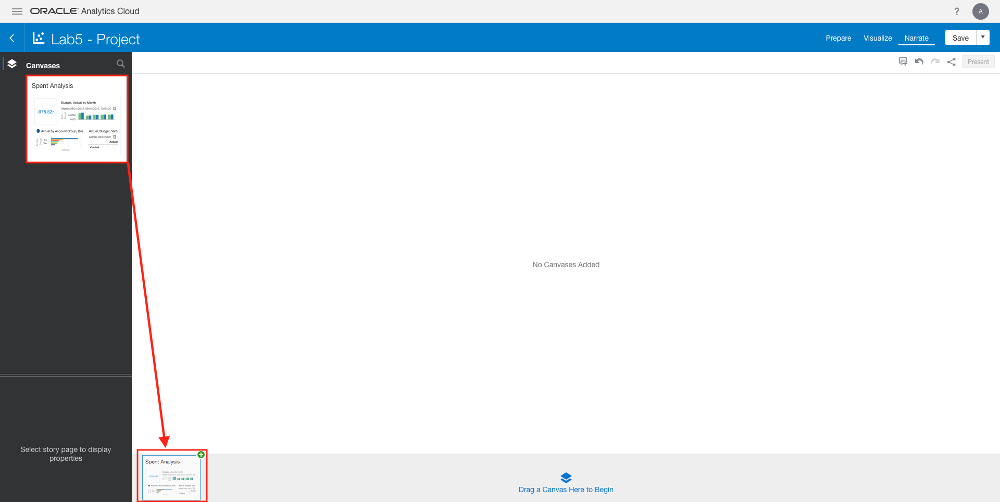

2) Click on the canvas in order to view it. Click on the Add Note button in the top right to start an annotation.

 

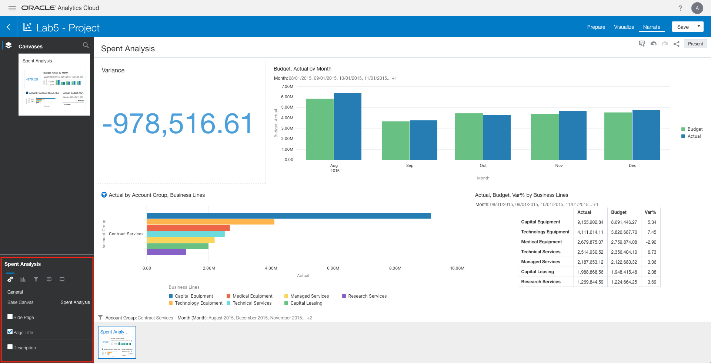

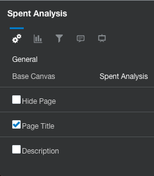  

 - **General**: This section allows you to adjust logistical parts of your storyboards/canvases. You are given the option to set the base canvas as well as hide/show the entire page, the page title, and the description.

 - **Adjustments**: This section allows you to make extra adjustments to the UI. You are given the option to set the layout and size orientation of your storyboards/canvases.

 - **Filters**: This section helps you to manage any filters you’ve applied to your canvases in a more organized manner.

 - **Notes**: This section helps you manage any notes you’ve appended to your canvases.

 - **Presentation**: This section helps you to manage the presentation of your storyboards/canvases. It includes the Story Navigator, which allows you to the style and auto hide properties of your presentation.

3)We are going to add a note to the visualization by selecting the add note icon. Aftter selecting the icon we will type the following text below: Type in **“We’re spending more than we have!”**

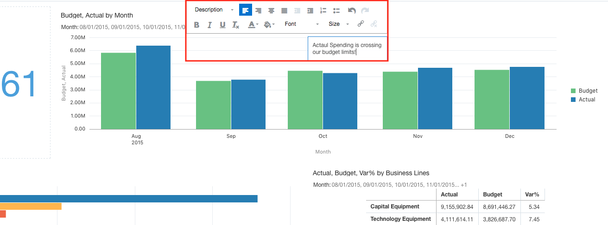

You can also choose to move the annotation around the canvas as you would like.

4) Click on Present in the top right corner.

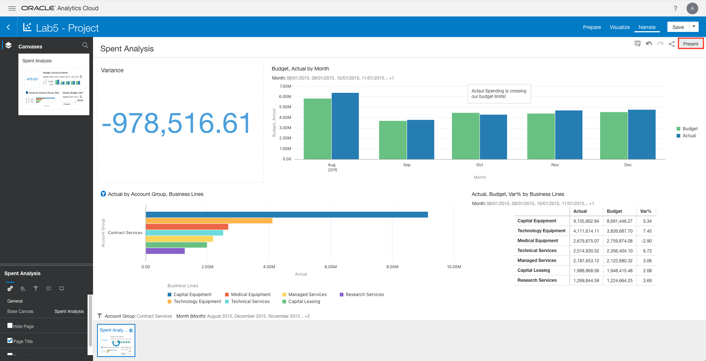

While in Present mode, you have the option to hide or show your annotations. Click on the Notes icon in the top right of the UI.

You are now familiar with how to create stories out of your visualizations in Data Visualization Clous Service 5.0!

