  
Updated: February 10, 2017

#Lab 6 – Advanced Data Visualizations (Box Plots, Clusters, Plugins)

Thus far you have learned how to manage data sources, create visualizations and convert your results into useful insights. In this next lab we will expand upon what you have learned with more advanced techniques to show even more powerful analytics capabilities and the platform’s flexibility.

-  - You must have completed all of Lab 4 or Lab 5a to complete this Lab. It would also help to have completed the rest of Lab 5 for context purposes around the data but it is not required.

##6a – Create a Box Plot and Scatter Plot Visualization in a New Project

**1) Create a Box Plot visualization of monthly variances across the organization.**

Steps:
    Create a new DVD Project.
    Use EITHER the **General Ledger Data – COMBINED** data source or **General Ledger Data Merged** data source.
    Select **Month**, **Business Lines**, and **Variance**. Select **Pick Visualization** and select **Box Plot**.
    Move **Month** to the **Item (Detail)** attribute. Move **Business Lines** to the **Category (X-Axis)**.
    
    To better understand what you are seeing, also create another visualization analyzing variances.
Steps:
    Select **Month** and **Variance**. Select **Pick Visualization** and **Bar** chart.
    Select the new visualization. Select **Business Lines** and add it to the **Filter** attribute (hint: make sure you add the filter only to the visualization and not the whole canvas).
    Select **Technical Services**.

**Save** your project (e.g. **Advanced Spend Analysis**).

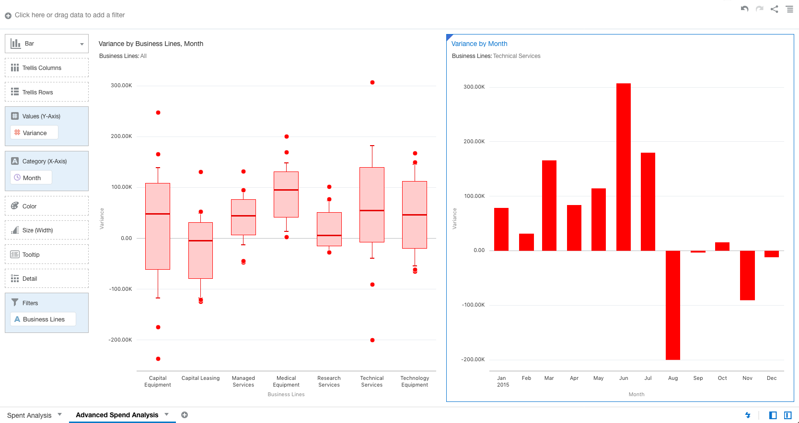

On the **Variance by Month** visualization you should see two large negatives. The one in **August** and the one in **November**. If you look at the **Variance by Business Lines** you should see those two data points appearing as dots for **Technical Services**.

You should also see a large positive in **June** on the right hand side which corresponds to the highest dot on the left.

Basically, a box plot is a way to visualize data using a statistical distribution of values (e.g. minimum, maximum, median, quartiles). By doing so we can see that even though **Technical Services** had the second largest overspend of any **Business Line** in the past year (in **August**),that was an anomaly and **Technical Services** is actually second most reliable in terms of adhering to budgets. And when the variance does get high it is usually within a comfortable range (more so than for 4 other Business Lines).

While excessive spend should be addressed it is important when analyzing data to evaluate trends as well and not just isolated incidents.

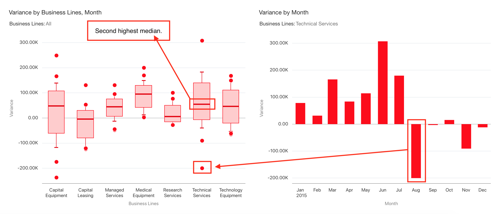

##6b – Create a Box Plot and Scatter Plot Visualization in a New Project

-  - You must have completed all of Lab 1c to complete this Lab.

**1) Create a Scatter Plot visualization of variances by month.**

**Capital Equipment** seems to have some issues in terms of exceeding budgets so let’s take a closer look at the data to see if we can identify any kind of trends.

Steps:
    Create a new **Canvas**.
    Select **Month** and **Variance**. Select **Pick Visualization** and select **Scatter (Cat.)**. 
    Add **Business Lines** to the **Filter**. Select **Capital Equipment**.

    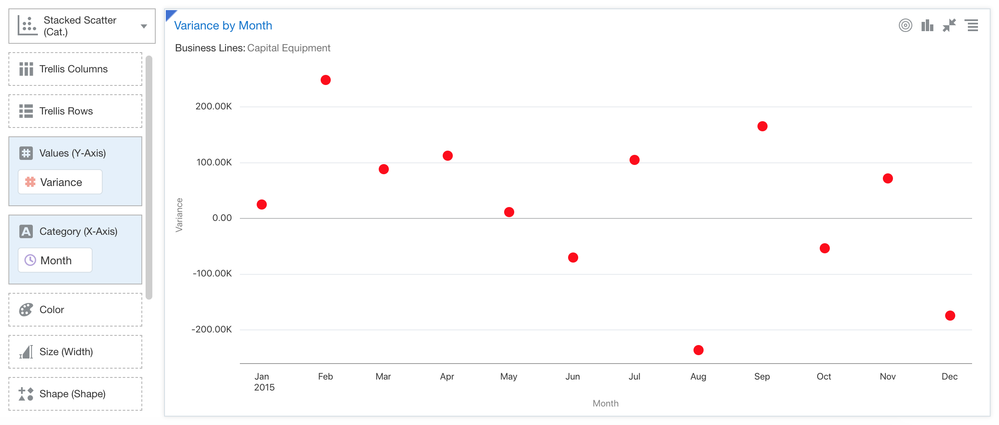

    Using the naked eye it may be hard to discern any kind of pattern here given the wide range of data. Fortunately, DVCS has tooling to help.

**2) Add a trend line with confidence level, a forecast, and outliers.**
Let’s first add a trend line:
    - Right-click in the chart and select **Trend Line** to see if the system can identify a pattern.

    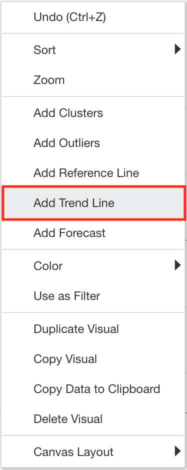

    - You should now see a line indicating the trend along with a grey area indicating possible ranges for the trend. You can navigate to the menu in the bottom right corner for more options. As you can see you can update how the trend is derived (i.e. the **Method**) as well as the **Confidence Interval** (i.e. the statistical certainty with which that trend has been determined). Given the range of data, let’s reduce the confidence.
    - Click on **95%** and select **90%** to thin out the range.

    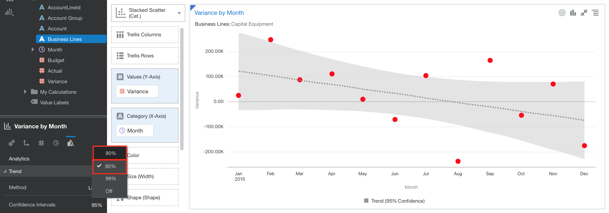

    - Let’s also ask the system to identify the true **Outliers** (values outside a statistical range which is typically based upon standard deviations from the median). **Outliers** are **NOT** values outside the trend line range but rather extremes in the data.
    - Select **Outliers** in the Project Components Menu (make sure to first select the Analytics icon). Drag it into **Color**.

    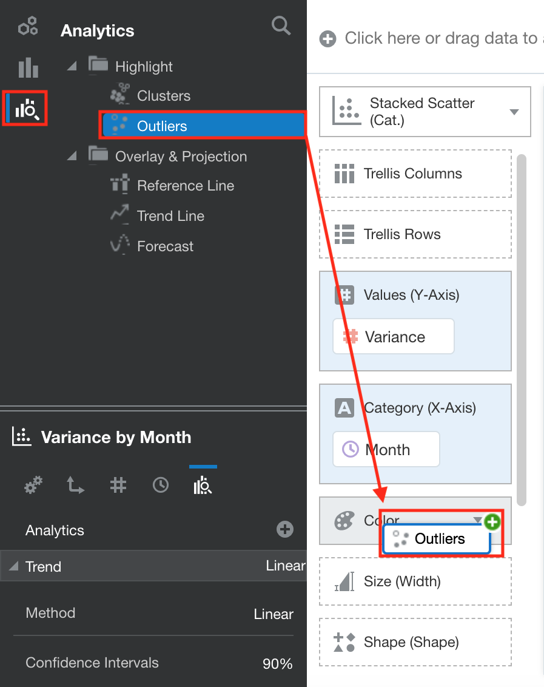

    - You will now see certain data points highlighted as **Outliers**. The variances in **February** and **August** seem to be anomalous based on these findings.
    
    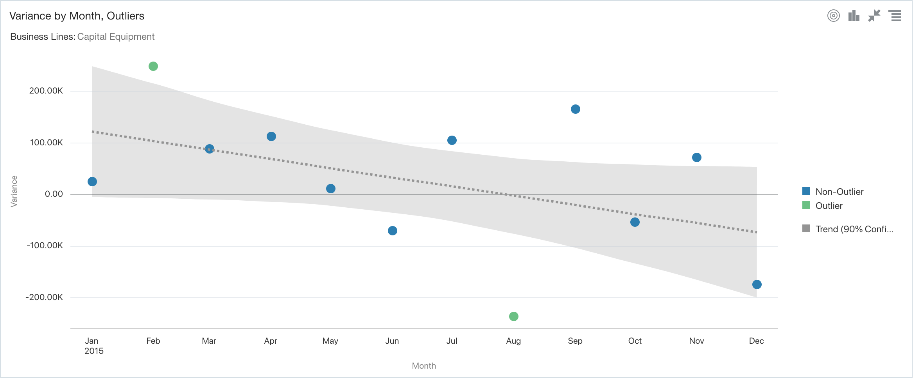

    - Let’s also quickly add a **Forecast** to see if this (worrying) trend of actuals outpacing budgets should be a cause for major concern.
    - Right click in the chart and select **Forecast** (you could also drag and drop from the **Analytics** menu we just used).(Error)

    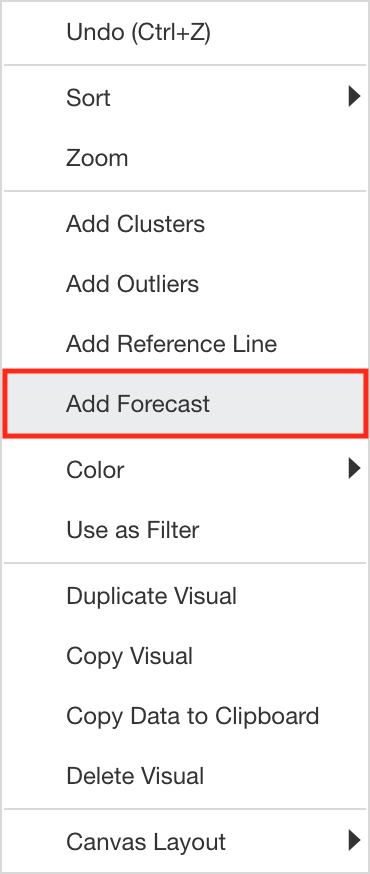

    - Navigate to the forecast settings and switch the Model from Seasonal ARIMA to ARIMA 

    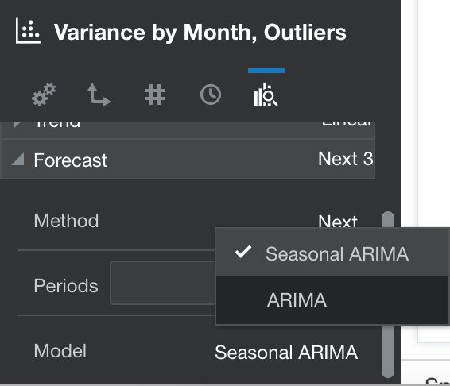

    - Based on the result set you could say that according to existing data with 90% confidence, actuals could exceed budget by as much as almost $175,000 within 3 months. That’s something certainly worth addressing!
    
    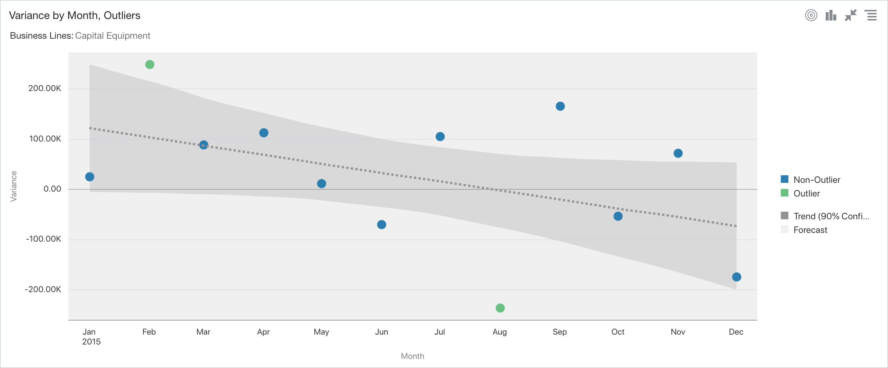

    - Rename the Canvas to **Spend Analysis Forecast**.

    Now what happens if you want to evaluate your data in a format that is not provided? Fortunately, DVD can still help! 
##6c – Upload and Use a Custom Visualization
**1) Search for and download a DVD plugin.**
    Navigate to the following URL in your browser

    https://www.oracle.com/solutions/business-analytics/data-visualization/library.html

    This is the **Oracle Analytics Library** where you can find plugins, sample projects, and map layers.

    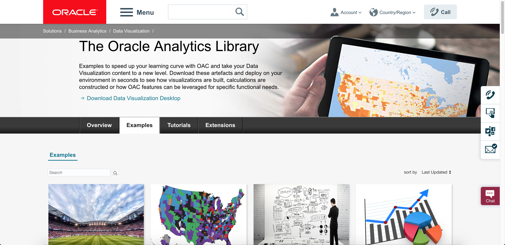

    In our example, we are going to download and use **Dial Gauges Sample Plugin** (you can scroll through the list or use the search functionality). Click on the **Extensions** tab and type **"Dial Guage"s** in the search box, and select **Download**.

    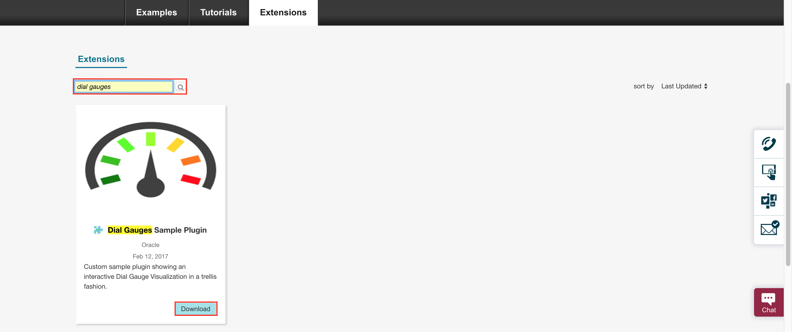

    You will be prompted to accept a license agreement and you may need to sign in to your free **Oracle Technology Network (OTN)** account (if you downloaded and installed the tool itself in Lab 1 it’s the same account).

    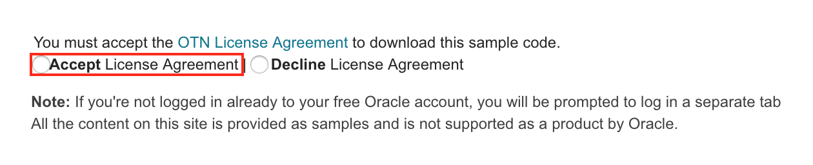

    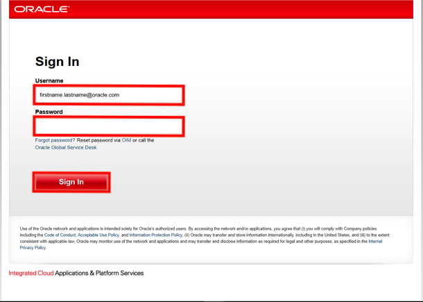

    Download the file to your machine.

    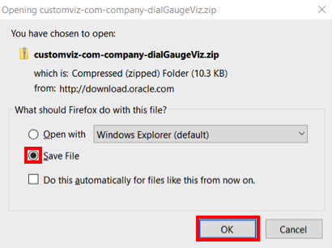
    
    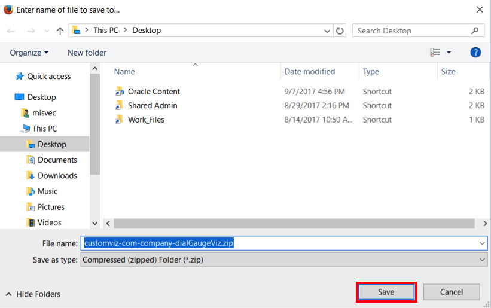

**2) Install the plugin.**
    Navigate to the **Console** menu.

    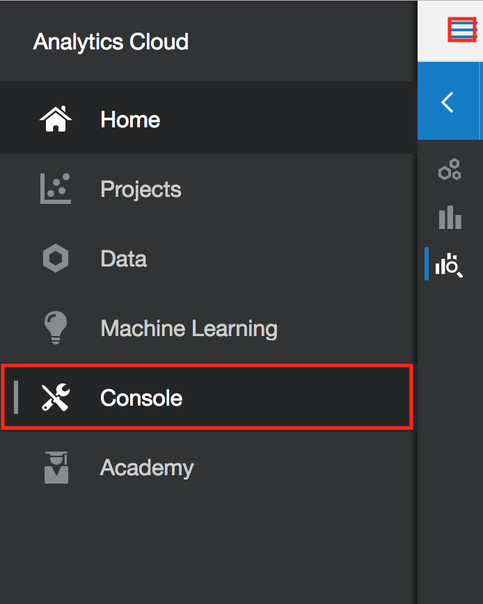

    In the **Custom Plugins** section, click on **Upload Custom Plugin**.
    
    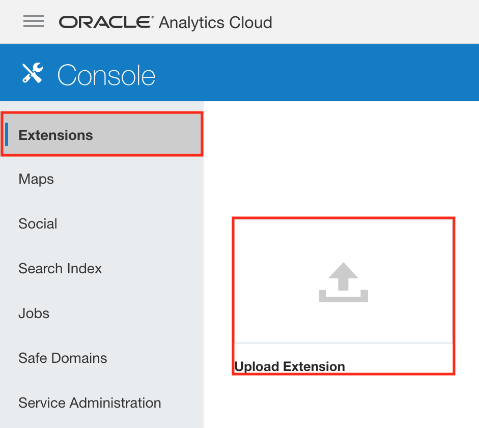
    
    You will be prompted to upload the file we downloaded in the last step. Navigate to where you saved the file, select it, and select **Open**.

    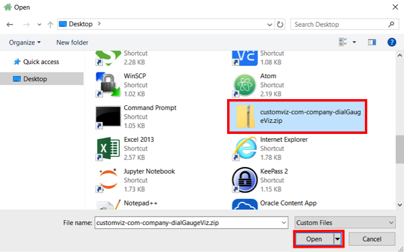

    You should also see the new plugin in the menu.
    
    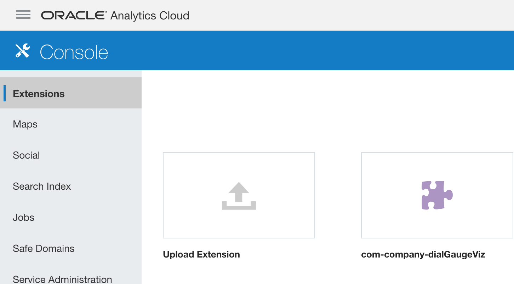

    You will see the following message. 
    
    
    Navigate back to the project for the next step. 
    
    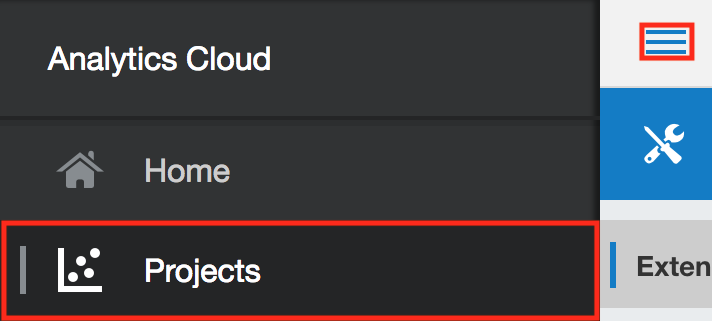
    
**3) Create a visualization using the plugin.**
    Then open the **Project** you were using in the prior sections of this Lab (e.g. **Advanced Spend Analysis**).

    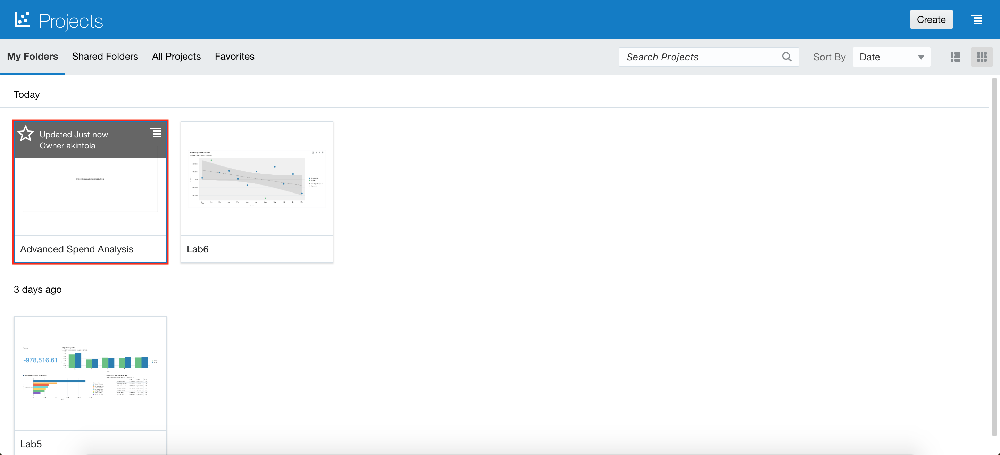

    Create a new **Canvas** using the menu at the bottom of the screeen. 
    
    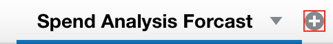 

    Create a calculation to show actauls as a percent of budget. 

    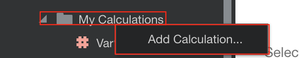

    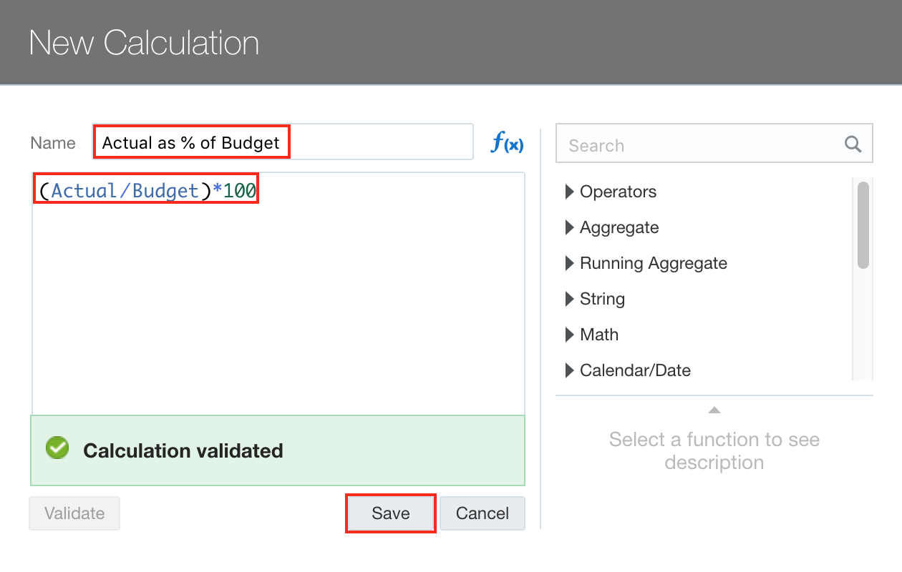

    Select **Business Lines** and **Actuals as % of Budget**. **Right click** and select **Pick Visualization**.
    
    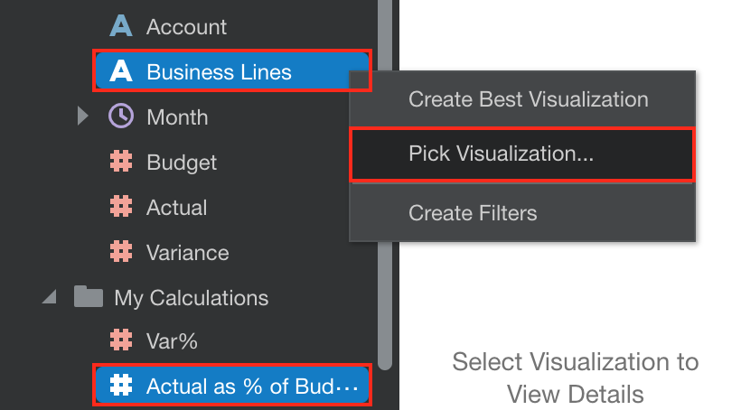
    
    Select **DialGaugeViz Plugin**.
    
    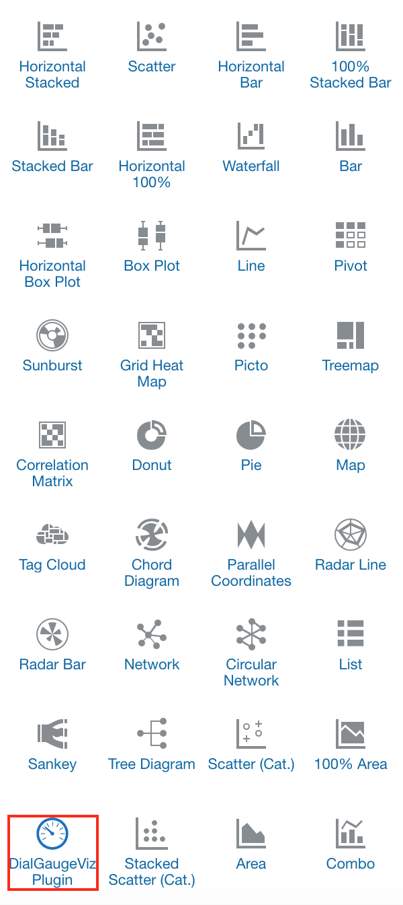
    
    Move **Business Lines** to **Trellis Columns**.
    
    PIC 
    
    Error (Not able to get the plugin to work properly in DVCS)

    Error - Let’s tweak the format so it’s easier to view and since some groups may exceed 100%. **Right click** the visualization and select **Properties**.
    PIC 
    Error - Enter **110** for the **Gauge Max Value**. Select **Alta** next to **Gauge Style** and select **Antique**. Click outside the menu to exit it.
    
    Error - PIC
    We now have a nice new visualization using a plugin! It is also worth noting the platform includes a Software Development Kit (SDK) for developers to create new plugins so there is no limit to what you can create!
    PIC
    **Save** your project.
    There is certainly a lot more you can achieve in terms of customization and analytics but hopefully thiS lab has given you an idea of the capabilities in the platform.

