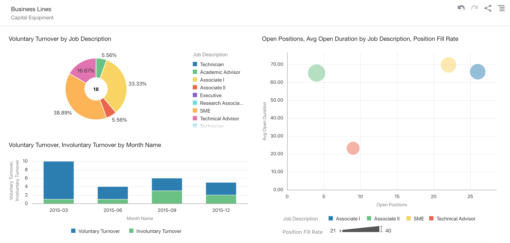
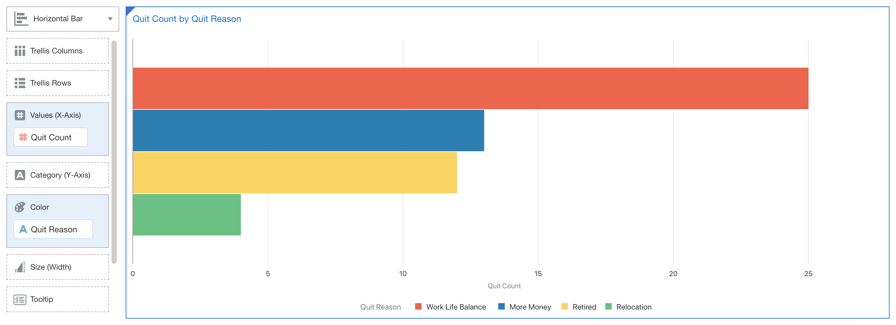
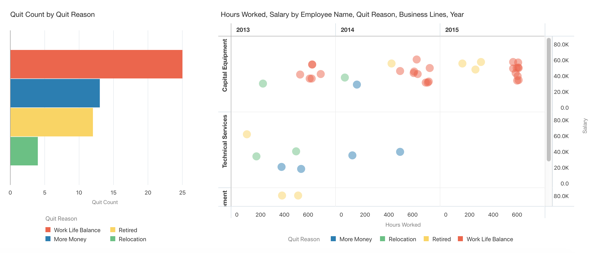
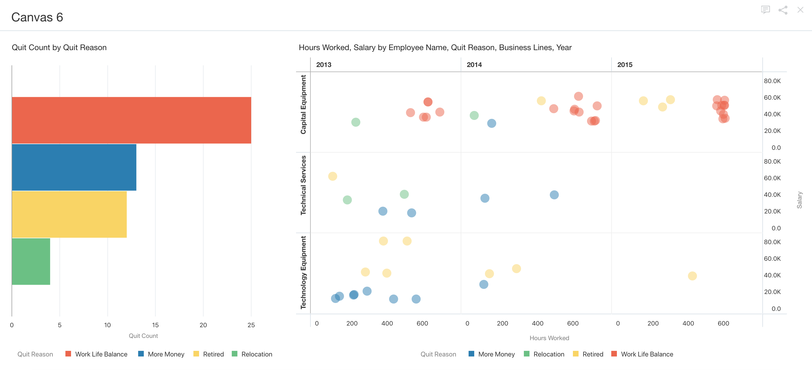

# Lab 7 – Explore HCM Data
In this last lab, you will continue to be challenged to apply what you’ve learned in the previous labs. You will create visualizations and Insights involving mashing up some HCM data (attrition, job vacancies, reasons why people are leaving) with your ERP data. Feel free to ask for help if you get stuck!

You will need to have completed Lab 5 to complete this lab.

### 7a – Add Data Sources and Create Visualizations of HCM Data

1.  Create visualizations of data regarding employees who have left the company.

    Steps required:
    Open the DVD **Project** you created in Lab 5.

    Create a new file based data source using the **HCM Data - Leavers.xlsx** file.
    Preview the data and change the **Voluntary Turnover** and **Involuntary Turnover** fields to Measures. Add it to your project.

    Create a new **Canvas**.

    Clear any existing filters and add **Business Lines** to the filter area and then filter on **Capital Equipment**.

    Create a **Stacked Bar** chart of **Voluntary Turnover** and **Involuntary Turnover** by **Month Name** (Make sure that both the **Voluntary Turnover** and **Involuntary Turnover** measures are in the **Value - Y-Axis**). Change the colors (hint: **right-click**, select **Color**, and select **Reset Visualization Colors**)

    Create a **Donut** chart on the right side of **Voluntary Turnover** by **Job Description**.

    

2. Create another data source, additional visualizations, and an Insight using recruitment data.

    Steps required:

    Create a new file based data source using the **HCM Data - Recruitment.xlsx file**.
    Preview the data. Set **Aggregation** to **Average** for both **Avg Open Duration** and **Position Fill Rate**. Change **Open Positions** to a **Measure** and then **Add** the data to your project.

    Move the **Donut** chart above the **Stacked Bar** chart.

    Select **Job Description**, **Open Positions**, **Avg Open Duration**, and **Position Fill Rate**. Select Create Best Visualization.
    Move **Position Fill Rate** to **Size** and **Job Description** to **Color**.

    **Save** your project.

    

3. Add a third data source along with visualizations and Insights using attrition history data.**
    Steps required:
    Create a new file based data source using the **HCM Data - Attrition History.xslx** file.
    Preview the data. Set **Salary**, **Hours Worked**, and **Quit Count** to **Measures**. Change the **Aggregation** to **Average** for both **Salary** and **Hours Worked**.
    **Add** to your project. 
    Add a new **Canvas**. 
    Remove any **Filters.**

    Select **Quit Reason** and **Quit Count**.
    Select **Create Best Visualization**.
    Move Quit Reason to the Color property. 
    Change the visualization type to **Horizontal Bar**. 
    Sort **Quit Count High to Low**.

    

    Select **Employee Name**, **Salary**, and **Hours Worked**.
    Select **Create Best Visualization**
    Add **Quit Reason** to the **Color** property.
    Swap **Salary** and **Hours Worked** (hint: move **Salary** to **Y-Axis** and **Hours Worked** to **X-Axis**). Widen the size of the visualization.
    Add **Year** to **Trellis Columns**.
    Add **Business Lines** to **Trellis Rows**

    Add an **Insight** with following **Description**:

    **Work Life Balance is an issue for employees assigned to Capital Equipment line resulting in high attrition and excessive spending on contracted services.**

    **Save** your project.

    

    To share this with others, it is probably best to navigate to the **Narrate** tab. 

    After clicking the **Narrate** tab, drag the insight to the bottom screen, and click on present. Click on the dots or arrows to navigate between **Insights**.

    