#Lab 8 – Predicting Subscriptions - Machine Learning

##What is Machine Learning?
Machine learning at its most basic is the practice of using algorithms to parse data, learn from it, and then make a determination or prediction about something in the world. Data Visualization Desktop uses Machine Learning to make predictions using your existing data. Data Visualization also provides scripts to train data models that you then add to other sets of data to predict trends and patterns in data.

 - Please refer to the excel files in the ML Folder to successfully complete Lab 8.

### 8a Create new project and add the Koolkart Orders dataset

1. Create a new project by dragging the Koolkart Orders Excel file onto the home page.
    
    

2. Formatting data types.

    After uploading the dataset, change **Order ID** and **Customer ID** to attributes. 
    Change the **Order Amount** number format from Auto to Currency. Hit OK. 
    Once uploaded, click on the file on the home page to open the project.

    
   
### 8b Create Visualizations for Sales Analysis

1. Create Visualizations Order Amount by Date and Category.
    Steps required:
    Go to the **Visualize** tab.
    Select **Order Amount** and **Order Date** and select **Pick Visualization**. After you selecting **Pick Visuliation**, select the line chart. 

    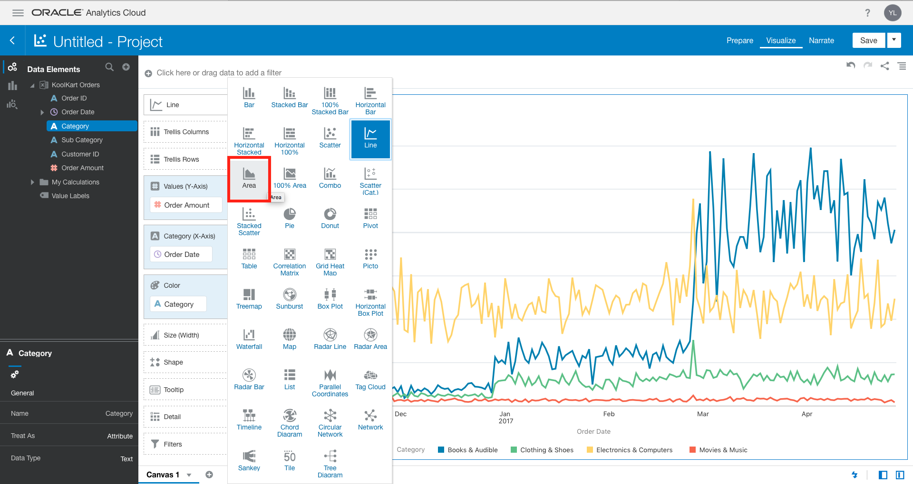

    Double click the **Category** attribute to add it to your visualization.
    Switch the chart from a line chart to an area chart.
    Select Order Date dropdown in Data Elements section. Select Month and drag to Category (X-Axis) to replace Order Date.

    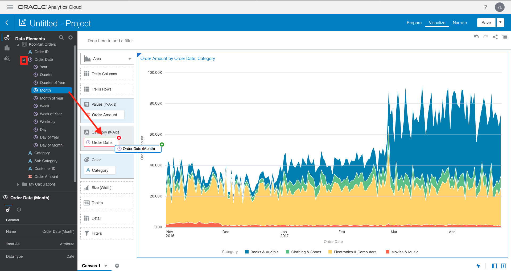
    
    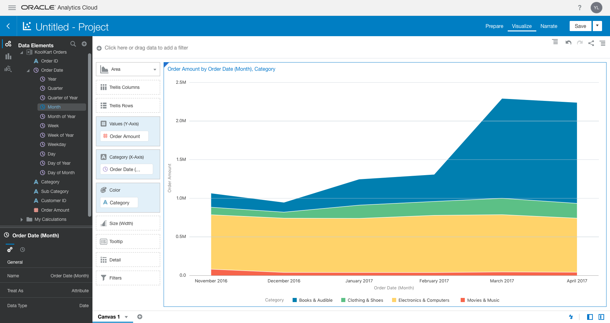

2. Create Visualization for Order Amount by Category and Sub Category.
    Steps required:
    Select **Category**, **ub Category**, and **Order Amount**. Right click attributes while selected then select **Tree Map**.

    

    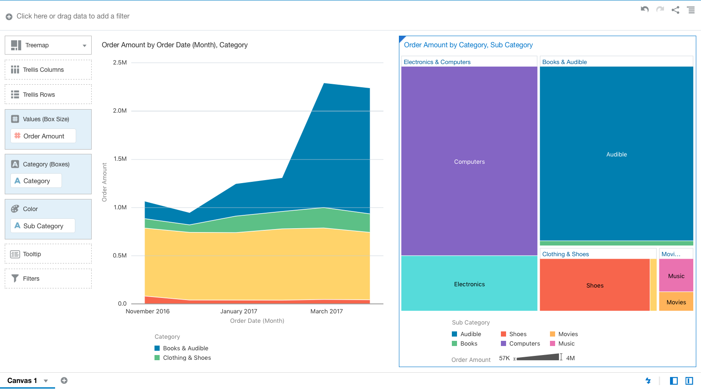

3. Create Visualization for Order Amount by Order Date.
    Select **Order Amount** and **Order Date**. Right click attributes while selected then select **Create best visualization**.

    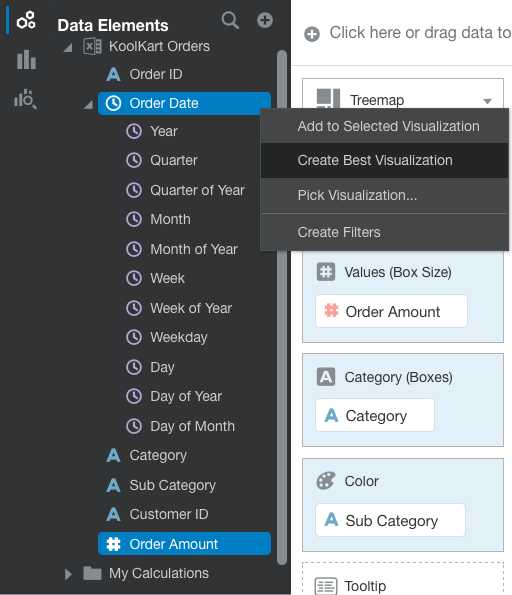

    Right Click the visualization and select Add Trend Line. 

    

    Right Click the visualization and select Add Forecast.
    
    

    Refer to the visualization settings in Project Components Menu and select the () Analytics option. Select the Forecast dropdown and enter 6 in the Period textbox to change the Model to Arima ().

    

    Change the **Prediction Interval** to **ARIMA**.

    

    You're canvas should reflect the picture below. 

    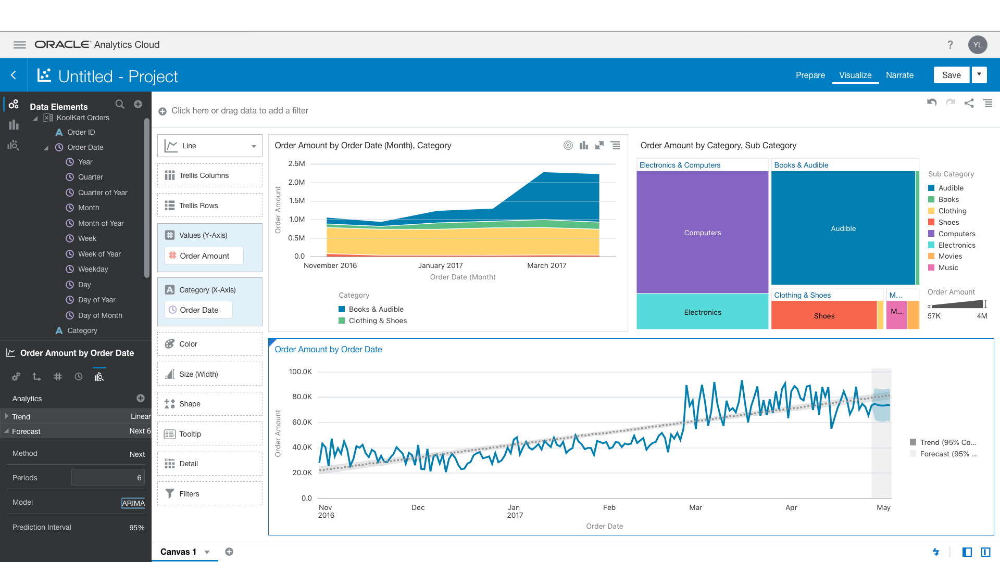

    Hover over the Canvas 1 tab with your tab and select the downward arrow.

    

    Rename the canvas to "Sales". 

    

    Save the project and name it "Machine Learning".

    

    
 
### 8c Create Visualization for Customer Analysis

1. Add another dataset and format data.

    Select the (+) next to Data Elements and select Add Data Set...

    

    Select (Create Data Set) and add the KoolKart Customers Excel File. Another way to create the data set is to drag and drop the KoolKart Customers Excel file to the data flow.

    

    **Drag** the file onto the file icon.
    Change Customer ID data type from a measure to attribute.

    

    Select Add to add the dataset

    

    Select Data Diagram and select CustomerID as the match for KoolKart Customers and KoolKart Orders. 

    

2. Create a visualization of Order Amount by Customer Age Group.

    Steps required:

    Create a new Canvas
    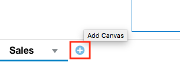

    Select **Order Amount** from Koolkart Orders and **Customer Age Group** from Koolkart Customers. While having the attributes selected, right click and select **Create best visualization**.
    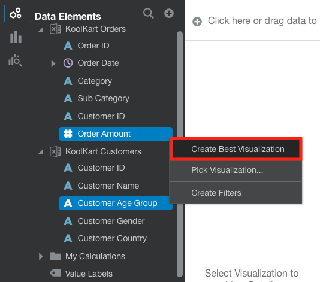

    Change chart type to a Donut chart 

    
    
    Move **Customer Age Group** to **Color**.

    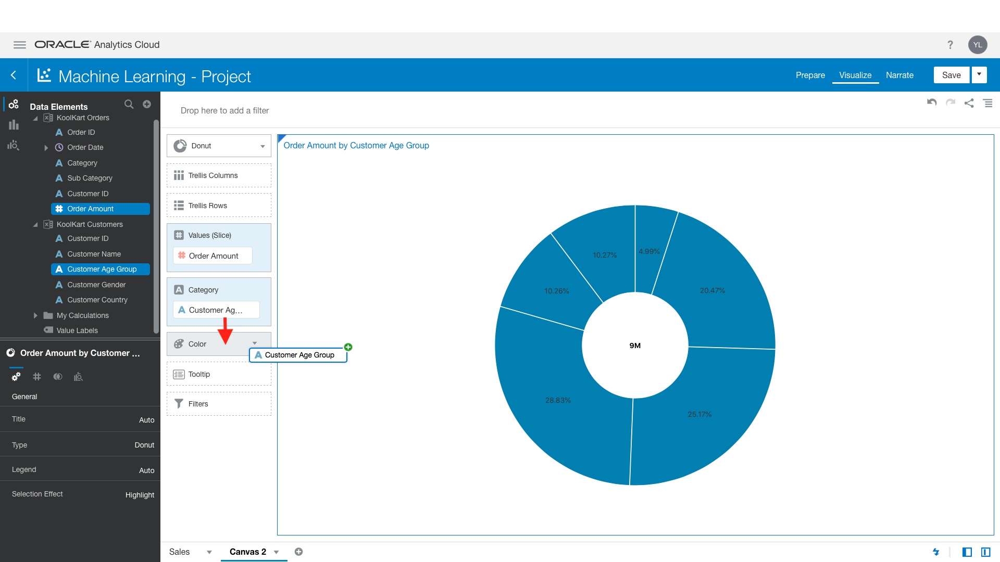

    Select **Order Amount** and **Customer Country**. While having the attributes selected, right click and select **Pick Visualization**.

    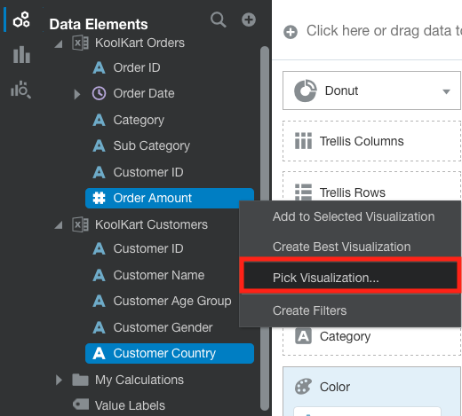

    Choose the **Map Chart**.

    

    You're canvas should reflect the picture below

   

    Select **Order Amount** and **Customer Gender**. While having the attributes selected, right click and select Pick Visualization.

   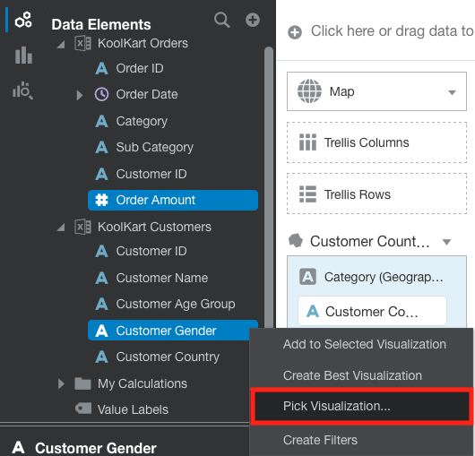

    Choose the **Pie Chart**.

   

    Right-click the **Pie Chart** and select Color > Manage Assignments. 
    
   

    Choose the color pink for F and the color royal blue for M.

   
    
    Move pie chart under the donut chart.

   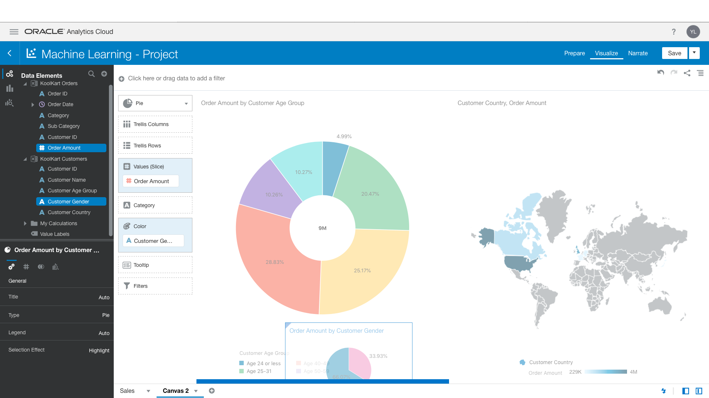
    
    Name the canvas “Customers” and save the project.
   

### 8d Using the Explain feature to create a visualization
    The Explain Feature allows you to uncover insights and patterns about a particular column within a data set.

1. Create a Data Flow and add Dataset**
    Steps required:

    Right-click the category attribute and selcted Explain Category. 
   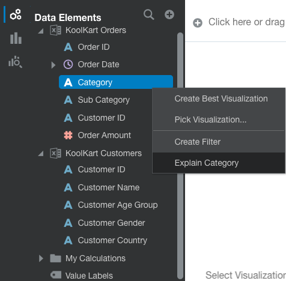

2. Look Explain Category window and observe some the basic insights. 
   
  
With using the explain feature you are presented with different insights about the Category column. Listed below is a description of what Basic Facts, Key Drivers, Segments and Anomalies entail:

Basic Facts
- Shows the basic distribution of the data element (attribute or measure) values across the data set and its breakdown against each one of the measures in the data set.

Key Drivers 
- Shows data elements (attributes or measures) that are more highly correlated to the outcome for the selected data. You will see charts showing the distribution of the selected attribute value across each of the correlated attributes values.

Segments that Explain
- Shows the segments or group in the data set, after examining all the records that can predict the value of the selected data element. You can select a particular segment or group and then continue to analyze it.

Anomalies 
- Shows the group of anomalies or unusual values in the data set that you can relate to the selected data element (attribute or measure). You can review and select particular group of anomalies.

3. Add the visualization to the the canvas using the explain feature.

    Steps required:
    Select the check on the right corner of the visual and click Add Selected
    

    If you've successfully added the visualization, your canvas should reflect the image below. 

    

    Delete the "Explain Category" Canvas by right clicking the tab and selecting Delete Canvas. 

    

### 8e Creating a Data Flow for Koolkart Orders and Customers

1. Create a Data Flow and add Dataset
    Steps required:

    Select the hamburger menu button and click on the Home button in the top right corner.

    

    Select Create > Data Flow. 

    

    Add the Koolkart Orders Dataset.

    

2.  Add the KoolKart Customer dataset and join with KoolKart Order dataset. 
    Steps required:

    Click the Add Data icon and drag it to the data flow. 
    
    

    Add the KoolKart Customers dataset by selecting KoolKart Customers and selecting Add.

    

    Click the Join and add it to the data flow. 

    

    Click on the circle to complete the join. 

    

    If you've succesfully made the join, the dataflow will reflect the image below. 

    

3. Add Filter a to Data Flow
    Steps required:
    
    Select Filter and drag between KoolKart Orders and Join.

    

    Select the + and select the category attribute. 

    

    Refer to the Selections, click the hamburger option, and select Exclude Selections.

    

4. Add Select Columns to the Data flow and exclude duplicated Customer ID

    Steps required:
    
    Select (Select Colums) and drag it to (+) on in front of Join.
    
    

    Select Customer_ID1 and click Remove Selected.

    

5. Group data into Sales Regions in data flow
    Steps required:
    Select (+) next to **Select Columns** and then select **Group**.

    

    Set the group name to **Sales Region**.
    Name the first group **NA** and add **Canada** and **USA** to the group.

    
    
    Select (+ Group) to add a second group and name it **EMEA**. Add the following countries to the group: **France**, **United Kingdom**, and **Germany**.

    Select (+ Group) to add a third group and name it APAC. Add Japan to the group.

    

    Your Data Flow should look this after you’ve successfully completed the steps.

    

    Save the Data Flow by clicking the Save button in the top corner. 

    
    
    Save the dataflow and name is "ML Dataflow".

    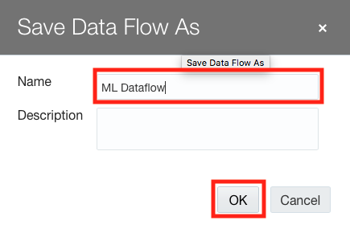

### 8f Creating a Dataflow and Predicting Subscriptions

![](images/UserStory.png - When customers purchase from Koolkart website they are offered the opportunity to subscribe to the KoolKart mailing list.

Some customers have purchased some products through a partner and in the shipping confirmation email KoolKart would like to include an incentive to subscribe to KoolKart mailing list, in the form of a discount coupon.

The marketing department just doesn’t know how big the incentive should be. They would like to predict the likeliness of new customers to subscribe and directly correlate the amount of the coupon to how much they are likely to subscribe anyway.

They want to take advantage of existing data gathered by looking at subscription patterns on Koolkart website and develop a model that looks at past subscription data to determine the influence of Customer Age Group, Customer Gender, Customer Country and purchased Product Category into the likeliness to subscribe.

1. Create a Data Flow and add Dataset**
    Steps required:

    Click the hamburger button and select Home.

    

    Select Create and Data Flow.  
    
    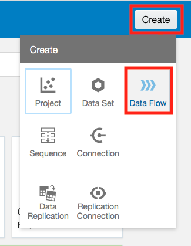
    
    Select "Create Data Set"

    

    Select "Drop data file here or click to browse" and selct the KoolKart Subsciption dataset 

    

    Select "Add" to add the KoolKart Subscription dataset. 

    

    Select Train Binary Classifier and select Naïve Bayes for Classification.

2. Add a Binary Classifier to the Data Flow**
    Steps required:
    Select (Train Multi Classifier) and drag it to the (+) in front of the KoolKart Subscription.

    

    When the “Select Train Two-Classification Model Script” window loads there will be multiple scripts that you can choose from.
    Select the Naïve Bayes for Classification script.

    

    Your data flow should reflect the image below. 

    

    Set a target by clicking (Select a column) and select Subscribed.

    

    Click Save Model and name the model "Subscribed Prediction Model" 

    

    Save the Data Flow and name it "Subscribed Predictions" and select OK.
    
    

    Click Run Data Flow to excute the data flow. 

    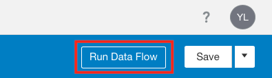

3. Create a Scenario that will predict subscription confidence.
    Steps required below:

    Open the Machine Learning project and create a new canvas

    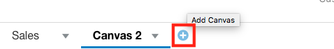
    
     Rename the canvas you created to “Subscription Prediction”. 

    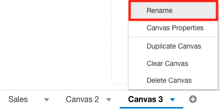
    
    Click the (+) next to the Date Elements, select the Add Data Set option.
    
    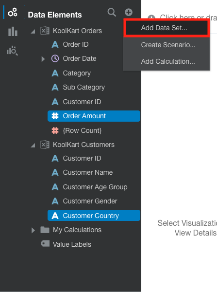

    Select the Create Data option 
    
    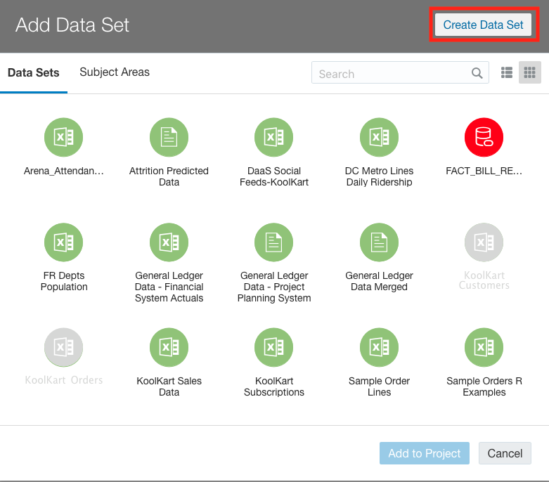

    Select the "Drop data here or click to browse" and navigate to the KoolKart Partner Sales Execl File or drag and drop the file onto the file icon. 

    

    Turn OrderID into an attibute.

    

    Click the (+) next to the Data Elements again and select the create scenario option.

    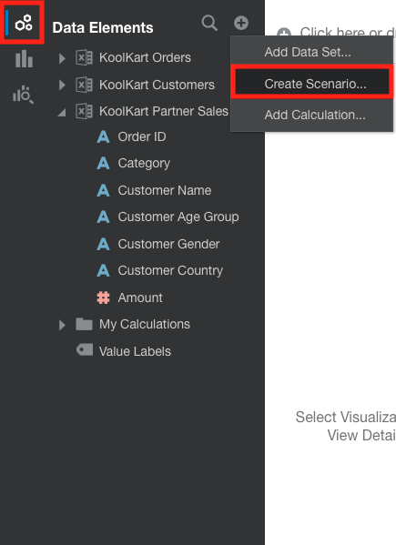
    
    Once the Create Scenario – Select Model window loads, select the Subscribed Prediction Model.

    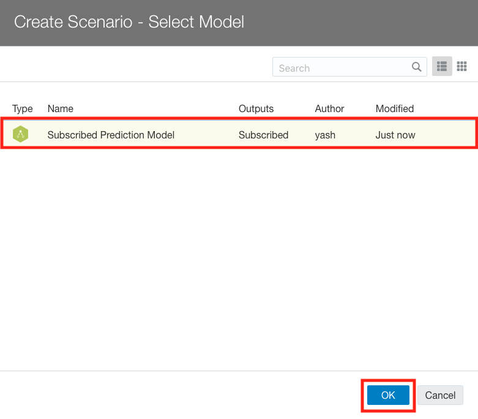

    Once the Create Scenario – Map Your Data window loads, select the KoolKart Partner Sales for the Data Set. Click on the Select Data next to the Order ID and click Order ID and do the same for Category. Select done. 

    

    Select **Customer Name** and **PredictionConfidence**. While having the attributes selected, right click,and select **Pick Visualization**. 
    
    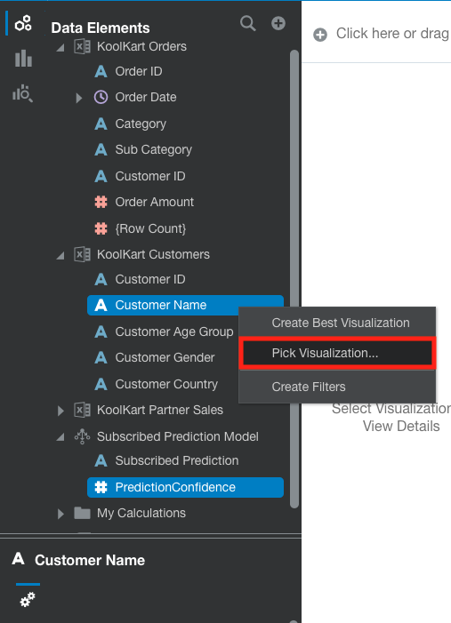

    Select **Pivot Table**.

    

    Drag the **Subscribed Prediction** to the Color. 
    
    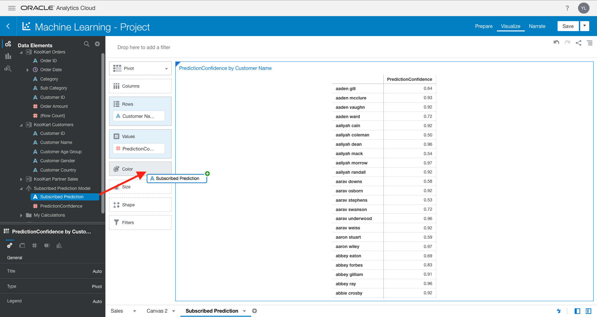

    Right click the color and the select Manage Assignments. 

    
    
    Choose the color Royal Blue for No and the color Green for Yes.

    

    If you have successfully completed the steps you will see the visualization below. From looking at the chart we can predict which customers are more likely to get a subscription.

    

Congratulations! You have completed the workshop.

In today’s workshop, we were able to quickly assess the effectiveness of your social media campaigns on sales and how sales trends correspond to social media tone/sentiment. We were also able to explore some ERP data to look at spend as well as HCM data to look at attrition, vacancies and reasons why people are leaving.

This concludes our Oracle Analytics Cloud 5 Data Visualization workshop.

For further information about Oracle Analytics Cloud Service or any of the Oracle BI products, contact your Oracle Business Intelligence Sales Rep.

