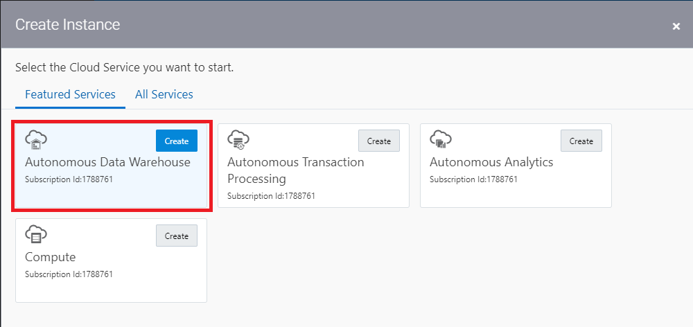
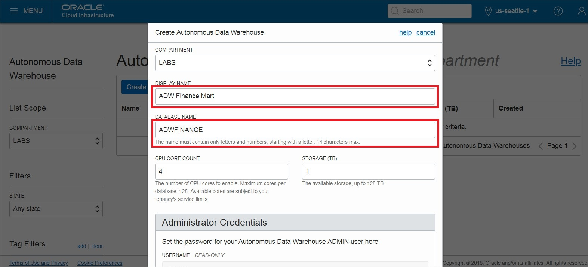
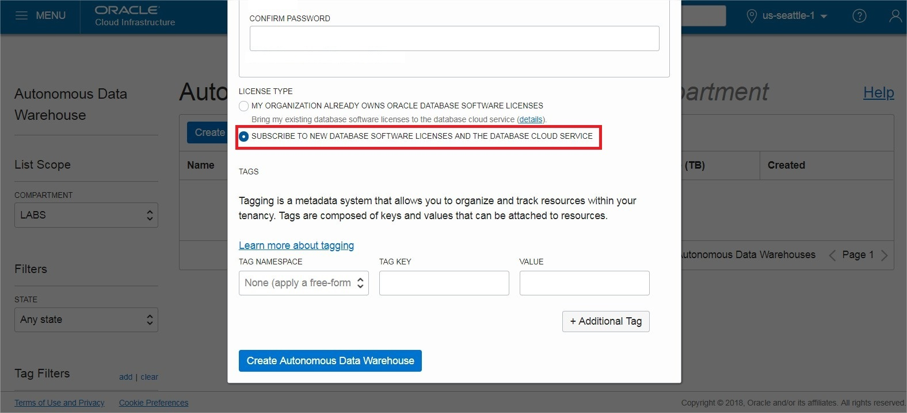
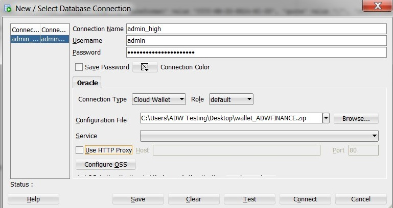

<table class="tbl-heading"><tr><td class="td-logo">

March 8, 2019
</td>
<td class="td-banner">
# Lab 1: Getting Started with Autonomous Data Warehouse (ADW)
</td></tr><table>

## Introduction

This lab walks you through the steps to get started using the Oracle Autonomous Data Warehouse (ADW) on Oracle Infrastructure Cloud (OCI). You will provision a new ADW instance and connect to the database using Oracle SQL Developer.

<a href="https://www.youtube.com/watch?v=mY1wOBqKEaw&feature=youtu.be" target="_blank">Click here to watch a video demonstration</a> of provisioning a new autonomous data warehouse.

<a href="https://apexapps.oracle.com/pls/apex/f?p=44785:112:0::::P112_CONTENT_ID:22790" target="_blank">Click here to watch a video demonstration</a> of connecting to your new Autonomous Data Warehouse using SQL Developer.

## Objectives

-   Learn how to provision a new Autonomous Data Warehouse

-   Learn how to connect to your new Autonomous Data Warehouse

## Required Artifacts

-   The following lab requires an Oracle Public Cloud account. You may use your own cloud account, a cloud account that you obtained through a trial, or a training account whose details were given to you by an Oracle instructor.

-   Oracle SQL Developer 18.3 or later (see <a href="http://www.oracle.com/technetwork/developer-tools/sql-developer/downloads/index.html" target="_blank">Oracle Technology Network download site</a>)
    Please use SQL Developer version 18.3 or later as this version contains enhancements for key Autonomous Data Warehouse features, including using ADW behind a VPN or Firewall.

    *Note:* If you are a Windows user on 64-bit platform, download the 'Windows 64-bit with JDK 8 included' distribution as it includes both Java 8 and the Java Cryptography Extension (JCE) files necessary to run SQL Developer and connect to your Autonomous Data Warehouse.
    If you are a non-Windows user, download and install the appropriate [Java 8 JDK](http://www.oracle.com/technetwork/java/javase/downloads/jdk8-downloads-2133151.html) for your Operating System. Download and extract the [Java Cryptography Encryption Archive](http://www.oracle.com/technetwork/java/javase/downloads/jce8-download-2133166.html) to the directory as indicated in the README.txt.

# Part 1. Provisioning an ADW Instance

In this section you will be provisioning an ADW instance using the cloud console.

#### **STEP 1: Sign in to Oracle Cloud**

-   Go to [cloud.oracle.com](https://cloud.oracle.com), click **Sign In** to sign in with your Oracle Cloud account.

-   Enter your **Cloud Account Name** and click **My Services**.

-   Enter your Oracle Cloud **username** and **password**, and click **Sign In**.

#### **STEP 2: Create an ADW Instance**

-   Once you are logged in, you are taken to the cloud services dashboard where you can see all the services available to you. Click **Create Instance**.

*Note:* You may also access your Autonomous Data Warehouse service via the pull out menu on the top left of the page, or by using Customize Dashboard to add the service to your dashboard.

- Click **Create** on the Autonomous Data Warehouse tile. If it does not appear in your Featured Services, click on All Services and find it there.

- Select the root compartment, or another compartment of your choice where you will create your new ADW instance. If you want to create a new Compartment or learn more, click <a href="https://docs.cloud.oracle.com/iaas/Content/Identity/Tasks/managingcompartments.htm#three" target="_blank">here</a>.
*Note* - Avoid the use of the ManagedCompartmentforPaaS compartment as this is an Oracle default used for Oracle Platform Services.

-  Click on **Create Autonomous Data Warehouse** button to start the instance creation process.

-  This will bring up the Create Autonomous Data Warehouse screen where you will specify the configurations of the instance. Select the root compartment, or another compartment of your choice.

-  Specify a memorable display name for the instance. Also specify your database's name, for this lab use ADWFINANCE.

-  Next, select the number of CPUs and storage size. Here, we use 4 CPUs and 1 TB of storage.

-  Then, specify an ADMIN password for the instance, and a confirmation of it. Make a note of this password.

-  For this lab, we will select Subscribe To A New Database License. If your organization owns Oracle Database licenses already, you may bring those license to your cloud service.

-  Make sure everything is filled out correctly, then proceed to click on **Create Autonomous Data Warehouse**.

-  Your instance will begin provisioning. Once the state goes from Provisioning to Available, click on your display name to see its details.

-  You now have created your first Autonomous Data Warehouse instance. Have a look at your instance's details here including its name, database version, CPU count and storage size.

# Part 2. Connecting to ADW

## Downloading the Connection Wallet

As ADW only accepts secure connections to the database, you need to download a wallet file containing your credentials first. The wallet can be downloaded either from the instance's details page, or from the ADW service console.

#### **STEP 4: Download the Connection Wallet**

-   In your database's instance details page, click **DB Connection**.

-   Under Download a Connection Wallet, click **Download**.

-   Specify a password of your choice for the wallet. You will need this password when connecting to the database via SQL Developer later, and is also used as the JKS keystore password for JDBC applications that use JKS for security. Click **Download** to download the wallet file to your client machine.
*Note: If you are prevented from downloading your Connection Wallet, it may be due to your browser's pop-blocker. Please disable it or create an exception for Oracle Cloud domains.*

## Connecting to the database using SQL Developer

Start SQL Developer and create a connection for your database using the default administrator account 'ADMIN' by following these steps.

#### **STEP 5: Connect to the database using SQL Developer**

-   Click the **New Connection** icon in the Connections toolbox on the top left of the SQL Developer homepage.

-   Fill in the connection details as below:

    -   **Connection Name:** admin_high

    -   **Username:** admin

    -   **Password:** The password you specified during provisioning your instance

    -   **Connection Type:** Cloud Wallet

    -   **Configuration File:** Enter the full path for the wallet file you downloaded before, or click the **Browse button** to point to the location of the file.

    -   **Service:** There are 3 pre-configured database services for each database. Pick **&lt;databasename&gt;_high** for this lab. For
        example, if you the database you created was named adwfinance, select adwfinance_high as the service.

*Note* : SQL Developer versions prior to 18.3 ask for a **Keystore Password.** Here, you would enter the password you specified when downloading the wallet from ADW.

-   Test your connection by clicking the **Test** button, if it succeeds save your connection information by clicking **Save**, then connect to your database by clicking the **Connect** button. An entry for the new connection appears under Connections.

-   If you are behind a VPN or Firewall and this Test fails, make sure you have <a href="https://www.oracle.com/technetwork/developer-tools/sql-developer/downloads/index.html" target="_blank">SQL Developer 18.3</a> or higher. This version and above will allow you to select the "Use HTTP Proxy Host" option for a Cloud Wallet type connection. While creating your new ADW connection here, provide your proxy's Host and Port. If you are unsure where to find this, you may look at your computer's connection settings or contact your Network Administrator.

# Part 3: Uploading Data into Autonomous Data Warehouse using SQL Developer
## Download Sample Data

#### **STEP 1: Download the Sample Data Files to Your Local Computer**

-   For this lab, you will need a handful of data files.  Click <a href="./files/files.zip" target="_blank">here</a> to download a zipfile of the sample source files for you to upload to the data warehouse. Unzip it to a directory on your local computer.

## Load data from the local file system

#### **STEP 2: Loading Data Using the Data Import Wizard in SQL Developer**

-   Click ‘**Tables**’ in your user schema object tree. Clicking the right mouse button opens the context-sensitive menu in SQL Developer; select ‘**Import Data**’:

    

-   The Data Import Wizard is started. Enter the following information:

    -   Select **Local File** as source for the data load

    -   Click the browse button and navigate to the 311_Service_Requests_v3.csv file (you extracted this file from the zip file you downloaded at the start of this lab).

After selecting the file, you can preview the data and select the appropriate file formats. You will see that the data preview is interactive and changes according to your selection.

When you are satisfied with the file content view, click **NEXT**.

-   On Step 2 of the Import Wizard, you control the import method and parameters. Leave the Import Method as Insert. Enter *Service_Requests* as your target table name, this table will be created by the import wizard. Click **NEXT**.

-   The Choose Columns screen lets you select the columns you want to import.  Leave the defaults and click **NEXT**.

-   The column definition screen allows you to set the column names and data types for your new table. You can change these if you need to. For this exercise leave them as default and click **NEXT**.

-   The final screen reflects all your choices made in the Wizard. Click **FINISH** to load the data into your newly created table *Service_Requests*. If you don't see it in your object tree under Tables, right click on Tables and hit refresh.

 

-   Repeat the same steps for the other files also.

<table>
<tr><td class="td-logo"></td>
<td class="td-banner">
## Great Work - All Done!
**You are ready to move on to the next lab. You may now close this tab.**
</td>
</tr>
<table>
