<table class="tbl-heading"><tr><td class="td-logo">

February 28, 2019
</td>
<td class="td-banner">
# Lab 4: Vizualizations on Oracle Analytics Cloud
</td></tr><table>

## Introduction

Leveraging the tight integration between Autonomous Data Warehouse, ERP and OAC we will perform what-if analysis and apply machine learning to create intuitive visualizations.

## Objectives

-   Learn how to create visualizations on Oracle Analytics Cloud

# Part 1: Add the data to Project
#### **Step 1: Create new project**
-   Click on **Create** and Select **Project** option.

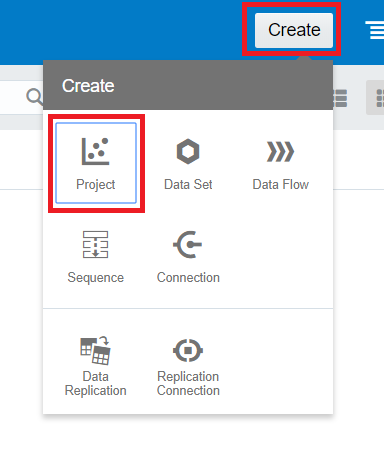

#### **Step 2: Choose the connection and select the data**

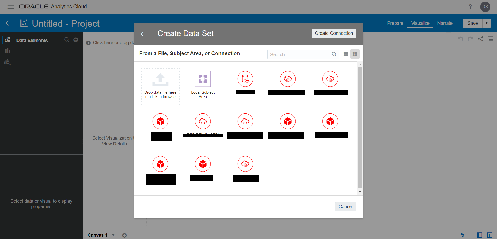

#### **Step 3: Using add data option in the project, add all the other required data**

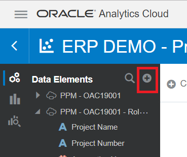

# Part 2: Creating the visualizations

#### **STEP 1: Explain Tariff Column**

-   Right click on **Tariff** and Select **Explain Tariff** option.

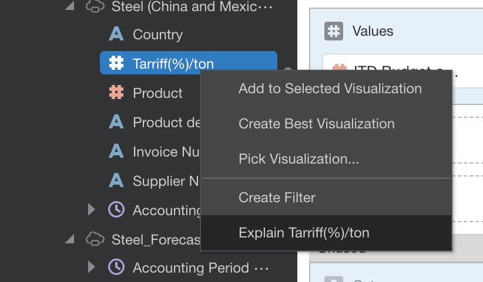

-   By using machine learning on the tariff data, OAC shows that tariffs on steel have increased recently.

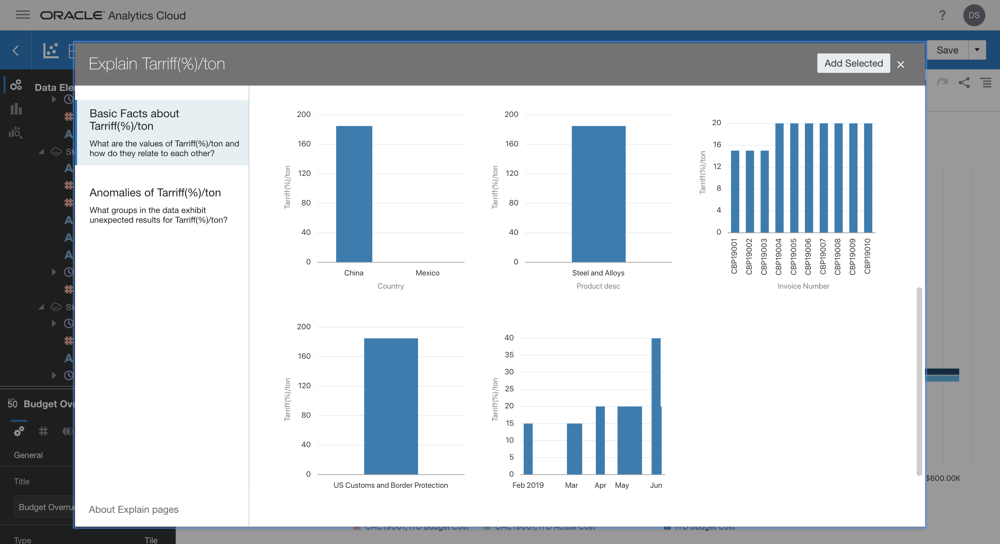

#### **STEP 2: Budget Related Visualizations**

Overall, the actual amount spent during the project has been more than the budgeted amount.
Budget Vs Actual:
- Budget Overrun(Tile): Choose ITD Budget and Actual Cost Variance 
- Budget Vs Actual Cost (Inception to date-Line graph): Choose Budget Vs Actual
- Budget Vs Actual Cost – Raw Materials (Horizontal graph): Look at how each raw material affects costs. For the steel tariff, there has been a negative variance showing that the actual amount spent is more than the budgeted amount.
Choose ITD Budget cost, ITD Actual cost, Cost Variance and pull in Raw materials.

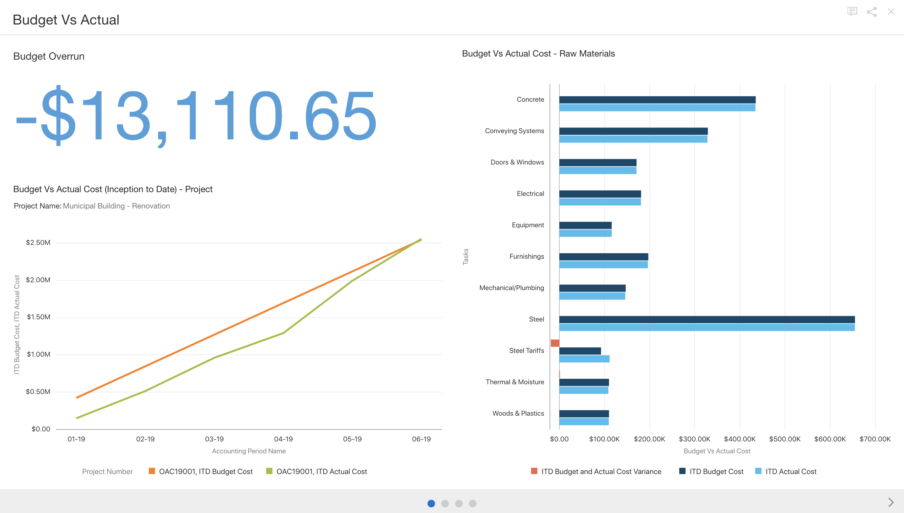

#### **STEP 3: Budget vs Actual**

-	Budget Vs Actual (Specific Period)-Horizontal Bar graph: To look more in depth on this issue apply filter on steel and steel tariff. The actual and budgeted costs for steel are about the same, whereas steel tariffs for this project have gone over budget.
-	Increase in Actual Cost (Q2) – Steel Tariffs (Bar graph): To look more specifically at steel tariffs, knowing that this is the root of the problem add Steel Tariff and specific periods in the filter. In quarter 2 the actual cost has increased from quarter 1.
-	Increase in tariff (5%)-China- Waterfall graph: Over the course of the year, within the quarters mentioned before there is an increase in tariffs by 5%.
Choose Tariff(%).

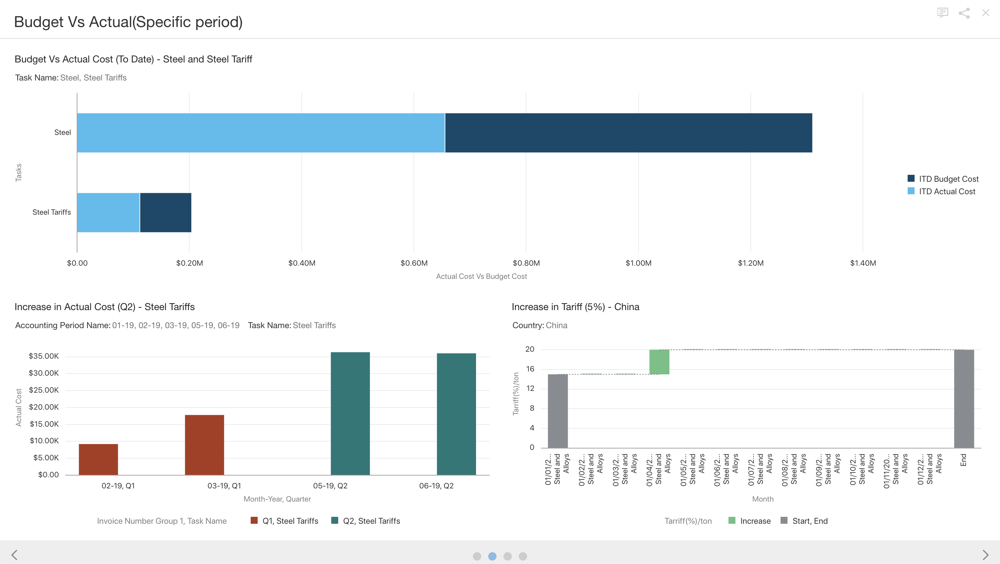

#### **STEP 4: Scatter plot**

Compare and contrast projected costs and you will find that steel will cost the least if bought from Mexico. Choose different countries and total cost of steel.
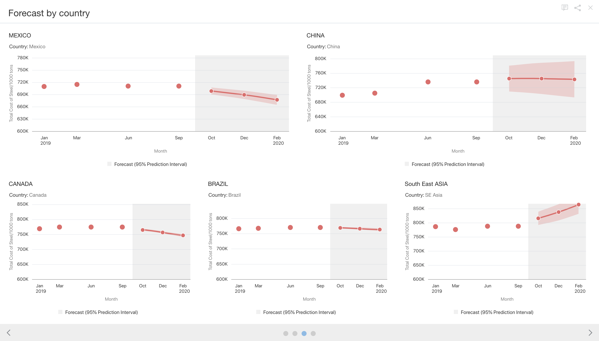

#### **STEP 5: China and Mexico (Forecast) - Line graph**

-   Use the forecast feature on Data Visulaization to see the total cost of steel in both China and Mexico. If they continue to import from China for the rest of the project, they will be well over budget. If the company were to import steel from Mexico, it will save company money overtime.

#### **STEP 6: Save the Project**

-   You can save the project and share it as a powerpoint or dva file

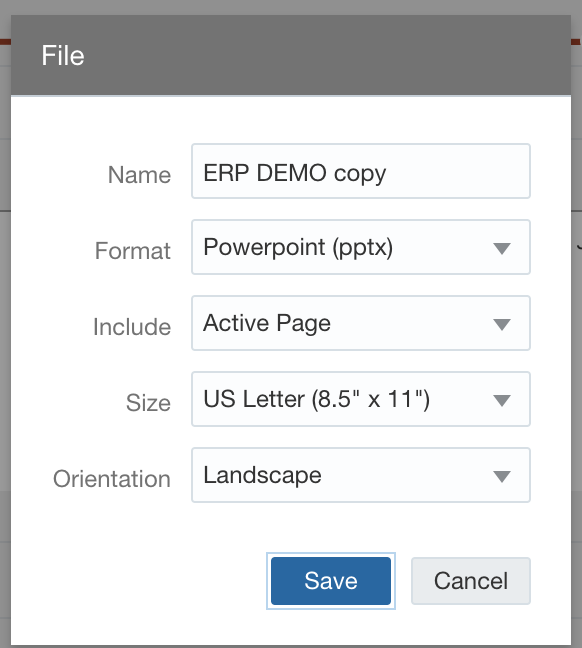

# Part 3: Oracle Day by Day

#### **STEP 1: Login to the Day-by-day Application**

-   Install the Day-by-day application from App Store or Play Store
-   Enter the Oracle Cloud Analytics URL and user credentials

#### **STEP 2: Use voice query to ask any question/data required**

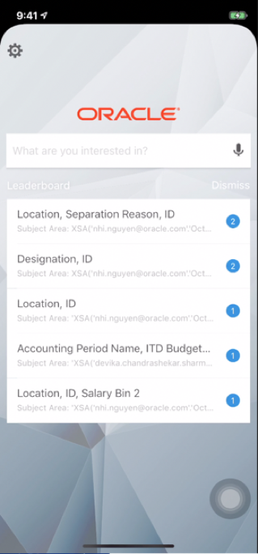

#### **STEP 4: Visualization appears on the screen**

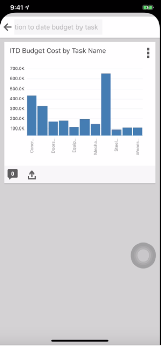

<table>
<tr><td class="td-logo"></td>
<td class="td-banner">
## Great Work - All Done!
**You are ready to move on to the next lab. You may now close this tab.**
</td>
</tr>
<table>
