## Review Cloud Services

### **STEP 1**: Login to your Oracle Cloud account and Review Services

- Open a Browser and log into [cloud.oracle.com](cloud.oracle.com):

	https://cloud.oracle.com

- Click **Sign In** in the upper right hand corner of the browser

	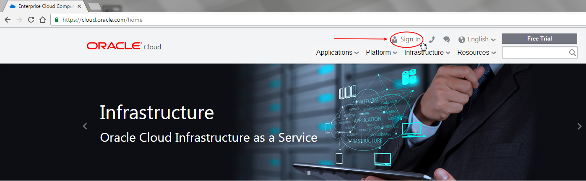

- **IMPORTANT** - Under my services, select Traditional Cloud Account from the drop down list, and the correct data center (Region) and click on **My Services**. Review your handout fields ***CS4*** for your assigned Cloud Service Region/Data Center information.

	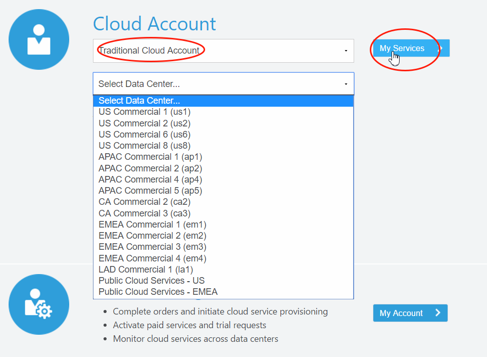

- Next enter the **identity domain** (***CS1*** in your handout) and click **Go**

	

- Once your Identity Domain is set, enter your User Name (***CS2***)and Password (***CS3***) and click **Sign In**

	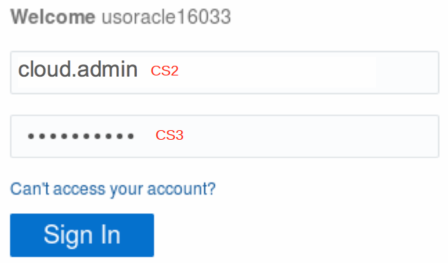

- You will be presented with a Dashboard summarizing all of your available services.  You have access to several services, but only Database and Compute are visible.  **Click** on **Customize Dashboard** to add GoldenGate to your list of visible services. 

	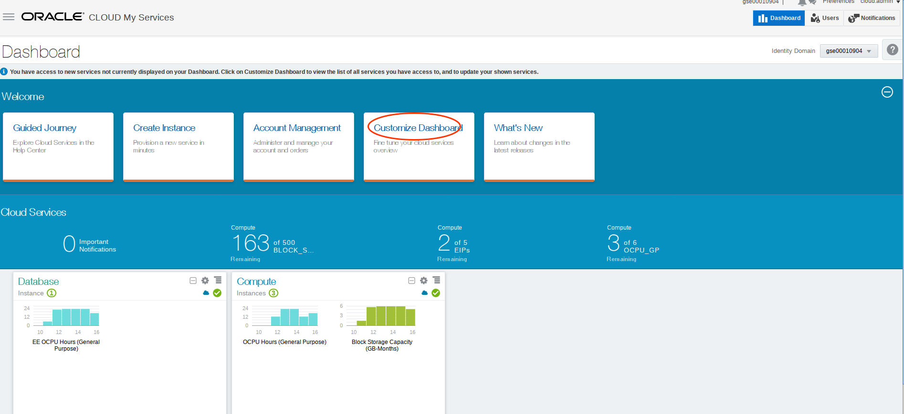

- You can then add services to the dashboard by clicking **Show**. If you do not want to see a specific service click **Hide**.

	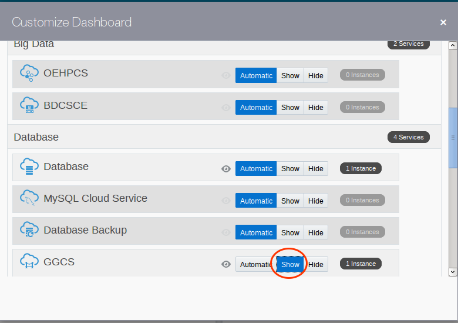

- Review services that will be used in the GGCS Labs:
	- The Compute node will serve as your on-premise 11g Database instance.  In Lab 200 Data from your 11g Database will be migrated to a target DBCS 12c pluggable Database (on-premise to Cloud).  In Lab 300 the data will flow the other way from DBCS12c back to 11g Database on-premise (Cloud to on-premise). In Lab 400 data will be replicated from one DBCS12c Pluggable Database to another (Cloud to Cloud replication).
	- The Database Service (DBCS) will be a GG target in lab 200 and a GG source in lab 300, and both a source and target in Lab 400.
	- The GoldenGate instance is not yet in your identity domain.  You will create and configure this in Labs 200 - 500.
	- You can collapse the Welcome region as we will not be using other services.

	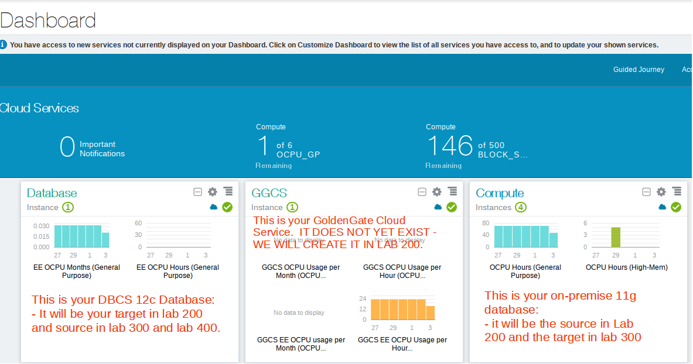

### **STEP 2**: Create a GoldenGate Enabled Database Cloud Service (note this has been done for you - this is a review step)

- Go to the Cloud Console and select the Database Cloud Service, and then open Service Console.

	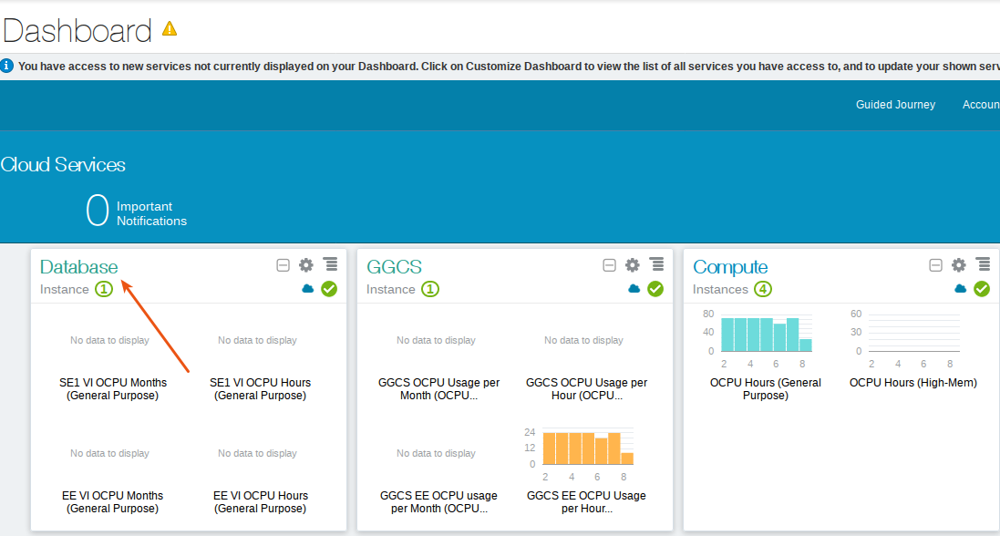

	

- Select Create Service.

	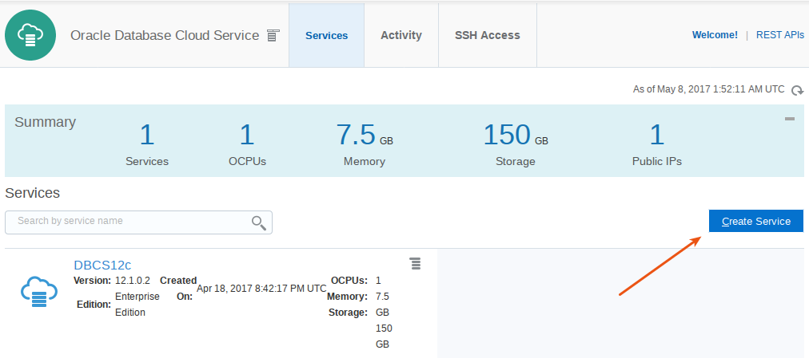

- Enter the following and hit next.

	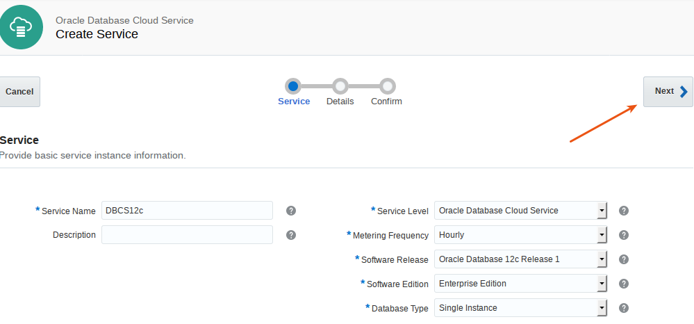

- Then enter or review the following.  Note the GoldenGate option (need to expand 'advanced').  Be sure to hit cancel.  We will ***NOT*** create a new DBCS instance.  This is just a review exercise.

	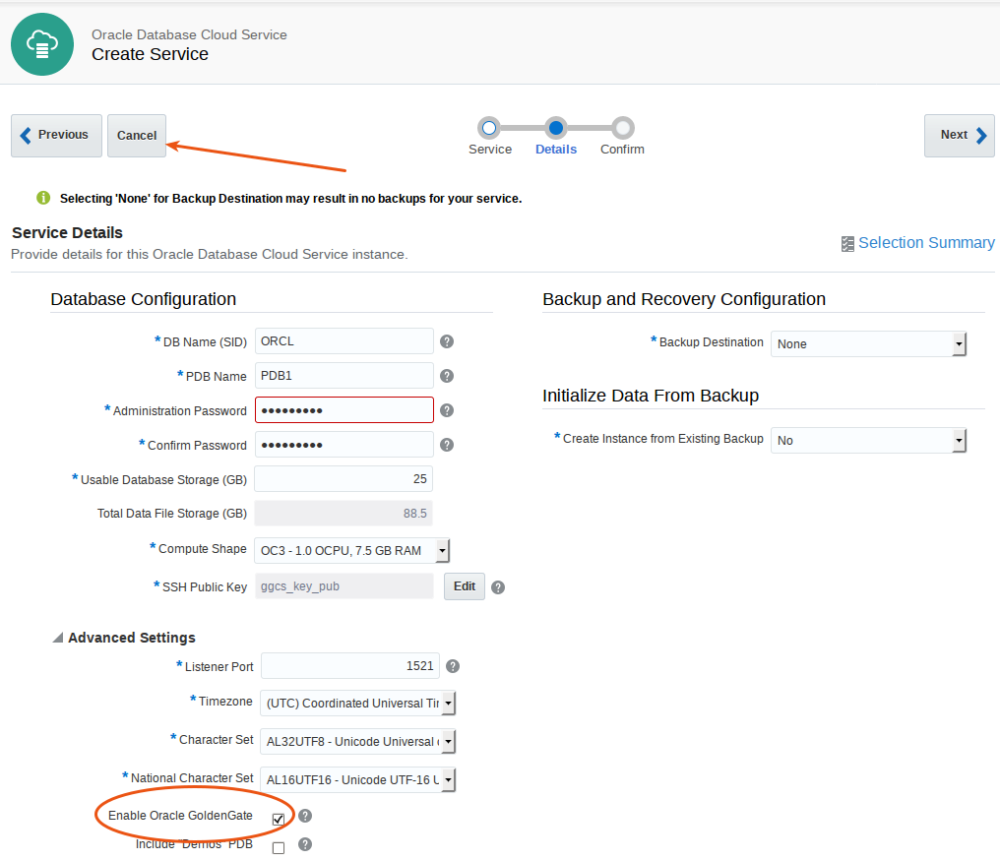

### **STEP 3**: Gather Information Required for Access to Images and GG Configuration

- Select the Database Cloud Service:

	

- Open the Service Console:

	

- Select the `DBCS12c-01` Service.  Note that each user will have their own set of services and will be assigned a number (eg DBCS12c-01, the screen shots do not show this numbered assignment):  Use the number assigned to you.

	

- Note the DBCS Public IP.  This is field ***DB1*** in your handout.  We have already collected this information for you.  Also note the Service Name (DBCS12c - you will need this when creating GGCS)

	

- Exit back out the the Cloud Dashboard:

	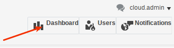

- Select the Compute Image:

	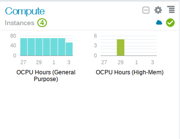

- Then open Service Console:

	

- Identity Domains will have multiple sites. Please ask you instructor which site the Client Image is running on. If needed, click the Site drop down to access the Site Selector, and choose the correct site.

	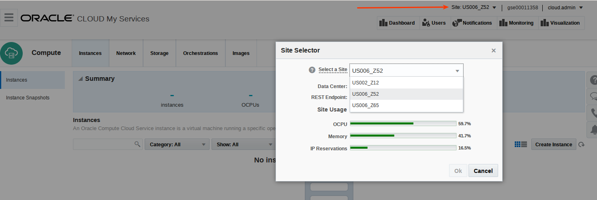

- Note the public IP of the GG_On-premise image.  This is field ***OG1*** on your handout, which we have collected for you.

	