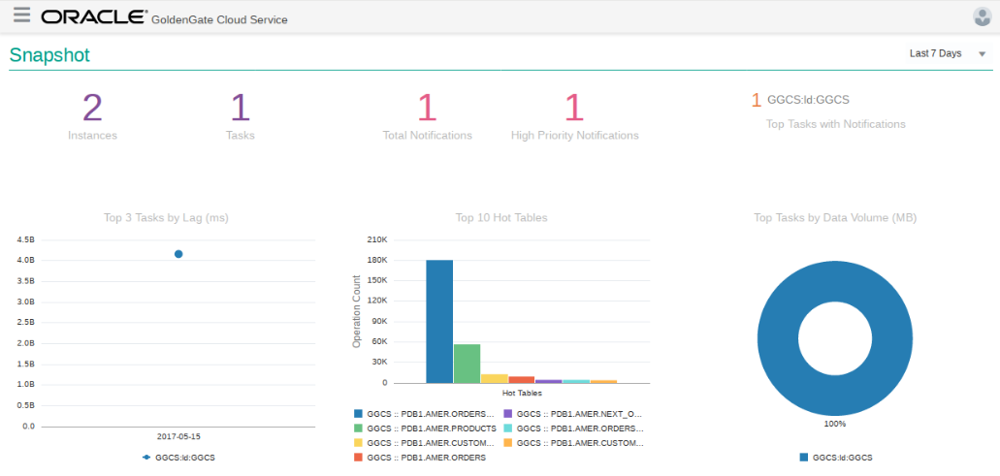

Update June 30, 2017

## Introduction

This is the first of several labs that are part of the Oracle Public Cloud GoldenGate Cloud Service workshop. These labs will give you a basic understanding of the Oracle GoldenGate Cloud Service and many of the capabilities around real time data replication and migration.  Throughout the workshop the following use cases will be covered in more detail in the following labs.  In lab 400 you will review GGCS monitoring.  Lab 500 covers the use case replication of data from a DBCS 12c Multi-tenant database (cloud) to an 11g on-premise database (optional lab).

- Lab 200: Zero downtime migration and replication of data from an on-premise 11g database to a DBCS 12c multi-tenant database use case.

	

- Lab 300: Replication and transformation of data from a DBCS 12c pluggable database to a DBCS 12c reporting data warehouse with Business Intelligence analytics access use case.

	

- Lab 400: GoldenGate Cloud Service monitoring.

	

- Lab 500 (optional): Replication of data from a DBCS 12c multi-tenant database back to an on-premise 11g database use case.

	

To log issues and view the lab guide source, go to the [github oracle](https://github.com/pcdavies/GoldenGateCloudService/issues) repository.

## Objectives

- Familiarize you with the Oracle Cloud environment and services that will be used in the following labs.
- Walk through the steps to create a GoldenGate Cloud Service that will manage data replication between on-premise and cloud environments, and manage replication between different cloud environments.

## Required Artifacts

- The following lab requires a [VNC Viewer](https://www.realvnc.com/download/viewer/) to connect to an Image running on Oracle's IaaS Compute Service.
- As noted in the readme, you will be accessing several Oracle Cloud Services throughout the labs. We have prepared a ***one-page GoldenGate Cloud Services Workshop handout*** with the required information.  You will also need to ***write down the IP address of GGCS in field GG1 of your handout after you create it*** later in Lab 100.

### **STEP 1**: Review Compute Image (On-premise OGG)

For the GoldenGate Cloud Service Workshop we will be using a compute Image that will represent your on-premises environment. In this image we have installed a 11g database that we will be migrating to our Oracle Public Cloud Database instance. The image also contains SQL Developer 4.1 that will be used to connect to both your local and cloud database.  If you do not have a VNC Viewer you can download and install from the [VNC Viewer Website](https://www.realvnc.com/download/viewer/).

- Start your vnc viewer and enter the IP address of the Compute image noted above.  ***You will be specifying port 10 (129.156.124.185:10)***.
	- **VNC Password:** ***OG2*** in your handout

	

- This is the 'On-premise' environment desktop.  All the lab material is in the `GGCS_Workshop_Material` folder on the desktop - double click on this folder and review the contents.  Note:
	- This folder has scripts to start the SSH proxy and to start and stop the GoldenGate Cloud Control Agent.
	- The keys folder:  You will use a private key to access the GGCS and DBCS instances.  You will need the IP addresses of those environments after GGCS is up.
	- The SQL Files folder:  These scripts are used in SQLDeveloper to generate transactional data, do row counts, and re-set your data if necessary for the DW.

	

- Select the File Browser off the desktop and navigate to /u01/app/oracle/product.  This location is where GoldenGate On-premise product is installed and configured.  We will review this in the next lab.  Note that Oracle Database 11g which is used in the following labs is installed in /opt/oracle.

	

- There are many directories under the GoldenGate product homes.  One particularly important directory is dirprm.  The dirprm directory will contain all of the parameter (OGG process configuration) and obey (ggsci scripts) that will be used for the workshop. There is also a cleanup directory that contain obey files to clean up the processes if a lab needs to be restarted.

	

### **STEP 2**: Create GoldenGate Cloud Service Instance

- Open a browser in your Compute desktop (VNC) either from the desktop shortcut or from the panel at the top.  Do ***NOT*** use your browser from your laptop desktop.  We will be needing to select a public key that is stored on the Compute Image.  Log into cloud.oracle.com:
	- **Enter your assigned Identity Domain and Region**: ***CS1*** and ***CS4***

 	 

- Select GoldenGate Service and then console.

 	

- Open Service Console, and then Create Service Instance.  Note first time you select GoldenGate you get a welcome page - select the 'Go to Console' link on this welcome page.  Screen shot below does not show the welcome page, but shows what you see after the first access.

 	

- Select `Create Service` Instance. 

	

- Enter Service Name `ggcsservice-ggcs-1` as the name and select Replication and Cloud Control option and then hit Next:

	

- Enter the following details.  Passwords are in your handout and are noted in the screen shot.

	

- Hit 'Next' and then create.  The instance create process will take several minutes.


### **STEP 3**: Review GGCS Instance

- A GoldenGate Cloud Service has already been created for you.  The one you created above should take about 15 minutes, but will not be used.  

- Go to the GoldenGate console to get the IP address.  Select GoldenGate.

	

- Open Service Console.

	

- Open `ggcsservice-ggcs-1`

	

- Note the public IP **this is field ***GG1*** on your handout**.  You will need this later for various configuration steps.

	

- To access GGCS we will use ssh on the OGG Compute image and log into GGCS from there.  Go to the OGG Compute Desktop, open the workshop folder, and navigate to the keys directory.  Right click inside the folder to open a terminal window.

	

- Enter the following to ssh to the GGCS instance.
	`ssh -i ggcs_key opc@<enter your ggcs IP here>` field ***GG1***

- Enter the following commands:
	- **Switch to user oracle:** `sudo su - oracle`
	- **Display the oracle home directory:** `pwd`
	- **Switch to the GG Home directory:** `cd $GGHOME
	- **Display the GG home directory:** `pwd` (/u01/app/oracle/gghome)
	- **Display the GG configuration directories:** `ls dir*`
	- **Log into ggsci (GoldenGate command shell):** `ggsci`
	- **Display status of services:** `info all`
	- **Delete the datastore:** `delete datastore` (confirm y)
	- **Start the GGCS manager:** `start mgr`
	- **Confirm manager is started:** `info all`
	- **Exit the command shell:** `exit`
	- **Switch to the network admin directory where connectivity to dbcs12c is configured:** `cd /u02/data/oci/network/admin`
	- **Display the tnsnames.ora file:** `cat tnsnames.ora`
	- Note this is where you configure GGCS sources and targets.  This has been done for you.
	- **Close the connection:** `exit` and then `exit` again

- This is sample output of the preceding commands:

```
bash-4.1$ ssh -i ggcs_key opc@140.86.38.87
[opc@ggcsservice-ggcs-1-ggcs-1 ~]$ sudo su - oracle
[oracle@ggcsservice-ggcs-1-ggcs-1 ~]$ pwd
/u01/app/oracle/tools/home/oracle
[oracle@ggcsservice-ggcs-1-ggcs-1 ~]$ cd $GGHOME
[oracle@ggcsservice-ggcs-1-ggcs-1 gghome]$ pwd
/u01/app/oracle/gghome
[oracle@ggcsservice-ggcs-1-ggcs-1 gghome]$ ls dir*
dirbdb:
datatype.db       ggrepo-MGR.bin    MGR         profile.db
__db.001          ggrepo-MGR.bin.1  mlayout.db  registry.db
__db.register     log.0000000001    mpoint.db   shmid.txt
ggrepo-GGSCI.bin  messages.db       procmap.db  status.db

dirchk:

dircrd:

dirdat:

dirdef:

dirdmp:

dirjar:

dirout:
README.txt

dirpcs:

dirprm:
ADD_AMER_EXTRACT.oby   cleanup              EXTDW.prm   PAMER.prm
ADD_AMER_REPLICAT.oby  CREDENTIALSTORE.oby  JAGENT.prm  RAMER.prm
ADD_DW_ALL.oby         EAMER.prm            MGR.prm     REPDW.prm

dirprm_bu:
ADD_EXTRACT.oby   EXTIN.prm  PUMP.prm   REPIN.prm
ADD_REPLICAT.oby  MGR.prm    REPCO.prm

dirrpt:
MGR0.rpt  MGR1.rpt  MGR2.rpt  MGR.rpt

dirsql:

dirtmp:

dirwlt:

dirwww:
image  schema  style
[oracle@ggcsservice-ggcs-1-ggcs-1 gghome]$ ggsci

Oracle GoldenGate Command Interpreter for Oracle
Version 12.2.0.1.160517 OGGCORE_12.2.0.1.0OGGBP_PLATFORMS_160711.1401_FBO
Linux, x64, 64bit (optimized), Oracle 12c on Jul 12 2016 02:21:38
Operating system character set identified as UTF-8.

Copyright (C) 1995, 2016, Oracle and/or its affiliates. All rights reserved.


GGSCI (ggcsservice-ggcs-1-ggcs-1) 1> info all

Program     Status      Group       Lag at Chkpt  Time Since Chkpt

MANAGER     STOPPED                                           
JAGENT      STOPPED                                           


GGSCI (ggcsservice-ggcs-1-ggcs-1) 2> delete datastore
Are you sure you want to delete the datastore? y

GGSCI (ggcsservice-ggcs-1-ggcs-1) 3> start mgr
Manager started.


GGSCI (ggcsservice-ggcs-1-ggcs-1) 4> info all

Program     Status      Group       Lag at Chkpt  Time Since Chkpt

MANAGER     RUNNING                                           
JAGENT      STOPPED                                           


GGSCI (ggcsservice-ggcs-1-ggcs-1) 5> exit
[oracle@ggcsservice-ggcs-1-ggcs-1 gghome]$ cd /u02/data/oci/network/admin
[oracle@ggcsservice-ggcs-1-ggcs-1 admin]$ cat tnsnames.ora
#GGCS generated file
target =
      (DESCRIPTION =
          (ADDRESS_LIST =
              (ADDRESS = (PROTOCOL = TCP)(HOST = DBCS12c-01)(PORT = 1521))
      )
      (CONNECT_DATA =
      (SERVICE_NAME = PDB1.gse00002185.oraclecloud.internal)
    )
 )

source =
      (DESCRIPTION =
          (ADDRESS_LIST =
              (ADDRESS = (PROTOCOL = TCP)(HOST = DBCS12c-01)(PORT = 1521))
      )
      (CONNECT_DATA =
      (SERVICE_NAME = ORCL.gse00002185.oraclecloud.internal)
    )
 )

dw =
      (DESCRIPTION =
          (ADDRESS_LIST =
              (ADDRESS = (PROTOCOL = TCP)(HOST = DBCS12c-01)(PORT = 1521))
      )
      (CONNECT_DATA =
      (SERVICE_NAME = PDB1.gse00002185.oraclecloud.internal)
    )
 )
[oracle@ggcsservice-ggcs-1-ggcs-1 admin]$ exit
logout
[opc@ggcsservice-ggcs-1-ggcs-1 ~]$ exit
logout
Connection to 140.86.38.87 closed.
bash-4.1$ 
```
- Note that the target entry is created automatically when the GGCS is associated with a DBCS during creations. Addition database sources and targets will need to be added manually. We have added entries representing the DBCS as a source (for Labs 300-400) and as a target for Lab 400.
