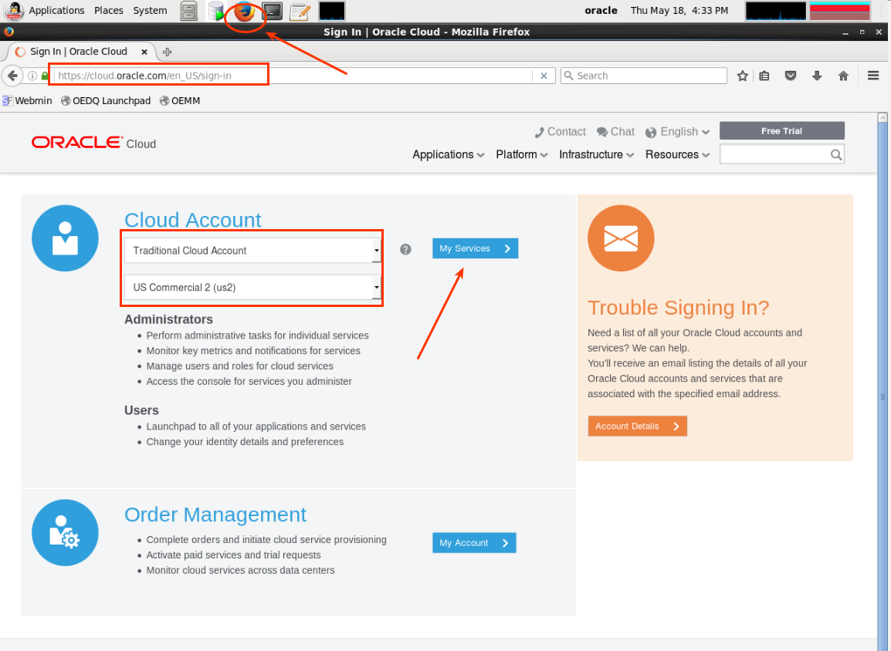
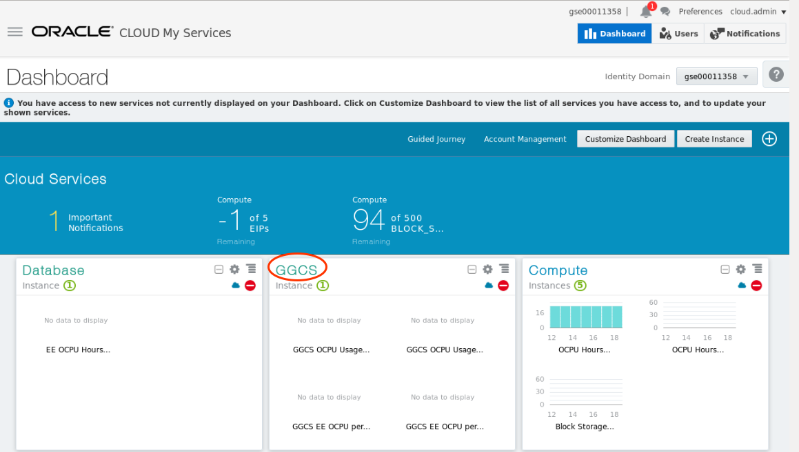
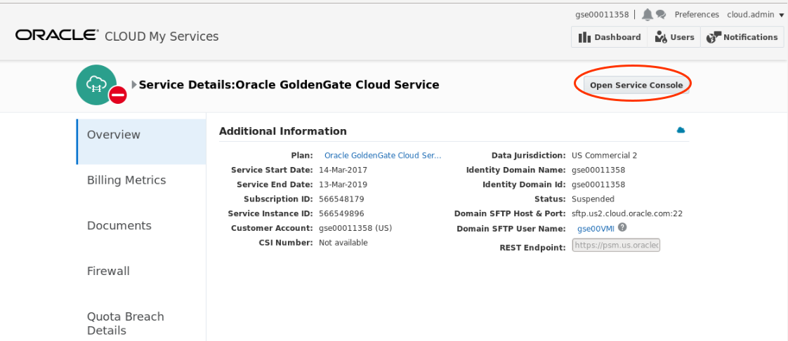

Update May 2, 2017

## Introduction

This is the first of several lab that are part of the Oracle Public Cloud GoldenGate Cloud Service workshop. These labs will give you a basic understanding of the Oracle GoldenGate Cloud Service and many of the capabilities around real time data replication and migration.  Throughout the workshop the following use cases will be covered.  These will be covered in more detail in labs 200, 300, and 400.  In lab 500 you will review GGCS monitoring.

- Lab 200: Zero downtime migration and replication of data from an on-premise 11g database to a DBCS 12c multi-tenant database:

	

- Lab 300: Replication of data from a DBCS 12c multi-tenant database back to an on-premise 11g database:

	

- Lab 400: Replication and transformation of data from a DBCS 12c pluggable database to a DBCS 12c reporting data warehouse with Business Intelligence analytics access:

	

To log issues and view the lab guide source, go to the [github oracle](https://github.com/pcdavies/GoldenGateCloudService/issues) repository.

## Objectives

- Familiarize you with the Oracle Cloud environment and services that will be used in the following labs.
- Familiarize you with an on-premise 11g Database environment that will be replicated to a DBCS 12c environment.  Note: this is set up as an image running in Oracle IAAS/compute, but process and configuration steps are the same as though the image was running outside the cloud.
- Walk through the steps to create a GoldenGate Cloud Service that will manage data replication between on-premise and cloud environments, and manage replication between different cloud environments.
- Walk you through creating a new GoldenGate enabled Database Cloud Service.
- To log issues and view the Lab Guide source, go to the [github oracle](https://github.com/pcdavies/GoldenGateCloudService/tree/master/workshops/goldengate) repository.

## Required Artifacts

- The following lab requires a [VNC Viewer](https://www.realvnc.com/download/viewer/) to connect to an Image running on Oracle's IaaS Compute Service.
- As noted in the readme, you will be accessing several Oracle Cloud Services throughout the labs. We have prepared a ***one-page GoldenGate Cloud Services Workshop handout*** with the required information.  You will also need to ***write down the IP address of GGCS in field GG1 of your handout after you create it*** later in Lab 100.

## Review Cloud Services

### **STEP 1**: Login to your Oracle Cloud account and Review Services

- Open a browser and go to the following URL:

	https://cloud.oracle.com

- Click **Sign In** in the upper right hand corner of the browser

	

- **IMPORTANT** - Under my services, select Traditional Cloud Account from the drop down list, and the correct data center (Region) and click on **My Services**. Review your handout fields ***CS4*** for your assigned Cloud Service Region/Data Center information.

	

- Next enter the **identity domain** (***CS1*** in your handout) and click **Go**

	

- Once your Identity Domain is set, enter your User Name (***CS2***)and Password (***CS3***) and click **Sign In**

	

- You will be presented with a Dashboard summarizing all of your available services.  You have access to several services, but only Database and Compute are visible.  **Click** on **Customize Dashboard** to add GoldenGate to your list of visible services. 

	

- You can then add services to the dashboard by clicking **Show**. If you do not want to see a specific service click **Hide**.

	

- Review services that will be used in the GGCS Labs:
	- The Compute node will serve as your on-premise 11g Database instance.  In Lab 200 Data from your 11g Database will be migrated to a target DBCS 12c pluggable Database (on-premise to Cloud).  In Lab 300 the data will flow the other way from DBCS12c back to 11g Database on-premise (Cloud to on-premise). In Lab 400 data will be replicated from one DBCS12c Pluggable Database to another (Cloud to Cloud replication).
	- The Database Service (DBCS) will be a GG target in lab 200 and a GG source in lab 300, and both a source and target in Lab 400.
	- The GoldenGate instance is not yet in your identity domain.  You will create and configure this in Labs 200 - 500.
	- You can collapse the Welcome region as we will not be using other services.

	

### **STEP 2**: Create a GoldenGate Enabled Database Cloud Service (note this has been done for you - this is a review step)

- Go to the Cloud Console and select the Database Cloud Service, and then open Service Console.

	

	

- Select Create Service.

	

- Enter the following and hit next.

	

- Then enter or review the following.  Note the GoldenGate option (need to expand 'advanced').  Be sure to hit cancel.  We will ***NOT*** create a new DBCS instance.  This is just a review exercise.

	

### **STEP 3**: Gather Information Required for Access to Images and GG Configuration

- Select the Database Cloud Service:

	

- Open the Service Console:

	

- Select the `DBCS12c-01` Service.  Note that each user will have their own set of services and will be assigned a number (eg DBCS12c-01, the screen shots do not show this numbered assignment):  Use the number assigned to you.

	

- Note the DBCS Public IP.  This is field ***DB1*** in your handout.  We have already collected this information for you.  Also note the Service Name (DBCS12c - you will need this when creating GGCS)

	

- Exit back out the the Cloud Dashboard:

	

- Select the Compute Image:

	

- Then open Service Console:

	

- Identity Domains will have multiple sites. Please ask you instructor which site the Client Image is running on. If needed, click the Site drop down to access the Site Selector, and choose the correct site.

	

- Note the public IP of the GG_On-premise image.  This is field ***OG1*** on your handout, which we have collected for you.

	

### **STEP 4**: Review Compute Image (On-premise OGG)

For the GoldenGate Cloud Service Workshop we will be using a compute Image that will represent your on-premises environment. In this image we have installed a 11g database that we will be migrating to our Oracle Public Cloud Database instance. The image also contains SQL Developer 4.1 that will be used to connect to both your local and cloud database.  If you do not have a VNC Viewer you can download and install from the [VNC Viewer Website](https://www.realvnc.com/download/viewer/).

- Start your vnc viewer and enter the IP address of the Compute image noted above.
	- **VNC Password:** ***OG2*** in your handout

	

- This is the 'On-premise' environment desktop.  All the lab material is in the `GGCS_Workshop_Material` folder on the desktop - double click on this folder and review the contents.  Note:
	- This folder has scripts to start the SSH proxy and to start and stop the GoldenGate Cloud Control Agent.
	- The keys folder:  You will use a private key to access the GGCS and DBCS instances.  You will need the IP addresses of those environments after GGCS is up.
	- The SQL Files folder:  These scripts are used in SQLDeveloper to generate transactional data, do row counts, and re-set your data if necessary for the DW.

	

- Double click on the SQL Developer desktop icon.  You will use SQL Developer to review data and execute SQL Scripts.  Three connections have been set up for you (highlighted).  These will need to be updated with the domain name and IP addresses of your assigned instances (On-premise 11g Database, DBCS 12c Database, and your GGCS instance).  **This will be done in Lab 200**.

	

- Select the File Browser off the desktop and navigate to /u01/app/oracle/product.  This location is where GoldenGate On-premise product is installed and configured.  We will review this in the next lab.  Note that Oracle Database 11g which is used in the following labs is installed in /opt/oracle.

	

- There are many directories under the GoldenGate product homes.  One particularly important directory is dirprm.  The dirprm directory will contain all of the parameter (OGG process configuration) and obey (ggsci scripts) that will be used for the workshop. There is also a cleanup directory that contain obey files to clean up the processes if a lab needs to be restarted.

	

### **STEP 5**: Create GoldenGate Cloud Service Instance

- Open a browser in your Compute desktop (VNC) either from the desktop shortcut or from the panel at the top.  Do **NOT** use your browser from your laptop desktop.  We will be needing to select a public key that is stored on the Compute Image.  Log into cloud.oracle.com:
	- **Enter your assigned Identity Domain and Region**: ***CS1*** and ***CS4***

 	 

- Select GoldenGate Service and then console.

 	

 	

- Open Service Console, and then Create Service Instance:

	

- Enter Service Name `ggcsservice-ggcs-1` as the name and select Replication and Cloud Control option and then hit Next:

	

- Enter the following details.  Passwords are in your handout and are noted in the screen shot.

	

- Hit 'Next' and then create.  The instance create process will take several minutes.


### **STEP 6**: Review GGCS Instance

- GolderGate Cloud Service (GGCS) create step should take about 15 minutes.  During this time your instructor will discuss Oracle Cloud topics.

- Once GGCS is available go to the GGCS console to get the IP address.  Select GGCS.  Note that at any time you can collapse the region above the services.  Then open Service Console.

	

- Open `ggcsservice-ggcs-1`

	

- Note the public IP **write this down in field ***GG1*** on your handout**.  You will need this later for various configuration steps.

	

- Next navigate to the ggcs_config folder, and update the tnsnames.ora file. 

	

- This needs to be updated with your Identity Domain information field ***CS1***.  If this is a customer account that is hosting multiple users with multiple DBCS instances (eg: DBCS12c-01...DBCS12c-02...03..) then update your DBCS instance number with that which is assigned to you.  Otherwise leave this (default is 01).
- Select `Save` when you are finished.  

	

- Next, execute a script to copy the GGCS configuration files.  Note these files exist on GGCS but need to modified for our use cases.  To simplify configuration we have done most of the setup and will transfer the configuration from our compute image to GGCS.  Now go to the `GGCS_Workshop_Material/ggcs_config` folder on the desktop and open a terminal window:

	

- Enter the following
`./copy_ggcs_config.sh <your ggcs IP address GG1>` field ***GG1*** on your handout `eg: ./copy_ggcs_config.sh 141.144.83.2`

	

- To access GGCS we will use ssh on the OGG Compute image and log into GGCS from there.  Go to the OGG Compute Desktop, open the workshop folder, and navigate to the keys directory.  Right click inside the folder to open a terminal window.

	

- Enter the following to ssh to the GGCS instance.
	`ssh -i ggcs_key opc@<enter your ggcs IP here>` field ***GG1***

- Enter the following commands:
	- **Switch to user oracle:** `sudo su - oracle`
	- **Display the oracle home directory:** `pwd`
	- **Switch to the GG Home directory:** `cd $GGHOME
	- **Display the GG home directory:** `pwd` (/u01/app/oracle/gghome)
	- **Display the GG configuration directories:** `ls dir*`
	- **Log into ggsci (GoldenGate command shell):** `ggsci`
	- **Display status of services:** `info all`
	- **Delete the datastore:** `delete datastore` (confirm y)
	- **Start the GGCS manager:** `start mgr`
	- **Confirm manager is started:** `info all`
	- **Exit the command shell:** `exit`
	- **Switch to the network admin directory where connectivity to dbcs12c is configured:** `cd /u02/data/oci/network/admin`
	- **Display the tnsnames.ora file:** `cat tnsnames.ora`
	- **Close the connection:** `exit` and then `exit` again

- This is sample output of the preceding commands:

```
bash-4.1$ ssh -i ggcs_key opc@140.86.38.87
[opc@ggcsservice-ggcs-1-ggcs-1 ~]$ sudo su - oracle
[oracle@ggcsservice-ggcs-1-ggcs-1 ~]$ pwd
/u01/app/oracle/tools/home/oracle
[oracle@ggcsservice-ggcs-1-ggcs-1 ~]$ cd $GGHOME
[oracle@ggcsservice-ggcs-1-ggcs-1 gghome]$ pwd
/u01/app/oracle/gghome
[oracle@ggcsservice-ggcs-1-ggcs-1 gghome]$ ls dir*
dirbdb:
datatype.db       ggrepo-MGR.bin    MGR         profile.db
__db.001          ggrepo-MGR.bin.1  mlayout.db  registry.db
__db.register     log.0000000001    mpoint.db   shmid.txt
ggrepo-GGSCI.bin  messages.db       procmap.db  status.db

dirchk:

dircrd:

dirdat:

dirdef:

dirdmp:

dirjar:

dirout:
README.txt

dirpcs:

dirprm:
ADD_AMER_EXTRACT.oby   cleanup              EXTDW.prm   PAMER.prm
ADD_AMER_REPLICAT.oby  CREDENTIALSTORE.oby  JAGENT.prm  RAMER.prm
ADD_DW_ALL.oby         EAMER.prm            MGR.prm     REPDW.prm

dirprm_bu:
ADD_EXTRACT.oby   EXTIN.prm  PUMP.prm   REPIN.prm
ADD_REPLICAT.oby  MGR.prm    REPCO.prm

dirrpt:
MGR0.rpt  MGR1.rpt  MGR2.rpt  MGR.rpt

dirsql:

dirtmp:

dirwlt:

dirwww:
image  schema  style
[oracle@ggcsservice-ggcs-1-ggcs-1 gghome]$ ggsci

Oracle GoldenGate Command Interpreter for Oracle
Version 12.2.0.1.160517 OGGCORE_12.2.0.1.0OGGBP_PLATFORMS_160711.1401_FBO
Linux, x64, 64bit (optimized), Oracle 12c on Jul 12 2016 02:21:38
Operating system character set identified as UTF-8.

Copyright (C) 1995, 2016, Oracle and/or its affiliates. All rights reserved.


GGSCI (ggcsservice-ggcs-1-ggcs-1) 1> info all

Program     Status      Group       Lag at Chkpt  Time Since Chkpt

MANAGER     STOPPED                                           
JAGENT      STOPPED                                           


GGSCI (ggcsservice-ggcs-1-ggcs-1) 2> delete datastore
Are you sure you want to delete the datastore? y

GGSCI (ggcsservice-ggcs-1-ggcs-1) 3> start mgr
Manager started.


GGSCI (ggcsservice-ggcs-1-ggcs-1) 4> info all

Program     Status      Group       Lag at Chkpt  Time Since Chkpt

MANAGER     RUNNING                                           
JAGENT      STOPPED                                           


GGSCI (ggcsservice-ggcs-1-ggcs-1) 5> exit
[oracle@ggcsservice-ggcs-1-ggcs-1 gghome]$ cd /u02/data/oci/network/admin
[oracle@ggcsservice-ggcs-1-ggcs-1 admin]$ cat tnsnames.ora
#GGCS generated file
target =
      (DESCRIPTION =
          (ADDRESS_LIST =
              (ADDRESS = (PROTOCOL = TCP)(HOST = DBCS12c-01)(PORT = 1521))
      )
      (CONNECT_DATA =
      (SERVICE_NAME = PDB1.gse00002185.oraclecloud.internal)
    )
 )

source =
      (DESCRIPTION =
          (ADDRESS_LIST =
              (ADDRESS = (PROTOCOL = TCP)(HOST = DBCS12c-01)(PORT = 1521))
      )
      (CONNECT_DATA =
      (SERVICE_NAME = ORCL.gse00002185.oraclecloud.internal)
    )
 )

dw =
      (DESCRIPTION =
          (ADDRESS_LIST =
              (ADDRESS = (PROTOCOL = TCP)(HOST = DBCS12c-01)(PORT = 1521))
      )
      (CONNECT_DATA =
      (SERVICE_NAME = PDB1.gse00002185.oraclecloud.internal)
    )
 )
[oracle@ggcsservice-ggcs-1-ggcs-1 admin]$ exit
logout
[opc@ggcsservice-ggcs-1-ggcs-1 ~]$ exit
logout
Connection to 140.86.38.87 closed.
bash-4.1$ 
```
- Note that the target entry is created automatically when the GGCS is associated with a DBCS during creations. Addition database sources and targets will need to be added manually. We have added entries representing the DBCS as a source (for Labs 300-400) and as a target for Lab 400.
