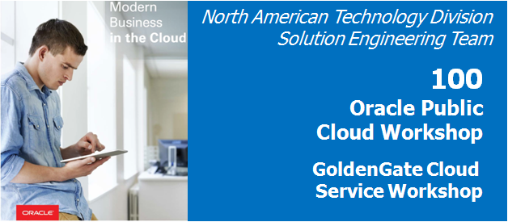

Update May 2, 2017

## Introduction

This is the first of several lab that are part of the Oracle Public Cloud GoldenGate Cloud Service workshop. These labs will give you a basic understanding of the Oracle GoldenGate Cloud Service and many of the capabilities around real time data replication and migration.  Throughout the workshop the following use cases will be covered.  These will be covered in more detail in labs 200, 300, and 400.  In lab 500 you will review GGCS monitoring.

- Lab 200: Zero Downtime Migration and replication of data from an on-premise 11g database to a DBCS 12c multi-tenant database:

	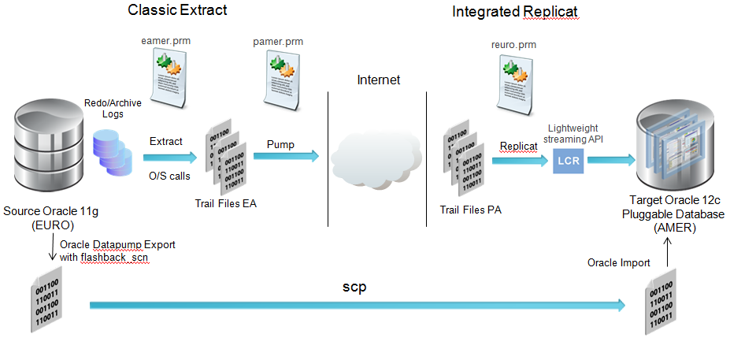

- Lab 300: Replication of data from a DBCS 12c multi-tenant database back to an on-premise 11g datbase:

	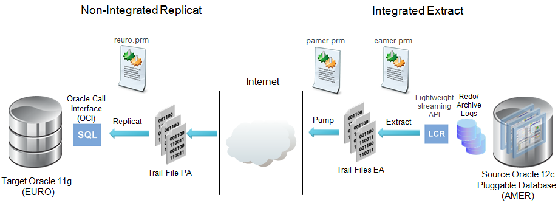

- Lab 400: Replication and transformation of data from a DBCS 12c pluggable database to a DBCS 12c reporting data warehouse with Business Intelligence analytics access:

	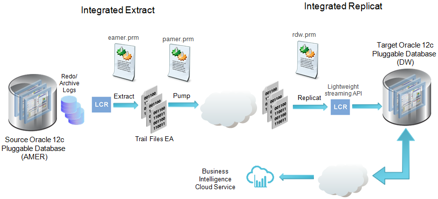

Please direct comments to: [Derrick Cameron](mailto:derrick.cameron@oracle.com) or [Charles Duncan](charles.duncan@oracle.com). 

## Objectives

- Familiarize you with the Oracle Cloud environment and services that will be used in the following labs.
- Familiarize you with an on-premise 11g Database environment that will be replicated to a DBCS 12c environment.  Note: this is set up as an image running in Oracle IAAS/compute, but process and configuration steps are the same as though the image was running outside the cloud.
- Walk through the steps to create a GoldenGate Cloud Service that will manage data replication between on-premise and cloud environments, and manage replication between different cloud environments.
- Walk you through creating a new GoldenGate enabled Database Cloud Service.
- To log issues and view the Lab Guide source, go to the [github oracle](https://github.com/pcdavies/GoldenGateCloudService/tree/master/workshops/goldengate) repository.

## Required Artifacts

- The following lab requires a VNC Viewer to connect to an Image running on Oracle's IaaS Compute Service.
- The following information will be required, and used throughout the labs.  For clarity this is listed below.  As you navigate the environments **write down** the necessary information on paper:
	- **Oracle Cloud Identity Domain:**
		- Userid and password will be given to you by your instructor.  
	- **SSH Key:**  `ggcs_key`.  This is a private key that will be used to ssh to GGCS and DGCS.  It is located in the `GGCS\_Workshop\_Material\keys` folder on the desktop of the OGG 'On-premise' 11g Database Compute image (noted below).
	- **OGG 'On-premise' 11g**
		- **IP Address:**  `you will be given this`
		- **VNC (port 5902) Password**  `ggcs2017_`
		- **Database Schemas:**
			- `euro` (your data source in lab 200 and target in lab 300)
			- `ggcs_bu` (backup/restore copy of the data)
			- passwords:  `ggcs2017_`
	- **GGCS:**
		- **IP Address**  `you will get this off the cloud console AFTER creating a new GGCS instance`
		- **SSH Access:**  `ggcs_key`
	- **DBCS:**
		- **IP Address:**  `you will get this off the Cloud Console`  DBCS will be running when you start the labs.
		- **Schemas:**
			- `amer` (target schema in lab 200, source schema in lab 300 and lab 400)
			- `dw` (target schema in lab 400)
			-`ggcs_bu` (backup/restore copy of the data)
			- passwords are `ggcs2017_`

## Review Cloud Services

### **STEP 1**: Login to your Oracle Cloud account and Review Services

- Open a browser and go to the following URL:

	https://cloud.oracle.com

- Click **Sign In** in the upper right hand corner of the browser

	

- **IMPORTANT** - Under my services, select from the drop down list the correct data center and click on **My Services**. If you are unsure of the data center you should select, and this is an in-person training event, ***ask your instructor*** which **Region** to select from the drop down list. If you received your account through an Oracle Trial, your Trial confirmation email should provide a URL that will pre-select the region for you.

	

- Enter the **identity domain** and click **Go**

	**NOTE**: The **Identity Domain, User Name** and **Password** values will be given to you from your instructor.

	

- Once your Identity Domain is set, enter your User Name and Password and click **Sign In**

	**NOTE**: the **Identity Domain, User Name** and **Password** values will be given to you from your instructor.

	

- You will be presented with a Dashboard summarizing all of your available services.

	

- If all of your services are not visible, **click** on **Customize Dashboard.** You can then add services to the dashboard by clicking **Show**. If you do not want to see a specific service click **Hide**.

	

- Review services that will be used in the GGCS Labs:
	- The Compute node will serve as your on-premise 11g database instance.  It will be migrated in Lab 200 to a target DBCS 12c pluggable databse in lab 200, and a GG target (reverse data replication) in lab 300.
	- The Database Service (DBCS) will be a GG target in lab 200 and a GG source in lab 300, and both a source and target in Lab 400.
	- The GGCS instance is not yet in your identity domain.  You will create and configure this in Labs 200 - 500.
	- Finally note that BICS is not available in this identiity domain.  That will be provided in a separate Identity Domain.

	

### **STEP 2**: Create a GoldenGate Enabled Database Cloud Service (note this has been done for you - this is a review step)

- Go to the Cloud Console and select the Database Cloud Service, and then open Service Console.

	

- Select Create Service.

	

- Enter the following and hit next.

	

- Then enter or review the following.  Note the GoldenGate option (need to expand 'advanced').  Be sure to hit cancel.  We will **NOT** create a new DBCS instance.  This is just a review exercise.

	

### **STEP 3**: Gather Information Required for Access to Images and GG Configuration

- Select the Database Cloud Service:

	

- Open the Service Console:

	

- Select the DBCS12c Service:

	

- Note the Public IP (**write this down**).  Also note the Service Name (DBCS12c - you will need this when creating GGCS)

	

- Exit back out the the Cloud Dashboard:

	

- Select the Compute Image:

	

- Then open Service Console:

	

- Identity Domains will have multiple sites. Please ask you instructor which site the Client Image is running on. If needed, click the Site drop down to access the Site Selector, and choose the correct site.

	

- Note the public IP of the GG_On-premise image (**write this down**):

	

### **STEP 4**: Create GoldenGate Cloud Service Instance

- Return to Dashboard (upper right), select GGCS, then Open Service Console, and then Create Service Instance:

	

- Enter Service Name ggcsservice-ggcs-1 as the name, take the defaults and then hit Next:

	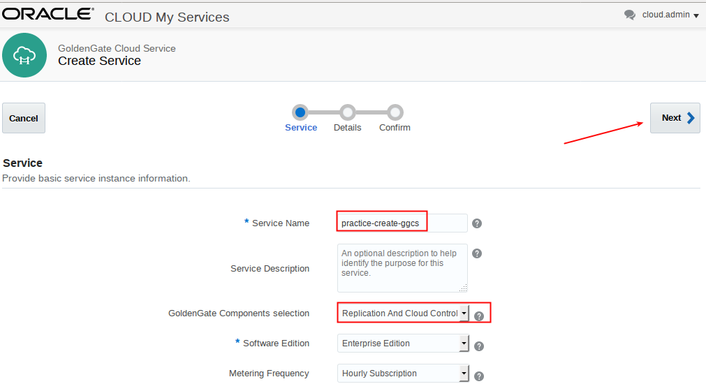

- Enter the following details:

	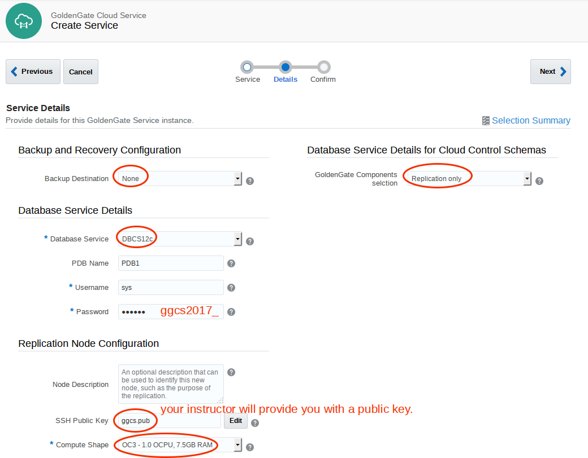

- Hit 'Next' and then submit.  The instance create process will take several minutes.

### **STEP 5**: Review Compute Image (On-premise OGG)

For the GoldenGate Cloud Service Workshop we will be using a compute Image that will represent your on-premises environment. In this image we have installed a 11g database that we will be migrating to our Oracle Public Cloud Database instance. The image also contains SQL Developer 4.1 that will be used to connect to both your local and cloud database.

- Start your vnc viewer and enter the IP address of the Compute image noted above.
	- **VNC Password:** `ggcs2017_`

	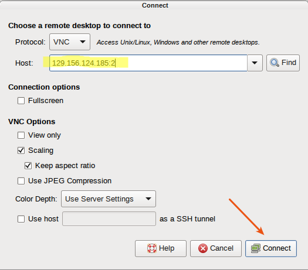

- This is the 'On-premise' environment desktop.  All the lab material is in the GGCS\_Workshop\_Material folder on the desktop - double click on this folder and review the contents.  Note:
	- This folder has scripts to start the SSH proxy and to start and stop the GoldenGate Cloud Control Agent.
	- The keys folder:  You will use a private key to access the GGCS and DBCS instances.  You will need the IP addresses of those environments after GGCS is up.
	- The SQL Files folder:  These scripts are used in SQLDeveloper to generate transactional data, do row counts, and re-set your data if necessary for the DW.

	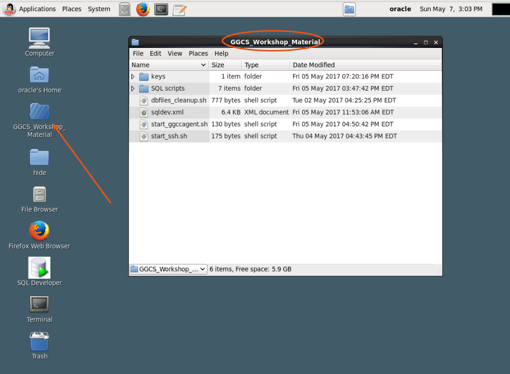

- Double click on the SQL Developer desktop icon.  You will use SQL Developer to review data and execute SQL Scripts.  Three connections have been set up for you (highlighted).  These will need to be updated with the domain name and IP addresses of your assigned instances (On-premise 11g Database, DBCS 12c Database, and your GGCS instance).  **This will be done in Lab 200**.

	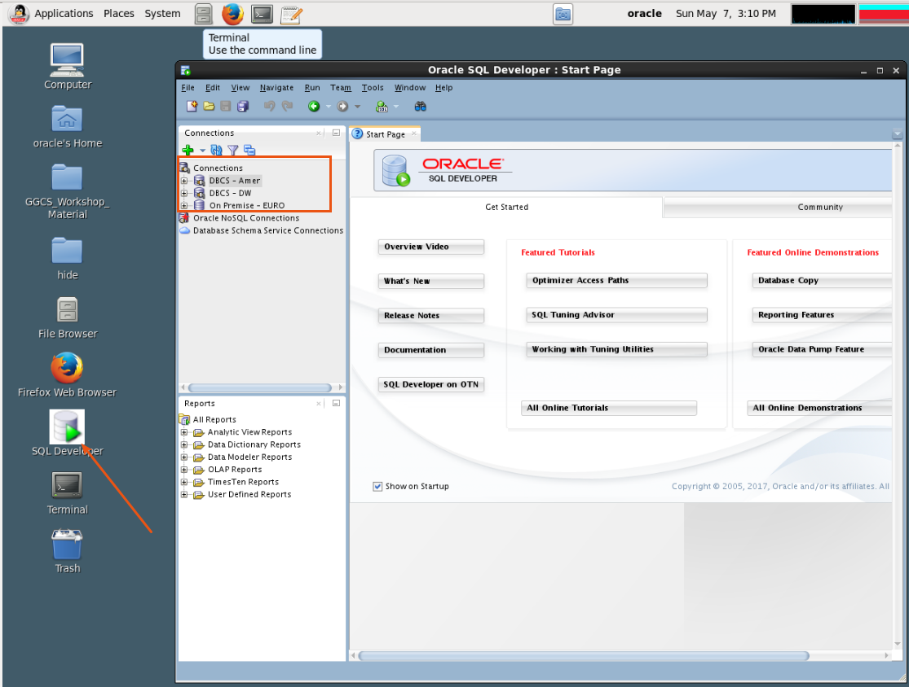

- Select the File Browser off the desktop and navigate to /u01/app/oracle/product.  This location is where GoldenGate On-premise product is installed and configured.  We will review this in the next lab.  Note that Oracle Database 11g which is used in the following labs is installed in /opt/oracle.

	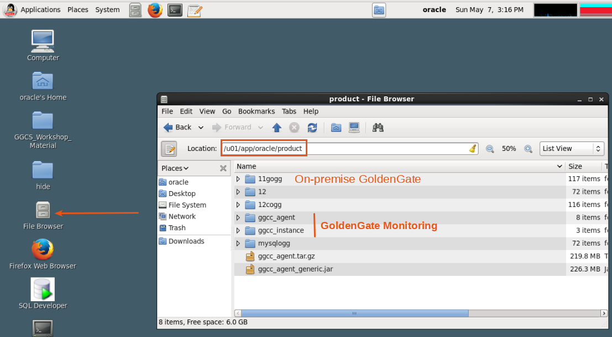

- There are many directories under the GoldenGate product homes.  One particularly important directory is dirprm.  The dirprm directory will contain all of the parameter (OGG process configuration) and obey (ggsci scripts) that will be used for the workshop. There is also a cleanup directory that contain obey files to clean up the processes if a lab needs to be restarted.

	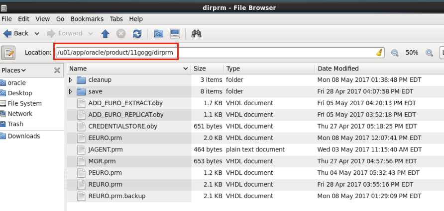

### **STEP 6**: Review GGCS Instance

- By now GolderGate Cloud Service (GGCS) should be available.  Go to the console to get the IP address.  Select GGCS.  Note that at any time you can collapse the region above the services.  Then open Service Console.

	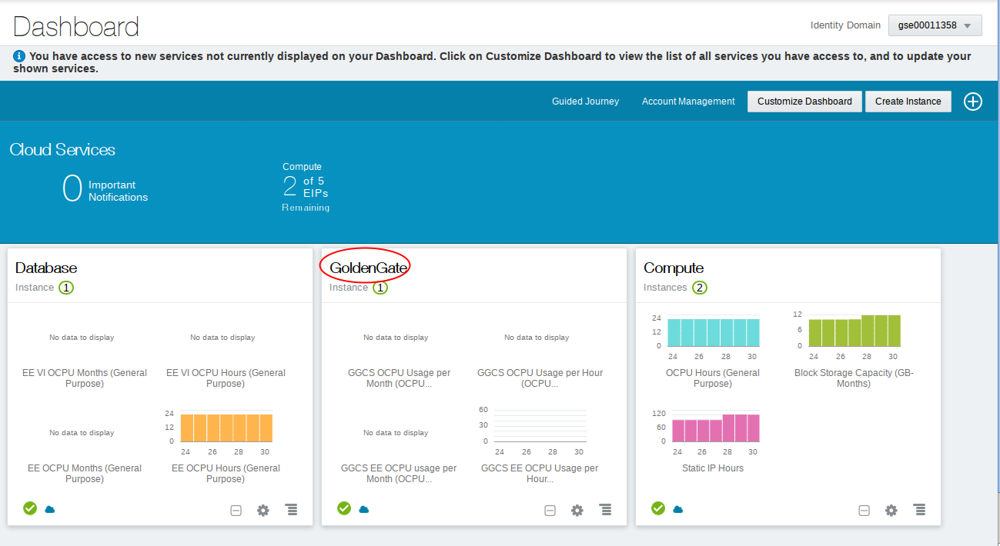

- Open ggcsservice_ggcs_1

	

- Note the public IP **write this down**.  You will need this later for various configuration steps.

	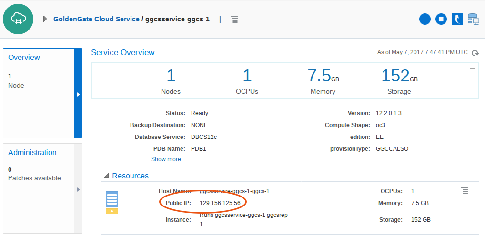

- Go back to the OGG Compute image, open the workshop folder on the desktop, and navigate to the sql_scripts folder.  Update the cr_dblink.sql file and set the DBCS IP and Identity Domain.  Note we will execute this script in Lab 200.

	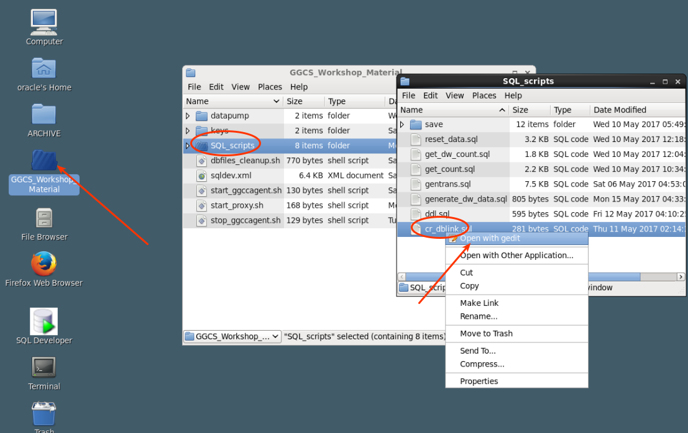

- Next open navigate to the ggcs_config folder, and update the tnsnames.ora file.  

	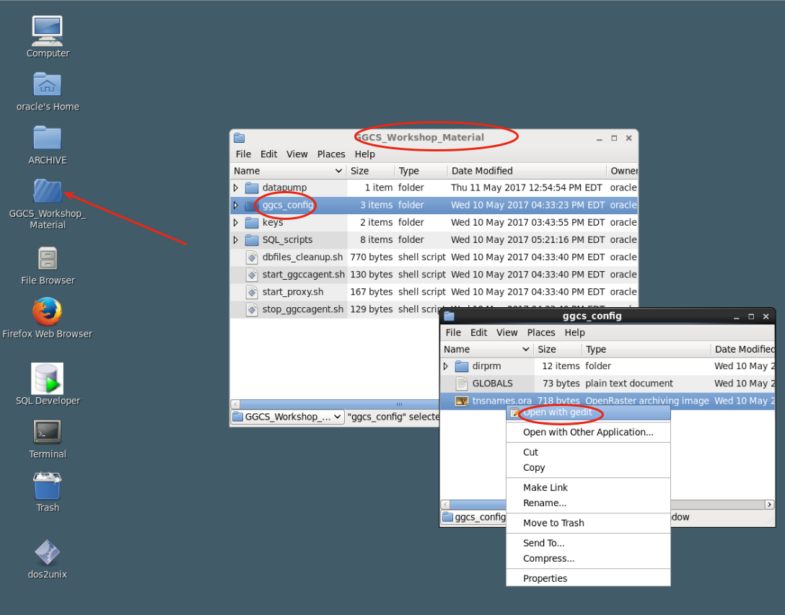

- This needs to be updated with your Identity Domain information.

	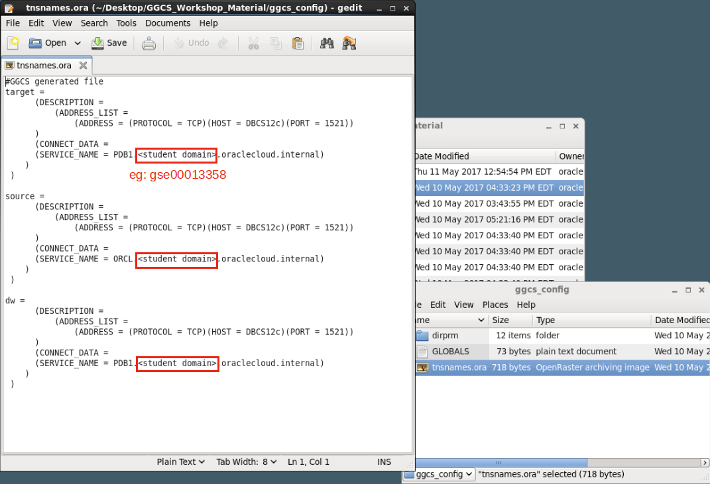

- Next, execute a script to copy the GGCS configuration files.  Note these files exist on GGCS but need to modified for our use cases.  To simplify configuration we have done most of the setup and will transfer the configuration from our compute image to GGCS.  Now go to the GGCS\_Workshop\_Material folder\ggcs_configuration folder on the desktop and open a terminal window:

	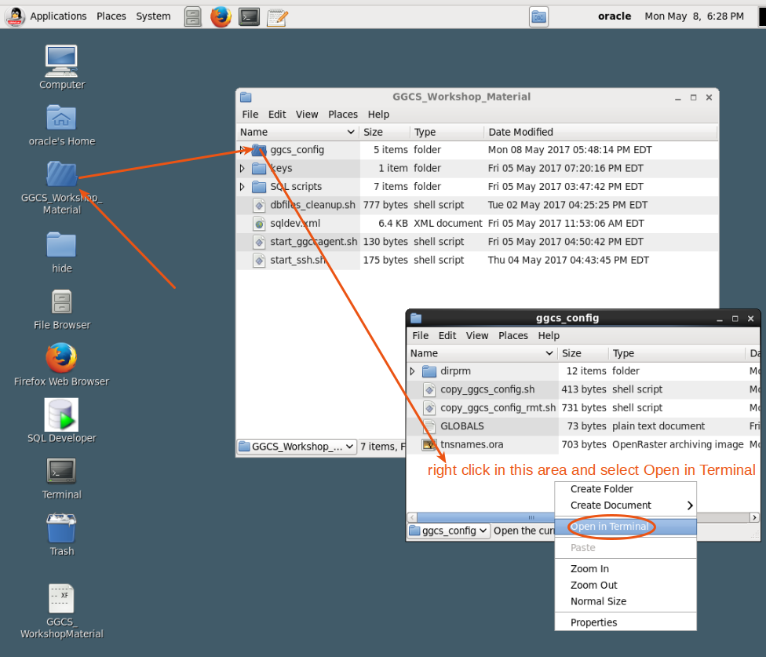

- Enter the following
`./copy_ggcs_config.sh <your ggcs IP address>`

	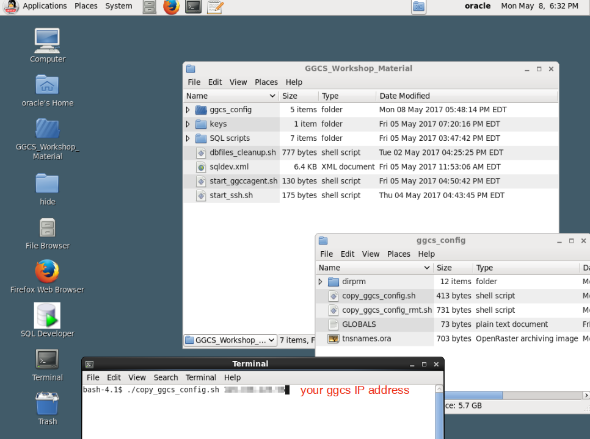

- To access GGCS we will use ssh on the OGG Compute image and log into GGCS from there.  Go to the OGG Compute Desktop, open the workshop folder, and navigate to the keys directory.  Right click inside the folder to open a terminal window.

	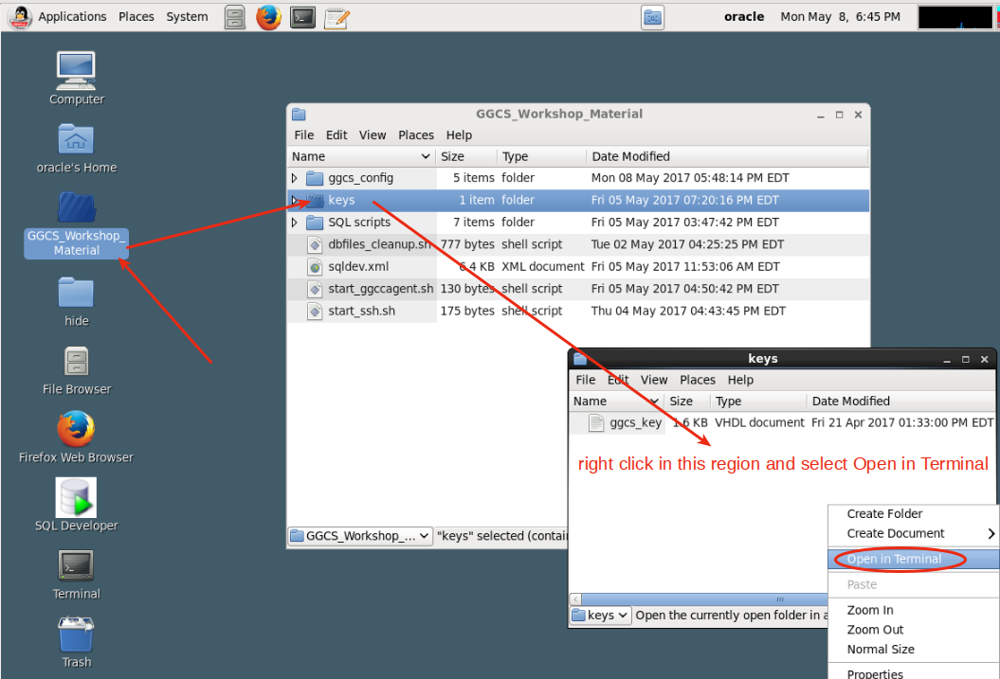

- Enter the following to ssh to the GGCS instance.
	`ssh -i ggcs_key opc@<enter your ggcs IP here>`

- Enter the following commands:
	- **switch to user oracle:** `sudo su - oracle`
	- **display the oracle home directory:** `pwd`
	- **switch to the GG Home directory:** `cd $GGHOME`
	- **display the GG home directory:** `pwd` (/u01/app/oracle/gghome)
	- **display the GG configuration directories:** `ls`
	- **display the key GG configuration files:** `ls dirprm`
	- **switch to the network admin directory where connectivity to dbcs12c is configured:** `cd /u02/data/oci/network/admin`
	- **display the tnsnames.ora file:** `cat tnsnames.ora`
	- **close the connection:** `exit` and then `exit` again

- This is the output of the preceding commands:

```
bash-4.1$ ssh -i ggcs_key opc@129.156.125.56
[opc@ggcsservice-ggcs-1-ggcs-1 ~]$ sudo su - oracle
[oracle@ggcsservice-ggcs-1-ggcs-1 ~]$ pwd
/u01/app/oracle/tools/home/oracle
[oracle@ggcsservice-ggcs-1-ggcs-1 ~]$ cd $GGHOME
[oracle@ggcsservice-ggcs-1-ggcs-1 gghome]$ pwd
/u01/app/oracle/gghome
[oracle@ggcsservice-ggcs-1-ggcs-1 gghome]$ ls
bcpfmt.tpl                       extract
bcrypt.txt                       freeBSD.txt
BR                               ggcmd
cachefiledump                    ggMessage.dat
cfgtoollogs                      ggparam.dat
checkprm                         ggsci
chkpt_ora_create.sql             ggserr.log
convchk                          GLOBALS
convprm                          help.txt
CREDENTIAL_STORE_SETUP.sh        install
db2cntl.tpl                      inventory
ddl_cleartrace.sql               jdk
ddl_create.sql                   keygen
ddl_ddl2file.sql                 label.sql
ddl_disable.sql                  lib12
ddl_enable.sql                   libantlr3c.so
ddl_filter.sql                   libdb-6.1.so
ddl_ora10.sql                    libgglog.so
ddl_ora10upCommon.sql            libggnnzitp.so
ddl_ora11.sql                    libggparam.so
ddl_ora9.sql                     libggperf.so
ddl_pin.sql                      libggrepo.so
ddl_remove.sql                   libicudata.so.48
ddl_session1.sql                 libicudata.so.48.1
ddl_session.sql                  libicui18n.so.48
ddl_setup.sql                    libicui18n.so.48.1
ddl_status.sql                   libicuuc.so.48
ddl_staymetadata_off.sql         libicuuc.so.48.1
ddl_staymetadata_on.sql          libxerces-c.so.28
ddl_tracelevel.sql               libxml2.txt
ddl_trace_off.sql                logdump
ddl_trace_on.sql                 marker_remove.sql
debug509.txt                     marker_setup.sql
defgen                           marker_status.sql
deinstall                        mgr
demo_more_ora_create.sql         notices.txt
demo_more_ora_insert.sql         oggerr
demo_ora_create.sql              OPatch
demo_ora_insert.sql              oraInst.loc
demo_ora_lob_create.sql          oui
demo_ora_misc.sql                params.sql
demo_ora_pk_befores_create.sql   prvtclkm.plb
demo_ora_pk_befores_insert.sql   prvtlmpg.plb
demo_ora_pk_befores_updates.sql  prvtlmpg_uninstall.sql
diagnostics                      README
dirbdb                           remove_seq.sql
dirchk                           replicat
dircrd                           retrace
dirdat                           reverse
dirdef                           role_setup.sql
dirdmp                           sequence.sql
dirjar                           server
dirout                           sqlldr.tpl
dirpcs                           srvm
dirprm                           SSH_SOCK5_SETUP.sh
dirprm_orig                      tcperrs
dirrpt                           ucharset.h
dirsql                           ulg.sql
dirtmp                           UserExitExamples
dirwlt                           usrdecs.h
dirwww                           zlib.txt
emsclnt
[oracle@ggcsservice-ggcs-1-ggcs-1 gghome]$ ls dirprm
ADD_AMER_EXTRACT.oby   cleanup              EXTDW.prm   PAMER.prm
ADD_AMER_REPLICAT.oby  CREDENTIALSTORE.oby  jagent.prm  RAMER.prm
ADD_DW_ALL.oby         EAMER.prm            MGR.prm     REPDW.prm
[oracle@ggcsservice-ggcs-1-ggcs-1 gghome]$ cd /u02/data/oci/network/admin
[oracle@ggcsservice-ggcs-1-ggcs-1 admin]$ cat tnsnames.ora
#GGCS generated file
target =
      (DESCRIPTION =
          (ADDRESS_LIST =
              (ADDRESS = (PROTOCOL = TCP)(HOST = DBCS12c)(PORT = 1521))
      )
      (CONNECT_DATA =
      (SERVICE_NAME = PDB1.gse00011358.oraclecloud.internal)
    )
 )

source =
      (DESCRIPTION =
          (ADDRESS_LIST =
              (ADDRESS = (PROTOCOL = TCP)(HOST = DBCS12c)(PORT = 1521))
      )
      (CONNECT_DATA =
      (SERVICE_NAME = ORCL.gse00011358.oraclecloud.internal)
    )
 )

dw =
      (DESCRIPTION =
          (ADDRESS_LIST =
              (ADDRESS = (PROTOCOL = TCP)(HOST = DBCS12c)(PORT = 1521))
      )
      (CONNECT_DATA =
      (SERVICE_NAME = PDB1.gse00011358.oraclecloud.internal)
    )
 )
[oracle@ggcsservice-ggcs-1-ggcs-1 admin]$ exit
```
- Note that the target entry is created automatically when the GGCS is associated with a DBCS during creations. Addition database sources and targets will need to be added manually. We have added entries representing the DBCS as a source (for Labs 300-400) and as a target for Lab 400.
