Update May 2, 2017

## Introduction

This is the second of five GoldenGate Cloud Service labs, and covers the first use case - zero downtime migration and replication of data from a 11g Database on-premise to DBCS 12c Pluggable Dataabase.  

This workshop will walk you through a zero downtime use case that shows how you can use Oracle Datapump and Oracle GoldenGate to maintain an on-premise database that remains available while data is migrated and replicated to a remote instance with transactional consistency.

To log issues and view the lab guide source, go to the [github oracle](https://github.com/pcdavies/GoldenGateCloudService/issues) repository.

## Objectives

- Configure SQLDeveloper to access the source and target databases.
- Use Oracle Datapump to migrate data from 11g on-premise to DBCS 12c.
- Configure an on-premise GoldenGate to extract data from a 11g Database.
- Configure GoldenGate Cloud Service to replicate data to a DBCS 12c Pluggable Database.
- Generate transactions to showcase real time data replication, while tracking data consistency between environments.

## Required Artifacts

- Access to your Oracle Cloud account (used in Lab 100) and services DBCS, GGCS, and Compute.

### **STEP 1**: Configure Database Connections in SQL Developer

- Go to the On-Premise Compute image desktop (VNC) and double click on SQLDeveloper on the desktop.

	

- Go to the top view menu and select SSH.  We need to update the IP address of the SSH tunnel that we use to connect to DBCS.  This tunnel encrypts database traffic and passes it through port 22.  Here we map local port 1521 through 22 to remote port 1521.

	

- In the lower left region right click on the DBCSWS tunnel and update the IP address (fild ***DB1***).  Note that in a new environment you would need to create a new tunnel yourself.

	

- Update the IP address.
	
	

- Then right click on the tunnel and select test.
	
	

	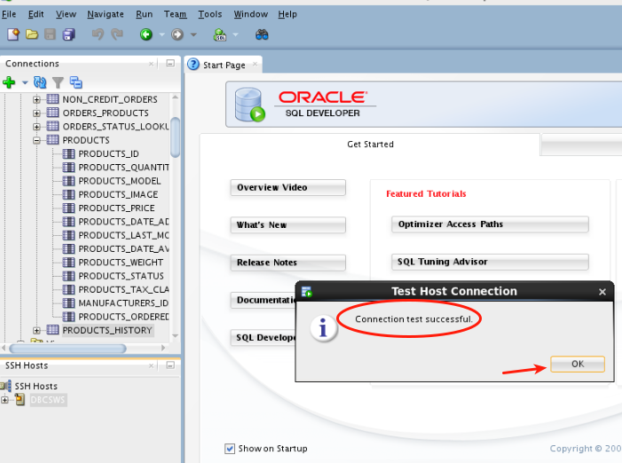

- Next right click on the top connection and select Properties.  We need to set that to your assigned DBCS instance.  Set the Service Name.

	

- Update the Service Name and enter your student identity domain with field ***CS1***.

	

- Do the same thing for the next (DW) connection down.  Right click on the DBCS-DW connection, select properties, and edit the Service Name, field ***CS1***.

	

- Next re-create the database link (from 11g Database to DBCS 12c) with your assigned IP address (field ***DB1***). 

	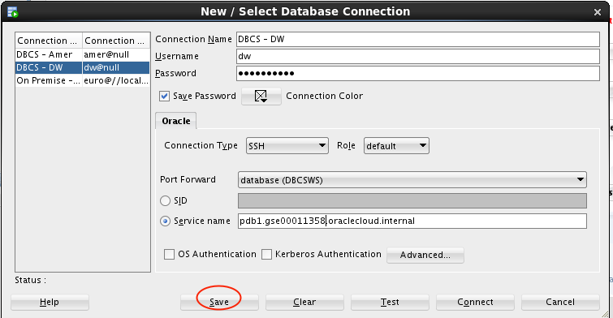

- Upated the DBCS IP (field ***DB1***) and Identity Domain (field ***CS1***) and then execute the script.  Be sure to select the EURO connection on the right.

	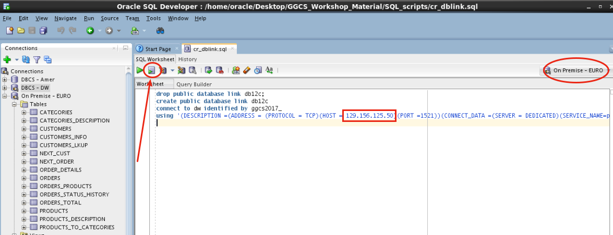

### **STEP 2**: Review Source Data in 11g Source Database (On-Premise/Compute image) and the DBCS 12c Target Database.

- In SQLDevelper select (expand) the On-Premise-EURO connection, and then expand the tables.  Select the ORDERS table, and then the data tab.  At this point we are just reviewing data in EURO on 11g Database that will be replicated to DBCS 12c.

	

- To avoid confusion close the Orders tab that is showing EURO data.

	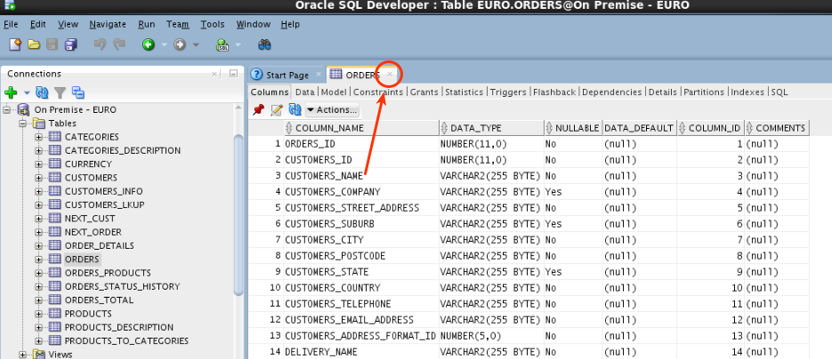

- Next close the SSH region (lower left) since we don't need that anymore.  

	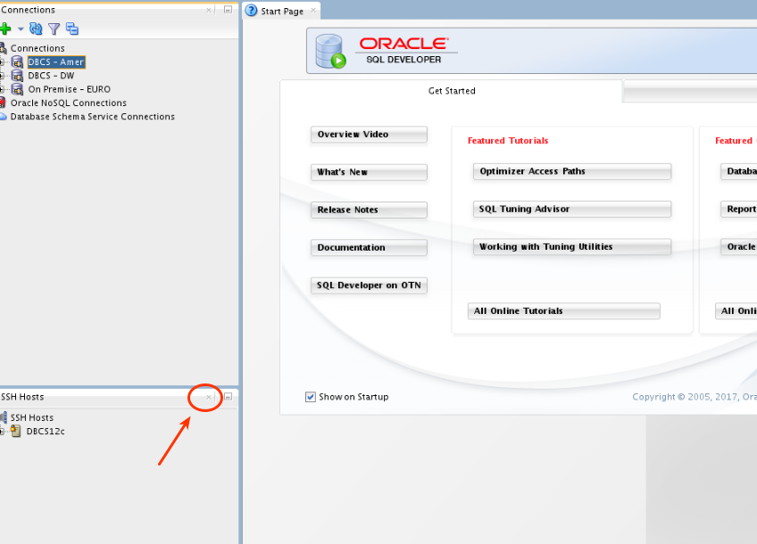

- Then select (expand) the DBCS-Amer connection and then expand the tables. There are no tables in the target Schema at this point.

	

- Lastly select (expand) the DBCS-DW connection and then expand the tables.  These are tranformed (and empty) tables ready for populating in Lab 400.

	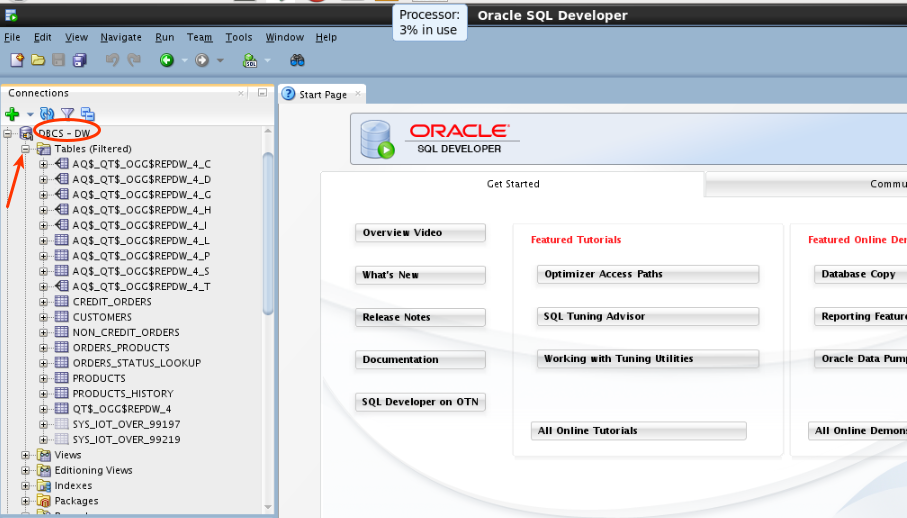

### **STEP 3**: Configure OGG (On-premise/Source)

- Note this is:
	- Using our On-premise/Compute image through VNC
	- Our source data configuration for 11g Database (schema euro)
	- USes OGG (not GGCS) with Classic Extract 

- Open a terminal window and start a SOCKS5 Proxy Tunnel.  This will encrypt data and send it through an SSH Tunnel.  First open the lab folder on the desktop.

	

- Then open the start_proxy.sh script.  Take a look at it.  It maps local port 1080 to port 22 and encrypts the traffic.  We will reference this port in OGG configuration in the following steps.

	

- Edit the IP address and enter the GGCS IP (field ***GG1***).  Save the file.

	

- Close the window edit window, and right click inside the folder to open a terminal window.

	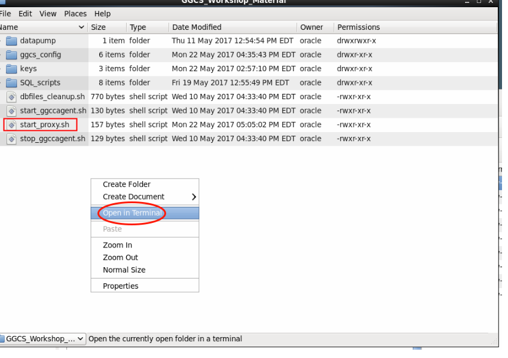

- Execute the start_proxy.sh script. 
	- **Enter the following:** `./start_proxy.sh`   **LEAVE THIS WINDOW OPEN - DO NOT CLOSE IT..YOU CAN MINIMIZE IT**.

	

- Start a GoldenGate command session.  Open a new terminal window (double click on terminal on the desktop), and enter the following:
	- **Switch to the GG home directory:** `cd $GGHOME`
	- **Start a gg command session:** `./ggsci`

	

- Review OGG parameters.  
	- **Open a file browser window and switch the the following directory:** `/u01/app/oracle/product/11gogg/dirprm`

	

- In the ggsci terminal window view the parameter CREDENTIALSTORE.oby.  Note that you can also open the file with gedit in the file browser menu.  The command view param is a shortcut way to view gg parameter files without having to navigate to the directory.
	- **Enter the following:** `view param dirprm/CREDENTIALSTORE.oby`

	
 
 - In the screen above note that the this credential allow us to connect to the local 11g database with an alias without having to specify an OCI connection.  You will see reference to alias ogguser in other gg configuration files.

 - Run this set of gg commands using oby files.  
 	- **Enter the following:** `obey dirprm/CREDENTIALSTORE.oby`

	

- View Extract EEURO.prm using ggsci:
	- **Enter the following:** `view param dirprm/EEURO.rpm`

	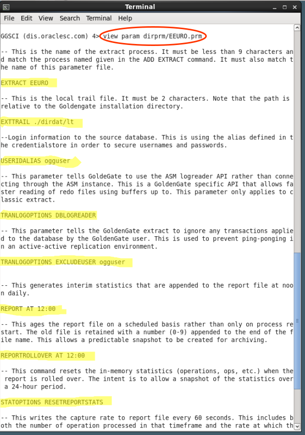

- Review extract configuration.  Note: if you go back and review the overview architecture diagram at the beggining if this lab you can identify these components (Extract, pump, trail file, etc.).  
	- **Enter the following:** `view param ./dirprm/ADD_EURO_EXTRACT.oby`
		- **DBLOGIN USERIDALIAS ogguser** log in
		- **ADD EXTRACT EEURO, TRANLOG, BEGIN NOW**: Add extract
		- **ADD EXTTRAIL ./dirdat/lt, EXTRACT EEURO, MEGABYTES 50**:  Add trail file prefix (trail files are lt0000000001..etc.)
		- **ADD EXTRACT PEURO, EXTTRAILSOURCE ./dirdat/lt**  Add pump
		- **ADD RMTTRAIL ./dirdat/rt, EXTRACT PEURO, MEGABYTES 50** Add remote trail file prefix
		- **ADD TRANDATA euro.** This allows you to specify at the schema or table level what data is extracted (fine control)
	
	
	
- Execute commands to add EURO extract:
	- **Enter the following:** `obey dirprm/ADD_EURO_EXTRACT.oby`

	

- Scroll through the terminal window to view the results.

- Edit parameters PEURO and set the IP Address.  This uses the 'VI' editor.  Note you can also edit this with gedit (see following step).
	- **Enter the following:** `edit param PEURO`
	- **Use the arrows on your keyboard to navigate to the IP address**
	- **Use the `i` character to enter insert mode and the `[ESC]` key to exit insert mode**
	- **Enter your GGCS IP address (field ***GG1***):** see highlighted text below
	- **Use the `x` key to delete characters**
	- **To save enter `:` character and then `x` character**

	

- Alternatively edit parameters PEURO and set the IP Address using gedit.  Minimized the ggsci terminal window and Open a new windows browser and use gedit as follows:

	

- Edit the IP address, hit save, and exit the window.

	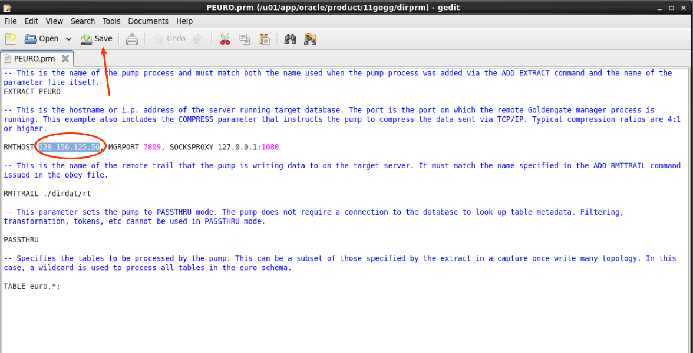

- Go back to ggsci and review processes that you have added:
	- **Enter the following:** `info all`
 
	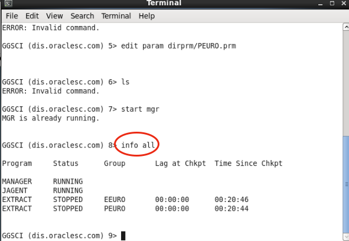

-  Start new processes:
	- **Enter the following:** `start *`
	- **Wait a few seconds for the processes to start, and then enter:** `info all`

	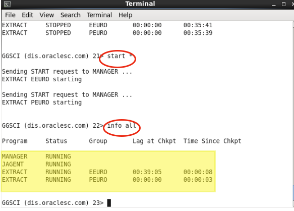

### **STEP 4**: Migrate Baseline Data with Datapump

- Export the 11g EURO schema data.  See field ***OG3*** from your handout for the password:
	- **Enter the following in a terminal window:** `expdp euro/<password> schemas=euro dumpfile=export.dmp reuse_dumpfiles=yes directory=oracle`

	

- Copy the export.dmp file to DBCS 12c.  Use field ***DB1*** for your password.
	- **Enter the following in a terminal window:** `scp -i /home/oracle/Desktop/GGCS_Workshop_Material/keys/ggcs_key /home/oracle/export.dmp oracle@<your DBCS IP address>:.`

 	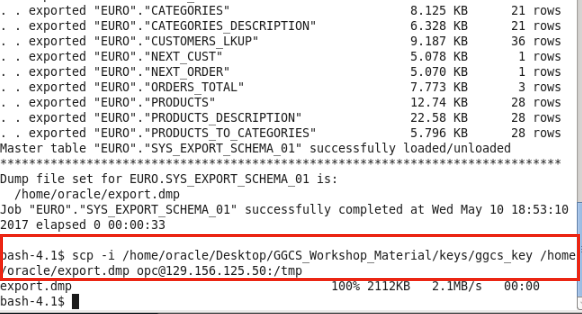
	
- SSH to the DBCS 12c instance:
	- **Enter the following in a terminal window and ssh to DBCS:** `ssh -i /home/oracle/Desktop/GGCS_Workshop_Material/keys/ggcs_key oracle@<your DBCS IP address>` field ***DB1*** for IP address
	- **Import the data:** `impdp amer/<password>@pdb1 SCHEMAS=euro REMAP_SCHEMA=euro:amer DIRECTORY=dmpdir DUMPFILE=export.dmp` field ***DB2*** for password

	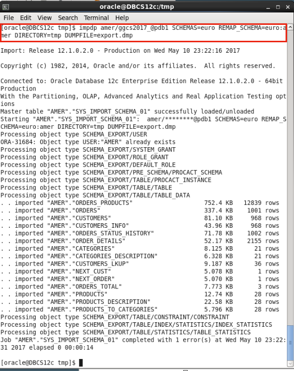

- Compare row counts.  Open SQL Developer and then open file get_count.sql (upper left).

	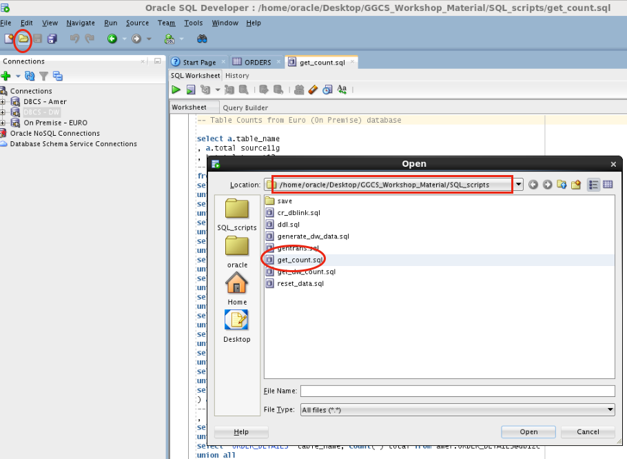

- Disconnect from the EURO connection to avoid a potential read consistency error.

	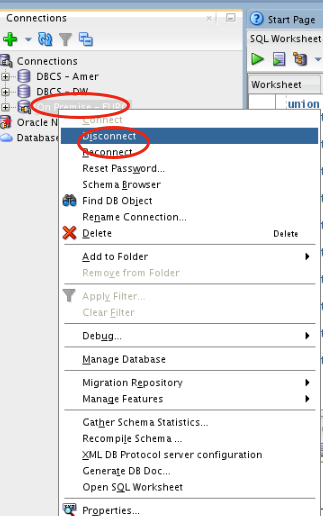

- Select the EURO Connection:

	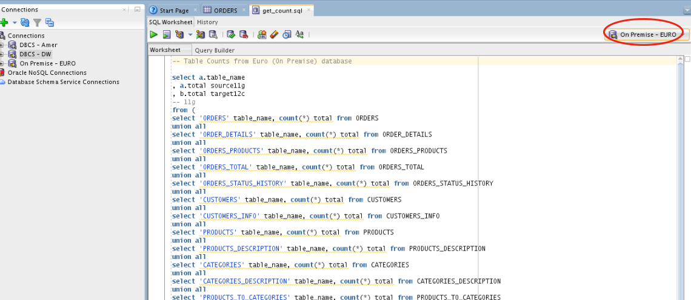

- Run the script.  Note the data is identical.

	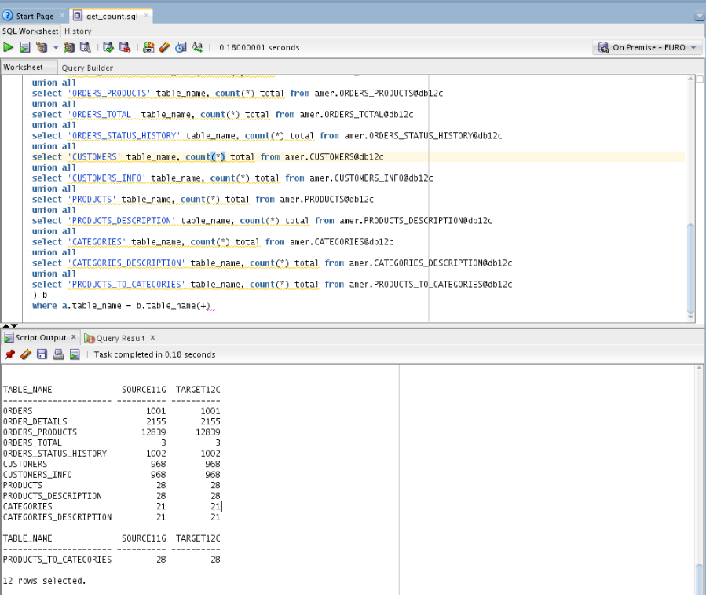

- Run simulated transactions.
	- **Open the gentrans.sql file**:

	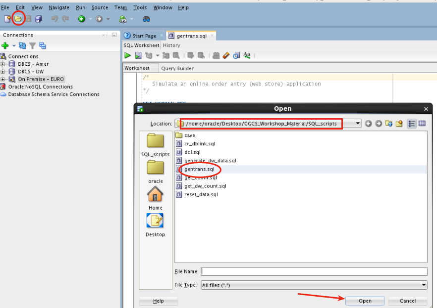

- Execute it.  Be sure to select the EURO connection.

	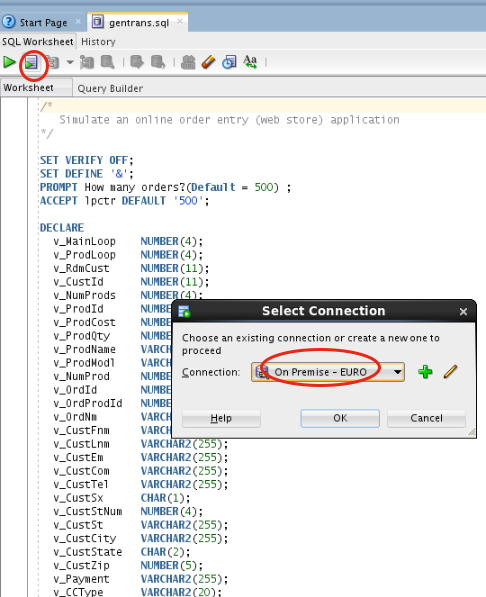

- Enter 500 as the number of transactions to generate.

	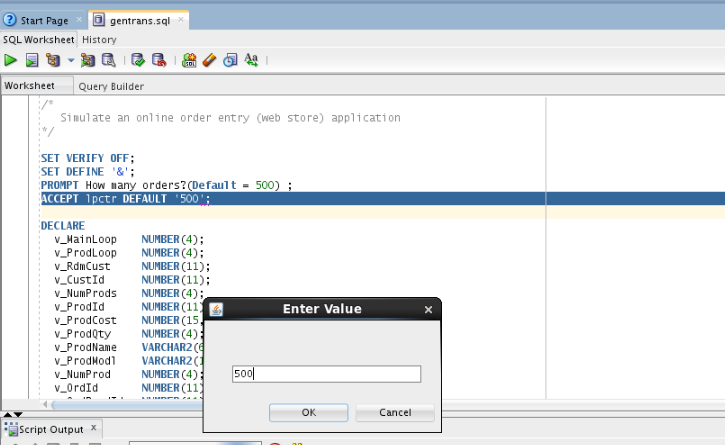

	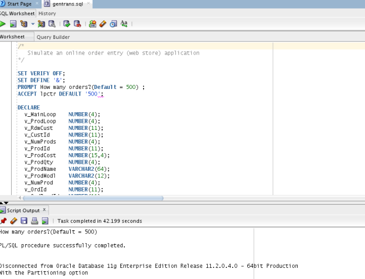

### **STEP 5**: Configure GGCS (Cloud/Target) 

Note this is:
- Using our GGCS Service (which also runs on Compute) paired with a DBCS for both GGCS metadata and target data
- Our target data configuration for 12c Pluggable Database (schema amer)
- USes GGCS (not on-premise OGG) with Integrated Replicat

- Open a terminal window on the OGG Compute image and ssh to GGCS (substituting your own GGCS IP):
	- **SSH to GGCS:** `ssh -i /home/oracle/Desktop/GGCS_Workshop_Material/keys/ggcs_key opc@<your ggcs IP address>` field ***GG1*** for your ip address
	- **Switch to user oracle:** `sudo su - oracle`
	- **Start a gg command shell:** `ggsci`

	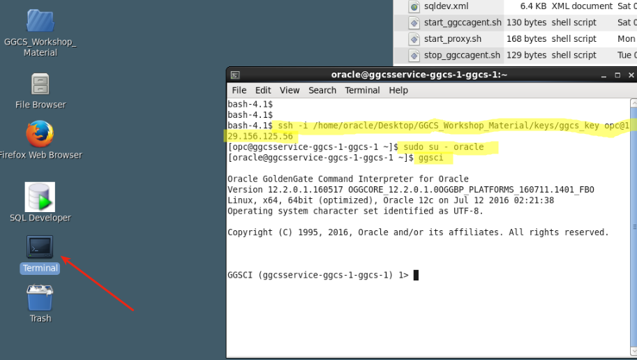

- View parameter CREDENTIALSTORE.oby
	- **Enter the following:** `view param dirprm/CREDENTIALSTORE.oby` (note the addition of user and passwords for the admin schema and the amer and dw data schemas)

	

- Add CREDENTIALSTORE
	- **Enter the following:** `obey dirprm/CREDENTIALSTORE.oby`

	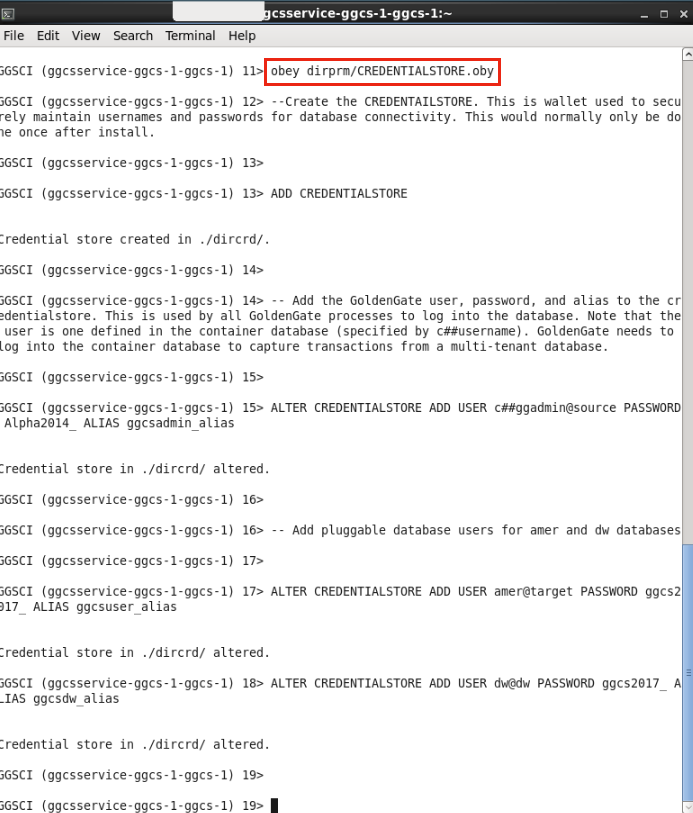

- View Replicat	RAMER
	- **Enter the following:** `view param dirprm/RAMER.prm`

	

- View add Replicat	configuration.
	- **Enter the following:** `view param dirprm/ADD_AMER_REPLICAT.oby`

	

- Add Replicat:
	- **Enter the following:** `obey dirprm/ADD_AMER_REPLICAT.oby`

	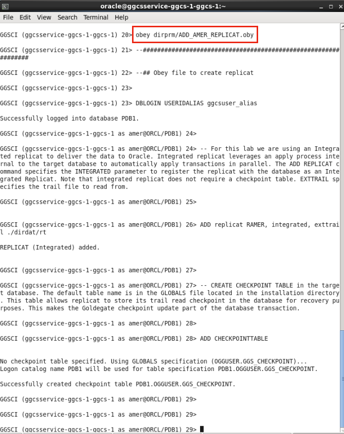

- start Replicat:
	- **Enter the following:** `info all`
	- **Start replicat:** `start RAMER`
	- **Review processes:** `info all`

	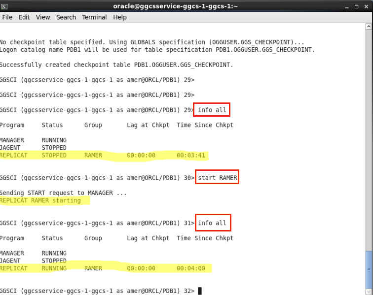

- Compare data (remember that after we used datapump to migrate the base tables we generated an additional 500 transactions).  Go back to SQLDeveloper and open the row_counts script:

	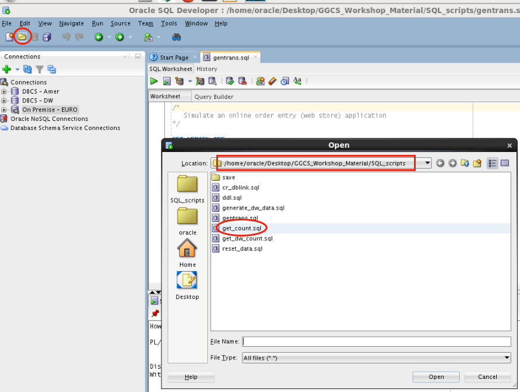

	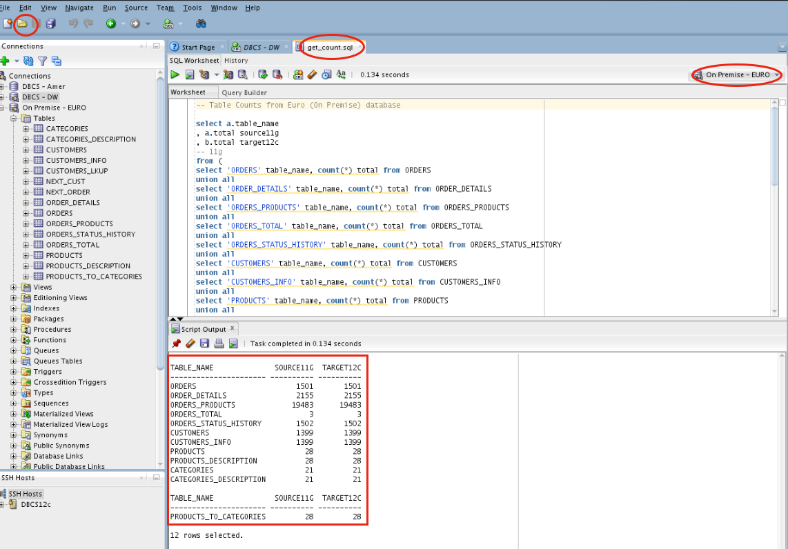