Update May 2, 2017

## Introduction

- This is the second of five GoldenGate Cloud Service labs, and covers the first use case - zero downtime migration and replication of data from a 11g Database on-premise to DBCS 12c Pluggable Dataabase.  

	

This workshop will walk you through a zero downtime use case that shows how you can use Oracle Datapump and Oracle GoldenGate to maintain an on-premise database that remains available while data is migrated and replicated to a remote instance with transactional consistency.

Please direct comments to: [Derrick Cameron] (derrick.cameron@oracle.com)

## Objectives

- configure SQLDeveloper to access the source and target databases.
- Use Oracle Datapump to migrate data from 11g on-premise to DBCS 12c.
- Configure an on-premise GoldenGate to extract data from a 11g Database.
- Configure GoldenGate Cloud Service to replicate data to a DBCS 12c Pluggable Database.
- Generate transactions to showcase real time data replication, while tracking data consistency between environments.

## Required Artifacts

- Access to your Oracle Cloud account (used in Lab 100) and services DBCS, GGCS, and Compute.

### **STEP 1**: Configure Database Connections in SQL Developer

- Go to the On-Premise Compute image desktop (VNC) and double click on SQLDeveloper on the desktop.

	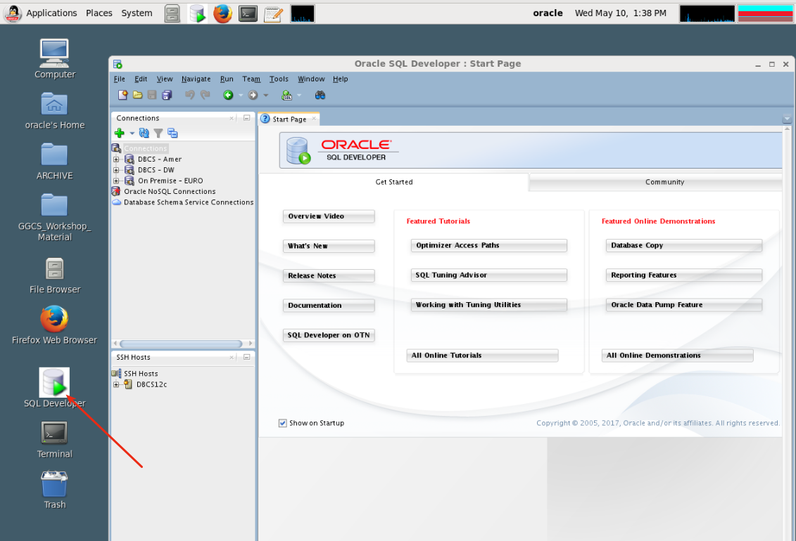

- Go to the top menu and select ssh.  We need to create an SSH tunnel to tunnel through ssh port 22, to access 1521 in DBCS.  In fact we have opened port 1521 for other reasons, but this is normally how you would securely connect to DBCS when 1521 is closed.

	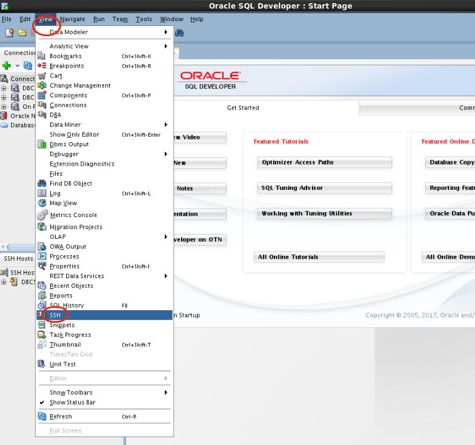

- In the lower left region create new SSH Host.

	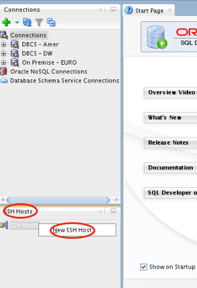

- Enter the following details
	- **Name:** `DBCS12c`
	- **Host:** `<Enter your DBCS IP here>`
	- **Username:** `opc`
	- **Use Keyfile:** `/home/oracle/Desktop/GGCS_Workshop_Material/keys/ggcs_key`
	- **Add a local port forward:** `check this`
	- **Name:** `database`
	- **Host:** `localhost`
	- **Port:** `1521`
	
	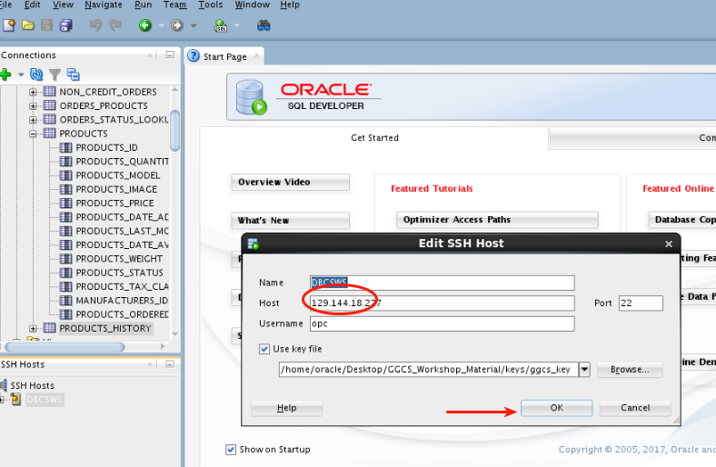

- Next right click on the top connection.  We need to set that to your assigned DBCS instance.  Set the Service Name.

	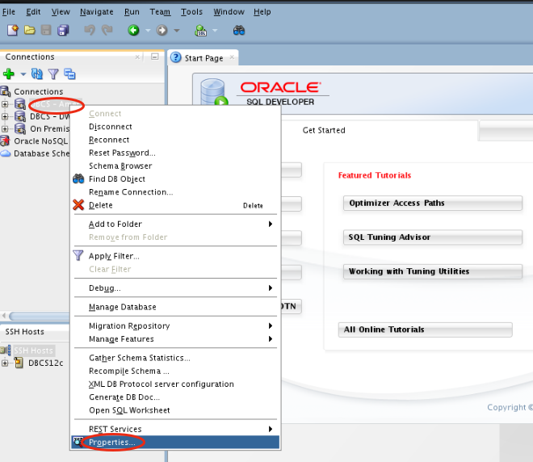

	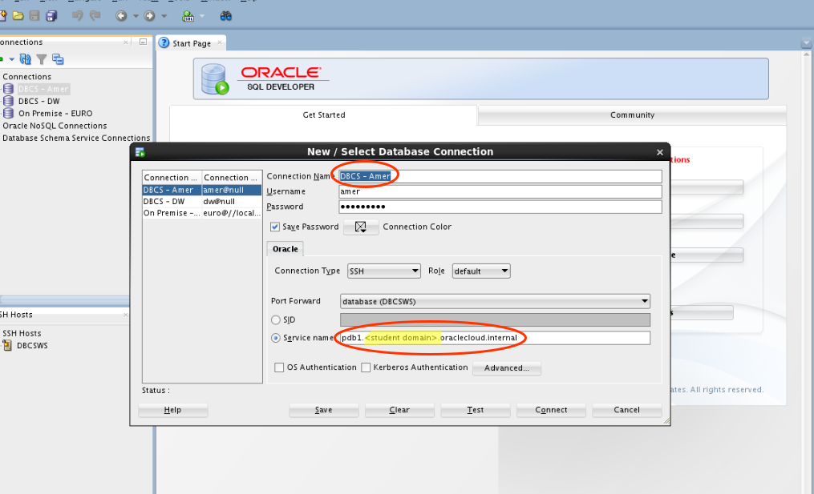

- Down the same thing for the next (DW) connection down.  Right click on the DBCS-DW connection, select properties, and edit the Service Name.

	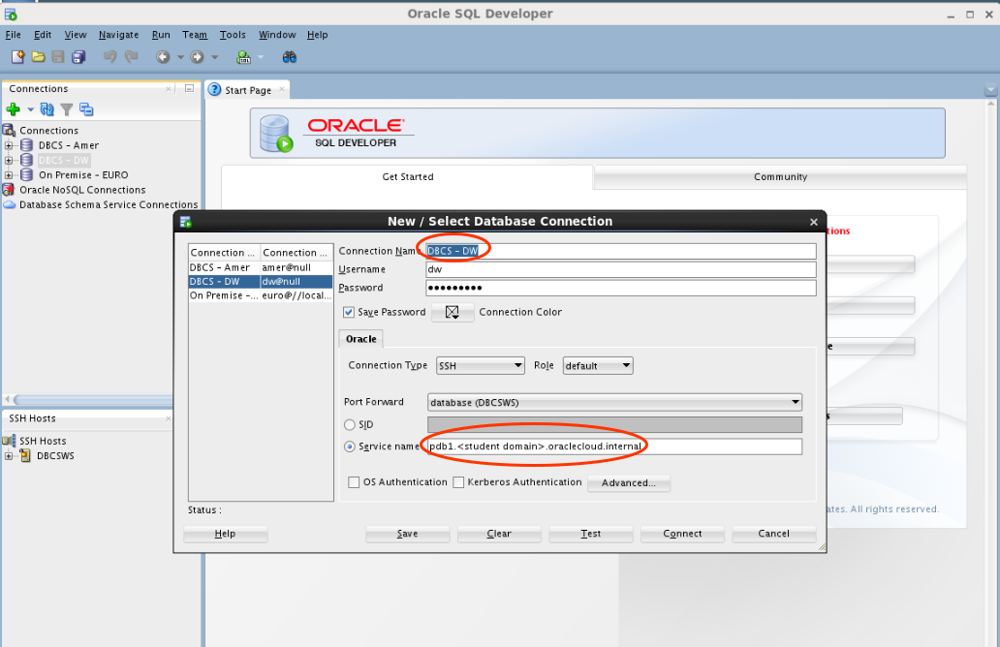

### **STEP 2**: Review Source Data in 11g Source Database (On-Premise/Compute image) and the DBCS 12c Target Database.

- In SQLDevelper select (expand) the On-Premise-EURO connection, and then expand the tables.  Select the ORDERS table, and then the data tab.

	

- Next close the SSH region (lower left) since we don't need that anymore.  Then select (expand) the DBCS-amer connection and then expand the tables. There are no tables in the target Schema at this point.  The data table still shows the 11g EURO data.

	

- Next select (expand) the DBCS-amer connection and then expand the tables.

	

- Again, review data in the orders table (target this time) by first clicking on the table, then selecting the data tab.  This data currently mirrors

	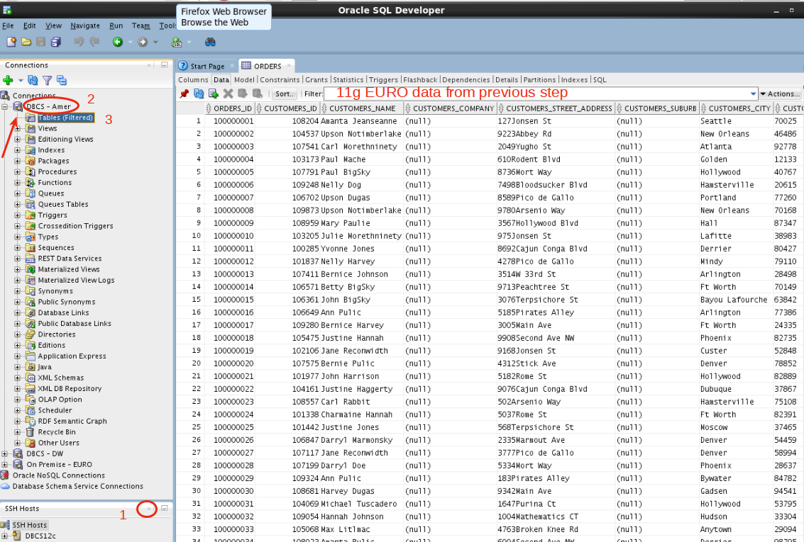

### **STEP 3**: Configure OGG (On-premise/Source)

- Note this is:
	- Using our On-premise/Compute image through VNC
	- Our source data configuration for 11g Database (schema euro)
	- USes OGG (not GGCS) with Classic Extract 

- Open a terminal window and start a SOCKS5 Proxy Tunnel.  This will encrypt data and send it through an SSH tunnel.  First open the lab folder on the desktop.

	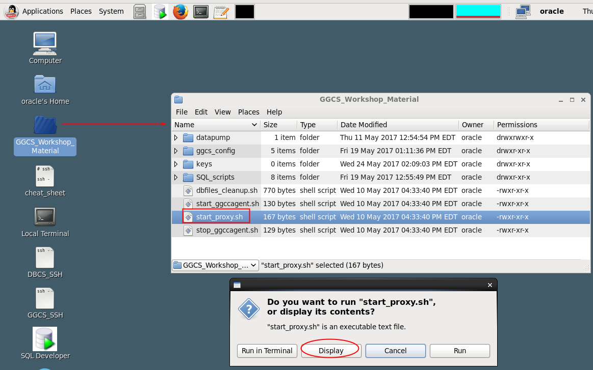

- Then open the start_proxy.sh script.  Take a look at it.  It maps local port 1080 to port 22 and encrypts the traffic.  We will reference this port in OGG configuration in the following steps.

	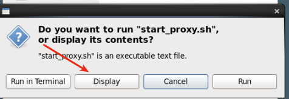

	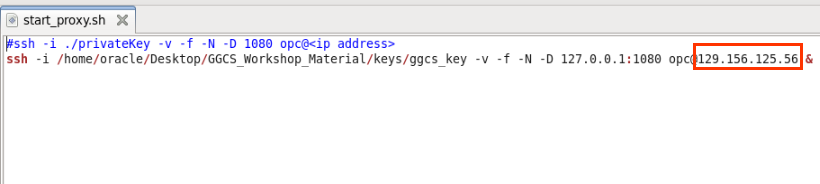

- Close the window (do not save), and double click on this file and select 'Run in Terminal'.  **LEAVE THIS WINDOW OPEN - DO NOT CLOSE IT..YOU CAN MINIMIZE IT**.

	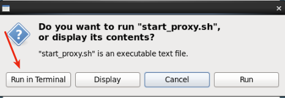

	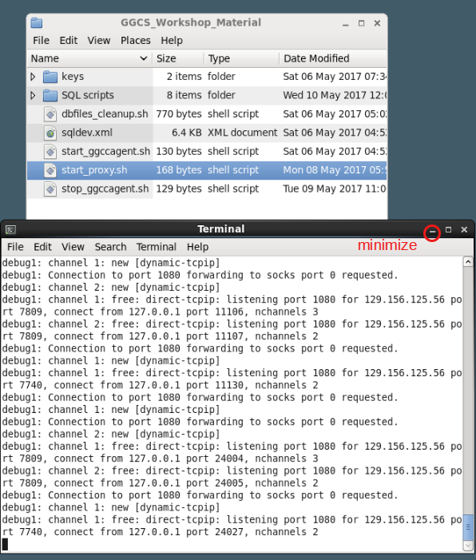

- Start a GoldenGate command session.  Open a terminal window (double click on terminal on the desktop), and enter the following:
	- **Switch to the GG home directory:** `cd $GGHOME`
	- **Start a gg command session:** `./ggsci`

	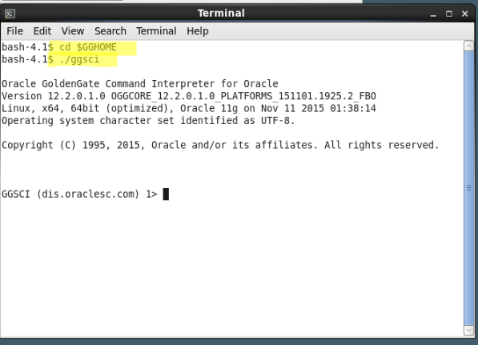

- Review OGG parameters.  
	- **Open a file browser window and switch the the following directory:** `/u01/app/oracle/product/11gogg/dirprm`

	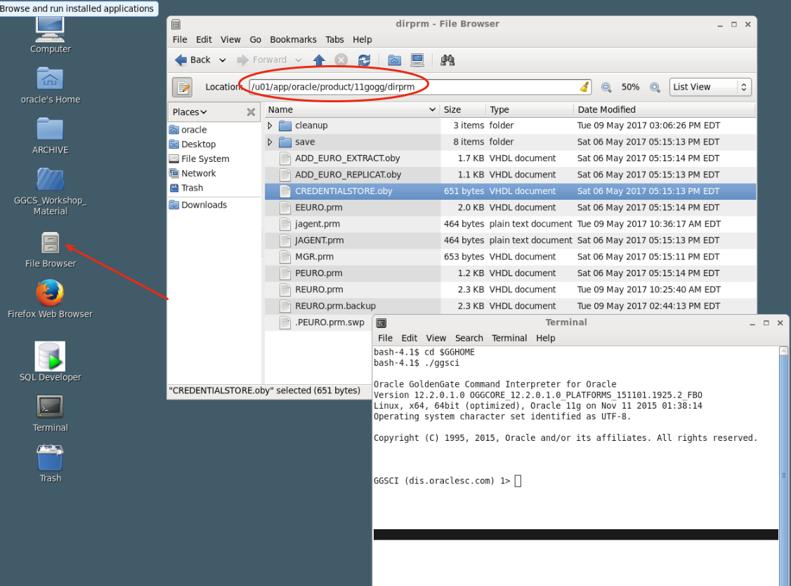

- In the ggsci terminal window view the parameter CREDENTIALSTORE.oby.  Note that you can also open the file with gedit in the file browser menu.  The command view param is a shortcut way to view gg parameter files without having to navigate to the directory.
	- **Enter the following:** `view param ./dirprm/CREDENTIALSTORE.oby`

	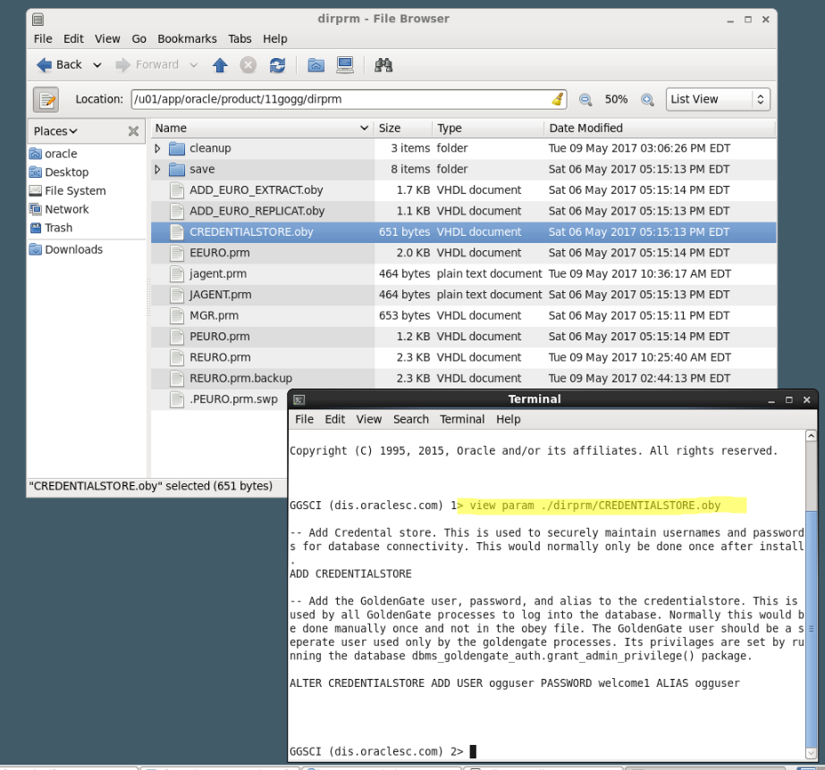
 
 - In the screen above note that the this credential allow us to connect to the local 11g database with an alias without having to specify an OCI connection.  You will see reference to alias ogguser in other gg configuration files.

 - Run this set of gg commands using oby files.  
 	- **Enter the following:** `obey ./dirprm/CREDENTIALSTORE.oby`

 	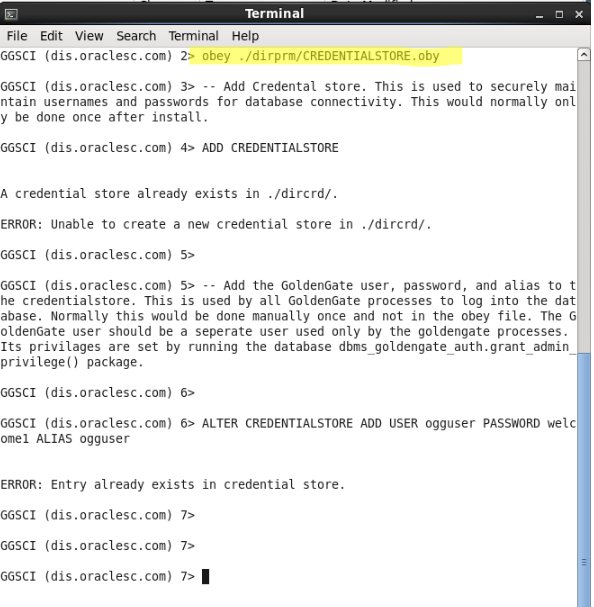

- Review extract configuration.  Note: if you go back and review the overview architecture diagram at the beggining if this lab you can identify these components (Extract, pump, trail file, etc.).  
	- **Enter the following:** `view param ./dirprm/ADD_EURO_EXTRACT.oby`
		- **DBLOGIN USERIDALIAS ogguser** log in
		- **ADD EXTRACT EEURO, TRANLOG, BEGIN NOW**: Add extract
		- **ADD EXTTRAIL ./dirdat/lt, EXTRACT EEURO, MEGABYTES 50**:  Add trail file prefix (trail files are lt0000000001..etc.)
		- **ADD EXTRACT PEURO, EXTTRAILSOURCE ./dirdat/lt**  Add pump
		- **ADD RMTTRAIL ./dirdat/rt, EXTRACT PEURO, MEGABYTES 50** Add remote trail file prefix
		- **ADD TRANDATA euro.** This allows you to specify at the schema or table level what data is extracted (fine control)
	
 	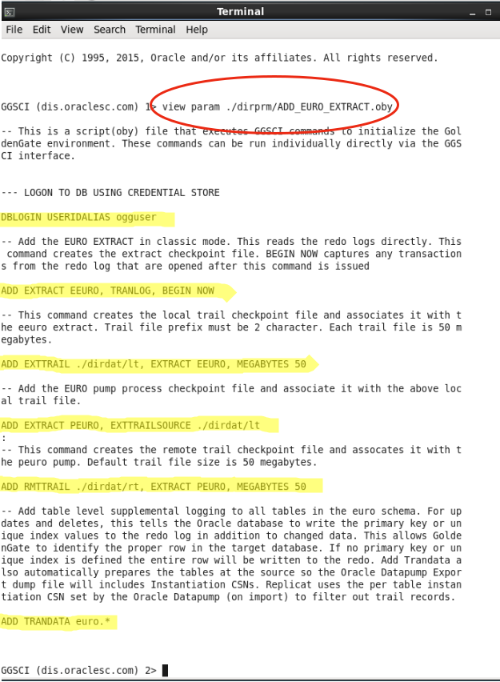
	
- Execute commands to add EURO extract:
	- **Enter the following:** `obey ./dirprm/ADD_EURO_EXTRACT.oby`

 	

- Scroll through the terminal window to view the results.

- Edit parameters PEURO and set the IP Address.  Note the other parameters.
	- **Enter your DBCS IP address:** see highlighted text below

 	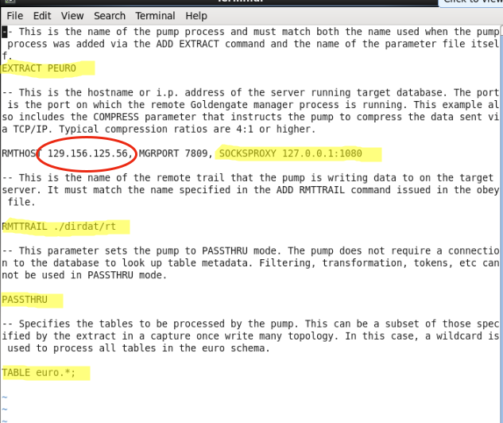

- Save the updates when you are finished.
	- **Select the following:** `Save Contents`

 	

### **STEP 4**: Configure GGCS (Cloud/Target) 

Note this is:
- Using our GGCS Service (which also runs on Compute) paired with a DBCS for both GGCS metadata and target data
- Our target data configuration for 12c Pluggable Database (schema amer)
- USes GGCS (not on-premise OGG) with Integrated Replicat

### **STEP 5**: Start Extracts and Migrate Data with Datapump

Start..
- start eeuro
- start peuro
- expdp..
- scp..
- impdp..
- Review target data

### **STEP 6**: Generate Transactions and Review Data Movement/Results

Start..
- generate transactions
- review source and target data
- start ramer
- review source and target data
- OGG: stats eeuro total
- GGCS: stats ramer total