Update May 2, 2017

## Introduction

This is the fourth of five GoldenGate Cloud Service labs, and will review GGCS monitoring.

To log issues and view the lab guide source, go to the [github oracle](https://github.com/pcdavies/GoldenGateCloudService/issues) repository.

## Objectives

- Configure GGCS for monitoring.
- Start monitoring services and review activity.

## Required Artifacts

- Access to your Oracle Cloud account, and GGCS and the Compute image.

### **STEP 1**: Configure On-premise

- Log into VNC on the Compute instance and open Firefox WEB browser and go to `<ip addresss of on prem vm>:7809/groups` (field ***OG1***).  All processes should be up and running.  This is necessary to ensure the monitoring agent will start the first time.

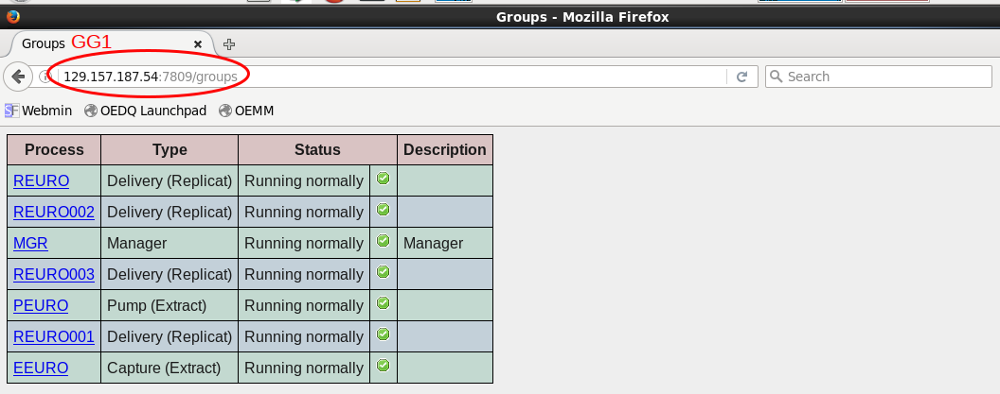

- Next open a file browser in the Compute instance.
	- **Open the following file and review key parameters:** `/u01/app/oracle/product/ggcc_instance/conf/agent.properties`

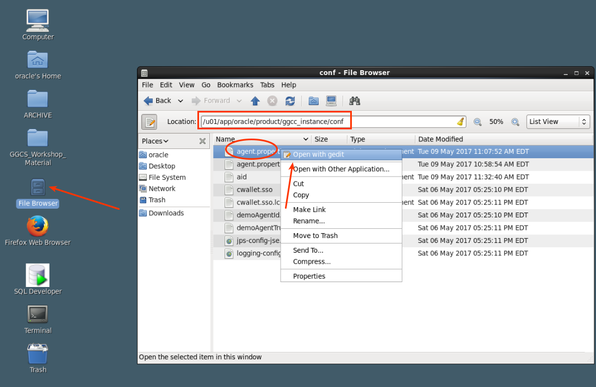

- Review the following fields at the bottom of the file.  **Note we have updated the IP addresses for you:**
    - **ggInstanceHost=** `<ip address of on prem vm>` Field ***OG1***
    - **ggccServiceHost=** `<ip address of ggcs vm>` Field ***GG1***
    - **proxy-127.0.0.1=** `<ip address of ggcs vm>` Field ***GG1***

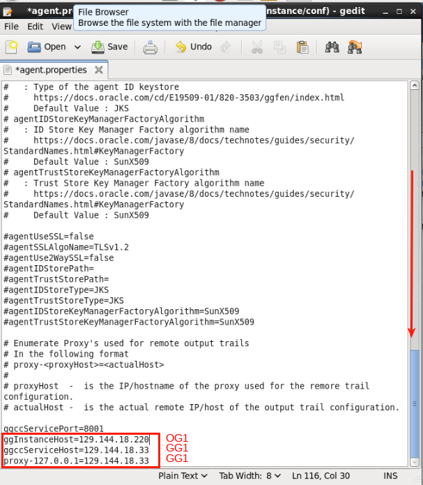

- Start GoldenGate Cloud Service agent:
    - **Open the workshop folder on the desktop.**
    - **Double click on the following file:** `start_ggccagent.sh`
    - **Select Run in Terminal.  LEAVE THIS WINDOW OPEN**

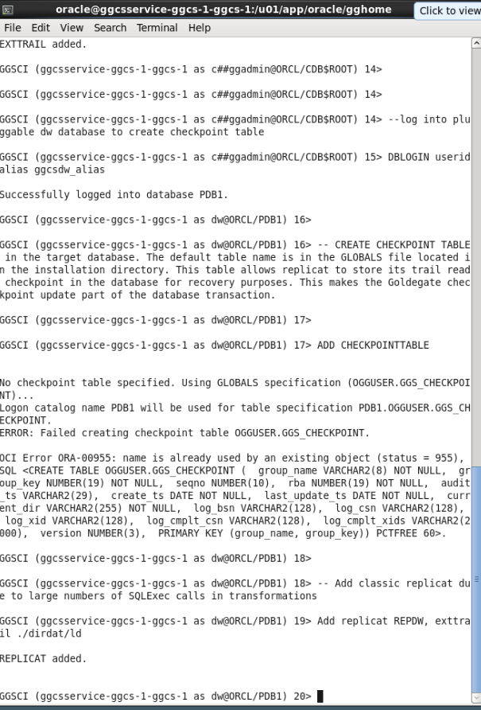

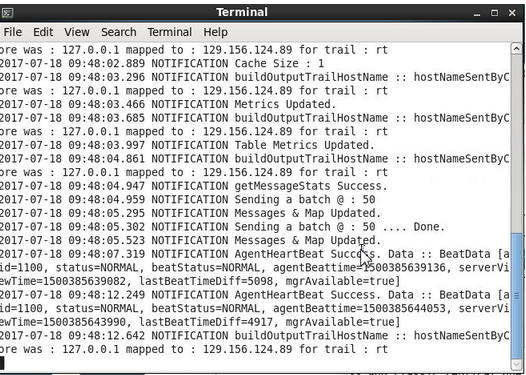

-  Open a new terminal window:
    - **Enter the following:** `cd $GGHOME`
    - **Start ggsci:** `./ggsci`
    - **Start jagent:** `start jagent`

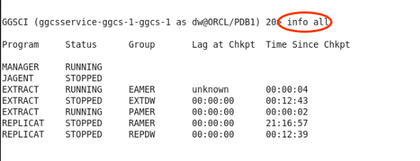

### **STEP 2**: Configure GGCS

- Double click on the `GGCS_SSH` shortcut on your desktop to open a SSH terminal window into GGCS:

    

- Execute the following commands:
	- **Switch to user oracle:** `sudo su - oracle`
    - **Enter the following:** `more /u02/data/ggcc/agent/conf/agent.properties`
    - **Review the key parameters highlighted below.  Note these have been updated for you.**

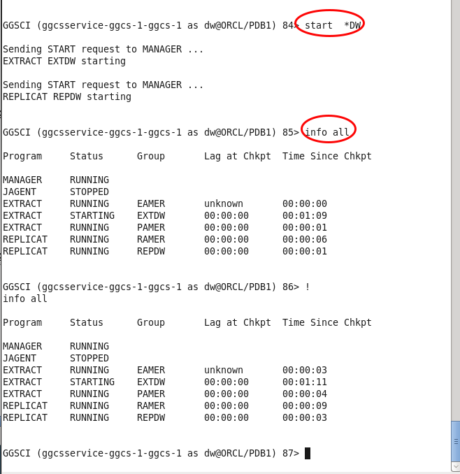

- Open a ggsci command shell and enter the following.  Note the data store may already exist, if so ignore messages that relate to this.
    - **Enter:** `cd $GGHOME`
    - **Start ggsci:** `./ggsci`
    - **Create datastore:** `create datastore` (it may already exist, if so ignore messages about this)
    - **Review processes:** `info all`
    - **Stop Manager:** `stop mgr`
    - **Start Manager:** `start mgr`
    - **Start DW Processes:** `start *`

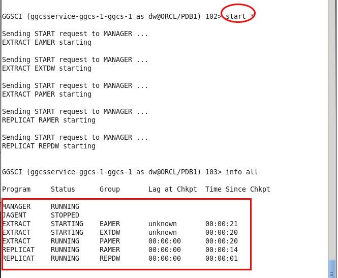

- Add weblogic credentials by executing the following: (**Note - screen shot below shows creds have already been created at the point of screen capture for this lab doc)
    - **Exit ggsci:** `exit`
    - **Enter:** `/u01/app/oracle/middleware/ggccagent/bin/ggccAgent.sh /u02/data/ggcc/agent/conf/agent.properties createServerCred`
    - **You will be prompted separately for weblogic username (enter twice) and password (enter twice):**
        - **Userid:**: Field ***GG2***
        - **Confirm Userid:** Field ***GG2***
        - **Password:** Field ***GG3***
        - **Confirm Password:** Field ***GG3***

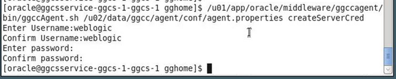

- Start the agent by running the following.  **BE SURE TO LEAVE THIS WINDOW OPEN, DO NOT CLOSE IT!**
    - **Run the following:** `/u01/app/oracle/middleware/ggccagent/bin/ggccAgent.sh /u02/data/ggcc/agent/conf/agent.properties start`

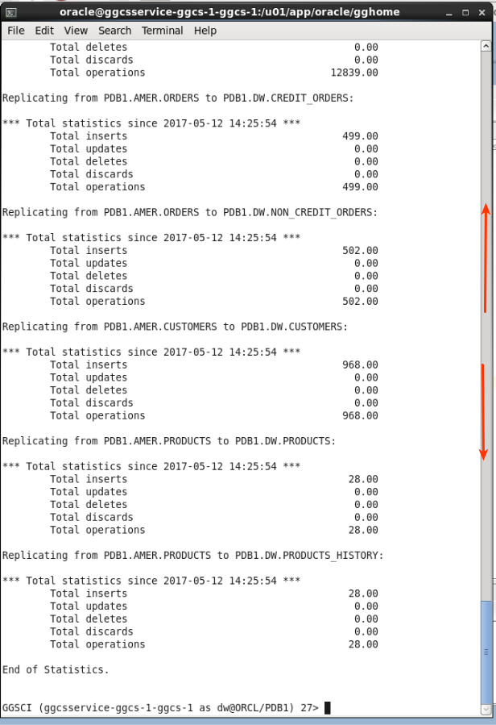

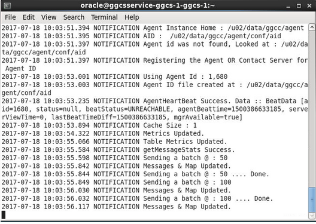

- Open a new terminal window and SSH into ggcs.  Run a process that Integrates the agent with the GoldenGate instance. Then log into ggsci and start jagent.
	- **Double click on GGCS_SSH shortcut on Desktop**
	- **Switch to user oracle:** `sudo su - oracle`
    - **Run the following:**  `/u01/app/oracle/middleware/ggccagent/bin/ggccAgent.sh /u02/data/ggcc/agent/conf/agent.properties intgGGSCI $GGHOME`
    - **Enter:** `ggsci`
    - **Enter:** `info all`
    - **Enter:**  `start jagent`
    - **Confirm the agent is runnning:** `info all`

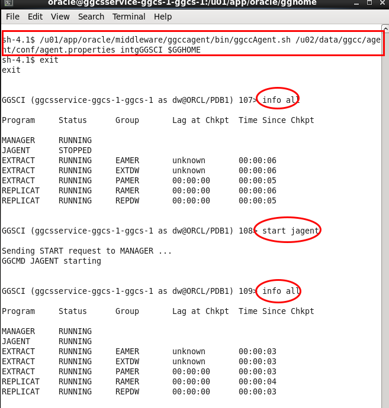

### **STEP 3**: Review Monitoring Services

- Return to your web browser and log into Oracle Cloud and open GoldenGate Control Console from GoldenGate Cloud Service Console (hamburger menu to right of service name)
    - **Log into Oracle cloud:** Fields ***CS1***, ***CS2***, ***CS3***, and ***CS4***

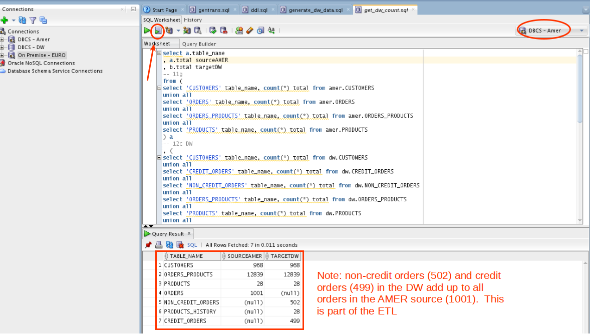

- Access the console using the hamburger menu on the right and log into the Console:
    - **Username:**  Field ***GG2***
    - **Password:**  Field ***GG3***

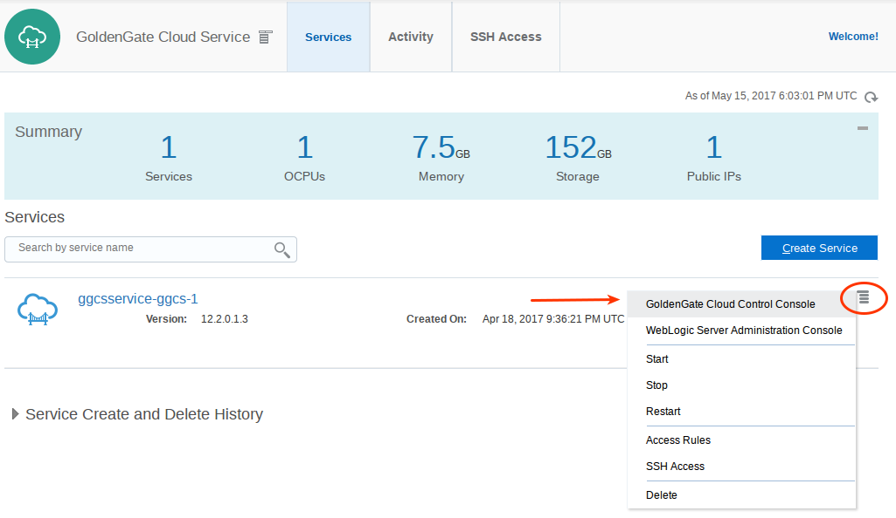

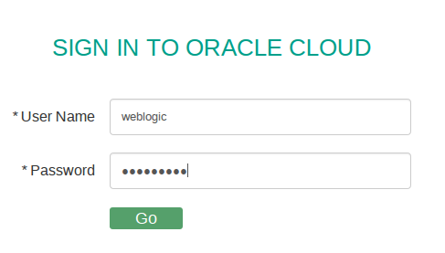

- Review the following (note your screen shot/numbers may look slightly different).
    - **Catalog/Instances**
    - **Catalog Tasks**
    - **Policies**

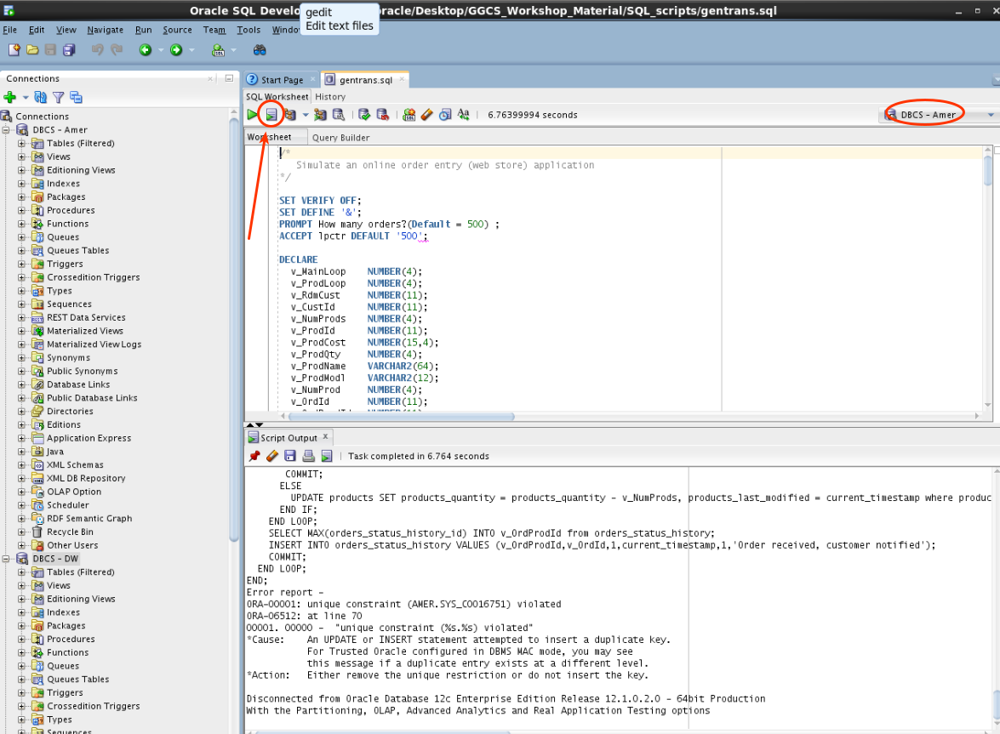

- Review Dashboard Hot Tables.  Click on the largest bar graph.

- Note the replication detail.

- Navigate to instances.  To help clarify which is the on-premise instance and which is the GGCS instance click on the name and rename it.  Provide the names GGCS and On-Prem.  This particular screenshot uses IP addresses from a different instance and will not be consistent with others used throughout these labs.  Use the i.p. addresses from your handout to determine which instance is on-prem (***OG1***) and which is GGCS (***GG1***).

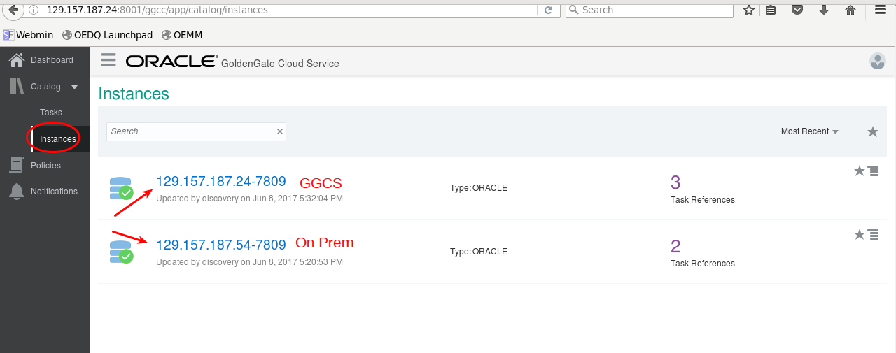

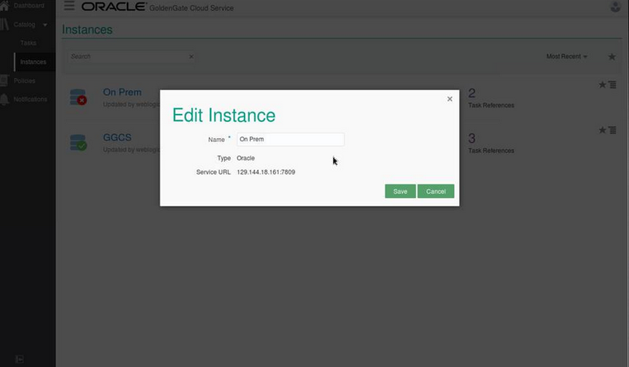

- Note the status of the two instances (up and available).

- Navigate to tasks.  Review activity.

- Return to ggsci and stop EXTDW process.  You may need to open a new terminal window (if you closed it previously):
- **Double click on GGCS_SSH shortcut on Desktop**
- **Switch to user oracle:** `sudo su - oracle`
	- **Run the following:**  `/u01/app/oracle/middleware/ggccagent/bin/ggccAgent.sh /u02/data/ggcc/agent/conf/agent.properties intgGGSCI $GGHOME`
	- **Enter:** `ggsci`
	- **Enter:** `info all`
	- **Enter:**  `stop EXTDW`
	- **Confirm the agent is stopped:** `info all`
	 
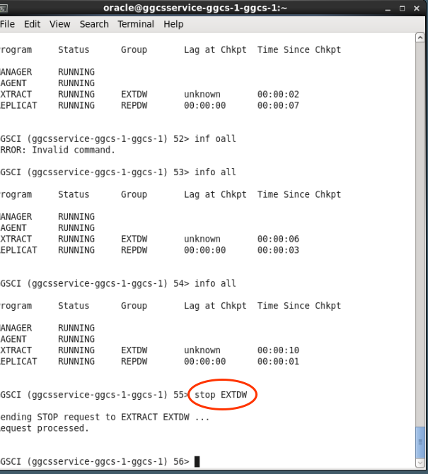

- Return to the Console and review Changes in status in instances, tasks.  

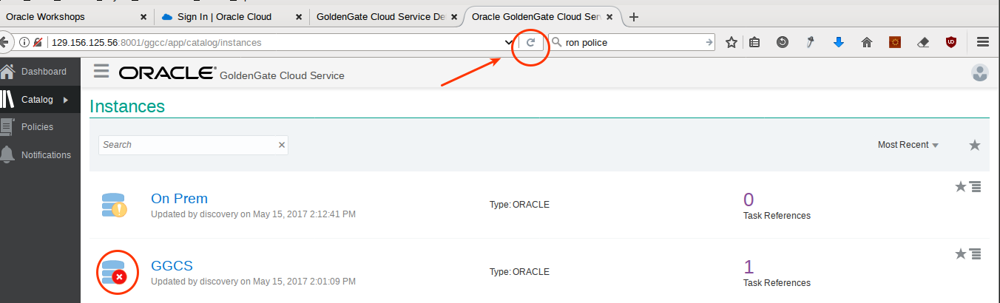

- Review Notifications.  Note the service is down.

- Go back to ggsci and start EXTDW process.
    - **Enter the following:** `start EXTDW`

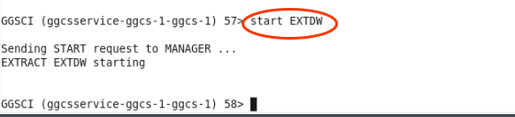

- Return to the Console and review changes in status in instances, tasks. Note service is back up.  Note that when starting and stopping EXTDW a refresh should not be necessary.

