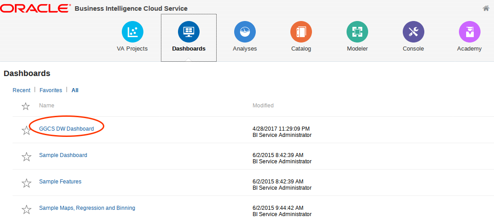
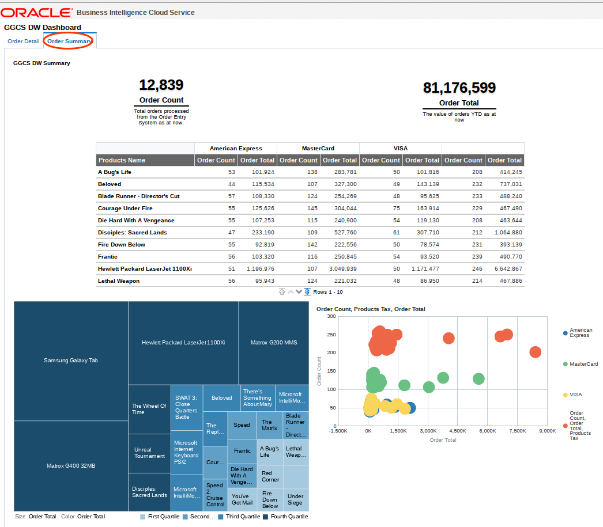
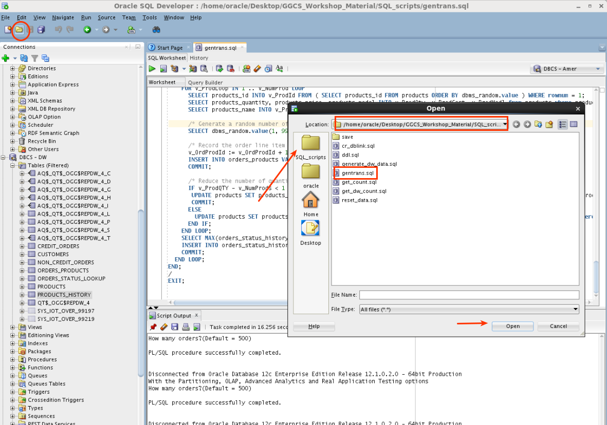

Update May 2, 2017

## Introduction

This is the fourth of five GoldenGate Cloud Service labs, and covers the third use case: Replication and transformation of data from a DBCS 12c pluggable database to a DBCS 12c reporting data warehouse with Business Intelligence analytics access.

This workshop will walk you through replacation of data from a DBCS 12c Pluggable database to another DBCS 12c Pluggable database.  This lab will introduce data transformations as part of the replication process, and will show how you can deliver real-time analytics through Oracle Business Intelligence data visualizations and dashboards.

To log issues and view the lab guide source, go to the [github oracle](https://github.com/pcdavies/GoldenGateCloudService/tree/master/workshops/goldengate/issues) repository.

## Objectives

- Configure GGCS extract and replicat processes for data replication between DBCS 12c Pluggable Databases.
- Process data transformations as part of the data replication process.
- Review auditing support for before/after image (record) capture.
- Show how real time data replication supports real time analytics and reporting.

## Required Artifacts

- Access to your Oracle Cloud account and services DBCS, GGCS, Compute, and BI Cloud Service (BICS).

### **STEP 1**: Configure GoldenGate Cloud Service (GGCS)

- Open a terminal window on the OGG Compute image and ssh to GGCS:
	- **SSH to GGCS:** `ssh -i /home/oracle/Desktop/GGCS_Workshop_Material/keys/ggcs_key opc@<your ggcs IP address>`
	- **Switch to user oracle:** `sudo su - oracle`
    - **Switch to GGHOME:** `cd $GGHOME`
	- **Start a gg command shell:** `ggsci`

    

- View extract and replicat configuration.  Note we are configuring both extract (source) and replicat (target) in on oby file.  Note the use of two different credentials.
    - **Enter the following:** `view param dirprm/ADD_DW_ALL.oby`  Read comments

    

- Create/add extract and replicat processes.
    - **Enter the following:** `obey dirprm/ADD_DW_ALL.oby`

    

- Review processes.
    - **Enter the following:** `info all`

    

- Stop Lab 300 processes and start new DW (Lab 400) processes.
    - **Stop EAMER:** `stop EAMER`
    - **Stop PAMER:** `stop PAMER`
    - **Start DW Processes:** `start *DW`
    - **Review results:** `info all`

    

### **STEP 2**: Generate Insert Transactions and Review Data on Source and Target

- Start SQLDeveloper and run script `generate_dw_data.sql` to generate insert transactions.  Open the script.
 
    

- Run `generate_dw_data.sql` against Amer

    

- Review results.  Scroll up and down to see all stats.
    - **Enter the following in ggsci:** `stats *DW total`

    

- Review results.  Run `get_dw_count.sql` and show that counts match.  Open the script.

    

- Run `get_dw_count.sql` against amer.

    

- Browse the following tables in SQLDeveloper to compare AMER and DW tables to see that the following transformations occurred.  **NO DETAILED SCREEN SHOTS**.
- **CUSTOMERS:** `CUSTOMERS_FIRSTNAME` and `CUSTOMERS_LASTNAME` concatenated into `CUSTOMERS_NAME` column.
- **CUSTOMERS:** mail address stripped out and only domain mapped into `CUSTOMER_EMAIL_DOMAIN` column.
- **ORDERS:** split into `CREDIT_ORDERS` and `NON_CREDIT_ORDERS` tables based on content of  `PAYMENT_METHOD` column.
- **ORDERS:** `ORDERS_STATUS_DESC` column filled in by SQL lookup of value from `ORDERS_STATUS_LOOKUP` table.
- **ORDERS_PRODUCTS:** `FINAL_PRICE` column calculated via stored procedure (they can look at the stored procedure `DW.SP_TOTAL` via GUI if desired)
- **PRODUCTS:**  `PRODUCTS_TAX_CLASS_DESC` column filled in by using case statement
- **PRODUCTS_HISTORY** auditing table populated by inserting all records (note additional columns).

    

### **STEP 3**: Review Audit Support

- Review `PRODUCTS_HISTORY` in `DW` auditing table to see that updates include the BEFORE and AFTER images of updates.

    

### **STEP 4**: Access BICS Dashboards and Review GGCS Replicated Data

- Log into BICS with your assigned userid/password.  **NOTE this is a different userid/password that what you have been using thus far in labs 100 - 400.  You MUST first log out of your other account, and clear browser cache.**
    - **Cloud Login:**  `<BICS userid and password>`

    

    

- Navigate to BI

    

- Click on the Service Instance URL:

    

- Click on Dashboards.

    

- Click on GGCS DW Dashboards

    

- Review Order Detail and Order Summary Dashboards.  In particular note the number of rows.  **The data in your lab may differ from the screenshot here.**  We will be generating more transactions and seeing the Dashboards update.

    

    

- Go back to your VNC Desktop (Compute image) and open SQLDeveloper.  Open the gen_trans.sql file.

    

- Execute the script and specify 500 transactions/orders.  Be sure to select the AMER connection.  GoldenGate will replicate and transform this data over to DW.  Note that, again, the number of orders in your BICS environment will likely differ from the totals here.  Also, the transaction generation process creates rows across several tables and you will not necessarily see the row count rise on the Dashboard by the number of rows you specify in the gen_trans.sql file.

    

- Go back to your browser and the BICS Dashboard, scroll to the bottom, and select `Refresh`.  Note that the row count (and other data) reflect the new transactions that were replicated and transformed in the DW.  The refresh may take several seconds to complete.

    

    