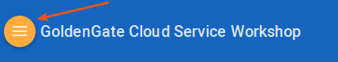

## IMPORTANT: How to prepare for this workshop

**Get an Oracle Cloud Account** 
- Oracle provides several methods for gaining access to Oracle Cloud Accounts used to complete the Labs in this Hands-on-Workshop. 
    - For some workshop events, cloud environments will be provided. 
    - For others events (e.g. **Oracle Code**), or when completing this workshop in a self-service model, you must gain access to your own Trial account. Trial accounts can be obtained at [Try It](http://cloud.oracle.com/tryit) 
    - If you are attending an Oracle sponsored event, please **review your Event invitation** for more instruction on how to gain access to your Workshop Account.
             
## How to View the Lab Guides

- The lab guides are best viewed using the Workshop's [GitHub Pages Website URL](https://pcdavies.github.io/GoldenGateCloudService/workshops/goldengate/) 

- Once you are viewing the Workshop's GitHub Pages website, you can see a list of Lab Guides at any time by clicking on the **Menu Icon**

      

- To log issues and view the lab guide source, go to the [github oracle](https://github.com/pcdavies/GoldenGateCloudService/tree/master/workshops/goldengate) repository.

## Oracle GoldenGate Cloud Services Workshop

This Oracle Public Cloud GoldenGate Cloud Services workshop will give you a basic understanding of the Oracle GoldenGate Cloud Service and many of the capabilities around real time data replication and migration.  Three use cases will be covered.  The first will walk you through setting up zero downtime migration with one-way replication between an Oracle 11g database and a DBCS 12c database.  The second lab will show you how to configure GGCS to perform one-way DML and DDL replication between a DBCS 12c database and an on-prem Oracle 11g database.  The third lab is designed to configure GGCS to replicate data between two DBCS 12c Pluggable Databases with data transformations, and show BICS dashboards against replicated data.  Lastly you will review GGCS monitoring services.

## Workshop Details

**Reference the following Lab Guides by opening their Documentation Files:**

## Lab 100: Introduction to GoldenGate Cloud Service

**Documentation**: [CloudWorkshop_GGCS_100.md](CloudWorkshop_GGCS_100.md)

### Objectives

- Stuff

## Lab 200: On-Premise to Cloud Zero Downtime Migration

**Documentation**: [CloudWorkshop_GGCS_200.md](CloudWorkshop_GGCS_200.md)

### Objectives

- Stuff

## Lab 300: Cloud to On-Premise Replication with DDL

**Documentation**: [CloudWorkshop_GGCS_300.md](CloudWorkshop_GGCS_300.md)

### Objectives

- Stuff

## Lab 400: Cloud to Cloud Replication with Transformations and Real Time BI Analytics

**Documentation**: [CloudWorkshop_GGCS_400.md](CloudWorkshop_GGCS_400.md)

### Objectives

- Stuff

## Lab 500: GoldenGate Cloud Service Monitoring

**Documentation**: [CloudWorkshop_GGCS_500.md](CloudWorkshop_GGCS_500.md)

### Objectives

- Stuff
