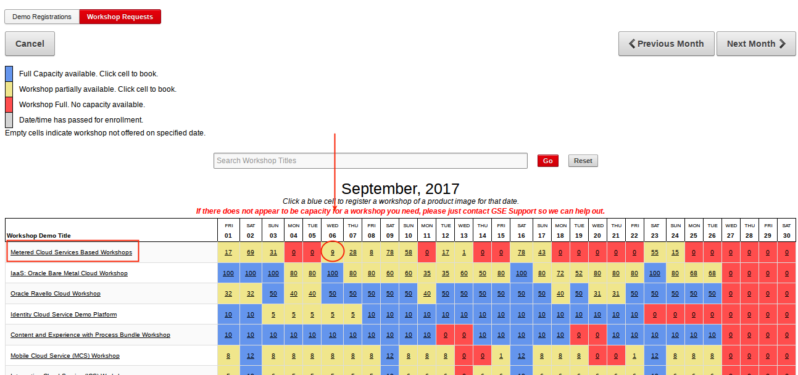
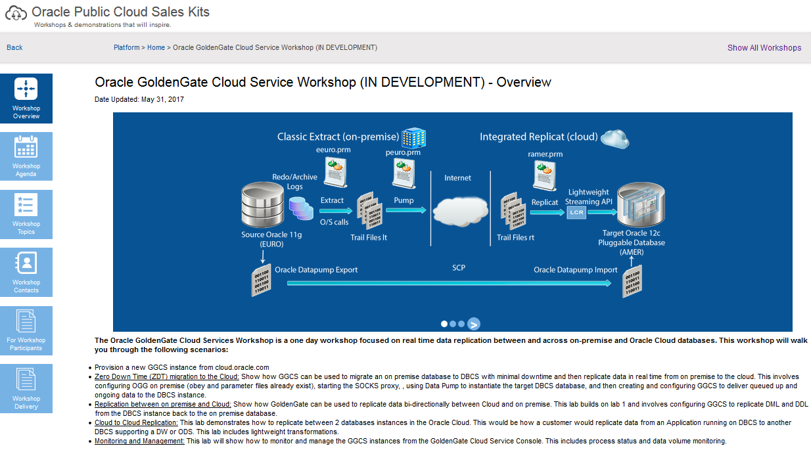
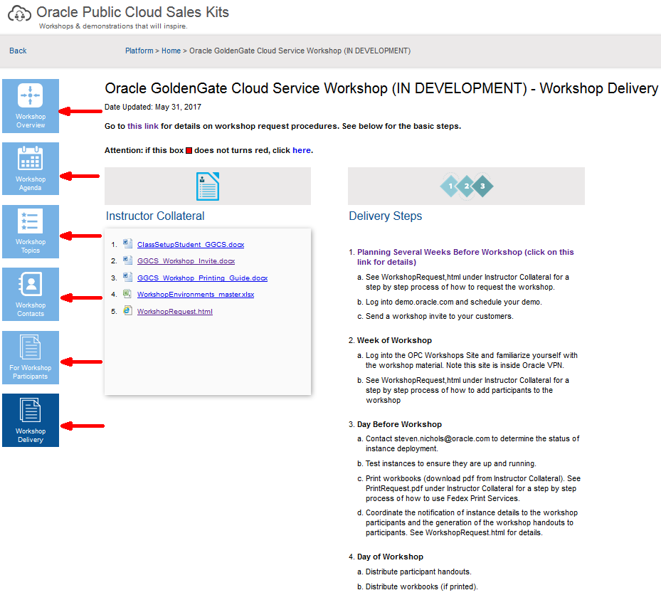
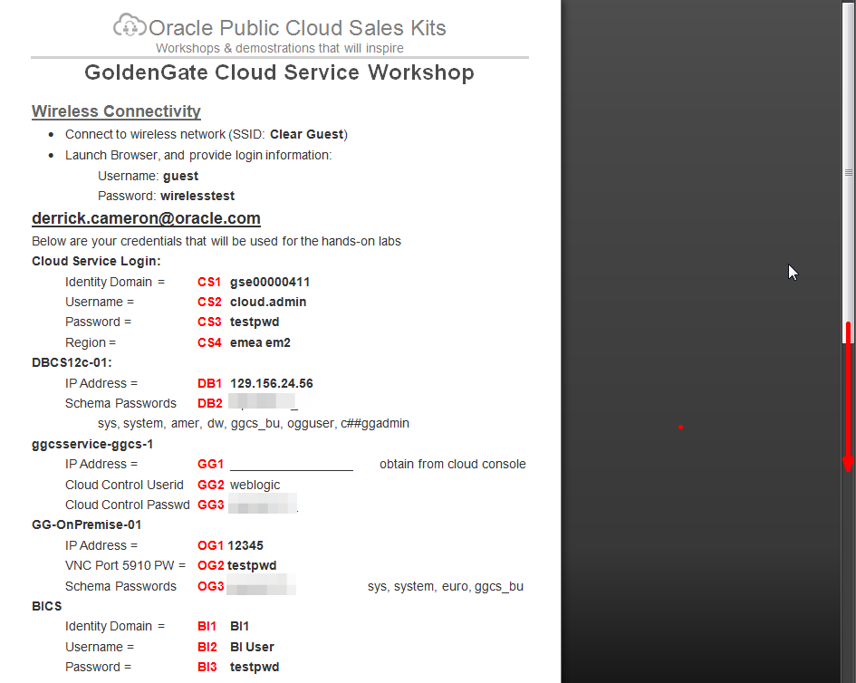

# Steps to Request and Deliver a GGCS Workshop

## **Planning Several Weeks Before Workshop**: 

- Log into demo.oracle.com and select Demo.

	

- Select Workshop Requests, then Request Workshop.

	

- You may need to advance to the next month:

	

- Select `Metered Cloud Services Based Workshops`, and the particular date you are interested in running the workshop.  Note that you must plan to also schedule the prior day of the workshop as well so you can test the setup prior to running the workshop.  In this case if we plan on delivering a workshop Thursday Sept 7 we select Wed Sept 6 and we know that there are only 9 instances available, even though the next day shows 28. 

	

- Complete the details and submit.  Note the following: 
	- **Workshop Name:** `<any name>`
	- **Workshop Purpose:** `Customer Demo/Prep`
	- **Primary Contact:** `enter your email address - only the primary and seconday contact can access this`
	- **Start Date:** `enter one day prior to the workshop`  This is needed to provision and test the instances.  This takes several hours.
	- **End Date:** `enter the workshop date`
	- **Refresh Env. Nightly:** `enter No`
	- **Numer of Participants:** `enter participant number - note that we have experience some failures, so be prepared to have your participants double up if not all environments are available`
	- **Data Set Recipe:** `NATDSE-GoldenGate Cloud Service Workshop (MAINTENANCE)` Do NOT select GoldenGate Cloud Service (GGCS) (MAINTENANCE)
	- **Secondary Contact:** `steven.nichols@oracle.com`  This is important.  Steve cannot support you if he is not added as a secondary contact.  This may not be necessary in the future.
	- **Timezone:** `America/New_York` This is also important, so Steve has more time to resolve potential issues rather than waiting till noon (9 AM PT).  
	- **Start Time:** `Enter 6AM to provide more time.

	

- Log into the [OPC Workshops Site](http://innovate.us.oracle.com:81/opcworkshops/overview.html?workshopkey=WS-GGCS) and click on (download) the ***GGCS_Workshop_Invite.docx*** document.  Send this to your customers.  Note this site is inside Oracle VPN.

	

## **Week of Workshop**: 

- Log into the [OPC Workshops Site](http://innovate.us.oracle.com:81/opcworkshops/overview.html?workshopkey=WS-GGCS) and familiarize yourself with the workshop material.  Note this site is inside Oracle VPN.

	

- Review the various pages on the left.  Make note of the Workhop Delivery materials at the bottom.

	

- Add workshop participants for those who are confirmed.  Go into your workshop tab in demo.oracle.com and update participants.

	

- Enter participants and select Apply.

	

## **Day Before Workshop**: 

- Contact steven.nichols@oracle.com to determine the status of instance deployment. 

- Test instances to ensure they are up and running.

- Assign Identity Domains to the workshop participants and generate the workshop handouts for participants.  This is a 'mail merge' process in Microsoft Word.  Start by downloading the mail merge documents from the [OPC Workshops Site](http://innovate.us.oracle.com:81/opcworkshops/overview.html?workshopkey=WS-GGCS).

	

- Open the spreadsheet document (***WorkshopEnvironments_master.xlsx***) and enter environment details.  Each student will be assigned an Identity Domain that has the required services.  Steven (and later GSE) will provision these services and then record information about the services in the spreadsheet so participants can access the environments.  This spreadsheet will drive the population of the information into a Word document that will be handed to the participants.  Coordinate the completion of the spreadsheet with steven.nichols@oracle.com, who is provisioning the instances for the workshop.

	

- Open the Word document (***ClassSetupStudent_GGCS.docx***).  Select No if prompted to run a SQL Statement.

	

	

- Select the `Mailings` menu and then `Select Recipients` (upper left) and select `Use Existing List`.

	

- Select Excel Files (lower right), and the select the `WorkshopEnvironments_master.xlsx` file you updated (above):

	

- Select sheet1, leave the default set to `First row of data contains column headers`:

	

- Next select Finish & Merge (upper right) and select `Edit Individual Documents`.  Take the default merge records all.

	 

	 

- This process will create a new document that has the fields from the spreadsheet populated into pages - one page per row in the spreadsheet.  Scroll down and confirm the document is correct.

	 

- Save the document as pdf (name it what you want), and then print it and hand out/assign a page per participant on the workshop day.

	 

	 

## **Day of Workshop**: 

- Assign student environments and distribute student handouts.