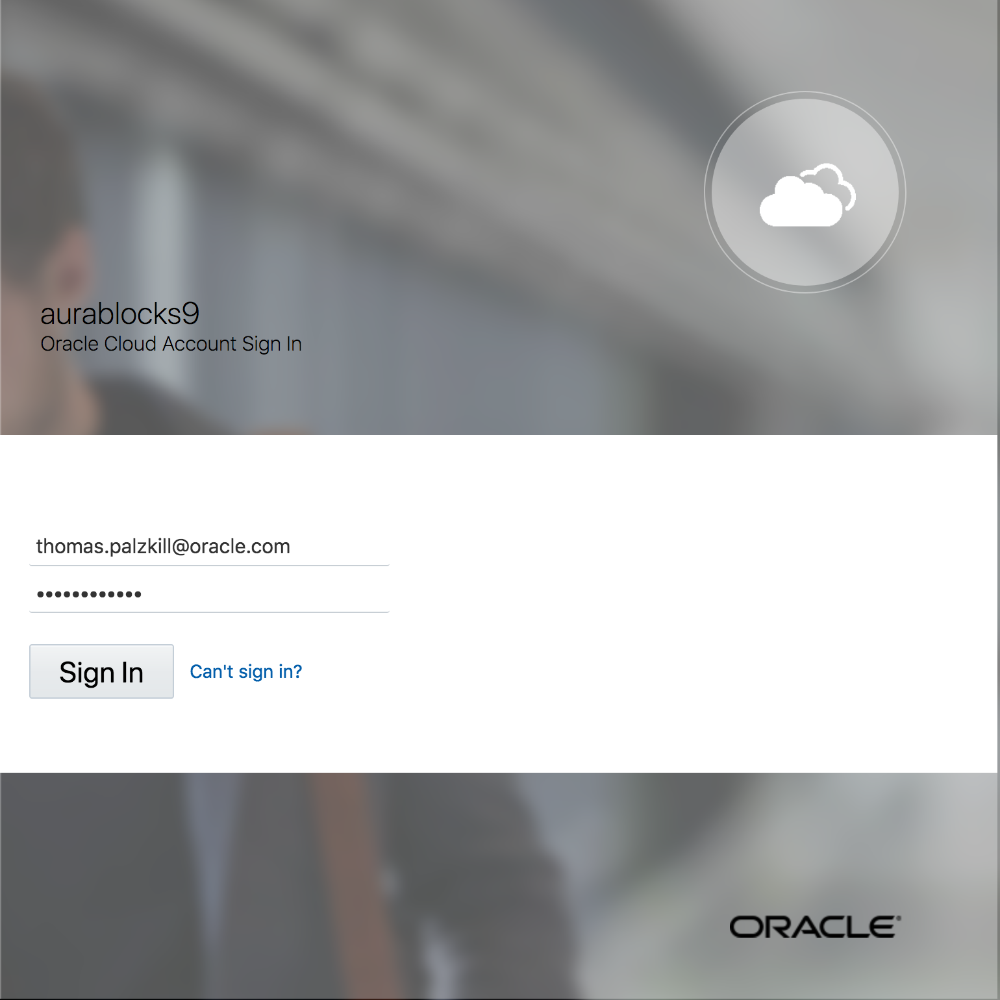
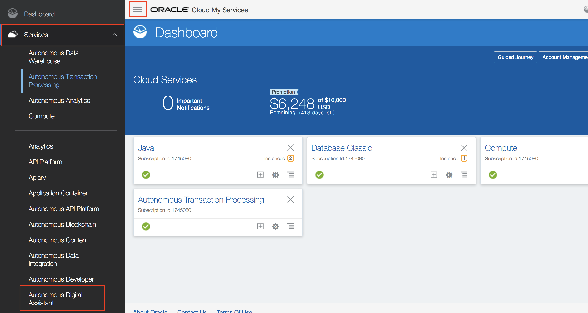
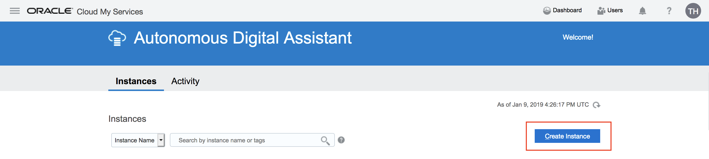

<!-- For provisioning in trial account -->
Provision Autonomous Digital Assistant
=========================
## **Introduction**

In this guided lab you will create a virtual chatbot to facilitate a cafeteria's ordering process step-by-step. Before you can get started with your bot you must first provision Oracle's Autonomous Digital Assistant in your cloud trial account. This first lab will guide you through the provisioning process, when you are finished navigate to lab 100 to begin working with your bot.

### **Objective**

- Provision Oracle Autonomous Digital Assistant in trial account

### **Provisioning Oracle Autonomous Digital Assistant in your cloud trial account**

Navigate to [cloud.oracle.com](cloud.oracle.com) and select sign in.

Enter your credentials and sign in.

Select the hamburger icon in the top left of the page to open the side menu.

Expand services and select “Autonomous Digital Assistant” from the list.

Select “Create Instance”

Name the instance, add a description, select a region and continue to confirmation. Create the instance; it will take a few minutes to provision.

