Updated: April 11, 2017

Intelligent Bots Training
=========================
 

Create ChatBots with Intents, Entities, Utterances and Flow
-----------------------------------------------------------

### Objective

- Create four intents
    - Create utterances
- Add an entity and associate it with your intent for this chat bot creation.
- Define the Dialog flow of your bot
- Train ChatBot and test it

### **STEP 1**: Create a simple Cafeteria Assistance ChatBot

Log in to your ChatBot Tenant instance, then click the **Bots** button on left-navigation menu.
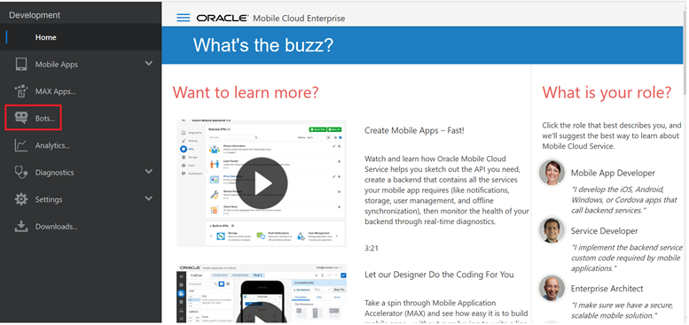

On the ChatBot Tenant instance dashboard, click the **New Bot** button.

***DISCLAIMER*** “The MCSe trail environment GUI might be little different than our test environment”

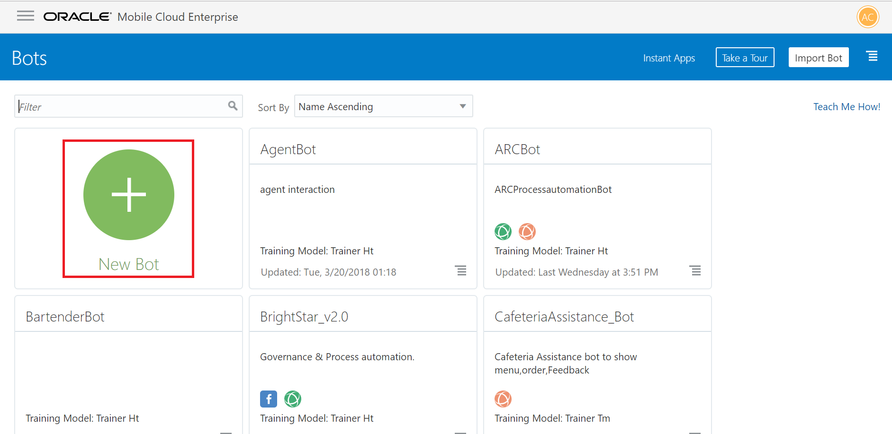

In the **Create Bot** dialog, name the ChatBot CafeteriaAssistance\_Bot. Then, add a description and click **Create**.

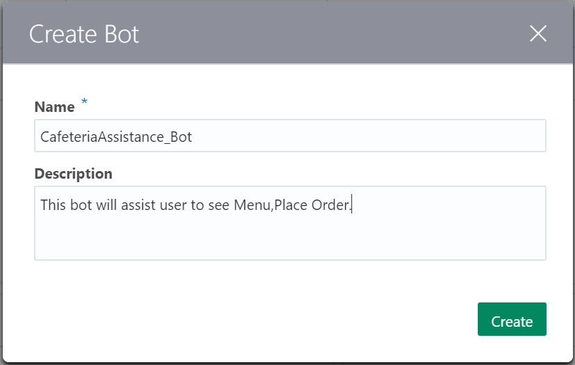

You are taken to the home page for your bot. Here on the left you can see a list of icons you use to navigate to your **Intents, Entities, Flow, Resource Bundles, QnA, Components, Settings and Quality**. At this time, you have no intents.

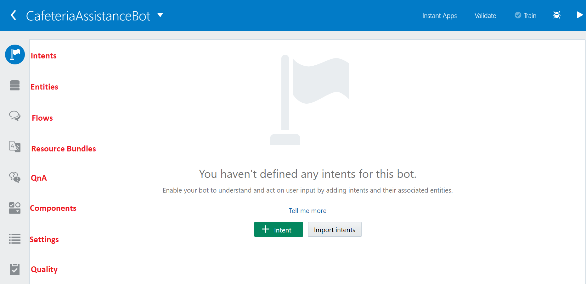

### **Step 2**: Add an Intent, Entity for show menu

From your ChatBot, click the **Intent** icon and then click the green **Intent** button.

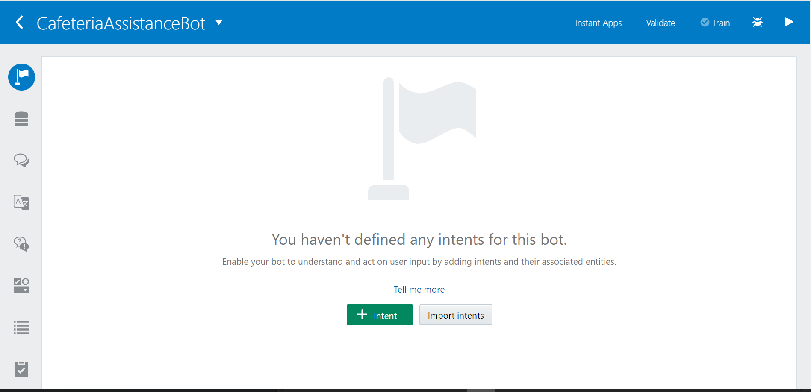

This intent will be used to show the cafeteria menu. Enter **ShowMenu** as the intent name, and then provide a description. These values are automatically saved, so you do not need to explicitly save them. As you create artifacts, you may notice a message in the lower right corner that your work has been saved.

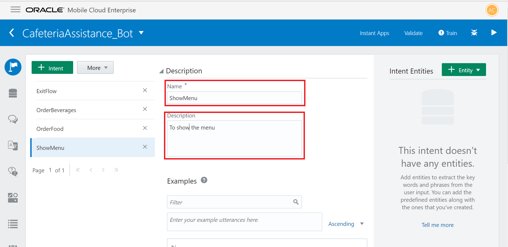

Now that you have an intent, you need some sentence examples to express what a show menu is. In the Examples area add the following text: **show menu,** followed by a return.

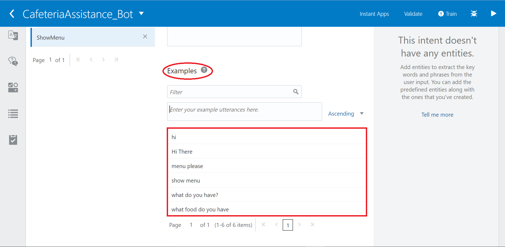

Add another example utterance: **what do you have?**, followed by a return.

Include the list of example utterances below to your intent, each followed by a return. Notice that the examples do not need to be in the form of a question, they can be a statement.

-   **hi**

-   **Hi There**

-   **menu please**

-   **show menu**

-   **What do you have?**

-   **What food do you have**

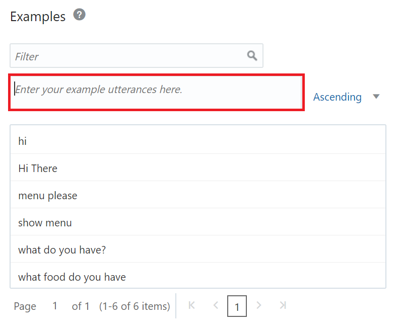

### **Step 3**: In the similar way add OrderFood intent:

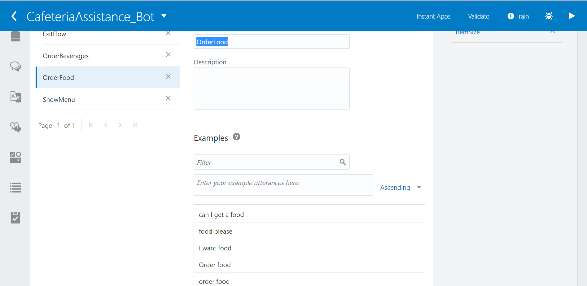

Add the below utterances for the OrderFood intent:

1.Can I get a food

2.Food please

3.I want food

4.Order Food
<!-- TODO: are utterances case sensitive? if not, remove #5 -->

<a name="step-4-add-an-intent-entity-for-order-beverage"></a>
### **Step 4**: In the similar way add OrderBeverages intent:

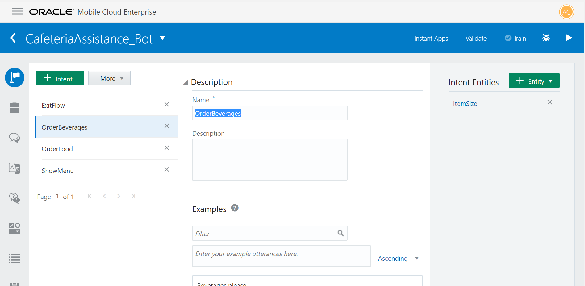

Add the below utterances for the OrderBeverages intent:

1\. Beverages please

2\. Can I get Beverages?

3\. I want Beverages
<!-- TODO: are utterances case sensitive? if not, remove #4 -->

4\. What kind of Beverages do you have?
<a name="step-5-add-an-intent-entity-for-exit-flow"></a>
### **Step 5**: In the similar way add ExitFlow intent:

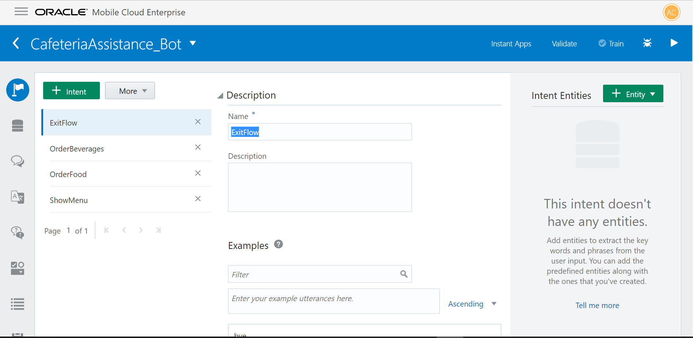

Add the below utterances for the ExitFlow intent:

1\. Bye

2\. Great

3\. Thank You

4\. Thank
<!-- TODO: are utterances case sensitive? if not, remove #5 -->

### **Step 6**: Now that the intent is created, add an entity.

If you want the list of options i.e. sizes (based on the quantity) in this bot for the item which user can choose to order, you would probably need to show the list of different available sizes of the item.

On the left-navigation bar, click the second icon down named **Entities** and you’ll be able to view pre-populated system entities. These are standard entities that can be used in your ChatBot without having to explicitly define them.

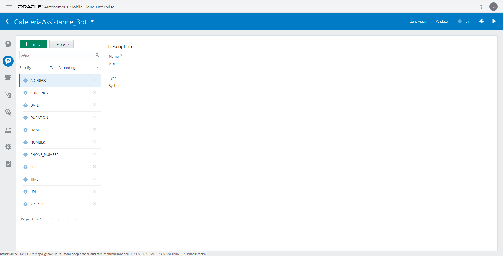

Click the green **Entity** button and then enter **ItemSize** as the entity name and a short description.

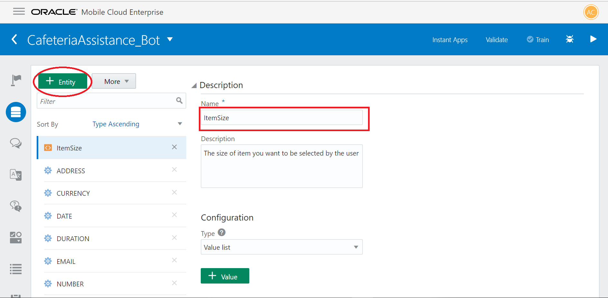

Now that you have an entity, you need to provide some values that could be used. In our case of the **ItemSize**, you would want to use values that represent size you could query for the order.

In the **Configuration** area, ensure the **Type** property is set to Value List (To create the list of values based on the requirement) and then click the green **Value** button.

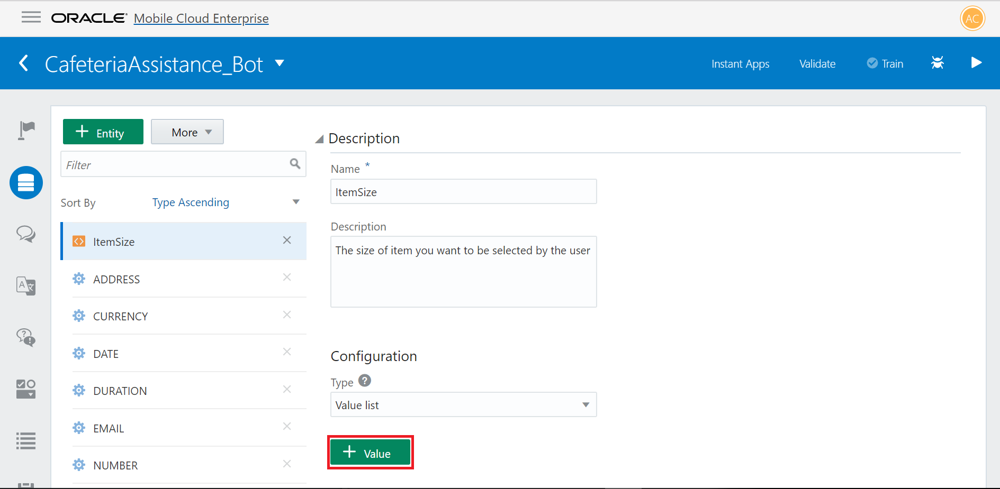

In the popup dialog, enter **Small** as the value and **small** as a synonym (followed by a return).

Then click **Create**.

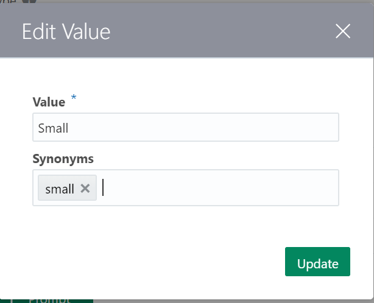

Then, add a second value named **Medium** and this time add a synonym of **normal**.

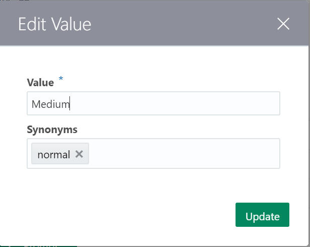

Finally, add a third value named **Large** and use **big** as the synonyms.

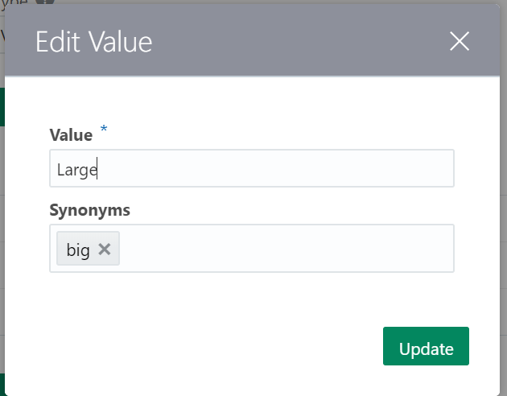

When finished your entity definition should look like the image below.

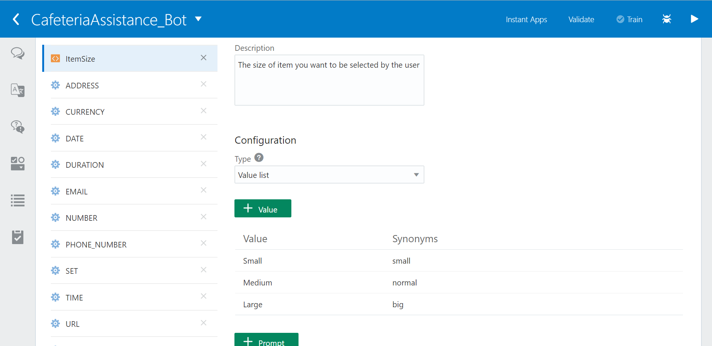

Now you've got 4 intents (ShowMenu, OrderFood, OrderBeverages and ExitFlow) and an entity named as ItemSize. You need to associate the **OrderFood** and **OrderBeverages** intents with **ItemSize** entity, and it's easy to do.

Click the **Intent** icon, and on the right find the **Intent Entities** area.

Click the green **Entity** button and select **ItemSize** from the list, after selection your screen will look like below screen:

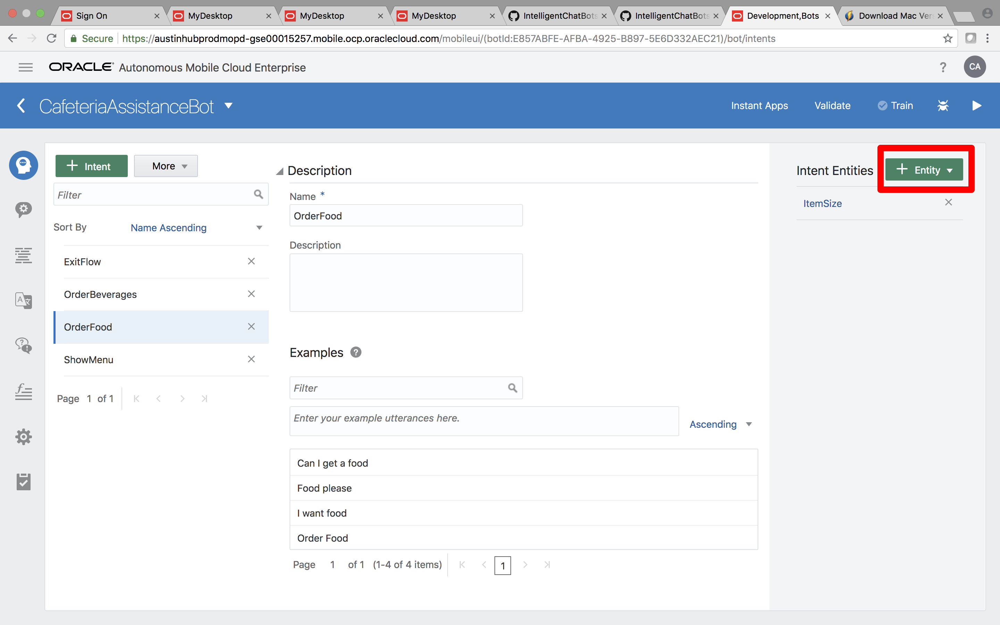

The entity is added and a required flag is set. If you want you can remove the entity by clicking the **x** to the right of the entity name. Do not remove the entity from your intent.

### **Step 7**: Define the Conversation Flow

With the intent and entity created, the next thing we need is a flow. Click the Flow icon on the left; some code has been added to display hello when activated. For the sake of brevity, you can simply replace all of the code with the below file content (Please click the below file to copy the content):

```
metadata:
  platformVersion: "1.1"
main: true
name: "CafeteriaAssistanceBot"
context:
  variables:
    iresult: "nlpresult"
    foods: "string"
    beverages: "string"
    dummy: "string"
    orderedFood: "string"
    orderedFoodImage: "string"
    itemSize: "ItemSize"
    location: "string"
    cardsRangeStart: "int"
    feedback: "string"
defaultTransitions:
  error: "DefaultErrorHandler"
  actions:
    unexpectedAction: "HandleUnexpectedAction"
    ExitFlow: "exitFlow"
states:
  setCardsRangeStart:
    component: "System.SetVariable"
    properties:
      variable: "cardsRangeStart"
      value: 0
    transitions: {}
  LoadFoods:
    component: "System.SetVariable"
    properties:
      variable: "foods"
      value:
      - name: "Afghani Chicken Biryani"
        description: "We took the all-time favorite and made it better by giving it an Afghani touch."
        image: "http://res.cloudinary.com/psjsaravana/image/upload/v1522685529/CafeteriaAssistant/Afghani-Chicken-Biryani_2.jpg"
      - name: "Black Forest Cake"
        description: "Black forest cake with a sinful layer of rich chocolate mousse."
        image: "http://res.cloudinary.com/psjsaravana/image/upload/v1522685529/CafeteriaAssistant/836x663-Black-Forest.jpg"
      - name: "Big Crunch Chicken Classic Burger"
        description: "Juicy chicken patty seared to perfection. Then, stuffed between soft oatmeal buns along with fresh veggies. So good, you will be tongue-tied."
        image: "http://res.cloudinary.com/psjsaravana/image/upload/v1522685528/CafeteriaAssistant/Big-Crunch-Chicken-Classic-Burger.jpg"
      - name: "Big Crunch Veg Cheese Burger"
        description: "Flavourful veggie patty cooked to perfection. Then, stuffed between soft oatmeal buns with handpicked veggies. Sure to make your eye widen and jaw drop."
        image: "http://res.cloudinary.com/psjsaravana/image/upload/v1522685528/CafeteriaAssistant/Big-Crunch-Veg-Cheese-Burger_2.jpg"
      - name: "Chilli Cheese Toastizza"
        description: "Get cheesy with this crispy toast topped with onions, tomatoes and capsicum, loaded with cheese and sprinkled with chilli flakes"
        image: "http://res.cloudinary.com/psjsaravana/image/upload/v1522685528/CafeteriaAssistant/Chilli-Cheese-Toastizza_2.jpg"
      - name: "Egg Wrap"
        description: "For the Desi at heart! Classic Indian egg bhurji with onions, capsicum and paprika, folded into a scrumptious Malabar paratha wrap."
        image: "http://res.cloudinary.com/psjsaravana/image/upload/v1522685529/CafeteriaAssistant/Egg-Wrap_2.jpg"
      - name: "Crackling Brownie"
        description: "A Rich gooey classic American fudge brownie"
        image: "http://res.cloudinary.com/psjsaravana/image/upload/v1522685529/CafeteriaAssistant/836x663-Brownie.jpg"
      - name: "Crispy Veg Wrap"
        description: "We made veggies taste good. You can thank us later."
        image: "http://res.cloudinary.com/psjsaravana/image/upload/v1522685528/CafeteriaAssistant/CrispyVeg_2.jpg"
    transitions: {}
  
  LoadBeverages:
    component: "System.SetVariable"
    properties:
      variable: "beverages"
      value:
      - name: "Alphonso Mango Milkshake"
        description: "Discover delight in every sip with this divine, sumptuous mango treat."
        image: "http://res.cloudinary.com/psjsaravana/image/upload/v1522769202/CafeteriaAssistant/mango-milkshake-recipe.jpg"
      - name: "Aztec single origin Coffee"
        description: "A delightful international gourment blend that includes a double shot of espresso brewed from a blend of imported coffee beans topped with steamed and foamed milk."
        image: "http://res.cloudinary.com/psjsaravana/image/upload/v1522769201/CafeteriaAssistant/Aztec_single_origin_Coffee.jpg"
      - name: "Classic Lemonade"
        description: "Get refreshed! Introducing a lemonade with a touch of mint and ginger that make for the perfect sip, when you are chillin'."
        image: "http://res.cloudinary.com/psjsaravana/image/upload/v1522769202/CafeteriaAssistant/Classic_Lemonade.jpg"
      - name: "Green Tea"
        description: "An aromatic tea that does wonders for your health. The leaves are mixed with Jasmine flower bits that give a distinct fragrance and flavour. Can be served either with milk or lemon."
        image: "http://res.cloudinary.com/psjsaravana/image/upload/v1522769202/CafeteriaAssistant/Green_Tea.jpg"
      - name: "Cool Blue"
        description: "Cool Blue, a syrupy blue blend skating on crushed ice! Zap away that summer heat and enjoy a tall glass of pure shock, as you plunge your mind into CCD's summer favourite!"
        image: "http://res.cloudinary.com/psjsaravana/image/upload/v1522769201/CafeteriaAssistant/Cool_Blue.jpg"
      - name: "Macchiato"
        description: "Macchiato, meaning 'Marked' is bold espresso with a small amount of foamed milk to compliment it."
        image: "http://res.cloudinary.com/psjsaravana/image/upload/v1522769202/CafeteriaAssistant/Macchiato.jpg"
      - name: "Cold Cocoa Latte"
        description: "Smooth, creamy ice cold chocolate milkshake. Who can say no to this classic beverage?"
        image: "http://res.cloudinary.com/psjsaravana/image/upload/v1522769201/CafeteriaAssistant/Cold_Cocoa_Latte.jpg"
      - name: "Café Americano"
        description: "A double shot of espresso topped with hot water, served with a complimentary milk on the side."
        image: "http://res.cloudinary.com/psjsaravana/image/upload/v1522769202/CafeteriaAssistant/Caf%C3%A9_Americano.jpg"
    transitions: {}  
  Intent:
    component: "System.Intent"
    properties:
      confidenceThreshold: 0.5
      variable: "iresult"
    transitions:
      actions:
        unresolvedIntent: "Unresolved"
        OrderBeverages: "OrderBeverages"
        ShowMenu: "ShowMenu"
        OrderFood: "OrderFood"
  Unresolved:
    component: "System.CommonResponse"
    properties:
      metadata:
        responseItems:
        - type: "text"
          text: "Sorry, I don't understand you, I am not human. Please try another\
            \ sentence."
          name: "Sorry"
          separateBubbles: true
      processUserMessage: false
    transitions:
      return: "done"
  ShowMenu:
    component: "System.CommonResponse"
    properties:
      metadata:
        responseItems:
        - type: "text"
          text: "Hello ${profile.firstName}, this is our menu for today:"
          name: "hello"
          separateBubbles: true
          actions:
          - label: "Food"
            keyword: "1"
            type: "postback"
            payload:
              action: "Food"
            name: "Food"
          - label: "Beverages"
            keyword: "2"
            type: "postback"
            payload:
              action: "Beverages"
            name: "Beverages"         
      processUserMessage: true
    transitions:
      actions:
        Food: "OrderFood"
        Beverages: "OrderBeverages"
        textReceived: "Intent"
  OrderFood:
    component: "System.CommonResponse"
    properties:
      metadata:
        responseItems:
        - type: "text"
          text: "Here are our food items you can order today"
          separateBubbles: true
          rendered: "<#if cardsRangeStart?number == 0>true<#else>false</#if>"
          name: "Our foods"
        - type: "text"
          text: "Some more items for you:"
          separateBubbles: true
          rendered: "<#if cardsRangeStart?number != 0>true<#else>false</#if>"
          name: "More food items"
        - type: "cards"
          cardLayout: "vertical"
          name: "FoodCards"
          actions:
          - label: "More food items"
            type: "postback"
            rendered: "<#if cardsRangeStart?number+4 < foods.value?size>true<#else>false</#if>"
            payload:
              action: "more"
              variables:
                cardsRangeStart: "${cardsRangeStart?number+4}"
            name: "More"
          cards:
          - title: "${foods.name}"
            description: "${foods.description}"
            imageUrl: "${foods.image}"
            name: "FoodCard"
            iteratorVariable: "foods"
            rangeStart: "${cardsRangeStart}"
            rangeSize: "4"
            actions:
            - label: "Order Now"
              type: "postback"
              payload:
                action: "order"
                variables:
                  orderedFood: "${foods.name}"
                  orderedFoodImage: "${foods.image}"
              name: "Order"
          channelCustomProperties:
          - channel: "facebook"
            properties:
              top_element_style: "large"
      processUserMessage: true
    transitions:
      actions:
        order: "AskItemSize"
        more: "OrderFood"
        textReceived: "Intent"
  
  OrderBeverages:  
    component: "System.CommonResponse"
    properties:
      metadata:
        responseItems:
        - type: "text"
          text: "Here are our beverages you can order today"
          separateBubbles: true
          rendered: "<#if cardsRangeStart?number == 0>true<#else>false</#if>"
          name: "Our beverages"
        - type: "text"
          text: "Some more items for you:"
          separateBubbles: true
          rendered: "<#if cardsRangeStart?number != 0>true<#else>false</#if>"
          name: "More beverages"
        - type: "cards"
          cardLayout: "vertical"
          name: "BeveragesCards"
          actions:
          - label: "More beverages items"
            type: "postback"
            rendered: "<#if cardsRangeStart?number+4 < beverages.value?size>true<#else>false</#if>"
            payload:
              action: "more"
              variables:
                cardsRangeStart: "${cardsRangeStart?number+4}"
            name: "More"
          cards:
          - title: "${beverages.name}"
            description: "${beverages.description}"
            imageUrl: "${beverages.image}"
            name: "BeveragesCard"
            iteratorVariable: "beverages"
            rangeStart: "${cardsRangeStart}"
            rangeSize: "4"
            actions:
            - label: "Order Now"
              type: "postback"
              payload:
                action: "order"
                variables:
                  orderedFood: "${beverages.name}"
                  orderedFoodImage: "${beverages.image}"
              name: "Order"
          channelCustomProperties:
          - channel: "facebook"
            properties:
              top_element_style: "large"
      processUserMessage: true
    transitions:
      actions:
        order: "AskItemSize"
        more: "OrderFood"
        textReceived: "Intent"
  AskItemSize:
    component: "System.CommonResponse"
    properties:
      variable: "itemSize"
      nlpResultVariable: "iresult"
      maxPrompts: 2
      metadata:
        responseItems:
        - type: "text"
          text: "<#if user.botsUserError == 'true'>Invalid size, please try again.\
            \ </#if>What size do you want?"
          name: "What size"
          separateBubbles: true
          actions:
          - label: "${enumValue}"
            type: "postback"
            payload:
              action: ""
              variables:
                itemSize: "${enumValue}"
            name: "size"
            iteratorVariable: "itemSize.type.enumValues"
      processUserMessage: true
    transitions:
      actions:
        cancel: "Intent"
      next: "AskLocation"
  AskLocation:
    component: "System.CommonResponse"
    properties:
      variable: "location"
      metadata:
        responseItems:
        - text: "To which location do you want the item to be delivered?"
          type: "text"
          name: "What location"
          separateBubbles: true
        globalActions:
        - label: "Send Location"
          type: "location"
          name: "SendLocation"
      processUserMessage: true
    transitions:
      actions:
        cancel: "Intent"
      next: "Confirmation"
  Confirmation:
    component: "System.CommonResponse"
    properties:
      metadata:
        responseItems:
        - text: "Thank you for your order, your ${itemSize} ${orderedFood} \
            \ will be delivered in 10 minutes at GPS position ${location.value.latitude},${location.value.longitude}!"
          type: "text"
          name: "conf"
          separateBubbles: true
        - type: "attachment"
          attachmentType: "image"
          name: "image"
          attachmentUrl: "${orderedFoodImage}"
      processUserMessage: false
    transitions:
      return: "done"
  HandleUnexpectedAction:
    component: "System.Switch"
    properties:
      variable: "user.botsUnexpectedAction"
      values:
      - "food"
      - "beverages"
      - "order"
    transitions:
      actions:
        NONE: "ActionNoLongerAvailable"
        food: "OrderFood"
        beverages: "OrderBeverages"
        order: "AskItemSize"
  ActionNoLongerAvailable:
    component: "System.Output"
    properties:
      text: "Sorry, this action is no longer available"
    transitions:
      return: "done"
  DefaultErrorHandler:
    component: "System.Output"
    properties:
      text: "Unexpected error occurred, please contact the helpdesk"
    transitions:
      return: "done"
  exitFlow:
    component: "System.Output"
    properties:
      text: "Alright. Have a nice day!"
      keepTurn: true
    transitions: {} 
```
### **Step 8**: Validate, Train and Test your ChatBot

Finally, click the **Validate** button in the upper right and you should see a message that there were no problems found in your bot.

In the next section, you train the bot to recognize responses that might be entered and then test it.

In this part of the tutorial, you run the training tool on the bot. This will train the bot allowing it to understand similar user inputs to the example utterances used when building the bot.

In the upper right, click the **Train** button. This will kick off a process that will run an algorithm to take your example utterances and build the model that will be used to ascertain the intents and entities. Anytime the ChatBot platform recognizes your bot needs to be trained, it will display an exclamation point in the train button. Once the training is complete the exclamation point is replaced by a check mark.

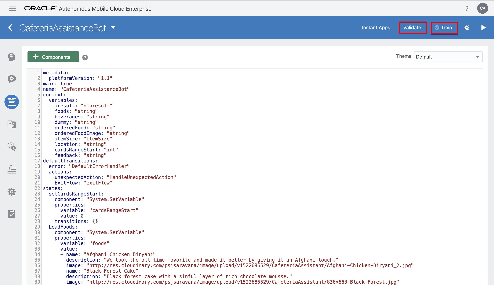

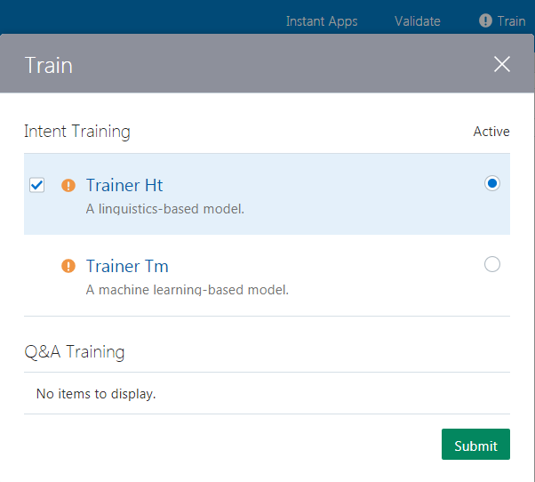

Oracle provides three models that learn from your corpus: Trainer Ht ,Trainer Tm and Q&A Training. Each uses a different algorithm to reconcile the user input against your intents. Trainer Ht uses pattern matching while Trainer Tm detects variations in user input and Q&A training is used to train for the pre-defined question and answers. You'd typically follow training process when you're creating intents:

a.  Choose Trainer Ht from the options.

b.  Refine your corpus , retrain with Trainer Ht. Repeat as necessary.

The Train button () activates whenever you add an intent or when you update an intent by adding, changing, or deleting its utterances. To bring the training up to date, choose a training model and then click Train. The model displays an exclamation point whenever it needs training. When its training is current, it displays a check mark.

To test the ChatBot, click the **play** (Run) icon in the upper right of the page. This takes you into the tester


where you can see three tabs: Bot, Intent and QnA.

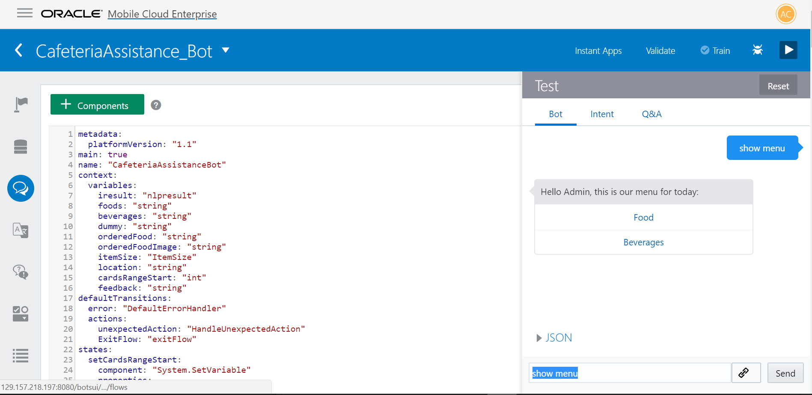

Click the **Bot** tab to test the bot. What you type in at the bottom in the **Message** area, is what will be sent to the bot when you click the **Send** button.

Let's start out simple to test the bot.

In the Message area, type **Show menu** and then click the **Send** button.


The bot will show cafeteria menu for you with two options.

Click one of the option i.e Food and the details for that item is displayed.

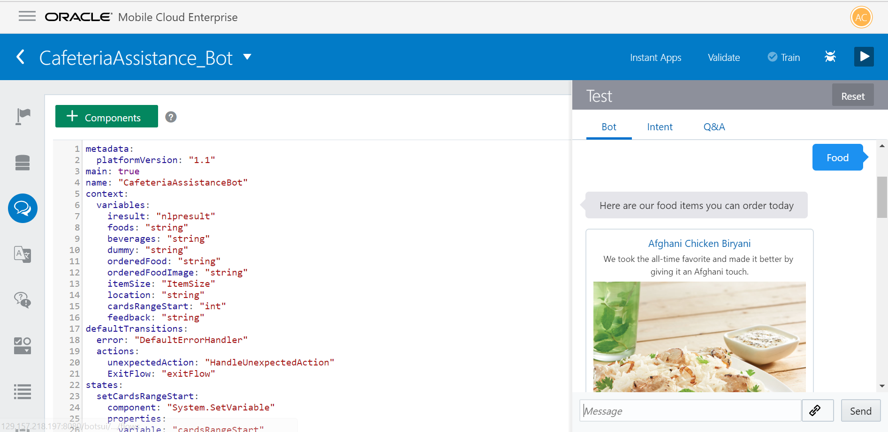

Now, let's try a message that includes the ItemSize.
<!-- TODO: need to include the instructions for testing ItemSize -->

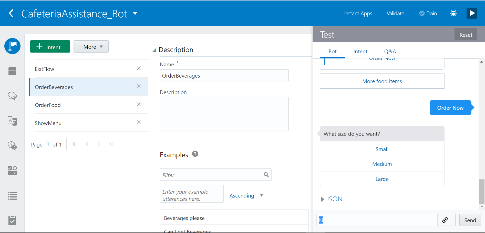

Please finish each flow if you are testing the Bot, or hit **Reset** to create a new session and avoid confusion with an incomplete flow from a previous session.

Now click the **Intent** tab. We are going to now test only the intent and entity resolution rather than a whole conversation flow.

In the message area type **Show menu** and press **Send**.

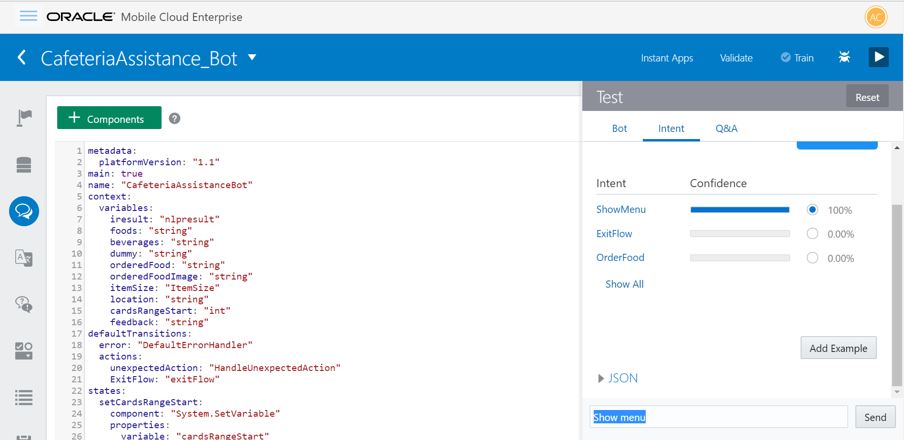

Here you can see a confidence percentage that the message is a particular intent. You also see that the Show menu is recognized.

**Note:** You can see the JSON as click option here as the user interface which is provided for debugging purpose with the Bot is for testing ,so that you can see the JSON response if it's not responding properly. Once you integrate the bot with some channel i.e Facebook messenger,Web Page this JSON option will not show there.

<!-- TODO: it would be good to add some recap text, telling the user what they have accomplished, where you can go from here, and any links to more information -->
#### You have successfully created **Cafeteria ChatBot**. You are now ready to move to the next lab.