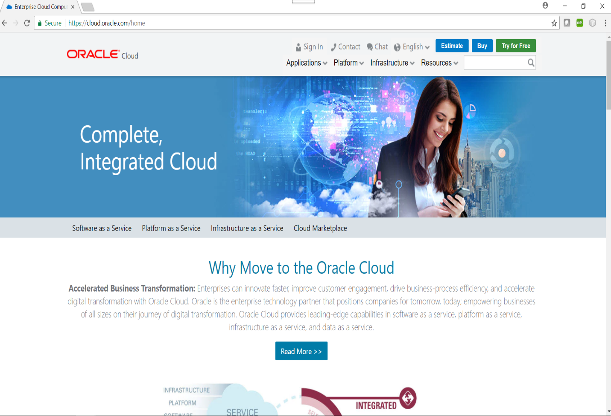
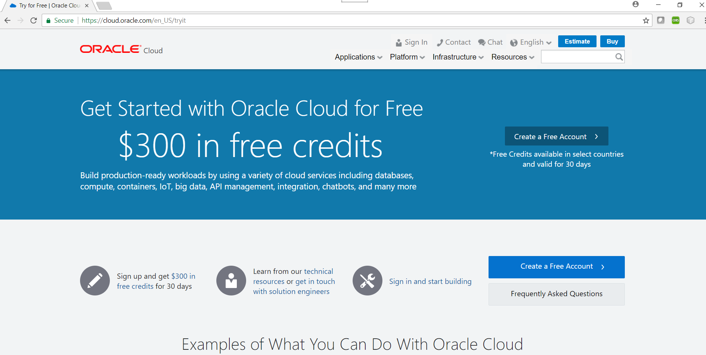
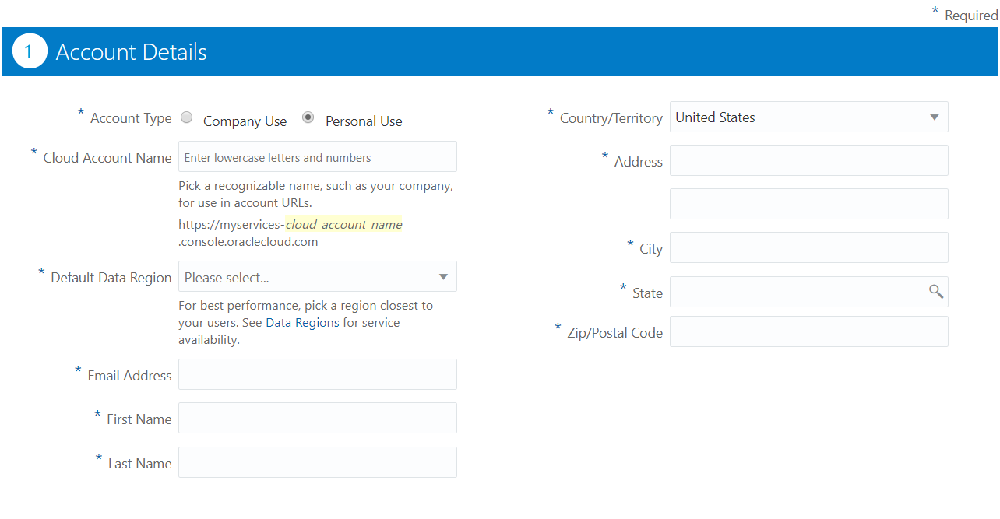
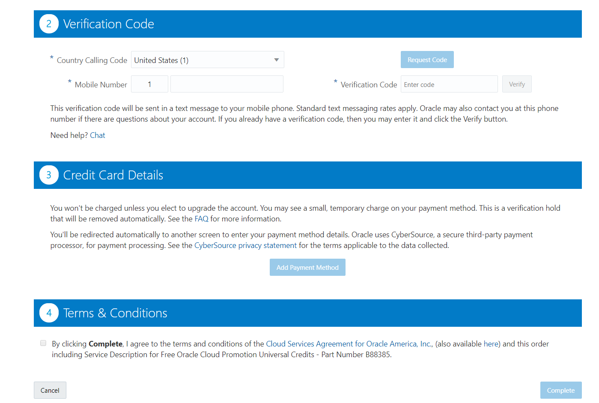
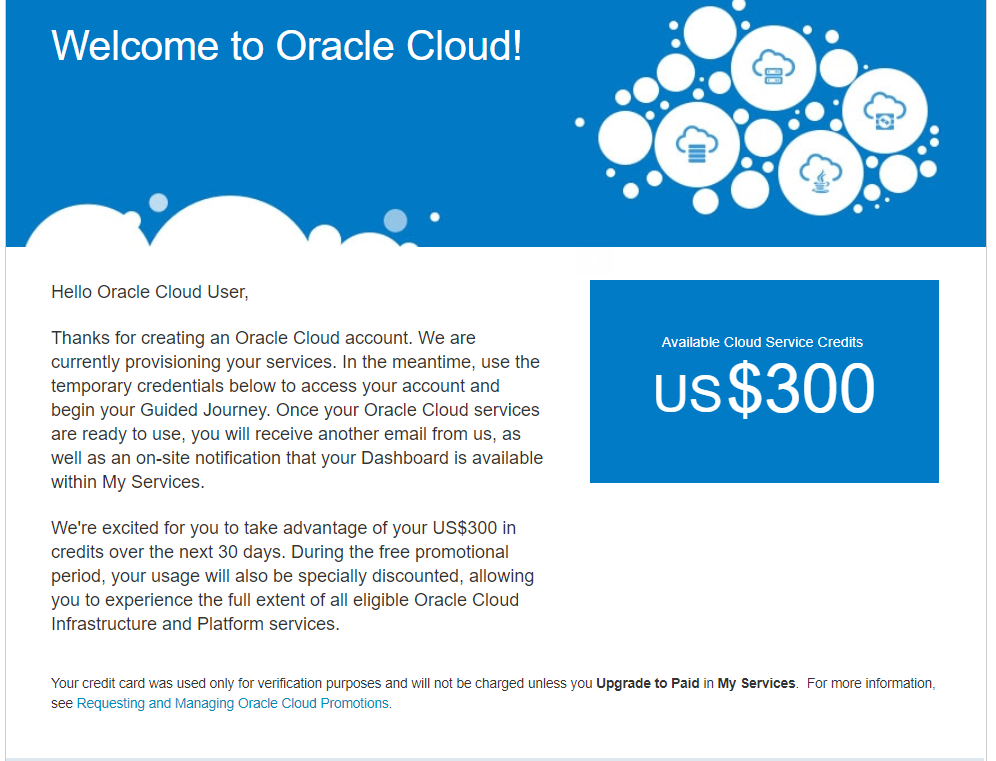
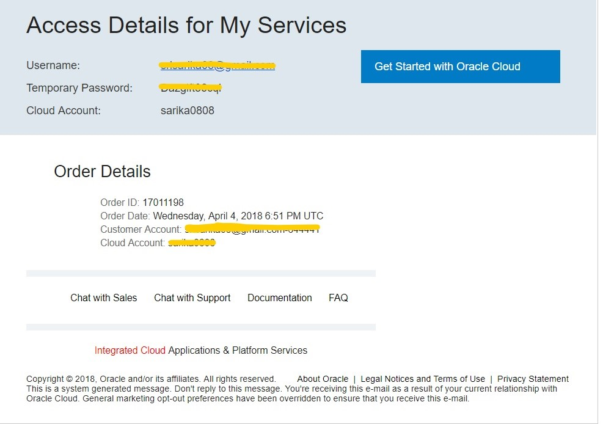
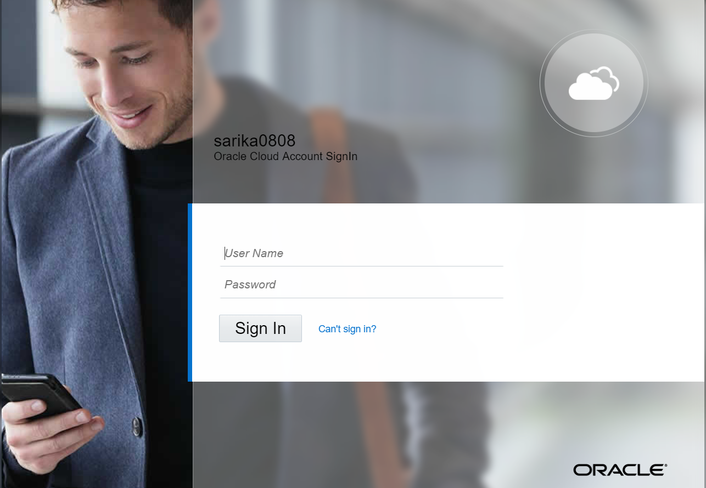
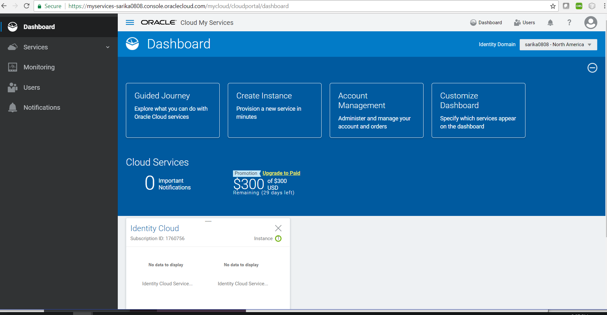
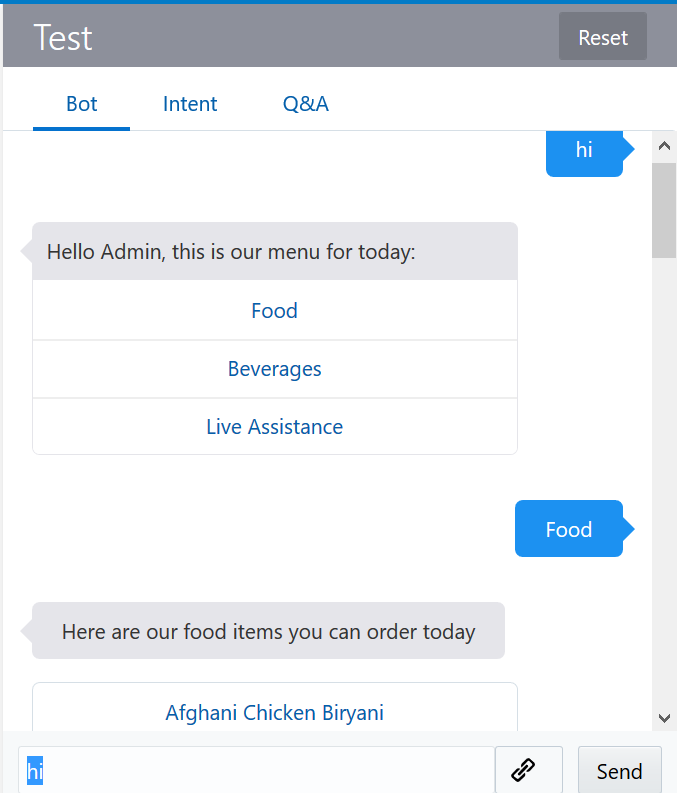
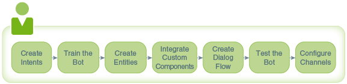

<!-- TODO: rename parent folder from workshop-template to the name of this workshop (e.g. chatbot-intro or intelligent-chatbots) -->
<!-- TODO: remove unnecessary files from this directory (e.g. LabGuide2,3,400.md, manifest-*-version.json, intro-*.md, css folder, js folder -- basically everything except your readme, labguide100, manifest.json, images folder, and index.html can go.) check-->
<!-- TODO: manifest.json should reference README.md instead of Intro-Instructor-Led.md check-->
<!-- TODO: need to create and link to an interactive lab guide (currently a broken link in manifest.json: "interactive":"https://launch.oracle.com/?") -->
<!-- TODO: need to create a video walkthrough of the lab -->

# Intelligent ChatBot Creation Workshop
#### **Oracle Cloud Test Drive Labs**

Pre-requisite:
-----------------------------------------------------------
### **STEP 1**: Getting your Trial Account
- From any browser, go to the URL:
    `https://cloud.oracle.com`

- Click on **Try for Free** icon located on the top of the right most side

    

<!--  TODO: we do not ask for regions anymore -- accounts are managed with IDCS -->
- **IMPORTANT** - Click on Create a Free Account icon located on the right most side.

    

<!-- TODO: these login screenshots are out of date -->
- Fill in the Account Details. Verification code will be sent to the mobile number provided. Fill in the Credit Card Details. Accept the Terms and conditions to get started.
 

    
    
    **NOTE:** The **Identity Domain, User Name** and **Password** values will be given to you by Trial confirmation email.
    
    
    
### **STEP 2**: Record information from the welcome email and login

- During the provisioning of your account, you will receive a welcome email message.
    
    **NOTE:** The **Username**: With a trial account, this should be your email address. **Temporary Password**: The first-time login with temporary password.

    

    
    
### **STEP 3**: Log into your Cloud Account
- Click on the **Get Started with Oracle Cloud** provided in the access details email.
    
    
    **NOTE:** Provide the username and temporary password provided in the email. Follow the instructions to **set your password**, and then record in your notes the new password for this **Cloud Account Password** field.
    
- You will be presented with a Dashboard displaying the various cloud services available to this account.

    

- If all your services are not visible, **click** on the **Customize Dashboard**, you can add services to the dashboard by clicking **Show.** Towards the left panel expand the Services to access all the available services

    
    
## Oracle Mobile Cloud Enterprise -- Intelligent Bots

### **STEP 1**: Introduction

Intelligent Bots in Oracle Mobile Cloud, Enterprise (or just Bots) is a conversational computing platform for the enterprise

You can think of your bot as a virtual personal assistant, one that completes a task through a combination of text messages and simple UI elements like select lists. While a bot can open your enterprise to messaging, it's not a replacement for a mobile or web app. It instead provides a new channel.

Bots enables you to connect your users to the enterprise while engaging them in naturalistic conversations. The bots you create can respond to free-form user input because the Bots' language intelligence framework uses machine learning. While users are probably aware that they're chatting with a bot, they don't need to limit or constrain their input.

You can build the bot, test it, and also configure it to run on different messaging services using the Bot Builder, a simple user interface. Although you can run this bot through Facebook Messenger and other platforms or websites, you need only write the bot once. Bots optimizes the bot for the target platform.

### **STEP 2**: How Do I Create a Bot?

Here's a bird's-eye view of bot development.

**Description of the illustration bots-overall-process.png**

**Create Intents**---Start off by creating intents. Intents illustrate your use case by describing the various actions that your bot helps its users complete. If your bot enables users to perform various banking transactions, for example, then you could create intents like CheckBalance or TransferMoney. Intents not only describe what your bot can do, they are also the key to your bot's intelligence: they enable it to recognize user input because each intent has a set of typical user statements, known as utterances, associated with it. While these phrases share the same meaning, they make your bot resilient because they're also varied (for example, What's my savings account balance? and How much is in my checking account?).

**Train the Bot**---To enable your bot to reference intents when it parses the user input, you need to train it. Specifically, you need to train it with the intents and their utterances (collectively, the training data), so that it can resolve the user input to one of the intents. By training your bot, you leverage the language intelligence which is at the core of the Bots platform: its algorithms enable your bot to not only recognize the sample phrases that belong to each intent, but similar phrases as well.

**Create Entities**--- In some cases, you may need to provide some context to enable your bot to complete a user request. While some user requests might resolve to the same intent (What's my savings account balance? and How much is in my checking account? would both resolve to the CheckBalance intent, for example), they are nonetheless asking for different things. To clarify the request, you would add an entity. Using the banking bot example, an entity called AccountType, which defines values called checking and saving would enable the bot to parse the user request and respond appropriately.

**Integrate Custom Components**---At this point, your bot can recognize input, but it can't respond to it. To put your bot's intelligence to work, you need to add components and then later, create a dialog flow. Components enable your bot to do its job. There are two types of components: the ones provided by Bots that perform functions ranging from holding the resolved intent to outputting text, and the ones that you provide. The components belonging to this latter category are known was custom components. Unlike the built-in components that you can use in any bot that you build with the Bots platform, the custom components perform tasks that are specific to a single bot, like checking a user's age, or returning account information. Custom components don't reside within the Bots platform, so for your bot to use them, you need to access them through a REST service.

**Create the Dialog Flow**--- Next, you need to give the bot the wherewithal to express its intelligence to its users by creating the dialog flow. The dialog flow describes how your bot reacts as different intents are resolved. It defines what your bot says to its users, how it prompts them for input, and how it returns data. Think of the dialog flow as a flow chart that's been transposed to a simple markup language. In Bots, this markup language is a version of YAML called OBotML.

**Test the Bot**---Once you've started your dialog flow, you can chat with your bot to test it out. You can see how the Tester works in [Building Your First Bot](https://docs.oracle.com/en/cloud/paas/mobile-suite/develop/bot-basics1.html#GUID-0C3BF9FB-563D-427C-8536-4E98C115CDB0).

**Configure Channels**---Users subscribe to your bot through messaging platforms such as Facebook Messenger, iOS App, Android App and Web Page. You don't have to rewrite your bot for each messaging platform, but you do need to configure a channel for each one. Bots enables you to integrate with Facebook Messenger quickly through its Facebook Channel. You don't need to craft any REST calls to run your bot on Facebook. Instead, you complete a UI using artifacts that are generated by both Facebook and Bots. See [Running Your Bot on Facebook Messenger](https://docs.oracle.com/en/cloud/paas/mobile-suite/develop/bot-channels.html#GUID-CCEE3FD5-21F2-4288-9450-0D24202F2615). To integrate your bot with other services, Bots provides the Webhook channel. You build your own webhooks for these non-Facebook integrations.

### **STEP 3**: How to prepare for this workshop

***Get an Oracle Cloud Account***
- Oracle provides several methods for gaining access to Oracle Cloud Accounts used to complete the Labs in this Hands-on-Workshop.
    - For some workshop events, cloud environments will be provided.
    - For others events (e.g. **Oracle Code**), or when completing this workshop in a self-service model, you must gain access to your own Trial account. Trial accounts can be obtained at [Try It](http://cloud.oracle.com/tryit)
    - If you are attending an Oracle sponsored event, please **review your Event invitation** for more instruction on how to gain access to your Workshop Account.

### **STEP 4**: How to View the Lab Guides

- The Labguides are best viewed using the Workshop's [GitHub Pages Website URL](http://oracle.github.io/learning-library/workshops/intelligent-chatbots)

- Once you are viewing the Workshop's GitHub Pages website, you can see a list of Lab Guides at any time by clicking on the **Menu Icon**

      
