# DevOps: JCS Pipeline Using Oracle Stack Manager


Update: February 7, 2018

## Introduction

This is the second of several labs that are part of the **DevOps JCS Pipeline using Oracle Stack Manger workshop**. This workshop will walk you through the Software Development Lifecycle (SDLC) for a Java Cloud Service (JCS) project that goes through Infrastructure as Code and deployment of a Struts application.

In the first lab (100), the Project Manager created a new project in the Developer Cloud Service, created and assigned tasks to the developers of this application. In this lab, you will assume the persona of Operations, who will be tasked with creating an Infrastructure as Code pipeline for the provisioning of Alpha Office Java Cloud Service (JCS) environment.

***To log issues***, click here to go to the [github oracle](https://github.com/oracle/learning-library/issues/new) repository issue submission form.

## Objectives

- Access Developer Cloud Service
- Import configuration from external Git Repository
- Build Infrastructure as Code pipeline
- Check in new template file
- Import Project into Eclipse
- Check in configuration file to provision new JCS environment.
- Setup application database and data source conneciton.

## Required Artifacts

- The following lab requires an Oracle Public Cloud account. You will need to download and install latest version of Eclipse. Instructions can be found in  [Student Guide](StudentGuide.md).

# Create Initial Git Repository for Infrastructure

## Create Initial Git Repository

### Logical Persona Overview

 Although you will remain connected to the Oracle Cloud using your user account, you are to take on the Persona of ***Bala Gupta*** as you perform the following steps. Bala is our operations engineer and will be handling all operations issues.


### **STEP 1:** Update Issue Status

- From the left have navigation panel, select **Agile** , then click on the **AlphaOffice** Board **Active Sprints**.

    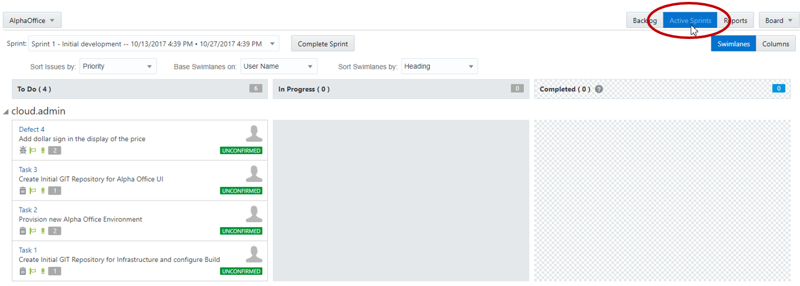

- Drag and drop **Task1 - Create Initial GIT Repository for Infrastructure and configure build** into the **In Progress** swim-lane.

    

- Leave the defaults, and click **OK** on the **Change Progress** popup.

    
    

### **STEP 2:** Create Repository

- In the left hand navigation panel, click **Project**.

- Click on **New Repository** to create a new Git Repository.

    

- In the New Repository wizard enter the following information and click **Create**.

    **Name:** `JCSStackAlphaInfrastructure`

    **Description:** `JCS Stack Alpha Office Infrastructure`

    **Initial content:** `Import existing repository`

    **Enter the URL:** `https://github.com/pcdavies/JCSStackAlphaInfrastructure`

    

- You have now created a new GIT repository based on an existing repository.

    

## Create Default Build for Template Upload

### Cloud Stack Overview

**Oracle Cloud Stack Manager** is a feature of Oracle Cloud that allows for the provisioning of multiple services within the Oracle Cloud. In order to build and deploy their applications, businesses often require sophisticated environments that consist of multiple, integrated cloud services. Consider a development environment whose needs include a Java application server along with a relational database. Provisioning each of these services for every member of your development team is time consuming and error prone, regardless of whether you’re using service consoles or REST APIs to provision the services. Oracle Cloud Stack Manager uses templates to provision a group of services (called a stack) and in the correct order.

### **STEP 3:** Create Template Update Build Process

Now that we have the configuration code in our managed GIT repository, we need to create a build process that will be triggered whenever a commit is made to the master branch. This build process will trigger any time the Alpha Office Stack template is modified and upload a new version via PSMcli (PaaS Service Manager command line interface) to the Oracle Cloud.

- On navigation panel, click **Build** to access the build page and click **New Job**.

    

- In the New Job popup enter **Infrastructure Update Template** for the Job Name, and then click **Save**.

    

- You are now placed into the job configuration screen.

    

- Click the **Source Control** tab. Click **Git** and select **JCSStackAlphaInfrastructure.git** from the drop down.

- Under the **Branches** section, expand the **Advanced Git Settings** and enter `Alpha-JCS-DBCS-Template.yaml` in the **Included Regions** field.

    

- Click the **Triggers** tab. Select **Based on SCM polling schedule**.

    

- Click the **Build Steps** tab. Click **Add Build Step**, and select **InvokePSMcli**.

    

- Enter the following data:

  - **Username**: `<Your User Name>`

  - **Password**: `<Supplied Password>`

  - **Identity Domain**: `<Your Identity Domain>` ***Note***: If you are using a **Trial account** and followed the instructions in the [Trial Account Student Guide](StudentGuide.md), then in place of the Identity Domain, you populate this field with the **Identity Service ID** you recorded.

- **Region**: `<Your Assigned Region>`

- **Output Format**: `JSON`

    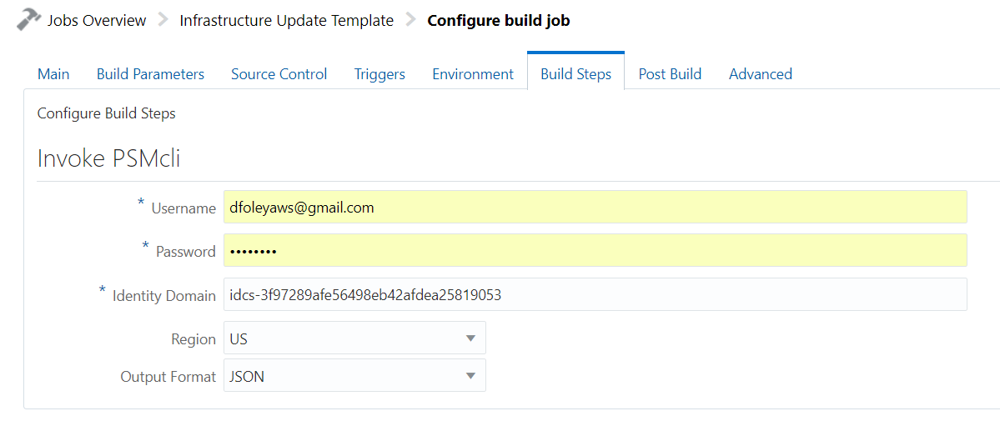

- Next we will add a second build step. Click **Add Build Step** and select **Execute Shell**

    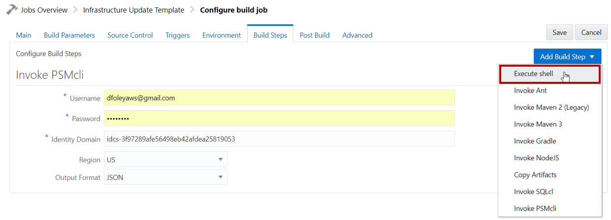

- Enter the following PSM CLI call for the **Execute Shell Command:**

```bash
psm stack import-template -f Alpha-JCS-DBCS-Template.yaml -of json
```

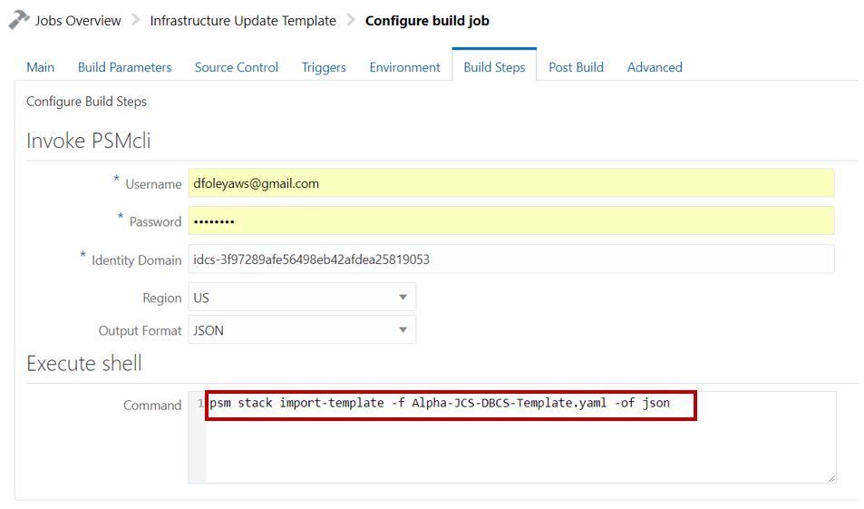

- Click **Save** to complete the configuration.

- Click the **Build Now** button to start the build. This will trigger for the build to be placed in the queue and should start shortly.

    

- Once the build has completed you should see a green check.

    

- If you want to view the results or debug a failure click on the **Console** link.

    

### **STEP 4:** Verify Template Upload to Oracle Cloud

- Now we will navigate to the Oracle Stack Manager console to view the newly uploaded template. Return to the tab where your Main Cloud Dashboard window is loaded. If your dashboard Window is not available, simply open a tab and go to cloud.oracle.com, and re-login as previously instructed. Note: for those using a Trial account, this is will be your Standard Identity Cloud Service based account/dashboard.

- Once the Oracle Public Cloud **Dashboard** is displayed, click on the navigation icon  for the **Java** Cloud Service and select **Open Service Console**.

    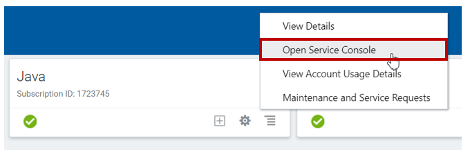

- From the Java Cloud Service Dashboard, Click on the far left navigation icon and select **Cloud Stack**

    

- From this service console you are able to manage and monitor all your **Stacks** and **Templates**.

    

- Click on **Templates**. You should see your newly uploaded template **Alpha-JCS-DBCS-Template** along with the default templates supplied by Oracle.

    

- Click on **Alpha-JCS-DBCS-Template** to view details about your template. The **Topology** gives you a graphical view of the Stack.  Our template has **JCS**, **DBCS** and **Storage Cloud** (backupContainer).

    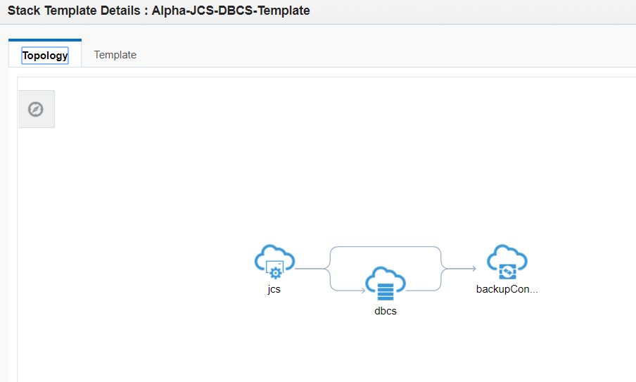

- If you click **Template** section you can view the entire template file.

    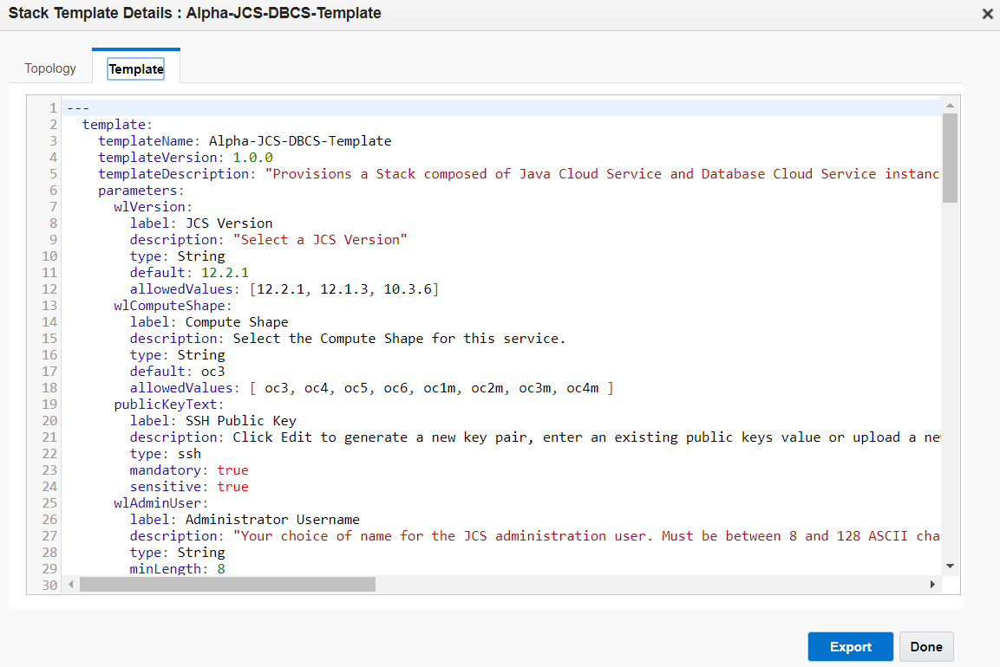

- Click **Done** to close the Template.

## Create Default Build for Stack Create

### **STEP 5:** Create Stack Create Build Process

Now we will create a build process that will provision a new Oracle Stack every time a change is made to a configuration file.  This File will define the need parameters to create unique environment using Oracle Stack Manager based on the newly uploaded template **Alpha-JCS-DBCS-Template**.

- Back in the Developer Cloud Service, click **Build**, followed by clicking **New Job**.

    

- In the New Job popup, leave the **Create a free-style job** selected and enter `Infrastructure Create Stack` for the Job Name, and then click **Save**.

    

- You are now placed into the job configuration screen.

    

- Click the **Source Control** tab. Click **Git** and select **JCSStackAlphaInfrastructure.git** from the drop down. Expand **Advanced Git Settings** and enter `JCSBuild.conf` in the **Included Regions** field.

    

- Click the **Triggers** tab. Select **Based on SCM polling schedule**.

    

- Click the **Build Steps** tab. Click **Add Build Step**, and select **Invoke PSMcli**.

    

- Enter the following data:

  - **Username**: `<Your User Name>`

  - **Password**: `<Supplied Password>`

  - **Identity Domain**: `<Your Identity Domain>` ***Note***: If you are using a **Trial account** and followed the instructions in the [Trial Account Student Guide](StudentGuide.md), then in place of the Identity Domain, you populate this field with the **Identity Service ID** you recorded.

- **Region**: `<Your Assigned Region>`

- **Output Format**: `JSON`

    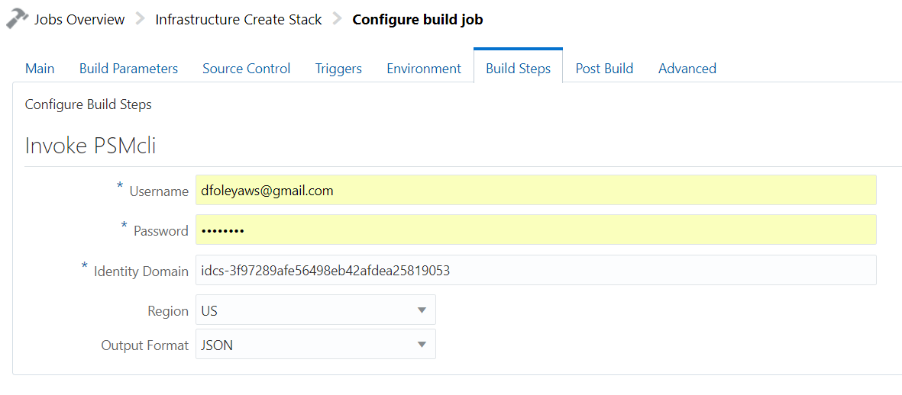

- Next we will add a second build step. Click **Add Build Step** and select **Execute Shell**

    

- Enter the following PSM CLI call for the **Execute Shell Command:**

```bash
source ./JCSBuild.conf
psm stack create -n $ServiceName -t Alpha-JCS-DBCS-Template \
  -p commonPwd:$CommonPassword \
      backupStorageContainer:$BackupStorageContainer \
      cloudStorageUser:<Your User Name> \
      cloudStoragePassword:<Supplied Password> \
      publicKeyText:"$publicKey"
```

**Note:** Replace Username and Password

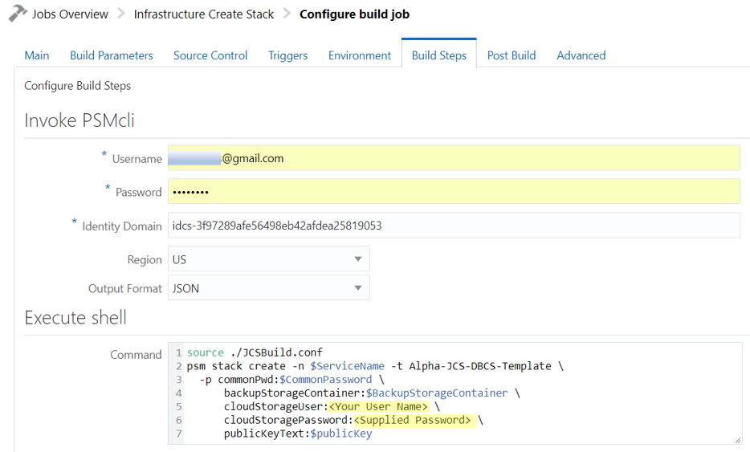

- Click **Save** to complete the configuration. We will **NOT** execute a build at this time, as we want to trigger the build by updating the **JCSBuild.conf** file.

    

### **STEP 6:** Complete Task

We have now completed our task. To finish up this part of the lab we will want to mark the Issue as completed in our Sprint.

- Back in the Developer Cloud Service, click **Agile**, followed by clicking **Active Sprints**.

- Drag and drop **Task 1** from **In Progress** to **Completed**.

    

- In the Change Progress popup click **Next**

- Set number of days to 1 and click **OK**

    

- Your Sprint should now look like the following:

    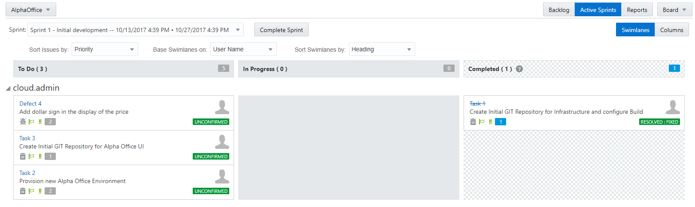

# Provision new Alpha Office Environment by modifying configuration file

## Clone Project to Eclipse IDE

### **STEP 7:** Load Eclipse IDE

In the following task we will provide screen shots taken from the optional compute image provided with the workshop. If you are using Eclipse and Brackets on your local hardware, your screens may vary slightly.

- Right Click and select **Run** on the **Eclipse** Desktop Icon.

    Note: If you have not already installed and configured Eclipse, please see this Workshop's **Student Guide** for instructions on how to install and configure it.

    

### **STEP 8:** Create connection to Oracle Developer Cloud Service

- We will now create a connection to the Developer Cloud Service. To do this, first click on the menu options **Window -> Show View ->Other**

    

- Enter **oracle** in the search field. Select **Oracle Cloud**, and click on **OK**.

    

- Click on **Connect** in the Oracle Cloud tab

    

- Enter the following information, then click on the **Finish** button:

  - **Identity Domain**: `<your identity domain>` ***Note:*** if you're using a trial account, since you are connecting to the Developer Cloud Services, which is a Traditional Service, you populate this field with the **Identity Domain Name** you recorded.

  - **User name**: `<your Username>`

  - **Password**: `<your Identity domain password>`

  - **Connection Name**: `OracleConnection`

    

### **STEP 9:** Create a local clone of the repository

- Expand **Developer**, and then double click on **Alpha Office Product Catalog** to activate the project.

    

- **Expand** the **Code**, and double click on the **Git Repo [JCSStackAlphaInfrastructure.git]**, to cause the Repo to be cloned locally.

    

- **Right Click** on the **JCSStackAlphaInfrastructure** cloned repository and click on **Import Projects**.

    

- Accept the Import defaults, and **click** on **Finish**

    

### **STEP 10:** Set Task 2 Status to In Progress

In the previous steps we updated the status of the Tasks using the web interface to the Developer Cloud Service. In this step we will use the Eclipse connection to the Developer Cloud Service to update the status of the tasks.

- Within the Oracle Cloud Connection tab, double click the **Issues** to expand, then double click on **Mine** to expand your list. Once you see the list of your Issues, then double click on **Provision new Alpha Office Environment**.

    

- Scroll down to the bottom of the **Provision new Alpha Office Environment** window. In the **Actions section**, and change the Actions to **Accept (change status to ASSIGNED)**, then click on **Submit**.

    

- Optionally, if you return to the Developer Cloud Service web interface, you’ll see that the Eclipse interface caused the **Task 2** to be moved to the **In Progress** column of the **Agile > Active Sprints**.

    

### **STEP 11:** Modify Configuration File

- In the Eclipse **Project Explorer** panel, expand the project and double click on **JCSBuild.conf** to open

    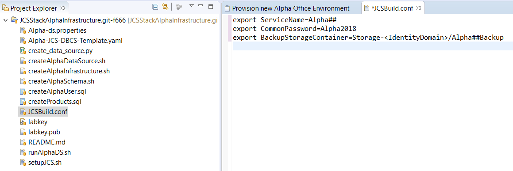

- Modify the values as defined below and click **Save All**. Replace `<Storage REST Endpoint>` with information captured during setup.

```bash
export ServiceName=Alpha01
export CommonPassword=Alpha2018_
export BackupStorageContainer=<Storage REST Endpoint>/Alpha01Backup
export publicKey=$(cat labkey.pub)
```

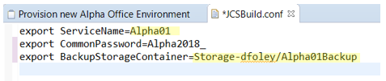

### **STEP 12:** Generate Seure Shell (SSH) Files

- To access an Oracle Cloud Instance such as DBCS and JCS we need to supply the ssh public key at the time of provisioning.  Later we will use the ssh private key to access the newly provisioned DBCS instance.

- Open a terminal windows. For **Windows** users we will be using **Git Bash** that should have been installed during the workshop setup.

- To generate the SSH keys enter the command below. **Note** the keys will be placed in the current directory. If you would like them in a specific directly please first change to that directory location.

```bash
ssh-keygen -b 2048 -t rsa -f labkey
```
- Press **Enter** when prompted for the passpharase

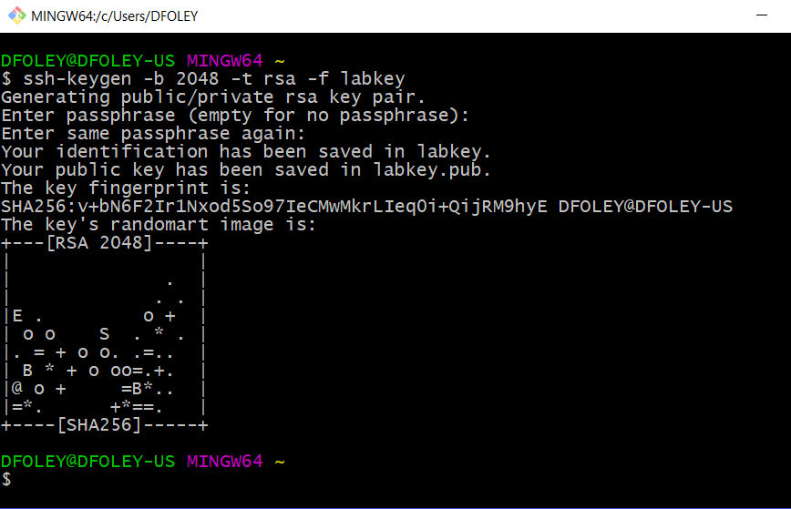

- Next we will copy the public key, labkey.pub, to the JCSStackAlphaInfrastructure project. **Note:** These instructions assume the Eclipe workspace was created under the home directory.

```bash
cp labkey.pub ~/workspace/JCSStackAlphaInfrastructure.git-*/.
```


## Commit Code

### **STEP 13:** Commit Code

- Right click on **JCSStackAlphaInfrastructure** and then Select **Team > Commit**

    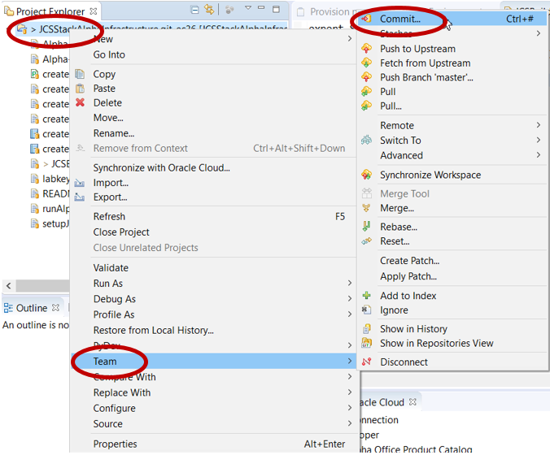

- Move **labkey.pub** and **JCSBuild.conf** to the Staged Changes. Enter `Provision Stack Alpha01` in the Commit Message box and click **Commit and Push**.

    

- Click **OK** on the Push Result dialog

    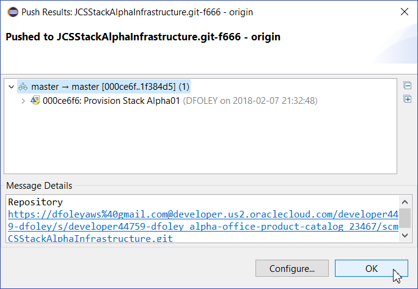

## Verify Provisioning

### **STEP 14:** Verify Build job ran

- Click **Code** on left hand navigation then click **Logs**. Notice that the file has been committed to the Git repository.

    

- Click **Build** on left hand navigation. You should now see that the **Infrastructure Create Stack** build is running, or just completed. If it's running, wait for it to complete.

    

### **STEP 15:** Monitor in Oracle Cloud

- Switch back to browser tab with **Oracle Stack Manager**.  Click on the **Stacks** tab. You should see that **Alpha01** stack is "Creating" and building out an Oracle Database Cloud Service and a Java Cloud Service. You may need to click on the refresh button if the stack is not immediately visible.

    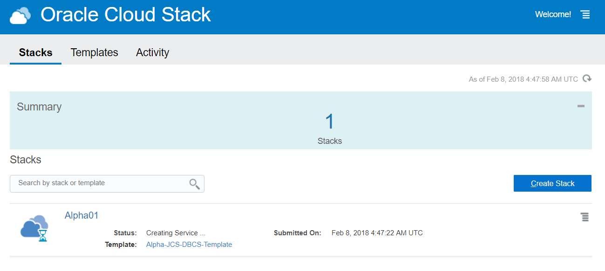

- Click on **Alpha01** to view details.

    

# Setup Application Database and Data Source Connection

## Setup Application Database

### **STEP 16:** Record Database Host IP Address

- Provisioning of the **Alpha01** Stack will take almost an hour.  Once completed Status will go away, as will the hourglass icon.

    

- Click **Alpha01** to view Stack OVerview of all resources.

    

- Click **Alpha01-DBCS** to view Database Instance details.  Make not of the **Public IP** for the Database.

    

### **STEP 17:** SSH into the Database Image

- From the same terminal windows (Git Bash for Windows) used earlier, enter the following command. Replace **<DBCS Public IP>** with your instance IP.

```bash
ssh -i labkey opc@<DBCS Public IP>
```


### **STEP 18:** Install git in the Image

- Enter the **yum** command show below to install **git**.

```bash
sudo yum install git
```

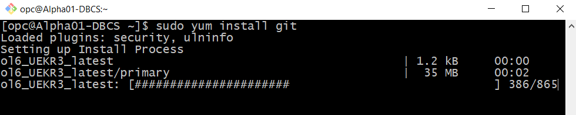

- When prompted with the **Is this ok** enter **y** and press the return key.

    

### **STEP 19:** Clone the Script repository

- Using the sudo command connect as the **oracle** user.

```bash
sudo su - oracle
```


- Clone a local copy of the git repository containing the scripts used to load the database with the Product Catalog tables.

```bash
git clone https://github.com/pcdavies/AlphaOfficeDBCSSetup.git
```


### **STEP 20:** Run the script

- Change directories to the **AlphaOfficeDBCSSetup** directory. Run the `ls` command to see all the files in this repository. View the contents of the **setupAlphaUser.sh** script.

    

- Run the **setupAlphaUser.sh** script with the following command. Ignore the warnings. **Note**: the setupAlphaUser.sh script use the Password suggested in previous steps. If you used a different password when creating the Database than what was documented, you will need to update the the password in the script.

```bash
sh ./setupAlphaUser.sh
```


- After the script completes, you can check to see if the **alpha** user was created, and the database tables where loaded by running the following command - you should see the **Product** tables:

```bash
sqlplus alpha/oracle@PDB1 <<EOF
SELECT count(*) FROM products;
EXIT;
EOF
```

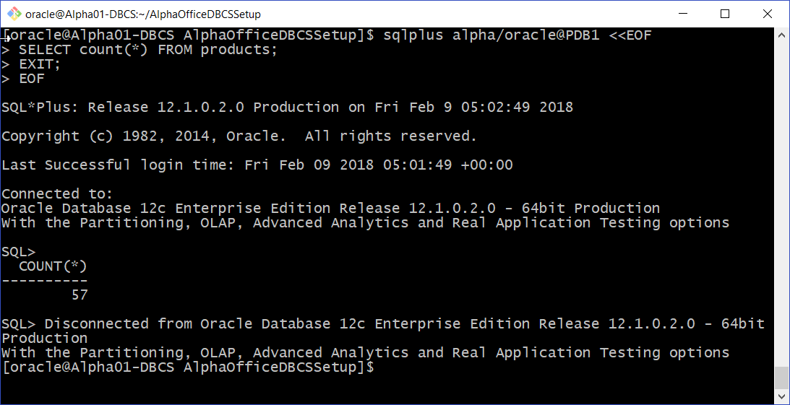

## Setup Data Source Connection

### **STEP 21:** Open WebLogic Service Console

- Navigate back to the **Cloud Stack** Service Console. Click **Alpha01** to view details for the stack. 

- Click navigation icon  for **Alpha01-JCS** and click **Open WebLogic Service Console**

    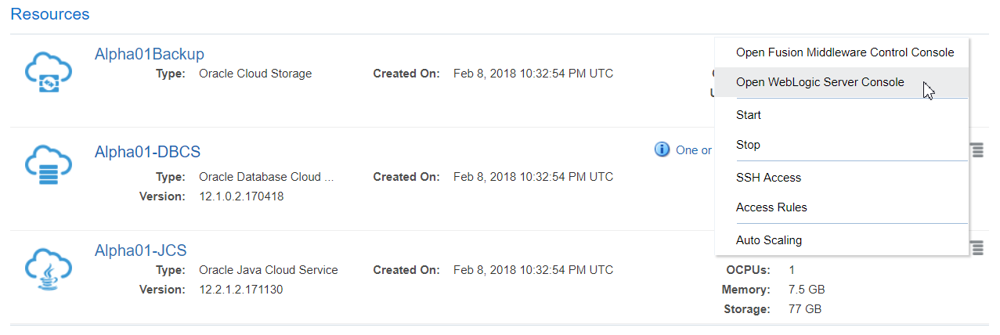

- On security warning page click **ADVANCED** followed by **Proceed**

    
 
- Enter the following data and click **Login**

    **Username:** `weblogic`

    **Password:** `Alpha2018_`

    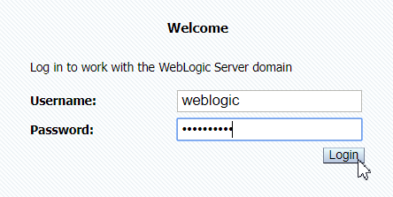

- In **Domain Structure** expand **Services** and click *Data Sources**

    

### **STEP 22:** Create Data Source

- In Change Center, click **Lock & Edit** to enable editting of the confirguration.

    

- Click New and select **Generic Data Source**

    

- Enter the following and click **Next**

    **Name:** `Alpha01-DBCS-ds`

    **JNDI Name:** `jdbc/Alpha01-DBCS-ds`

    

- Accept defaults, click **Next** twice.

- Enter the following and click **Next**. Note: the **DBCS Services Instance ID** was captured during the Trial Account Student Guide steps.

    **Database Name:** `PDB1.<DBCS Service Instance ID>.oraclecloud.internal`

    **Host Name:** `Alpha01-DBCS`

    **Database User Name:** `alpha`

    **Password:** `oracle`

    

- Click **Test Connection**. If test succedded click **Next**.

    

- Click **Alpha01-_cluster** to target the deployment to the WebLogic customer. Click **Finsh**.

    

- Click **Activate Changes**. If test succedded click **Finish**.

    

- Your Infrustructure is now ready for deployment of the Alpha Office Product Catalog.

    

### **STEP 23:** Set Task 2 Status to In Progress

- From either Eclipse or Developer Cloud Service console update the status of **Task 2** to **Completed**. Your sprint should now look like the following.


- **You have completed Lab 200**