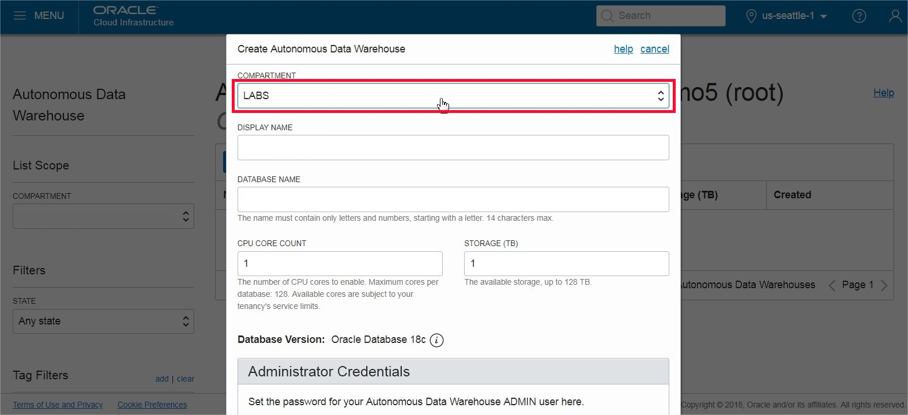
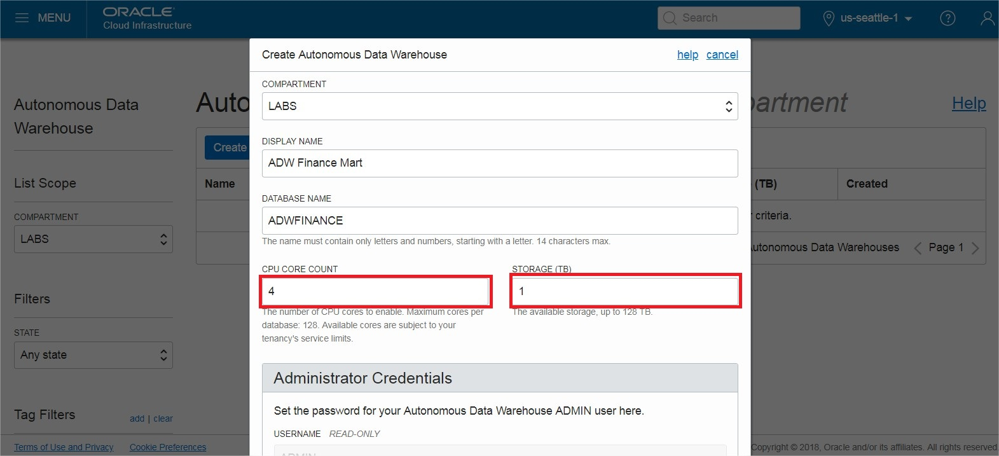
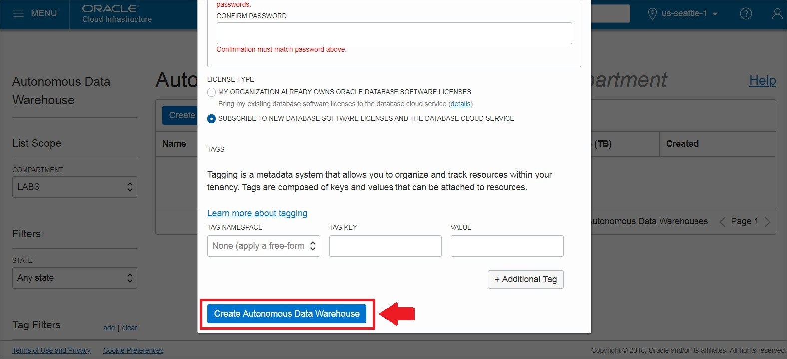
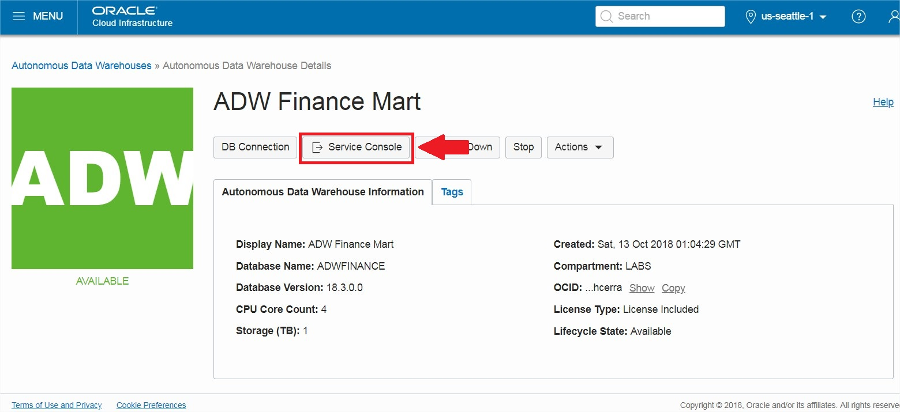
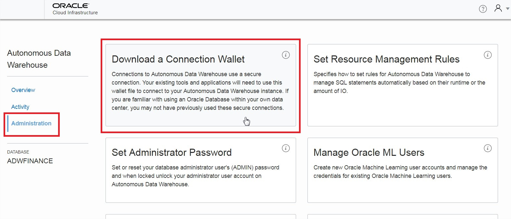
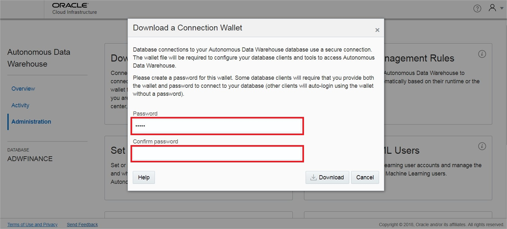

<table class="tbl-heading"><tr><td class="td-logo">

September 21, 2018
</td>
<td class="td-banner">
# Lab 1: Getting Started with Autonomous Data Warehouse
</td></tr><table>

## Introduction

This lab walks you through the steps to get started using the Oracle Autonomous Data Warehouse Cloud (ADW) on Oracle Infrastructure Cloud (OCI). You will provision a new ADW database and connect to the database using Oracle SQL Developer.

  <a href="https://raw.githubusercontent.com/millerhoo/journey4-adwc/master/workshops/journey4-adwc/images/ADWC%20HOL%20-%20Provision%20and%20Connect.mp4" target="_blank">**Click here**</a> to watch a video demonstration of provisioning and connecting to a new ADW database.

To **log issues**, click [here](https://github.com/millerhoo/journey4-adwc/issues/new) to go to the github oracle repository issue submission form.

## Objectives

-   Learn how to provision an new Autonomous Data Warehouse

-   Learn how to connect to your new Autonomous Data Warehouse

## Required Artifacts

-   The following lab requires an Oracle Public Cloud account. You may use your own cloud account, a cloud account that you obtained through a trial, or a training account whose details were given to you by an Oracle instructor.

-   Oracle SQL Developer 18.1 (see [Oracle Technology Network download site](http://www.oracle.com/technetwork/developer-tools/sql-developer/overview/index.html)).
    Please be sure to use SQL Developer version 18.1 or later because this version contains enhancements for key Autonomous DW Cloud features.

    * Note *: If you are a Windows user on 64-bit platform, download the 'Windows 64-bit with JDK 8 included' distribution as it includes both Java 8 and the Java Cryptography Extension (JCE) files necessary to run SQL Developer and connect to your Autonomous DW Cloud.
    If you are a non-Windows user, download and install the appropriate [Java 8 JDK](http://www.oracle.com/technetwork/java/javase/downloads/jdk8-downloads-2133151.html) for your Operating System. Download and extract the [Java Cryptography Encryption Archive](http://www.oracle.com/technetwork/java/javase/downloads/jce8-download-2133166.html) to the directory as indicated in the README.txt.

# Part 1. Provisioning an ADW Instance

In this section you will be provisioning an ADW database using the cloud console.

#### **STEP 1: Sign in to Oracle Cloud**

-   Go to [cloud.oracle.com](https://cloud.oracle.com), click **Sign In** to sign in with your Oracle Cloud account.

-   Enter your **Cloud Account Name** and click **My Services**.

-   Enter your Oracle Cloud **username** and **password**, and click **Sign In**.

#### **STEP 2: Create an ADW Instance**

-   Once you are logged in, you are taken to the cloud services dashboard where you can see all the services available to you. Click **Create Instance**.

*Note:* You may also access your Autonomous Data Warehouse service via the pull out menu on the top left of the page, or by using Customize Dashboard to add the service to your dashboard.

- Click **Create** on the Autonomous Data Warehouse tile. If it does not appear in your Featured Services, click on All Services and you will find it there.

-  Click on **Create Autonomous Data Warehouse** button to start the instance creation process.

-  This will bring up the Create Autonomous Data Warehouse screen where you will specify the configurations of the instance. Select a compartment of your choice.

-  Specify a memorable name for the instance. Also specify your database's name, for this lab use ADWFINANCE.

-  Next, select the number of CPUs and storage size. Here, we use 4 CPUs and 1 TB of storage.

-  Then, specify an ADMIN password for the instance, and a confirmation of it. Make a note of this password.

-  For this lab, we will select Subscribe To A New Database License. If your organization owns Oracle Database licenses already, you may bring those license to your cloud service.

-  Make sure everything is filled out correctly, then proceed to click on **Create Autonomous Data Warehouse**.

-  Your instance will begin provisioning. Once the state goes from Provisioning to Available, click on your instance name to see it's details.

-  You now have created your first Autonomous Data Warehouse Cloud instance. Have a look at your instance's details here including its name, database version, CPU count and storage size.

# Part 2. Connecting to ADW

## Downloading the credentials wallet

As ADW only accepts secure connections to the database, you need to download a wallet file containing your credentials first. The wallet is downloaded from the ADW service console.

#### **STEP 3: Sign in to the Service Console**

-   In your database's instance details page, click **Service Console**.

-   This will open a new browser tab for the service console. Sign in to the service console with the following information.

    -   **Username:** admin

    -   **Password:** The administrator password you specified during provisioning

#### **STEP 4: Download the Connection Wallet**

-   Click the “**Administration**” tab and click “**Download a Connection Wallet**” to download the wallet.

-   Specify a password of your choice for the wallet, you will need this password when connecting to the database later. Click **Download** to download the wallet file to your client machine.

## Connecting to the database using SQL Developer

Start SQL Developer and create a connection for your database using the default administrator account 'ADMIN' by following these steps.

#### **STEP 5: Connect to the database using SQL Developer**

-   Click the **Create Connection** icon in the Connections toolbox on the top left of the SQL Developer homepage.

-   Fill in the connection details as below:

    -   **Connection Name:** admin_low

    -   **Username:** admin

    -   **Password:** The password you specified during provisioning

    -   **Connection Type:** Cloud PDB

    -   **Configuration File:** Enter the full path for the wallet file you downloaded before, or click the **Browse button** to point to the location of the file.

    -   **Keystore Password:** The password you specified when downloading the wallet from the ADW service console

    -   **Service:** There are 3 pre-configured database services for each database. Pick **&lt;databasename&gt;_low** for this lab. For
        example, if you created a database named testdw select testdw_low as the service.

-   Test your connection by clicking the **Test** button, if it succeeds save your connection information by clicking **Save**, then connect to your database by clicking the **Connect** button. An entry for the new connection appears under Connections.

-   Create another connection named as **admin_high** using the same information as above, this time pick **&lt;databasename&gt;_high** as the service name, for example, testdw_high.

-   You are now ready to move to the next lab.

## Great Work - All Done!

<table class="tbl-heading"><tr><td class="td-logo">
</td>
<td class="td-banner">
Please click here to return to the [Getting Started Home page](README.md)
</td></tr><table>
