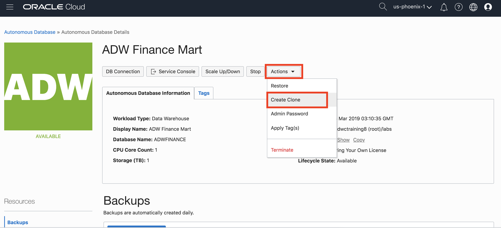
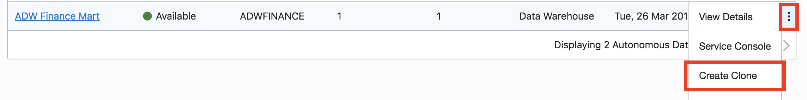
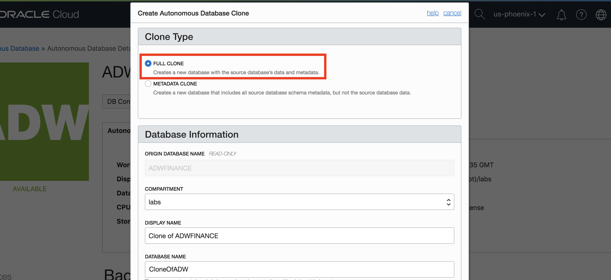
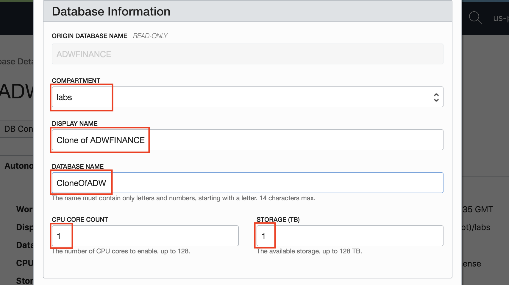
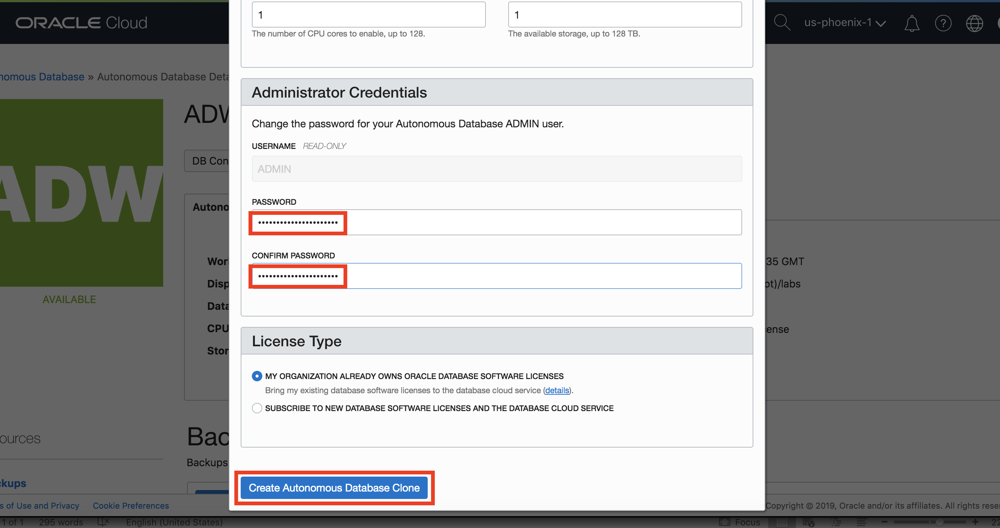
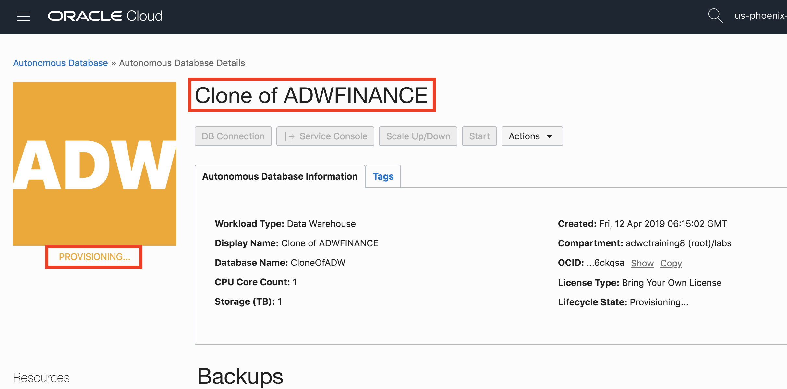

<table class="tbl-heading"><tr><td class="td-logo">

April 10, 2019
</td>
<td class="td-banner">
# Lab 11: Cloning your Autonomous Data Warehouse
</td></tr><table>

## Introduction

This lab will walk you through the few simple steps it takes to clone your Autonomous Data Warehouse instance. A clone is essentially a standalone copy of your ADW instance. Often you might be in a situation when you need a copy of your instance as a sandbox for sanity or performance testing, without it affecting your production instance. In other cases, you might want a clone of your instance for each of your new business applications, verticals or regions. Or you might simply need a clone for development and trying out any new incoming data sources. In the past, creating these non-operational or production environments has been a challenging and time consuming process for technical teams, especially DBAs. With ADW, creating a clone is as simple clicking a few buttons and having a few magical minutes of patience!

By this point, you should have performed the following:

1. Obtained an Oracle Cloud account
2. Created an Autonomous Data Warehouse instance

## Objectives
- Learn how to create a Clone of your ADW instance
- Learn the difference between meta-data clones and full clones of ADW instance

## Required Artifacts
- The latest Oracle SQL Developer (or any version post 18.3 ; See [Lab 1](LabGuide1.md) for more specifics on the version of SQL Developer and how to install and configure it).
- Access to a running Autonomous Data Warehouse instance.

# Creating a Clone

#### **STEP 1: Go to your ADW Instance Service Console**

  - In your instance's service console, look for the __"Create Clone"__ option under Actions.

    

  - Note that it is also possible to create a clone from the ellipsis option button in your Instances list as well.

    

#### **STEP 2: Choose between a meta-data only or a full clone**

You will now want to decide whether you need a clone with all of the data from the original instance or not. A __full clone__ will make a copy of your instance's tables, views and other meta-data as well as copy all the data into the newly created instance. A __meta-data only clone__, as the name suggests, will create a copy of the instance along with the definitions of the tables, views and other meta-data, but will not copy of all the actual data to the new instance. Therefore, a meta-data clone will be created more quickly, but will require you to manually load data into it to return any query results (ie. the tables and other structures will be created, but they will be empty). You may want a meta-data clone for instances where the structure of your incoming data is the same as the original instance, but your incoming data is from a new source or different business unit or region. A use case for a full clone would be a developer or testing sandbox of your production environment.

_Note_ - **For either type of clone:**
 - If your existing data warehouse instance contains any Oracle Machine Learning workspaces, projects, and notebooks, those are not cloned to the new database. Click <a href="https://docs.oracle.com/en/cloud/paas/autonomous-data-warehouse-cloud/omlug/get-started-notebooks-data-analysis-and-data-visualization.html#GUID-C06D695F-EEEB-452F-A569-29677AAE70E3" target="_blank">here </a> for more information about how to export existing OML workbooks and notebooks.
 - Only one clone operation can be done at any current point in time. If there is an ongoing clone operation on a source database, you cannot initiate a new clone operation on the database being cloned until the ongoing operation completes.
 - You cannot yet create an ADW clone into a different tenancy or region.
 - The __optimizer statistics__ are copied from the source data warehouse to your newly cloned ADW instance. For for a Full Clone, this means you have a complete copy of the optimizer statistics right away. For a Metadata Clone, the first data load into a table will force the optimizer to update the statistics based on the new data load.
 - During the cloning process, any __resource management rules__ in the source data warehouse that have been changed by the cloud DBA/administrator will be carried over to your newly cloned data warehouse. For more information on setting resource management rules, see <a href="https://docs.oracle.com/en/cloud/paas/autonomous-data-warehouse-cloud/user/manage-service.html#GUID-4861BA7F-F9FA-4909-8DC0-4F46AFF80706" target="_blank"> Manage Runaway SQL Statements on Autonomous Data Warehouse. </a>

Let's select a full clone here, so that we may start to query the data immediately once the clone is created.

#### **STEP 3: Enter the details about your new instance**

- Similar to when provisioning a new instance, to clone your instance select the compartment for your clone, as well as an appropriate Display Name and Database Name. Here we have selected our __"labs"__ compartment, with __"Clone of ADWFINANCE"__ as the Display Name and __"CloneOfADW"__ as the Database Name. For more information on compartments, click <a href="https://docs.cloud.oracle.com/iaas/Content/Identity/Tasks/managingcompartments.htm#three" target="_blank">here</a>.

- Select the number of __CPUs__ you need and the amount of __storage__. Note for a “Full Clone” (we selected this in Step 2), since all the data will be copied too, the minimum storage that we can specify here is the actual space used (rounded up to the next TB) by your “source" database instance. However, you can set any number of CPUs for both your full or meta-data clone, which is a great flexibility for lowering the resources for your clone instances.

#### **STEP 4: Enter the new instance's admin password and proceed to clone**

- Enter an admin password, that adheres to <a href="https://docs.oracle.com/en/cloud/paas/autonomous-data-warehouse-cloud/user/manage.html#GUID-54CA837B-CD6A-4ED2-A960-5874535818CB" target="_blank">complexity requirements</a>, for your new clone instance.

- If your organization has Oracle Database licenses, you may select the Bring Your Own license" option. Else, to start off, select the "Subscribe to new database software licenses" option.

- That's it! You may now click __Create Autonomous Database Clone__ and your new copied instance will immediately start provisioning and be ready in minutes!

- Once provisioning is complete, you may __connect__ to your new cloned instance just as we did in __Step 5 in [Lab 1](LabGuide1.md)__. Since this is an exact copy of the ADW instance we loaded data into in Lab 3, you may run any of the same sample queries in the <a href="https://docs.oracle.com/database/122/DWHSG/part-relational-analytics.htm#DWHSG8493" target="_blank">relational analytics</a> section of the Oracle documentation. For example, to analyze the cumulative amount sold for specific customer IDs in quarter 2000, you could run the query in <a href="./scripts/300/query_tables.txt" target="_blank">this code snippet</a>.

<table>
<tr><td class="td-logo"></td>
<td class="td-banner">
## Great Work - All Done!
**You are ready to move on to the next lab. You may now close this tab.**
</td>
</tr>
<table>
