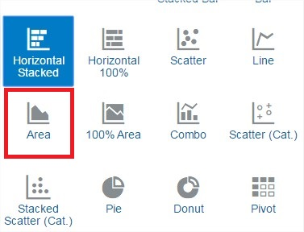

<table class="tbl-heading"><tr><td class="td-logo">

September 21, 2018
</td>
<td class="td-banner">
# Lab 5: Creating Rich Data Visualizations
</td></tr><table>


## Introduction

This lab will walk you through the steps to connect Oracle Data Visualization Desktop to an instance of ADW and create data visualizations.  Unlimited Data Visualization Desktop licenses are included when connecting to an ADW data source.  Instructions will be provided to connect your previously created ADW instance (using sample data loaded into data warehouse) to Oracle Data Visualization Desktop.  We will demonstrate how you can immediately gain insights and create beautiful data visualizations.

At this point, you should have performed the following:

1. Obtained an Oracle Cloud account
2. Created a new Autonomous Data Warehouse instance
3. Downloaded the Connection Wallet for your Autonomous Data Warehouse.

## Objectives
- Learn how to connect a desktop analytics tool to the powerful Autonomous Data Warehouse
- Learn how to secure a desktop client connection to Autonomous Data Warehouse
- Learn how to create a simple data visualization project with Oracle Data Visualization Desktop
- Learn how to access and gain insights from data in the Autonomous Data Warehouse


## Required Artifacts
- Installation of Oracle Data Visualization Desktop (free with Autonomous Data Warehouse). If you already have Data Visualization Desktop installed, please check the version. The recommended version is 12.2.5.0.0 to connect to your Oracle Autonomous Data Warehouse.
- Access to an existing Autonomous Data Warehouse instance

# Set Up Local Data Visualization Desktop Environment in Windows

#### **STEP 1: Installing Oracle Data Visualization Desktop on a Windows Desktop**

  - Download the latest version of Oracle Data Visualization Desktop (DVD) from <a href="http://www.oracle.com/technetwork/middleware/oracle-data-visualization/downloads/oracle-data-visualization-desktop-2938957.html" target="_blank"> here </a>.
- After saving the installer .ZIP to your desktop, unzip the file and click on the DVDesktop .exe installer to follow the guided steps.

   

   

#### **STEP 2: Securing Your Client Connection to Autonomous Data Warehouse**

You want to secure your data from the desktop all the way from the client application to the server where your data is stored.  Password credentials for connecting to databases can now be stored in a client-side Oracle wallet, a secure software container used to store authentication and signing credentials.  This wallet usage can simplify large-scale deployments that rely on password credentials for connecting to databases. When this feature is configured, application code, batch jobs, and scripts no longer need embedded user names and passwords. Risk is reduced because such passwords are no longer exposed in the clear, and password management policies are more easily enforced without changing application code whenever user names or passwords change.

- Go to the directory that you saved your Connection Wallet file from the previous lab.  This will be a zipped file that you will select or drag/drop into DVD.

   

*Note:* If you have an older version of DVD, you may have to unzip the wallet and select the specific "cwallet.sso" wallet within it.

# Create a View using Tables in the SH Schema

#### **STEP 3: Execute the Provided Script in SQL Developer**

For simplicity's sake, in this exercise we will use the SH schema provided and will be creating a simple view.

- Go back to SQL Developer as you did in the previous exercises and connect to the __‘admin_high’__ user.   Copy and execute the following script.  

   ```
   drop view DV_SH_VIEW;

   create or replace view DV_SH_VIEW as select
   P.PROD_NAME,
   P.PROD_DESC,
   P.PROD_CATEGORY,
   P.PROD_SUBCATEGORY,
   P.PROD_LIST_PRICE,
   S.QUANTITY_SOLD,
   S.AMOUNT_SOLD,
   X.CUST_GENDER,
   X.CUST_YEAR_OF_BIRTH,
   X.CUST_MARITAL_STATUS,
   X.CUST_INCOME_LEVEL,
   R.COUNTRY_NAME,
   R.COUNTRY_SUBREGION,
   R.COUNTRY_REGION,
   T.TIME_ID,
   T.DAY_NAME,
   T.CALENDAR_MONTH_NAME,
   T.CALENDAR_YEAR from
   SH.PRODUCTS P,
   SH.SALES S,
   SH.CUSTOMERS X,
   SH.COUNTRIES R,
   SH.TIMES T where
   S.PROD_ID=P.PROD_ID and
   S.CUST_ID=X.CUST_ID and
   S.TIME_ID=T.TIME_ID and
   X.COUNTRY_ID=R.COUNTRY_ID;
   ```

   


# Create a Connection to Your Autonomous Data Warehouse from Data Visualization Desktop

#### **STEP 4: Create Connection**

- Start Oracle Data Visualization Desktop. When Oracle Data Visualization Desktop opens, click on the __‘Create’__ button and __‘Connection’__ selection highlighted.

   

-   In the Create Connection Dialog, select the highlighted option for __‘Oracle Autonomous Data Warehouse’__ and start moving through the wizard.

   

-   Go back to the directory where you saved your wallet file and extracted the file, __‘tnsnames.ora’__.  Open the file and search for the wallet connection information (in our example "**adwfinance_high**") that you will use to connect with.


   | Connection Info       | Entry                                             |  
   | --------------------- | :--------------------------------------------- |
   | Connection Name:      | Type in 'SALES_HISTORY'                             |
   | Client Credentials:   | Select or drag/drop the **Wallet zip file** "wallet_*Your DB Name*.zip"" from Step 2   |
   | Username:             | Insert username created in previous labs.  Same as SQL Developer credentials. |                                            
   | Password              | Insert password created in previous labs.  Same as SQL Developer credentials. |
   | Service Name:         | Select your service preference here (for eg. the "_high" service) |

  - After completing the fields, click on __‘Save’__ button.
  *Note*: If you are running an older version of DVD, you may have to copy your Service Name from tnsnames.ora within the wallet zip file. Even older versions may not have the option to select Client Credentials. Update your DVD or read about connections in older versions in the <a href="https://docs.oracle.com/en/middleware/bi/data-visualization-desktop/bidvd/create-connections-oracle-adw.html#GUID-D3542D1C-B21F-45D1-86F7-DBAAE43A5574" target="_blank"> DVD User's Guide. </a>

   

  - Upon success of creating a new connection to the Autonomous Data Warehouse, select the __Create__ button and select __Data Set__.  

    

  - We will now choose to select the sales data we want to analyze and visualize in our first project.  Select the connection we just created named __SALES_HISTORY__.

   

  - Click on the __ADMIN__ schema in the data warehouse.

   

  - Find and Click on __DV_SH_VIEW__.

   

  - First click on the __Add All__ Label in the left column, type a new Name for the Data Set called, __‘SALES_HISTORY’__. You may click on the __'Get Preview'__ at the bottom to see some example records. Click on the __Add__ button to add the Data Set.
  *NOTE*: It is important to use the new name of __‘SALES_HISTORY’__ as the rest of the lab exercises will reference that name.  

   

  - Once the __SALES_HISTORY__ Data Set has successfully been created, click on the main menu on the top left.

   

  - Select the __Data__ menu option on the left.  This should reveal your new __SALES_HISTORY__ Data Set you created.  Click on it to open it up as a **Project**.

   

 - We are going to override the data types for two columns recognized as measures (ie. numeric), and correct them to be treated as attributes -- __CALENDAR_YEAR__ and __CUST_YEAR_OF_BIRTH__.  Click the __CALENDAR_YEAR__ column name under Data Elements, and change the __‘Treat As’__ field to an __‘Attribute’__.  Repeat for the field, __CUST_YEAR_OF_BIRTH__.

   


# Working with your New Project in Oracle Data Visualization Desktop

#### **Project Introduction**

No matter what your role is in the organization, access to timely data can provide greater insights to improve the performance of your business.  Whether you’re creating a data warehouse or data mart for yourself or others, Autonomous Data Warehouse is making it far simpler than ever before.  Easy, fast and elastic.   This small project demonstrates this.  This is how business users would interact with the Autonomous Data Warehouse.

SCENARIO: You work at an electronics reseller company. The founder started his business by selling camera and photography equipment.  He’s already diversified his business portfolio as he already owns many 1-hour photo processing and video rental stores.  Over the last few years, his computer reselling business has grown, but he’s not convinced that the PC/server business will last.  His instincts tell him to continue to focus on growing his photography equipment and supplies business rather than PCs.  If you had access to this technology and solution, what would this data tell him?  What insights could you share?  How could this data help him focus on the right investments, grow his business and better target his existing and potential customers?

#### **STEP 5: Browse and Explore the Data**

  - We will first start by browsing the data that’s available in our Data Set. Click on the highlighted __Prepare__ button.  

   Notice how easy it is to browse the data elements to see what is available for you to further explore.  After scrolling through the data, click back on the highlighted __Visualize__ option to bring up the blank canvas.

   

#### **STEP 6: Create Your First Data Visualization**

  - We will now create a very simple visualization project to finish this lab.  Multi-select (ctrl+click) the 5 Data Elements within __SALES_HISTORY__ including __PROD_NAME__, __AMOUNT_SOLD__, __CALENDAR_YEAR__, __PROD_CATEGORY__, and __QUANTITY_SOLD__.  

- Drag the five selected columns to the middle of the screen.
   

- Based upon this data, Oracle Data Visualization Desktop will choose a default visualization.  If not, choose the __Scatter__ chart so it matches the view below.   

   

 You may **Save** this project if you need.   At this point with very few steps, you now have something that can further bring your data to life and you can begin to make some data-driven decisions.  As you share this with others, more people will want to gain access to and benefit from the data. To enable this, the Autonomous Data Warehouse is easy to use, fast, elastic, and will be able to quickly scale to meet your growing data and user base.

# Create a Another Project with Multiple Canvases in Oracle Data Visualization Desktop

#### **STEP 7: Create a New Data Visualization project**

In this part of the lab, we will create 3 basic interactive canvases within a single project.  You will see how easy and powerful you can gain insights and visualize your data in just a few clicks.  This lab is not intended to be an exhaustive view of all Oracle Data Visualization capabilities.

While this will provide specific instructions to replicate the intended visualizations, don’t feel that you must be constrained.  Try other visualization types and layouts.  Modify filters and colors as you like.  If you run into trouble you can always undo the previous step with Ctrl-Z or the back arrow at the top right of the screen.

   

- Create a new Data Visualization project

   You will create a basic interactive dashboard with 3 canvases that summarizes:
    - __Sales Summary__
    - __Product Summary__
    - __Customer Demographics Summary__

- Select the __“Data”__ menu option on the right to reveal the available Data Sets.  Your newly created __SALES_HISTORY__ should be visible with a red icon indicating a live ADW connection.

- Click on the __SALES_HISTORY__ data set, or open up the options menu and choose __“Create Project”__.

   

- This is your new Data Visualization project (blank canvas).

   

#### **STEP 8: Canvas 1 - Sales Summary**

Questions Answered with Data in this section:

```
‘What are my monthly sales by dollar and quantity sold?’
‘What are my sales in each country region? And what products sell best in each country?’
```

##### **Create Sales Summary using a Combo Chart and Trend Line**

We will create Sales Summary using a Combo Chart to show the Amount Sold, Quantity Sold by Month.  This will help answer the question, *‘What are my monthly sales by dollar and quantity sold?’*

- Expand the __TIME_ID__ attribute to expose the component time dimension elements.  Create the first visualization by holding down __CTRL__ and multi-selecting __AMOUNT_SOLD__, __QUANTITY_SOLD__ and __MONTH__.  Drag those 3 fields from the left navigation pane to the center blank canvas (where it says "Drop Visualizations Here").  A scatterplot is created automatically as you added 2 numeric fields and 1 dimension.  From the __chart__ icon at the top right change the chart type to a __Combo__ chart.

   

- Right click on the metric __QUANTITY_SOLD__ and choose __Y2 Axis__.  Right click the metric __QUANTITY_SOLD__ again and this time choose __Bar__ type display.

   

   

- Select the __Analytics__ icon option from the left Menu Navigator.  Then double click on __Trend Line__. This chart serves as valueable insight on month-over-month sales.

   

##### **Create Sales Summary using an Area Chart**

We will create a Sales Summary using a Trend Line to show the Amount Sold by Product Category and Country Region.  This will help answer the questions such as, *‘What are my sales in each country region? And what products sell best in each country?’*

- Return to the __Data Elements__ view in the left Menu Navigator.

   

- Drag __AMOUNT_SOLD__, __COUNTRY_REGION__ and __PROD_CATEGORY__ from the navigator (using __CTRL__ for multi-select) onto the canvas at the bottom of the existing visual.  When the blue bar appears, drop the elements to create the next visualization.

   

   

- Change the chart type to an __Area__ chart.

   

   

- Switch the two attributes locations.  Drag __COUNTRY_REGION__ over __PRODUCT_CATEGORY__ until the green (switch) icons appear over the top right corner of the 2 elements.  Then drop the element to swap their locations.

   

- We now have a useful chart below that tells us which products sell best in each country, and by how much. Rename the current canvas by click on the down triangle on the canvas name and choosing __rename__.  Change the name to __Sales Summary__. Save your project as __SALES_HISTORY__.

   

Great job!  You have created the first of the 3 views for this project.  This is the __Sales Summary__ view.  Next you will create the Product Summary view.

#### **STEP 10: Canvas 2 - Product Summary**

We will create the __Product Summary__ using a Scatter Chart to show the Quantity Sold, Product List Price by Month, Product Category, Amount Sold and Country Region.

Questions Answered with Data:

```
‘What products are selling the best?’
‘What products categories are trending?  Are there trends based upon price?  Or by regions?’
```

##### **Create Product Summary using a Sunburst Chart**

We will create the Product Summary using a Sunburst Chart to show the Quantity Sold by Product Category and Product Sub-Category.  This will help answer the question, *‘What products are selling the best?’*

- Add a new blank canvas using the __+__ icon at the bottom of the screen beside the current __'Sales Summary'__ canvas name.

    

- On the new blank canvas, choose the __Visualizations__ menu option from the left-hand menu navigator.  Then drag the __Sunburst__ chart onto the canvas.

   

- Switch back to the __Data Elements__ view.  

   

- From the Data Elements pane on the left, drag the following attributes and measures to the appropriate visualization category:
    - __QUANTITY_SOLD__ to the __Values (Slice size)__.  
    - __PROD_CATEOGORY__ to the __Category (slices)__.
    - __PROD_SUBCATEGORY__ to the __Color__.

   


##### **Create Product Summary using a Scatter Chart**

- We will now create a visualization to answer, *‘What products categories are trending?  Are there trends based upon price?  Or by regions?’*

- Use the left navigator menu to switch to the chart types view.  Drag the __Scatter__ chart option onto the canvas to the right of the sunburst chart you created earlier.  

- Switch back to the __data elements__ view from the left navigator menu and drag the following items into the new scatter chart.

   From the Data Elements pane on the left, drag the following attributes and measures to the appropriate visualization category:
    - __PROD_LIST_PRICE__ to __Values (Y-Axis)__
    - __QUANTITY_SOLD__ to __Values (X-Axis)__
    - __TIME_ID (Month of Year)__ to __Category (Points)__
    - __PROD_CATEGORY__ to __Color__
    - __AMOUNT_SOLD__ to __Size__
    - __COUNTRY_REGION__ to __Shape__

   

- Rename this canvas, from the bottom bar, to __Product Summary__.

You have created 2 of the 3 views for this project.  We will finish this exercise by adding a Demographics Summary view.

#### **STEP 11: Canvas 3 - Demographics Summary**

Questions Answered with Data:

```
‘Of all my customers, which customer income level segment drives my sales?’
‘Do Male or Females buy more from us? And what are the ages of our customers who purchase the most?’
‘What products and product subcategories sell the best to our male or female customers?’
```

##### **Create Demographics Summary using a Tree Map**

We will create the __Demographics Summary__ using 3 different charts.  We will start by creating a Tree Map to show the Amount Sold segmented by Customer Income Level.  This will help answer the question such as, *‘Of all my customers, which customer income level segment drives my sales?’*

- Create a new blank canvas from the bottom bar.  This is the 3rd canvas.  Rename the canvas to __'Demographics'__.

- Hit the __CTRL__ key and multi-select __AMOUNT_SOLD__ and __CUST_INCOME_LEVEL__ in the Data Elements section and drag them onto the canvas.

   

- Change the chart type to a __Tree Map__.  Then drag __CUST_INCOME_LEVEL__ to the Color

   

##### **Create Demographics Summary using a Horizontal Stacked Bar Chart**

We will create another chart on our Demographics Summary.  We will create a chart to show the Amount Sold based upon our Customers Year of Birth and their Gender.  This will help answer the question such as, *‘Do Male or Females buy more from us? And what are the ages of our customers who purchase the most?’*

- Multi-select __AMOUNT_SOLD__ and __CUST_YEAR_OF_BIRTH__ and drag them onto the canvas below the tree map to create a new visual.

- Change the chart type to __Horizontal Stacked__.

- Add __CUST_GENDER__ to the __Trellis Rows__

   

- Notice, you can resize the chart to make the top horizontal color chart take up more room.  Hover your mouse between the 2 charts until it turns into a double headed arrow.  Then drag the chart up to resize it.

##### **Create Demographics Summary using a Scatter Chart**

We will create our last chart on our Demographics Summary.  We will create a chart to show the Amount Sold and Amount Sold for Product Category and Product Sub Category based upon our Customers Gender.  This will help answer the question such as, *‘What products and product subcategories sell the best to our male or female customers?’*

- Create the final chart.  Add a __Scatter__ chart to the right of the horizontal bar chart and below the tree map.  Watch the blue insertion line change from inserting to the right of both charts versus to the right of the bar chart **_and_** below the tree map.

- Add the following attributes and metrics:  

    - __AMOUNT_SOLD__ to __Values (Y-Axis)__
    - __QUANTITY_SOLD__ to __Values (X-Axis)__
    - __PROD_CATEGORY__ to __Category (Points)__
    - __PROD_SUBCATEGORY__ to __Color__
    - __AMOUNT_SOLD__ to __Size__
    - __CUST_GENDER__ to __Trellis Rows__

   

 - Resize the scatter chart to be larger.  Hover the mouse between the scatter chart and the horizontal bar until the double headed mouse appears.  Drag the mouse left to increase the scatter plots size.

#### **STEP 12: Switching to presentation mode - Narrate Your Data, Insights and Analytics**

The narrate capability is intended to provide a live presentation mode that an analyst can use to explain their findings during meetings.  Instead of screen grabbing or exporting charts and pasting them statically into a DOC or PPT, this presentation mode provides a versatile graphical mode for stepping through your storyline.  Your storyline, or narrative, is the thinking that led to your finding – your workings that justify your conclusion.  During a meeting, in presentation mode, all navigation and build interfaces are hidden to maximize the view of the visualizations.  All visualizations remain dynamic and are drillable and you can even apply filters. If there are questions during your presentation, you are not trapped in a static PPT.

- Click on the __Narrate__ button at the top right.  This switches the modes from creating visualizations to presenting them.

   

- Drag your 3 new canvases into the storyboard (at the bottom).

   

- Switch the order of your story so that you present Sales Summary, then Demographics and finally Product Summary.

- Click on the __Present__ button.

   

- Use the navigation dots at the center bottom of the screen to step through your presentation and explain your findings.

   
   
      

#### **Optional STEP 13: Exporting your DVA (project) file**

This step enables you to share your project file with colleges.

- Exit the Narrate mode by clicking the __X__ at the top right.

- Click on the __Home__ icon which is at the top right of the screen.

- Your most recent project (DVA) will appear at the top left of your home page tiles, under __What’s New__.  Once you mouse over your project the properties icon will appear at the top right of the project tile. Click the properties and then choose __Share__.

     

  - Choose to export as a __File__.  Email may work if DV Desktop is able to interact with your local email client.  Cloud provides the mechanism to upload and share your project to <a href="https://cloud.oracle.com/en_US/oac" target="_blank">Oracle Analytics Cloud</a>.

- Choose the export options as shown below and save the DVA file to your desktop.

     

<table>
<tr><td class="td-logo">[](#)</td>
<td class="td-banner">
## Great Work - All Done!
**You are ready to move on to the next lab. You may now close this tab.**
</td>
</tr>
<table>
