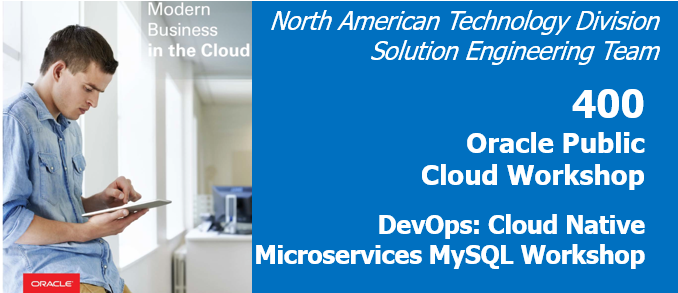
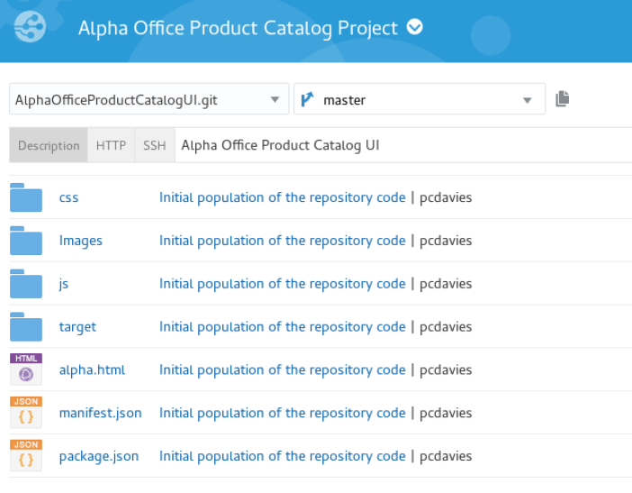
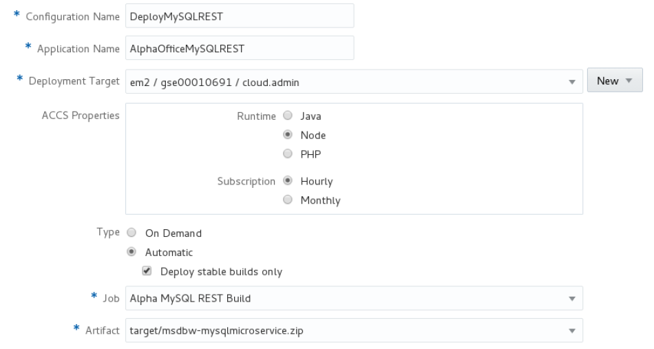
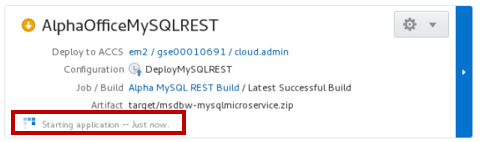
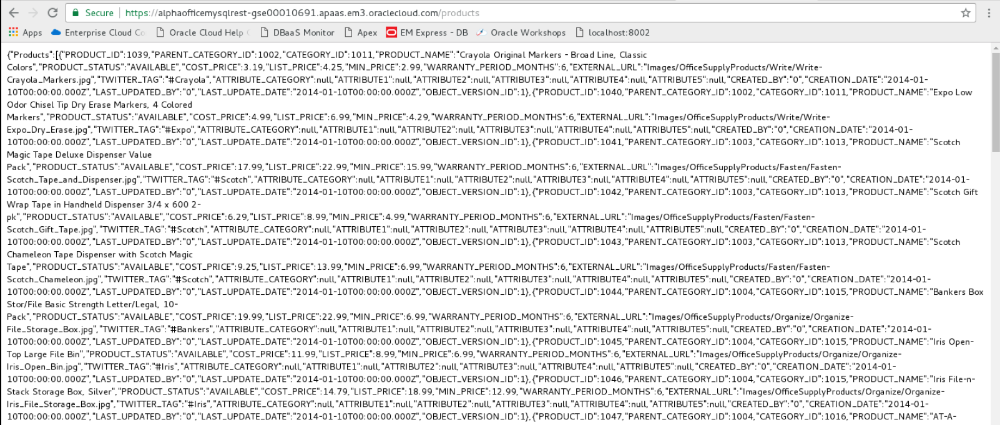
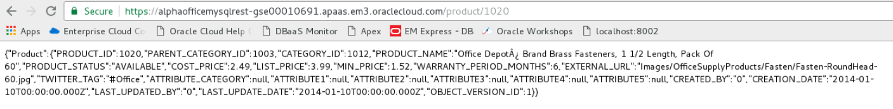

  
Update: October 1, 2017

## Introduction

This is the fourth of several labs that are part of the **Oracle Cloud DevOps and Cloud Native Microservices MySQL workshop.** This workshop will walk you through the Software Development Lifecycle (SDLC) for a Cloud Native project that will create and use several Microservices.

In the first lab (100), the Project Manager created a new project in the Developer Cloud Service and also created and assigned tasks to the developers of this application. In the second lab (200), the java developer created a new microservice to retrieve and filter twitter data. In the third lab (300, the full stack developer created a microservices that will supply data from MySQL database. In this lab you will assume the persona of the UI developer, who will create new generation product catalog UI. The product catalog will combine both the Twitter Feed Microservice and the Product Catalog Microservice into a single unified view for the consumer.

**To log issues**, click here to go to the [github oracle](https://github.com/oracle/learning-library/issues/new) repository issue submission form.

## Objectives

- Access Developer Cloud Service
- Import Code from external Git Repository
- Import Project into Brackets
- Build and Deploy project using Developer Cloud Service and Oracle Application Container Cloud Service

## Required Artifacts

- The following lab requires an Oracle Public Cloud account that will be supplied by your instructor. You will need to download and install latest version of Brackets or used supplied compute VM. Instructions are found in the Student Guide.

# Create Next Generation Product Catalog UI

## Explore Developer Cloud Service

### **STEP 1**: Review Agile Board

- This Lab assumes that you just completed Lab 300 and are still connected to the Oracle Cloud, that you're still in the Developer cloud Service Dashboard, and you're viewing the "Alpha Office Product Catalog Project." If for some reason that is not the case, follow the first several Steps of Lab 100 to once again view the Developer Cloud Service Console.

- Although you will remain connected to the Oracle Cloud using the user account you were provided, you will take on the Persona of ***John Dunbar*** as you perform the following steps.

      

- Within the **Alpha Office Product Catalog Project**, click on **Agile** found on the left hand navigation.

      

### **STEP 2**: Display the Active Sprint

- On the **Microservices** Board, click **Active Sprints**

      

## Create Initial Git Repository

### **STEP 3**: Create Initial Git Repository

To begin development on our Product Catalog UI, we could start coding from scratch. However, prior to the formal kickoff of this project, you (as John Dunbar) have already started doing some proof-of-concept development outside of the Developer Cloud Service in order to assess the feasibility of your assignment. You want to bring that existing code into the Developer Cloud Service as a starting point for your UI. You will do that by cloning your external GIT repository into the Developer Cloud Service. Your first step will be to accept your task using the agile board.

- Drag and drop **Feature 4 - Create Alpha Office Product Catalog UI** into the **In Progress** swim-lane.  

      

- Leave the defaults, and Click **OK**.

      

- Your Sprint progress will appear as shown below.

      

- In the left hand navigation panel, click **Project**

- Click **New Repository**. In the New Repository wizard enter the following information and click **Create**.

    **Name:** `AlphaOfficeProductCatalogUI`

    **Description:** `Alpha Office Product Catalog UI`

    **Initial content:** `Import existing repository`

    **Enter the URL:** `https://github.com/pcdavies/ProductCatalogUI.git`

      

- You have now created a new GIT repository stored within the Developer Cloud Services that is based on an existing repository.

      

## Create Default Build and Deployment Process

### **STEP 4**: Create Default Build Process

Now that we have the source code in our managed GIT repository, we need to create a build process that will be triggered whenever a commit is made to the master branch. We will NPM package manager to set up a Node.js build process in this section.

- On the left side navigation panel click **Build** to access the build page.

- Click **New Job**.

- In the New Job popup enter `Product Catalog UI Build` for the Job Name, and then click **Save**.

      

- You are now placed into the job configuration screen.

      

- Click the **Source Control** tab. Click **Git** and select the **AlphaOfficeMyProductCatalogUI.git** from the drop down.

      

- Click the **Triggers** tab.

  **Select**: `Based on SCM polling schedule`

      

- Click the **Build Steps** tab. Click **Add Build Step**, and select **Execute shell**.

      

- For **Command** enter: `npm install`

      

- Click the **Post Build** tab and complete the following:
  - Check **Archive the artifacts**.
  - Enter `**/target/*` for **Files to Archive**.  
  - Verify **GZIP** in the Compression Type.
  
      

- Click **Save** to complete the configuration.

- Click the **Build Now** button to start the build immediately. Wait, as it may take 30 seconds to a few minutes for the queued job to execute, but when it does, the status will change to the following:

      

- Wait, as it may take 30 seconds to a few minutes for the queued job to execute, but when it does, the status will change to the following:

      

  **NOTE:** Once the build begins, it should take about approximately 1 to 2 minutes for the build to complete. Once complete, you will be able to see the number of successful test runs in the Test Result Trend section. ***Wait for the build to complete before continuing to the next step***, as we need the build artifact to complete the deployment configuration.

- After the build begins, you can also click on the **Console Icon**  to monitor the build log details.

      

### **STEP 5**: Create Default Deployment Process

Now that we have an automated build process, we will setup up a deployment configuration that will push out build artifacts to a node.js environment running on Application Container Cloud Service whenever a successful build occurs.

- On the navigation panel click **Deploy** to access the Deployment page. Click **New Configuration**.

- Enter the following data:

  **Configuration Name**: `DeployProductCatalogUI`

  **Application Name**: `AlphaOfficeProductCatalogUI`

      

- Click on **Deployment Target** drop down and select deployment defined in lab 200.

      

- In Deployment window, click **Test Connection**. If Successful, click **Use Connection**:

      

- Set the following Properties as follows:

  - **Runtime**: `Node`

  - **Subscription**: `Hourly`

  - **Type:** `Automatic` and `Deploy stable builds only`

  - **Job:** `Product Catalog UI Build`

  - **Artifact:** `target/msdbw-mysqlmicroservice.zip`

      

- To reduce the number of resources that are used we will modify the default deployment of 2 instances. Click **Include ACCS Deployment** and enter the following in the text box:

```
{
  "memory": "1G",
  "instances": "1"
}  
```
  

- Click **Save**

      

- Click the gear drop down for **AlphaOfficeProductCatalogUI** and select **Start**

      

- Wait until the message **Starting application** changes to **Last deployment succeeded**

      

      

## Verify Product Catalog UI deployment

### **STEP 6**: Test REST services

- We are able to access the application directly from Developer Cloud Service. Click **AlphaOfficeProductCatalogUI** to launch the application.

      

- A new tab in the browser should open with application running.

      

- First lets test out the **products** REST call.  Append **/products** to the end of the URL and hit **enter**.  All of the Alpha Office products should be returned in a JSON payload. 

      

- Now lets search for just on product.  Change **products** to **product/1020**.  This will just return the product with the Product Id of 1020.

      

### **STEP 7**: Complete Task

We have now verified that the Product Catalog UI has been deployed and functions properly. To finish up this lab, we will mark the Issue as completed in the Sprint.

- Back in the Developer Cloud Service window, click **Agile**, followed by clicking **Active Sprints**.

- Drag and drop **Feature 4** from **In Progress** to **Completed**.

      


- In the Change Progress popup click **Next**.

      

- In the **Add Time Spent** popup, set the **Time Spent** to `1` and click **OK**.

      

- Your Sprint should now look like the following:

      

- **You are now done with this lab.**
