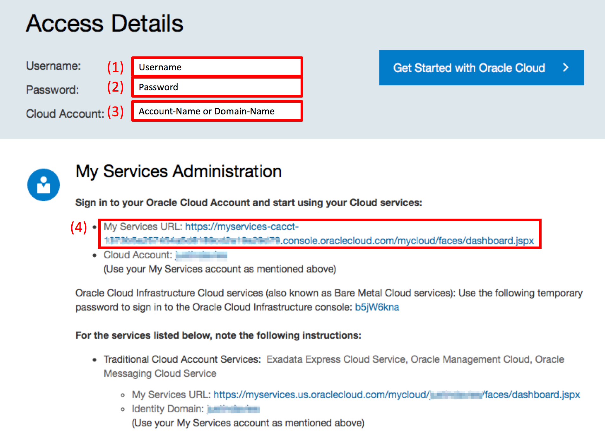
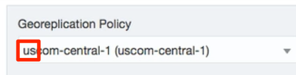
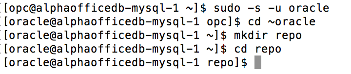
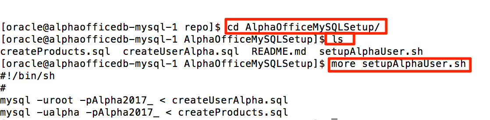
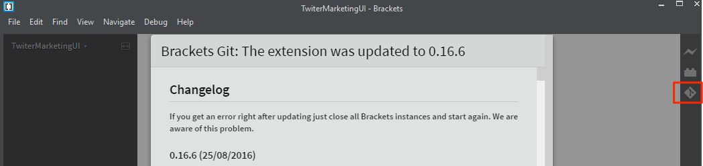

# Trial Account Student Guide


Update: November 8, 2017

## Overview of Tasks

You will need to **complete the following 3 Tasks** prior to attempting the Labs contained in this workshop

- **Acquire an Oracle Cloud Trial Account**
- **Create and Configure the MySQL Database**
- **Install the required open source tools locally on your computer (e.g. Eclipse, Maven, Git, and Brackets)**

# Acquire an Oracle Cloud Trial Account

### **Step x**: Getting your Trial Account

- Click on this URL [oracle.cloud.com/tryit](http://oracle.cloud.com/tryit), and complete all the required steps to get your free Oracle Cloud Trial Account.
- You must wait before continuing to the "**Create and Configure the MySQL Database**" Section.

# Create and Configure the MySQL Database

During this Workshop you'll use a MySQL Database. The purpose of this workshop is to create microservices, one of which will access data from database. In the following steps we'll show you how to create and seed the MySQL Database with sample data.

## Login to your Oracle Cloud Account

### **Step x**: Record information from email for future reference

- After your account is fully provisioned, you will receive an email from Oracle that will allow you to connect to the cloud account. Follow the instructions in that email. However, for later use during the workshop labs, **record the following fields**, some of which you'll find in the email. The other fields will be provided shortly. This information during the workshops Labs.

    - **(1)Username** - With a trial account, this will be your email address. However, in the labs, an example username of cloud.admin will be referenced.
    - **(2) Password** - The first time you login, you will be required to change the default password.
    - **(3) Account-Name or Domain-Name** - Within the Lab Guides, this field will often be referenced as your **Domain Name**
    - **(4) My Services URL** - The lab guides provide examples of how to login to a traditional account. Saving, or bookmarking this URL will allow you to more easily login to your account.
    - **(5)Data Center** - We'll locate this information shortly.

    

- Click on the **My Services URL** provided in email.
- Follow the instructions to **Reset your Password**, and then record your new password for later use.

### **Step x**: Check/Set Storage Replication Policy

Some services that we will use in this workshop require that your account's Replication Policy is set. The following steps will show you how to set your replication policy.

- Click on the **Hamburger Menu** in the upper left corner of the browser window to expose the **Dashboard Menu**, then click on the **Storage Classic** menu option.

    

- If your replication policy has not yet been set, the following dialog will be displayed. **Record** the **Data Center**. In this example, you will record **US** for the Data Center. Another Data Center Options could be EMEA. 

    

- Leave the Default **Georeplication Policy**, and click on **Set Policy**.

    

- To return to the main **Dashboard**, click on the **Hamburger Menu**, and then click on the **My Services** menu option.

    

## Create the MySQL Database

### **Step x**: Load the MySQL Dashboard

- The **Oracle CLOUD My Services** Dashboard should be displayed. Click on the **Hamburger Menu** on the top left side of the Dashboard.

    

- Select **MySQL** from the menu options.

    

- If the following Welcome screen is displayed, click on **Go to Console**.

    

### **Step x**: Create a new MySQL Instance

- Click on the **Create Service** button.

    

- Enter `AlphaOfficeDB` for the **Service Name**, and then click on the **Next** button.

    

- Click on the **Edit** button to for the **SSH Public Key** field.

    

- Select the **Create a New Key** option, and the click on the **Enter** button.

    

 - Once the SSH Keys have been created, click on the **Download** button. A file named **sshkeybundle.zip** will download to your Browser's configured download directory. Click on **Done** to close the dialog. 

    

- **Unzip** and **save** the **privateKey** and **publicKey** files, as you will need these files when accessing the Cloud Image on which the MySQL Database will be installed.

    

 - Change the following default fields on the **Service Details** page, and then click on **Next**.

    - **Password**: `Alpha2017_`
    - **Database Schema Name**: `AlphaOfficeDB`
    - **Backup Destination**: Select the **None** option

    

- Review the **Confirmation** Screen, and click on **Create**

    

- It will take several minutes for the MySQL Database to be fully configured. You can click on the refresh Icon to refresh the status page. You can Also click on the Status Link to view the provisioning log.

    

### **Step x**: Record the Database Host IP Address

- Once the Database is provisioned, click on **AlphaOfficeDB** to view the Database details.

    

- Make note of the **Public IP** for the Database Service host.

    

## SSH into the Database Image

### **Step x (option Windows)**: Connection from Windows

From Windows using PuTTy you will now **ssh** into the MySQL Host using the **Public IP**.

### **Step x (option Mac)**: Connecting from a Mac

From your Mac us a Terminal, you will now **ssh** into the MySQL Host using the **Public IP**.

- Open a Terminal Window, change to the directory where you saved your **privateKey** file, and change the file permission of the private key file to **600** using the following command: 

    ```
    chmod 600 <privateKeyFileName>
    ```

    

- Enter the ssh command to connect into the MySQL Database image instance. ***Note***: the  **opc** user has rights to **sudo** as other users:

    ```
    ssh -i <privateKeyFileName> opc@<yourHostIPAddress>
    ```

    

### **Step x**: Install git in the MySQL Image

- Install **git** using **yum**. When prompted with **Is this OK**, enter `Y`

    ```
    sudo yum install git
    ```

### **Step x**: Clone the Script repository

- Once, using the **sudo** command, connected as **oracle** user. Then change to the Oracle User's home directory. Next, create a **repo** directory, and change to that directory.

    ```
    sudo -s -u oracle
    cd ~oracle
    mkdir repo
    cd repo
    ```

    

- Clone a local copy of the git repository containing the scripts used to load the seed database with the Product Catalog. This seed database will be used in subsequent labs.

    ```
    git clone https://github.com/pcdavies/AlphaOfficeMySQLSetup.git
    ```

    

### **Step x**: Run the scripts

- Change directories to the **AlphaOfficeMySQLSetup** directory. Run the `ls` command to see all the files in this repository. View the contents of the **setupAlphaUser.sh** script. Notice that this script runs all the other scripts contained in the directory. Then change the permission on the script so it can be run.

    ```
    cd AlphaOfficeMySQLSetup
    ls
    more setupAlphaUser.sh
    chmod +x ./setupAlphaUser.sh
    ```

    

- Run the **setupAlphaUser.sh** script with the following command - ignore the warnings:

    ```
    ./setupAlphaUser.sh
    ```
- After the script completes, you can check to see if the **alpha** user was created, and the database tables where loaded by running the following command - you should see the **Product** tables:

    ```
    mysql -ualpha -pAlpha2017_ AlphaOfficeDB -e 'SHOW TABLES;'
    ```
    

# Install the Open Source Tools

## Verify your version of the Java JDK

### **Step x (Windows Option)**: JDK Verification on Windows

**Note**: Eclipse requires that you have the a Java JDK 8 installed. Even if you have a JRE version 8, you still need to verify that you have a JDK 8 installed.

- On Windows, open a **cmd** window and enter `java -version` 

```
C:\Users\usr>java -version
java version "1.8.0_121"
Java(TM) SE Runtime Environment (build 1.8.0_121-b13)
Java HotSpot(TM) Client VM (build 25.121-b13, mixed mode, sharing)
```

- If JDK/**Java version 1.8** is not installed,  you will need to download a [JDK 8](http://www.oracle.com/technetwork/java/javase/downloads/jdk8-downloads-2133151.html) from the Oracle Technology Network website, and install.

### **Step x (Mac Option)**: JDK Verification on a MAC

**Note**: Eclipse requires that you have the a Java **JDK** 8 installed. Even if you have a **JRE** version 8, you still need to verify that you have a JDK 8 installed.

- Open Terminal window and execute the following command: 

```
ls /Library/java/JavaVirtualMachines/
```

- If you do not have a JDK 1.8 folder, you will need to download the [JDK 8](http://www.oracle.com/technetwork/java/javase/downloads/jdk8-downloads-2133151.html) from the Oracle Technology Network website, and install.

## Download and Install Eclipse

### **Step x**: Download Eclipse

***Note***: Even if you already have Eclipse installed, you need to install and use the version documented below. This version of Eclipse contains the ***Oracle Enterprise Pack for Eclipse***, which will be used during the workshop.

- Go to the [Eclipse](http://www.oracle.com/technetwork/developer-tools/eclipse/downloads/index.html) installation website

- Accept the **licensing agreement**, and then select the **Neon** version of Eclipse required for your operating system.

    

- Once you’ve downloaded eclipse, extract the zip file and install.

### **Step x**: Optionally Configure Proxies (if behind a firewall)

If you are running Eclipse behind a firewall, you need to configure the proxy setting. First, you need to ensure that Eclipse’s proxy is set. Next, you need to update the maven proxy setting, and then finally, you need to ensure that the Oracle Plugin will work with your proxy settings.

- To set configure Eclipse’s proxy, open Eclipse and navigate to the Properties menu. Depending on the operating system, this drop down is found either from the **Eclipse > Preferences, or Window > Preferences**

    

- From the preferences panel, enter “**proxy**” into the search window, and click on **Network Connections**. Select **Native** for the Active Provider and click on **OK**. This setting works well, but it requires that you have the proxy setting configured correctly on the system running Eclipse – e.g. Windows, MAC OS or Linux. Selecting Manual should also work, but some of the plugins require the underlying operating system’s proxy to be configured.

    

- To test that your connection works, select the menu option **Window > Show View > Other**

    

- Type “**web**” in the search field, select **Internal Web Browser** and click on **OK**

    

- Enter a **URL** into the browser and press **enter** to test your proxy settings.


### **Step x**: Optionally Update the Eclipse / Maven proxy (if behind a firewall)

***Note:*** You will only do this optional Eclipse/Maven Proxy setup if you are behind a firewall. Otherwise, skip this step, and go to next step where you will download and install Brackets.

- From the **Eclipse > Preference or Window > Preferences** panel, type **Maven** into the search box. 
- Click on the Maven **User Settings**. Make note of the directory where the settings.xml file is to be located. In the example below, the Maven User Settings will be located in the **/home/oracle/.m2** directory

    

- **Cancel** out of the Maven dialog, and **Close** Eclipse

- If the directory does not exist where the settings.xml file is to be located, **create the directory**. In this example, we will create the **.m2** directory. 

- Also, create the **settings.xml** file, if it does not exist. Add the following to the settings.xml file (NOTE: you will need to use your correct **Host, Port, nonProxyHosts, username and Password settings**):

```
<?xml version="1.0" encoding="UTF-8"?>
<settings xmlns="http://maven.apache.org/SETTINGS/1.1.0" xmlns:xsi="http://www.w3.org/2001/XMLSchema-instance"
xsi:schemaLocation="http://maven.apache.org/SETTINGS/1.1.0 http://maven.apache.org/xsd/settings-1.1.0.xsd">
<proxies>
<proxy>
<active>true</active>
<protocol>http</protocol>
<username>proxyuser</username>
<password>proxypass</password>
<host>www-proxy.us.oracle.com</host>
<port>80</port>
<nonProxyHosts>local.net|some.host.com</nonProxyHosts>
</proxy>
<proxy>
<active>true</active>
<protocol>https</protocol>
<username>proxyuser</username>
<password>proxypass</password>
<host>www-proxy.us.oracle.com</host>
<port>80</port>
<nonProxyHosts>local.net|some.host.com</nonProxyHosts>
</proxy>
</proxies>
</settings>
```

- Reload Eclipse to use the new maven settings

## Download and Install Git and Brackets

### **Step x**: Download/Install Git

- Go to the following URL: https://git-scm.com/downloads

    

- Select your OS. In our example, we will show how to install on Windows. Click **Windows** Download and click **Save File**

    

- Select your download location and click **Save**. We will use D:\Software    

    

- Open Windows Explorer and navigate to where you downloaded the Git executable. Double click on the Git executable to start the install process.

    

- Run through the installation process

    

### **Step x**: Download/Install the Brackets Text Editor

- Go to the following URL: http://brackets.io    

    

- Click **Download Brackets 1.X** then click **Save File**

    

- Select you download location and click **Save**. We will use D:\Software

    

- Open Windows Explorer and navigate you where you downloaded Brackets. Double click on the Brackets executable to start the install process.


- Run through the installation process

### **Step x**: Start Brackets and Configure Git

- Create a directory called **TwitterMarketingUI**. From Windows Explorer navigate to the directory **TwitterMarketingUI**, right click and select **Open as Brackets Project**

    

- Select **File -> Extension Manager…**

- In the search field, type `Git`. Click **Install** for **Brackets Git**

    

- After the install completes, leave the defaults for Git Settings and click **Save**

    

- Click **OK** to restart Brackets

    

- You will now see the Git icon on the right-hand panel

    


- You can now exit and close your terminal session, and start on [Lab 100](CloudNativeMySQL100.md) Lab
