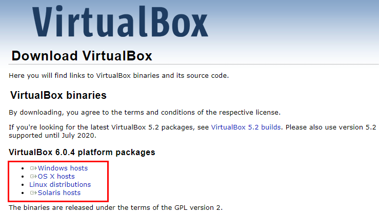
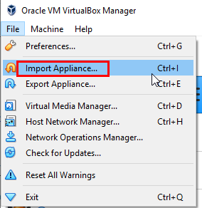
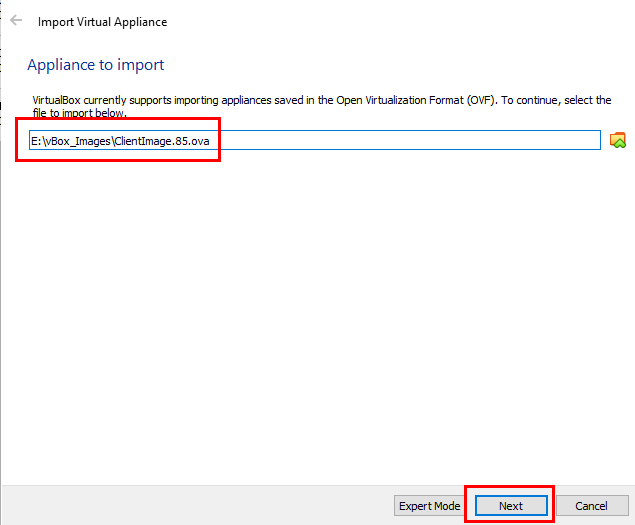
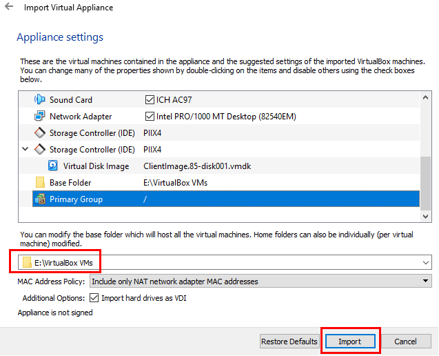
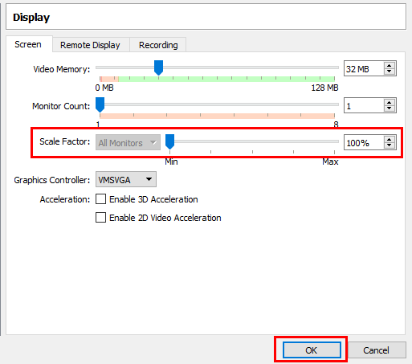
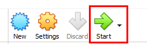
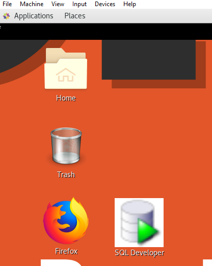
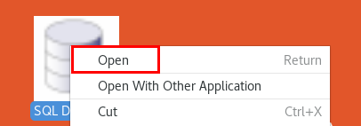
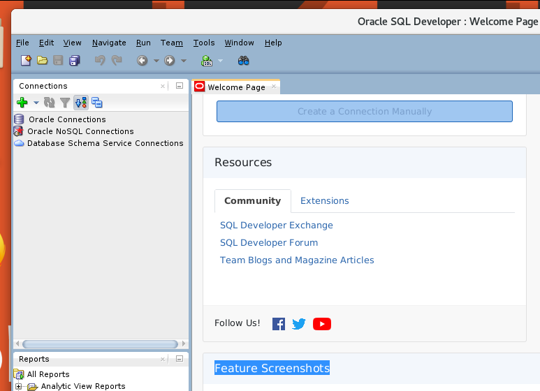

# Monolithic to Microservice Cloud Native Development - Setup VirtualBox Client Image

  

## Workshop Overview

In this workshop you are guided through using many of the Oracle's Cloud Services to support a transition from a monolithic on-prem environment to a Cloud based microservices environment. The high level flow will be:

- Lab 010: Install VirtualBox on your local machne and import the workshop Client Image
- Lab 050: Provision supporting services (Database, Visual builder Instance).
- Lab 100: Populate your database with seed data.
- Lab 200: Create a Compute Instance and use Docker to deploy a Java based REST application.
- Lab 300: Deploy and explore the REST application into a Kubernetes Cluster.
- Lab 400: Create a Visual Builder mobile application to use the REST endpoints of the Java application.

***To log issues***, click here to go to the [github oracle](https://github.com/oracle/learning-library/issues/new) repository issue submission form.

## Lab 010 Objectives

- Download and install VirtualBox for your operating system
- Download the supporting workshop Client Image and import into VirtualBox
- Startup the Client Image

# VirtualBox Setup

You will create all required infrastructure components that support this workshop. The client image is a pre-created Linux based image that has GIT and SQL Developer already installed. These tools are used in the subsequent workshop labs.

## Setup of the Workshop Client Image

### **STEP 1**: Download and Install VirtualBox

- Open the following link in a new tab in your browser. <a href="https://www.virtualbox.org/" target="newwerc">VirtualBox</a>

- Click on the download button:

  

- Select the platform that matches your operating system:

  

- Once downloaded install the executable package following any additional tips for installation from the VirtualBox page.

  **NOTE:** For the later Mac OS's you may be prompted to **Trust the "Oracle Inc." software distributor**. Please do so.

### **STEP 2**: Download and Install the Workshop Client Image

- Download the Client Image from: <a href="https://">Client Image</a>. The download size is a tad over 3GB.

- Bring up VirtualBox and select **File-->Import Applicance**.

  

- Browse to the file location where you saved the Client Image and select it. (Your Client Image filename may be different than the screen shot as the Client Image is updated from time to time). Click **Next**.

  

- You will take the image settings defaults. Check the default `base folder` and if you don't think you have enough disk space to accommodate the image in the default you can change the base folder to a disk where you do have enough space. The image requires ....

  **Example:**

  

- Click the **Import** bitton. It will take several minutes to import the image.

### **STEP 3**: Run the Client Image

- Once the image is imported click on it and look at the Display setting called **Scaled-factor**. If it is not not 1.00 then click on **Display** and change it to **100%**. Click **OK**.

  

  

- With `ClientImage` still selected click the **Start** Icon:

  

- The image will take a couple of minutes to start up. You should see the image's Desktop:

  

- Right-click on the **SQL Developer** icon and select **open**.

  

- SQL Developer should start up...

  

**This completes the Lab!**

**You are ready to proceed to [Lab 050](LabGuide050Virtual.md)**
