# Monolithic to Microservice Cloud Native Development - Setup Cloud Environment

  

## Workshop Overview

In this workshop you are guided through using many of the Oracle's Cloud Services to support a transition from a monolithic on-prem environment to a Cloud based microservices environment. The high level flow will be:

- Lab 050: Provision supporting services (Client Image, Database, Visual builder Instance).
- Lab 100: Populate your database with seed data.
- Lab 200: Create a Compute Instance and use Docker to deploy a Java based REST application.
- Lab 300: Deploy and explore the REST application into a Kubernetes Cluster.
- Lab 400: Create a Visual Builder mobile application to use the REST endpoints of the Java application.

***To log issues***, click here to go to the [github oracle](https://github.com/oracle/learning-library/issues/new) repository issue submission form.

## Lab 050 Objectives

- Start up and connect into the supporting Client Image
- Create Autonomous Transaction Processing (ATP) Database
- Provision a new Visual Builder Cloud Service and Application

# Infrastructure Setup

You will create all required infrastructure components that support this workshop.

## Create a SSH Key Pair

This Key Pair provides a secure link which will be used to create and access a `Client Image` which is a Compute Service Instance that has all of the ancillary tools required to complete this workshop. Docker, Git and SQL Developer and VNC to, name a few, are already installed. You will use VNC Viewer (Download location is noted below in the **Prerequisite** section) to access this instance.

### Prerequisite

Once the infrastructure is provisioned you can access your enironment using `VNC Viewer`. **Please download and install:** <a href="https://www.realvnc.com/en/connect/download/viewer/" target="newwer">VNC Viewer</a>

### **STEP 1a**: WINDOWS 10 - Configure OpenSSH 

- If you already have SSH installed to can go to STEP 2. You can verify by opening up a Powershell or Command Prompt and typing:

  ```
  ssh
  ```

  **NOTE: If using Windows 7 then SKIP to STEP 1b, Mac or Linux SKIP to STEP 2**

- In the Windows 10 Start bar type **features** and select **Manage optional features**.

  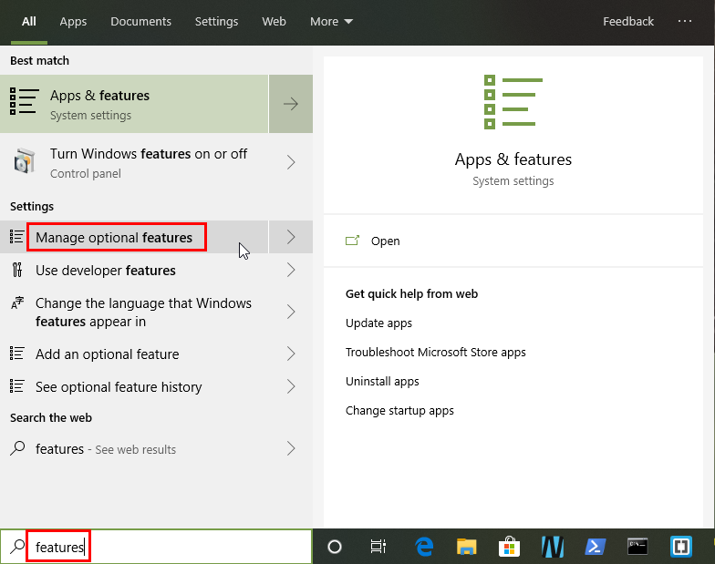

- Click **Add a feature**.

  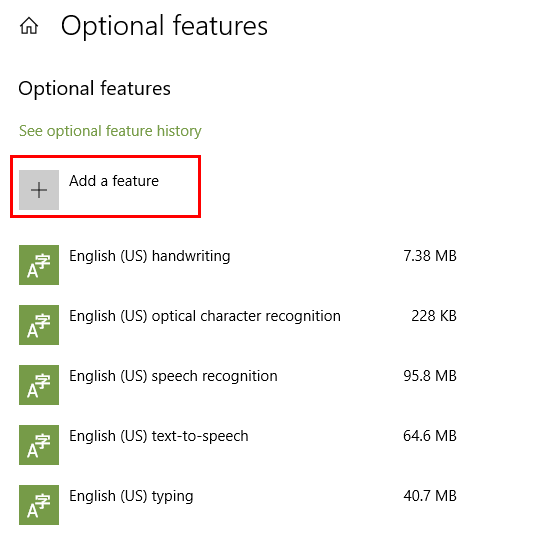

- Scroll down to find the **OpenSSH Client**, select it and click **Install**.

  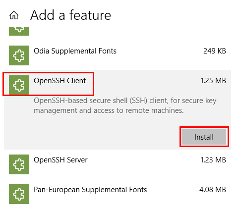

- Click the **back arrow** at the top of the page. It will take you to previous page and if your quick enough you'll see the OpenSSH Client installing. When it is done it will be part of the installed optional features list.

  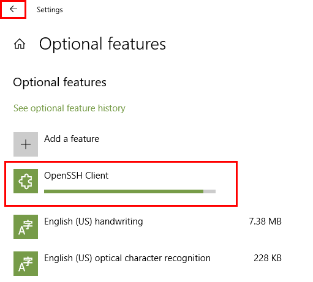

- To verify the installation open up a Powershell or Command Prompt and type **ssh**. You should see the command usage:

  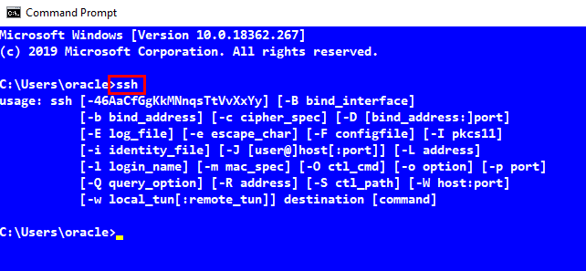

### **STEP 1b**: WINDOWS 7 - Install OpenSSH 

- Download and double click to install OpenSSH software for Windows 7: <a href="https://objectstorage.us-ashburn-1.oraclecloud.com/p/xC0ksF5VxlqOFZTd8-nIxqUTzVwcTM-3yJAe2IMfgKM/n/natdcshjumpstartprod/b/M2M-ssh/o/setupssh-8.0p1-2.exe">OpenSSH</a>

- Follow the installation steps:

  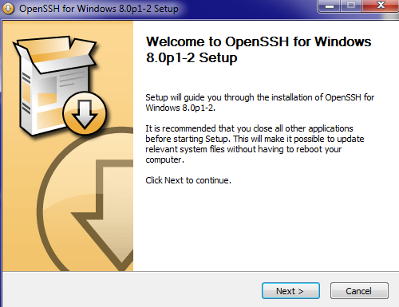

  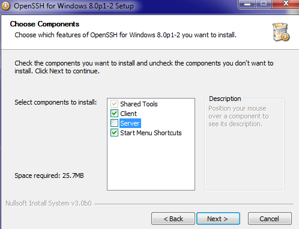

  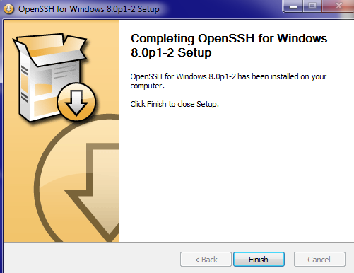

- When the installation is completed open up a Powershell or Command Prompt and type **ssh**. You should see the command usage:

  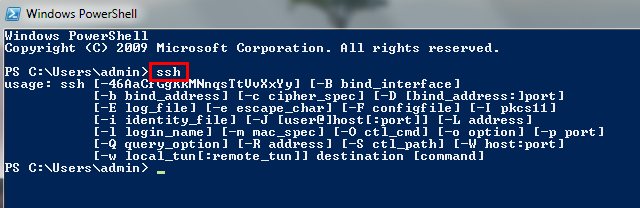  

### **STEP 2**: Create the Key Pair

Before we create the Compute instance that contains Docker and the other supporting client tools we need to create a ssh key pair so we'll be able to securely connect to the instance.

- Open a Terminal (Linux/Mac) or Command Prompt/Powershell (Windows) and navigate to a directory of your choice.

- **Type** the following: (**You don't have to worry about any passphrases. Press enter to proceed without a passphrase.**). Linux screen shots are shown here:

  ```
  ssh-keygen -b 2048 -t rsa -f dockerkey
  ```

- Your key pair is now in the current directory:

  

- Open up the pubic key file in the text editor of your choice: (e.g. **vi/TextEdit - Linux/Mac**) or (**notepad - Windows**). Linux screen shots shown here:

  ```
  vi/TextEdit/notepad dockerkey.pub
  ```

  

- **Select and Copy** the entire contents. This will be used in the Compute instance creation later in this lab.   

    

- Exit out of the editor.

## Access Your Trial Account

### **STEP 3**: Log in to your OCI dashboard and Switch Regions

- Once you receive the **Get Started Now with Oracle Cloud** Email, make note of your **Username, Password and Cloud Account Name**.

  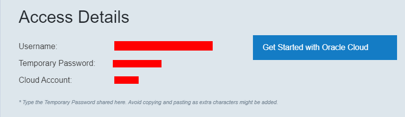

- From any browser go to

  [https://cloud.oracle.com/en_US/sign-in](https://cloud.oracle.com/en_US/sign-in)

- Enter your **Cloud Account Name** in the input field and click the **Next** button.

  

- Enter your **Username** and temporary **Password** in the input fields and click **Sign In**.

  

  **NOTE: The first time logging in you will be prompted to reset your password.**

- You are presented with the Oracle Cloud Infrastructure (OCI) Dashboard/Portal

  

- We are going to subscribe to a new Region. Click on the Region Drop-Down in the upper right-hand corner and select **Manage Regions**
  
  

- On the Tenancy page, click on the **Subscibe To This Region** button for the **us-phoenix-1** Region
  
  

- Click **OK** to confirm the subscribtion to the region.
  
  

  **NOTE:** The subscribtion can take minute or two to occur.
	
- Once the Region is Active (Green Circle), click on the Region Drop-Down in the upper right-hand corner and select **us-phoenix-1**. You may have to refresh the browser page to see us-phoenix-1 appear in the Drop-Down.

  
	
  

### **STEP 4**: Create a Compartment

Compartments are used to isolate resources within your OCI tenant. User-based access policies can be applied to manage access to compute instances and other resources within a Compartment.

  - Click the **Menu icon** in the upper left corner to open the navigation menu. Under the **Governance and Administration** section, select **Identity** and select **Compartments**.

    

    

  - Click **Create Compartment**

    

  - In the **Name** field, enter `monoTOmicro`. Enter a **Description** of your choice. Click **Create Compartment**.

    

  - In a moment, your new Compartment will show up in the list.

    

### **STEP 5**: Create the Client Image

- Click the **Menu icon** in the upper left corner to open the navigation menu. Under the **Solutions and Platform** section, select **MarketPlace**. The Marketplace offers pre-created Custom Images with software pre-installed for whatever your application or development needs may be.

  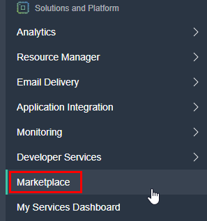

- Filter on the following criteria:

  ```
  Type: Image
  Publisher: Oracle
  Category: Developer Tools
  ```

- You'll see a few image options. Click on the **Oracle Cloud Developer Image**.

  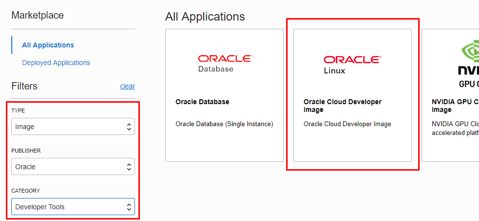

- The next page all of the client tools included in this Linux based image. Select the **monoTOmicro** compartment, check the "...reviewed..." checkbox and click **Launch Instance**.

  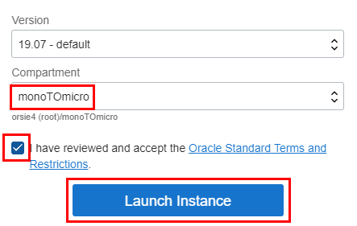

- **Type or Select** the following in the **Create Compute Instance** section of the dialog:

  ```
  Name: Docker
  Availability Domain: AD 1 (Use default AD 1)
  Image Source: Oracle Cloud Developer Image (Selected Earlier)
  Shape Type: Virtual Machine (Default)
  Shape: VM.Standard2.2
  Boot Volume: (Default)
  ```

- For the Instance Shape click on the **Change Shape** button. 

  

- Select the shape **VM.Standard2.2** and click **Select Shape**.

  **NOTE: If the VM.Standard2.2 shape is not availible then select VM.Standard2.1**

  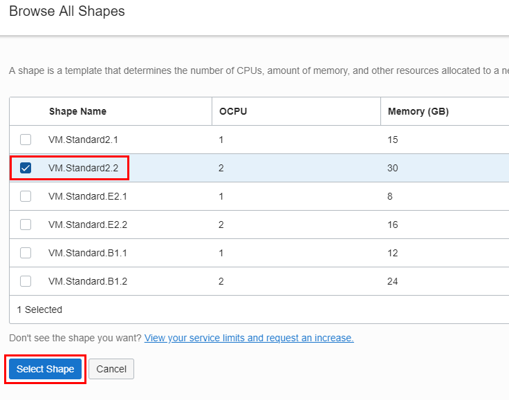

- After entering the _Docker_ instance details your screen should look like:

   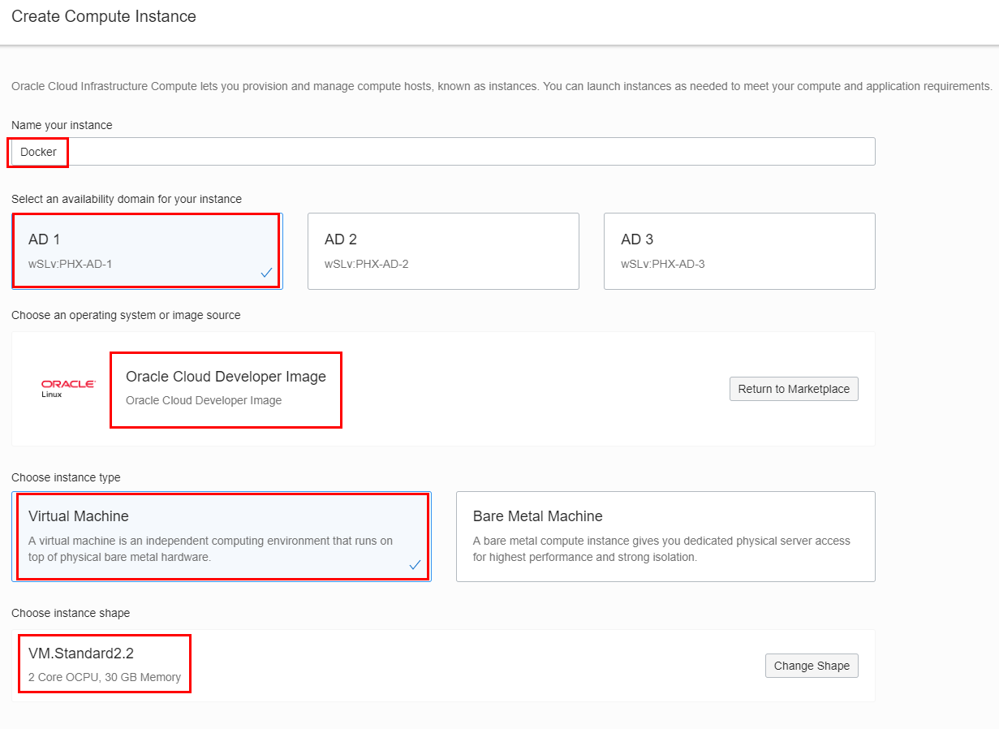

- Scroll down furthur on the page to insert your PUBLIC SSH Key
**NOTE:** You will paste the public key you copied at the end of Step 2 from your text editor into the SSH KEY field by selecting the **Paste SSH Keys** radio button. `The public key should all be on ONE LINE`

   

- In the Configure networking section esure that the **monoTOmicro** compartment is selected. Enter:

  ```
  DockerVCN
  ```

- ... as the generated Virtual Cloud Network (VCN) name. 

   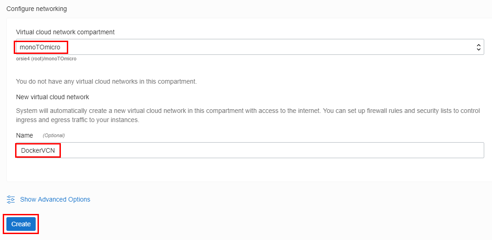

- Click **Create**

  After a few minutes you should see a running instance with a Public IP Address. _**Copy the Public IP Address** and save it off into a text editor, we will be using this IP in the next step._

   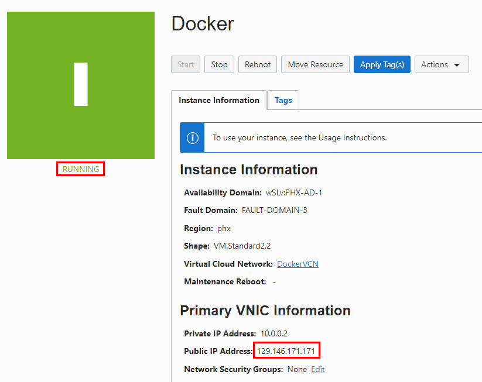

### **STEP 6**: Add Security List Entries

A Virtual Cloud Network (VCN) is locked down from a security standpoint until you define access via security lists. Any Compute Instances running in a specific VCN will inherit these rules. In addition each Compute Instance also has it's own firewall for instance specific rules. Definded Ingress and Egress rules specify the types of traffic allowed in and out. Security lists are enforced at the instance level. However, you configure your security lists at the subnet level, which means that all instances in a given subnet are subject to the same set of rules. The security lists apply to a given instance whether it's talking with another instance in the VCN or a host outside the VCN.

- Recall that you named a VCN called `DockerVCN` when you created the `Docker` Compute Instance. You will go into that VCN and add a couple of new rules to the default Security List to allow outside networking traffic to ports 5901, for VNC Server and port 8080 for an application that you will deploying and testing in lab 200.

- From the **hamburger menu** at the top left hand side of the OCI Console select **Networking-->Virtual Cloud Networks**.

  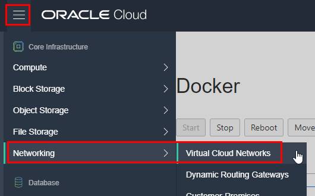

- Click the **DockerVCN** link.

  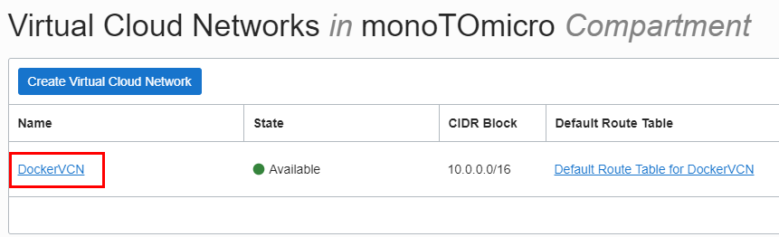


- Click the **Security Lists** link:

    

- Click on the **Default Security List for DockerVCN** link:

    

- Click **Add Ingress Rules**:

  **`NOTE: DO NOT EDIT AN ALREADY EXISTING RULE, ADD A NEW ONE`**

  

- In the dialog **Enter the following** and then click the **+ Additional Ingress Rule** button:

  **NOTE:** Leave all other values at default.

  ```
  Source CIDR: 0.0.0.0/0
  Destination Port Range: 5901
  ```

  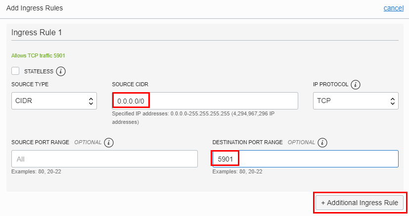

- Add port 8080 Ingress Rule:

  ```
  Source CIDR: 0.0.0.0/0
  Destination Port Range: 8080
  ```

  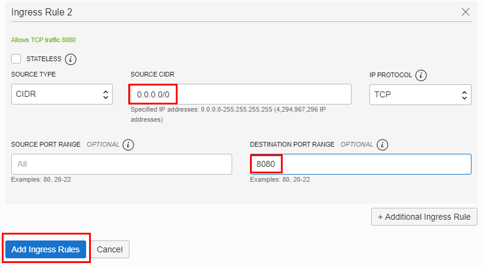

- Your Completed Ingress Rules should look like:

    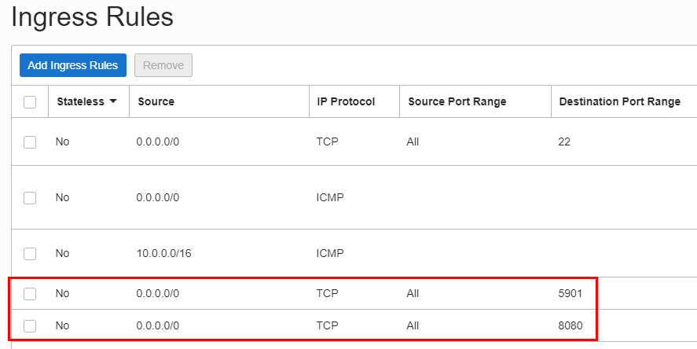

### STEP 7: SSH into the Client Image and configure VNC

- The generated public/private Key files should already have the  proper file permissions set when they where created. On Linux/Mac you can double check to see if the  `dockerkey` file has the permissions of **600**. On Windows, don't worry about it. Then, **ssh** into the newly created compute instance using your `dockerkey` and `substituting your Public IP address`. Windows Command Prompt screen shots shown here:

  Example: (129.146.171.171 is used here... your Public IP will be different)

  ```
  cd <where-your-key-files-are>
  (Windows) ssh -i .\dockerkey opc@<Paste or Type in Your Public IP>
  (Linux/Mac) ssh -i ./dockerkey opc@<Paste or Type in Your Public IP>
  ```

- The first time you ssh into the instance you will be prompted to accept. Answer **yes**.

  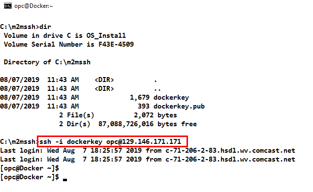

- We need to allow direct access to the VNC server which will be running on this server so we'll need to open up the VNC port on the server's firewall. We need to be root to configure this. Type the following:

  ```
  sudo -s
  firewall-cmd --add-port=5901/tcp --permanent
  firewall-cmd --reload
  exit
  ```

  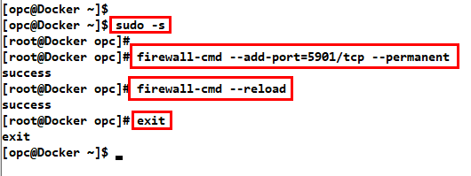

- Set a password for the VNC Server. You be prompted for the password when you connect via VNC Viewer. Say **n** to the `view-only password` prompt. Type:

  ```
  vncpasswd
  ```

  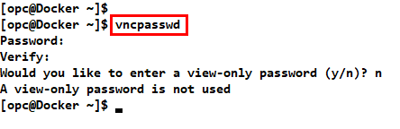

- Start the VNC Server. This will start on port 5901. The screen resolution shown in the example is recommended. **Type or Copy and Paste** the following:

  ```
  vncserver -geometry 1680x1050
  ```

- The server will be started. You can verify the screen size and port by typing:

  ```
  ps -ef | grep Xvnc
  ```

  

- **OPTIONAL**: You can leave your ssh connection open in case you have to stop and restart the VNC Server. If you test your connection with VNC Viewer and don't like the screen size you can stop and restart with a different geometry.

  Example commands to resize screen:

  ```
  vncserver -kill :1
  vncserver -geometry <your-screen-size>
  ```

### **STEP 8**: Start VNC Viewer

Use VNC Viewer to connect to your provisioned account.

- Start VNC Viewer and enter the connect string using <**your-public-IP>:1**. (Example shown below).

**NOTE: Do NOT click the Sign In button**

  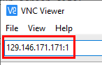

- If presented with this prompt, click **Continue**.

  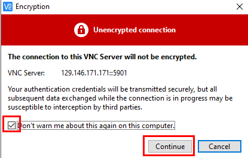

- Enter the VNC password you created in STEP 7 and click **OK**.

  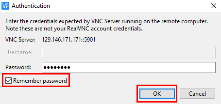

- There will be some one time preference settings that come up. The english default was chosen. Click **Next**. 

  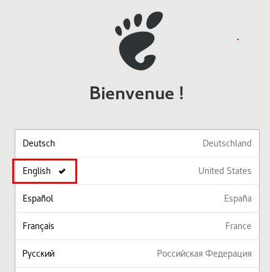

- Click **Next** at the Typing preference.

  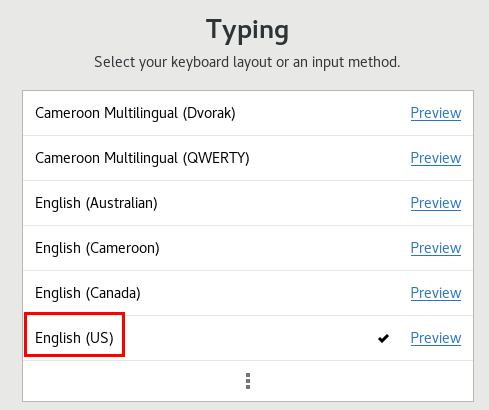

- Click **Skip** at the Online Account preferences.  

  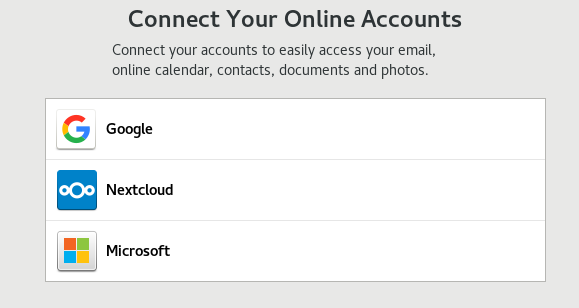

- Click **Start Using Oracle Linux Server**.

  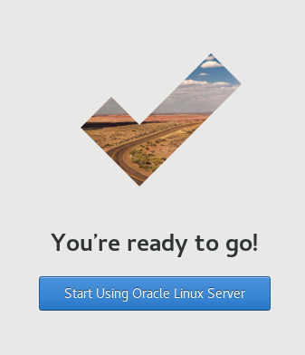

- You can **close** the Gnome "Getting Started" window.

- If you want to change the desktop's background image right-click on the desktop and choose **Change Background**.

  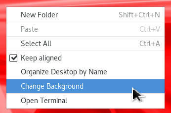

- Select your color:

  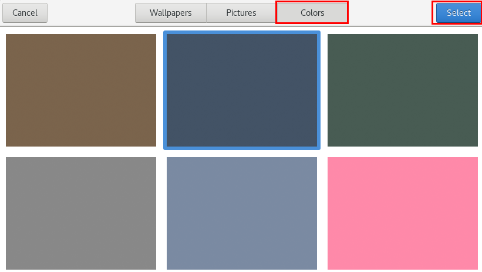

- Your Client Image Desktop is ready to go:

  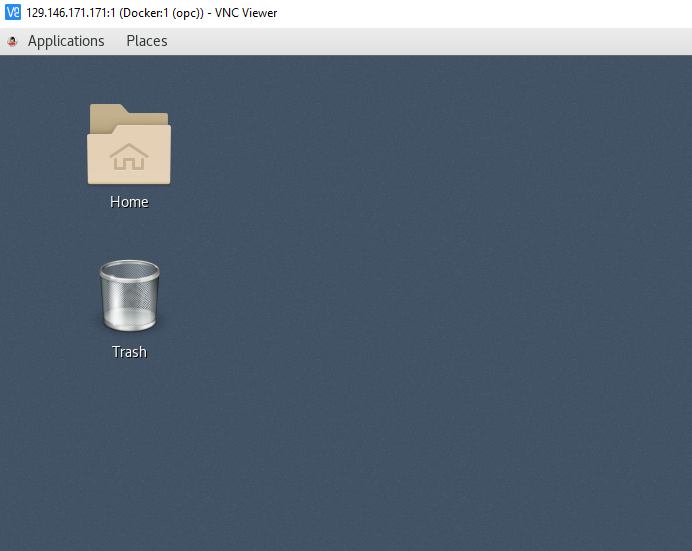

## Autonomous Transaction Processing (ATP) Database Creation
	
### **STEP 9**: Create an Autonomous Transaction Processing (ATP) Database

We require a Database to store the Alpha Office data which is accessed later in this workshop.  We will create an Autonomous Transaction Processing (ATP) Database to load data into.  Autonomous Transaction Processing is one of a family of cloud services built on the self-driving, self-securing, and self-repairing Oracle Autonomous Database.  Autonomous Transaction Processing uses machine learning and automation to eliminate human labor, human error, and manual tuning, delivering unprecedented cost saving, security, availability, and production. Autonomous Transaction Processing supports a complex mix of high-performance transactions, reporting, batch, IoT, and machine learning in a single database, allowing much simpler application development and deployment and enabling real-time analytics, personalization, and fraud detection.

  - Click the **Menu icon** in the upper left corner to open the navigation menu. Under the **Database** section of the menu, click **Autonomous Transaction Processing** .

    

  - Select the **Compartment** `monoTOmicro` and click **Create Autonomous Database**.

    

  - Verify the **Compartment** `monoTOmicro` is still selected. Enter the **Display Name** `AlphaOffice`, **Database Name** `orcl`. Select a **Workload Type** of `Transaction Processing` and **Deployment Type** of `Serverless`. Enter the **Administrator Password** of `a1phaOffice1_`, and select a **License Type** of `Bring Your Own License`. Click **Create Autonomous Database**.

    

    

  - After approximately 5-10 minutes, the ATP instance will be provisioned. You can proceed to the next STEP.

    

## Visual Builder Instance Creation

### **STEP 10**: Create a New Visual Builder Cloud Service

In this step you will create a VBCS instance that will be used in Lab 400. It takes about 20 minutes for the underlying infrastructure to be created. We just need to fire off the create instance process at this point. We'll check the status of the instance at the beginning of Lab 400.

- Goto the My Services dashboard by clicking on the **hamburger menu** in the upper left hand side of the OCI Console and selecting under the **Solutions and Platform** section **My Services Dashboard**

  

- You are now in the Dashboard. **If prompted set any preferences** and click **OK**.

  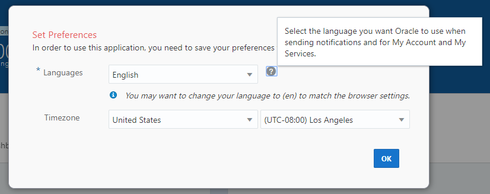

  

- Click the **Customize Dashboard** panel.

  

- Scroll down until you find the `Visual Builder` service and click the **Show** button. **Close** the window.

  

- You should see the following added to your dashboard:

  

### **STEP 11**: Create a New Visual Builder Instance

- In the Visual Builder panel click the **hamburger menu**, right-click **Open Service Console** and select **Open link in new tab**.

  

- Next, click the **Create Instance** button.

  

- On the next screen set your `Instance Name` to:

  ```
  monoTOmicro
  ```

- Enter a `Description` and for the `Region` select the same region you chose for the ATP database. **In this example us-phoenix-1**. Click **Next**.

  

- Review your information and press **Create**.

  

- You will see the following screen once your request is submitted. The refresh button can to used to update the provisioning status:

  

- You can immediately proceed to the next Lab. We will check for VBCS Instance completion at the beginning of Lab 400.

  

**This completes the Lab!**

**You are ready to proceed to [Lab 100](LabGuide100.md)**
